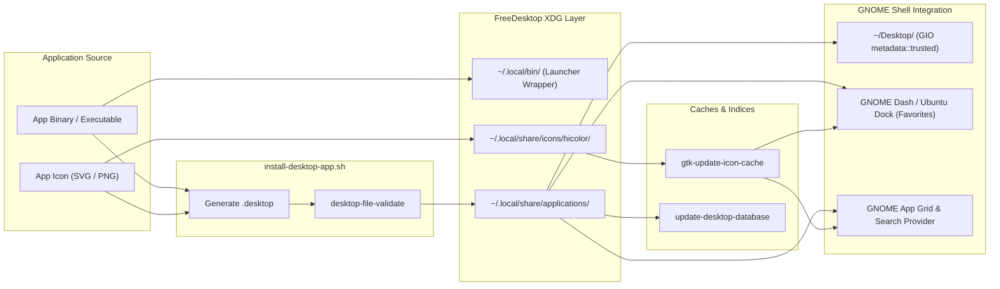

# Install Desktop Application & .desktop Icon on GNOME Linux

Standardized skill and automation engine for installing, configuring, and registering desktop applications, `.desktop` launcher entries, and application icons on GNOME Linux (Ubuntu, Debian, Fedora, and RobOS appliance desktops).

Complies with the **FreeDesktop.org Desktop Entry Specification 1.5**, **Icon Theme Specification**, and **GNOME Shell / Desktop Icons NG (DING)** standards.

---

## Architecture Overview




---

## Input

`$ARGUMENTS` — Application details and target options:
- `--app-id <id>` (Required): Unique lowercase kebab-case slug (e.g. `robos-crpg`, `godot-editor`).
- `--name <name>` (Required): Display name (e.g. `"RobOS cRPG: Realm of Heroes"`).
- `--exec <command>` (Required): Executable binary or invocation command line.
- `--icon <path>`: Path to SVG/PNG icon file or theme icon name.
- `--desktop`: Create and trust launchable desktop shortcut in `~/Desktop/`.
- `--favorite` / `--dock`: Pin app to GNOME Shell favorites dock.
- `--path <dir>`: Set working directory (`Path=...`).
- `--categories <list>`: Semicolon-delimited categories (e.g. `"Game;RolePlaying;"`).
- `--comment <text>`: Tooltip and search description.
- `--wrapper`: Generate a wrapper script in `~/.local/bin/<app-id>`.
- `--scope <user|system>`: Target scope (`user` default to `~/.local/share/`, or `system` to `/usr/share/`).

---

## Procedures

### 1. Automated Installation via Script

Use the bundled automation utility:

```bash
plugins/robos/skills/install-desktop-app/scripts/install-desktop-app.sh \
  --app-id <app-id> \
  --name "<Display Name>" \
  --exec "<executable command>" \
  --icon "<path/to/icon.svg>" \
  --path "<working-directory>" \
  --categories "Utility;Development;" \
  --desktop \
  --favorite
```

---

### 2. Manual / Step-by-Step Procedure

When performing manual setup or customizing entries:

#### Step 1: Icon Placement & Cache Update
1. **Scalable Vector Icons (SVG)**:
   ```bash
   mkdir -p ~/.local/share/icons/hicolor/scalable/apps
   cp icon.svg ~/.local/share/icons/hicolor/scalable/apps/<app-id>.svg
   chmod 644 ~/.local/share/icons/hicolor/scalable/apps/<app-id>.svg
   ```
2. **Raster Icons (PNG)**:
   ```bash
   mkdir -p ~/.local/share/icons/hicolor/128x128/apps
   cp icon.png ~/.local/share/icons/hicolor/128x128/apps/<app-id>.png
   ```
3. **Compatibility Pixmap**:
   ```bash
   mkdir -p ~/.local/share/pixmaps
   cp icon.png ~/.local/share/pixmaps/<app-id>.png
   ```
4. **Update GTK Icon Cache**:
   ```bash
   gtk-update-icon-cache -f -t ~/.local/share/icons/hicolor
   ```

#### Step 2: Generate Desktop Entry
Create `~/.local/share/applications/<app-id>.desktop`:

```ini
[Desktop Entry]
Version=1.5
Type=Application
Name=<Display Name>
GenericName=<Generic Name>
Comment=<Description>
Exec=<exec-command> %U
Icon=<app-id>
Path=<working-directory>
Terminal=false
Categories=<Categories;>
Keywords=<search;keywords;>
StartupWMClass=<wm-class>
StartupNotify=true
X-RobOS-App=true
```

#### Step 3: Validate and Register
1. **Validate desktop syntax**:
   ```bash
   desktop-file-validate ~/.local/share/applications/<app-id>.desktop
   ```
2. **Update desktop database**:
   ```bash
   update-desktop-database ~/.local/share/applications
   ```

#### Step 4: GNOME Desktop Shortcut (DING Extension)
For GNOME Desktop Icons NG (DING) to display and launch the desktop shortcut without prompting "Untrusted Application":
```bash
cp ~/.local/share/applications/<app-id>.desktop ~/Desktop/
chmod +x ~/Desktop/<app-id>.desktop
gio set ~/Desktop/<app-id>.desktop metadata::trusted true
```

#### Step 5: GNOME Shell Favorites (Dock Pinning)
To pin the application to the left-hand Ubuntu dock / GNOME Shell dash:
```bash
# Read current favorites
CURRENT="$(gsettings get org.gnome.shell favorite-apps)"

# Add <app-id>.desktop if not already present
gsettings set org.gnome.shell favorite-apps "$(echo "$CURRENT" | sed "s/]$/, '<app-id>.desktop']/")"
```

---

## Validation & Verification

1. Check file validity:
   ```bash
   desktop-file-validate ~/.local/share/applications/<app-id>.desktop
   ```
2. Verify GIO recognition:
   ```bash
   gio info ~/.local/share/applications/<app-id>.desktop
   gio info ~/Desktop/<app-id>.desktop | grep "metadata::trusted"
   ```
3. Test launcher from terminal:
   ```bash
   gtk-launch <app-id>
   ```
