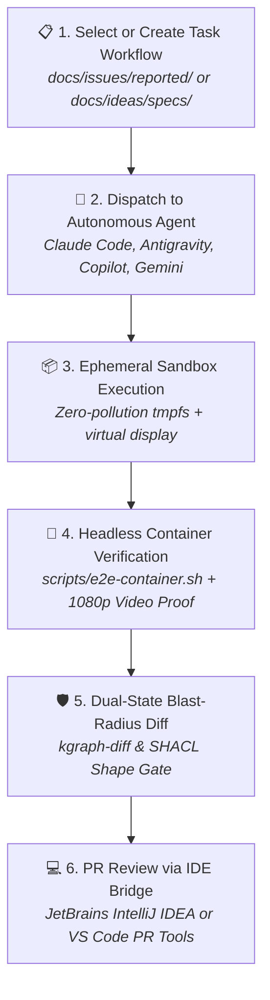

# Contributing to RobOS: Use RobOS to Build RobOS!

Welcome! RobOS is an AI-first SDLC platform and autonomous agent governance harness. We believe contributing to open source should not be an exercise in manual drudgery, endless environment debugging, and waiting weeks for unverified diffs to be reviewed.

> **"RobOS changes how open source works: we just create task workflows we want to run, and ask someone in the community (or their autonomous AI agent) to run them for us!"**

In the RobOS ecosystem, human contributors act as **Lead System Architects**—steering requirements, defining prompt contracts, and reviewing proof-of-work—while autonomous AI agents (Claude Code, Google Antigravity, GitHub Copilot, and Google Gemini) handle the grueling implementation, boilerplate, and verification in disposable, zero-pollution sandboxes (`tmpfs`).

---

## Table of Contents

- [The RobOS Contributor Lifecycle](#the-robos-contributor-lifecycle)
- [Agent-Ready Contribution Prompts](#agent-ready-contribution-prompts)
  - [1. Fixing a Bug or Issue](#1-fixing-a-bug-or-issue)
  - [2. Implementing a Feature Proposal](#2-implementing-a-feature-proposal)
  - [3. Scaffolding a New Electron App](#3-scaffolding-a-new-electron-app)
  - [4. Updating Knowledge Graph Schemas & Contracts](#4-updating-knowledge-graph-schemas--contracts)
- [Local Prerequisites & Setup](#local-prerequisites--setup)
- [Architecture & Development Conventions](#architecture--development-conventions)
- [Commit & Pull Request Standards](#commit--pull-request-standards)
- [Community & Communication](#community--communication)

---

## The RobOS Contributor Lifecycle



### 1. Select or Create a Task Workflow
- **Fix an Issue**: Browse open, triaged bug specifications in [`docs/issues/reported/`](docs/issues/reported/).
- **Build a Feature**: Pick an approved architectural specification from the [Feature Ideas Store](docs/ideas/specs/).
- **Submit a New Workflow**: If you discovered a bug or have an idea, don't just dump unformatted text—use the `report-issue` or `create-feature-spec` skills to generate a prompt contract that anyone in the community can run.

### 2. Dispatch to an AI Agent (Community Runner)
Launch your coding agent of choice inside your cloned repository. Feed the agent the exact task workflow or specification. The agent will analyze dependencies, create a feature branch, and build the solution following [AGENTS.md](AGENTS.md).

### 3. Ephemeral Sandbox Execution
RobOS agents run inside isolated, disposable in-memory environments (`tmpfs`). Workstations stay clean: no lingering daemon processes, no cluttering config files in your user home, and zero credential leaks.

### 4. Containerized E2E Verification & Video Proof-of-Work
RobOS eliminates blind trust in AI diffs. Before submitting code, the contributor or agent runs `./scripts/e2e-container.sh`. This spins up a headless Docker container with an `Xvfb` virtual framebuffer and Picom compositor, runs the E2E test suite, and records a 1080p narrated video walkthrough proof with Piper TTS voiceover.

### 5. Dual-State Knowledge Graph Blast-Radius Diff
Run `kgraph-diff` to compare the feature branch against `main`. RobOS checks W3C SHACL shape conformance and verifies that no services, databases, or contracts suffer broken references.

### 6. PR Review in Your IDE
Open the PR and review it with full rich AST context:
- **IntelliJ IDEA**: Connect via the RobOS IntelliJ plugin (IPC port 63343) for native JetBrains Pull Request tool window review, breakpoint debugging, and run configuration testing.
- **VS Code**: Use native GitHub Pull Request review (`GitHub.vscode-pull-request-github`).
- Inspect the embedded 1080p video proof-of-work in the PR description and approve!

---

## Agent-Ready Contribution Prompts

Copy and paste these battle-tested prompts directly into your AI agent terminal (Claude Code, Google Antigravity, GitHub Copilot, or Gemini CLI) to execute tasks autonomously.

### 1. Fixing a Bug or Issue

```text
You are a Lead Software Engineer for RobOS. We need you to resolve the reported issue:
`docs/issues/reported/ISSUE-<XXX>-<slug>.md`

Follow the RobOS Agent Review-Based Development harness (AGENTS.md):
1. Branch: Create a new branch `fix/<slug>`.
2. Investigate & Reproduce:
   - Read the reproduction steps in the issue spec.
   - Run the relevant app locally or run its unit test in packages/robos-test/.
3. Implement Fix:
   - Apply minimal, surgical modifications to packages/<app-id>/.
   - Ensure all Electron security rules are preserved (contextBridge, userData set before single-instance lock).
4. Verify & Proof:
   - Run `./scripts/e2e-container.sh` or the specific package test suite.
   - Confirm that the issue is fixed with zero regressions.
5. Commit:
   - Create a conventional commit: `fix(<app-id>): <clear description>`.
```

### 2. Implementing a Feature Proposal

```text
You are an autonomous RobOS Core Architect. Implement the approved feature spec:
`docs/ideas/specs/<spec-slug>.md`

Follow AGENTS.md:
1. Branch: Create a branch `feat/<spec-slug>`.
2. Knowledge Graph:
   - Update `.robos/kgraphs/` with any new entities or microservice nodes conforming to W3C SHACL shapes.
3. Implementation:
   - Implement the feature across packages/.
   - If introducing a new app, register its icon in packages/robos-icons/index.js and assign a debug port in packages/robos-lib/snapshot-cli.js.
4. Testing & Verification:
   - Add BDD Gherkin test scenarios in packages/robos-test/tests/.
   - Run containerized headless verification via `./scripts/e2e-container.sh`.
   - Record a 1080p narrated video demo using `record-demo`.
5. PR Blast Radius:
   - Run `kgraph-diff` to verify zero unintended architectural side-effects.
```

### 3. Scaffolding a New Electron App

Use the `/create-robos-app` skill or prompt your agent:

```text
You are building a new native RobOS Electron application called "<App Label>".
App ID: "<app-id>"
Purpose: "<1-sentence description>"

Please:
1. Create `packages/<app-id>/` with:
   - `package.json` (name, version, scripts: "start": "electron .", standalone dependencies)
   - `main.js` (sets userData to ~/.config/robos/electron/<app-id>, single instance lock, snapshot debug server)
   - `preload.js` (contextBridge exposing safe IPC invoke channels)
   - `renderer/index.html`, `renderer/app.js`, `renderer/styles.css` (using RobOS dark navy theme variables)
   - `<app-id>.desktop` file and `icon.svg` (48x48 Lucide cyan style)
2. Register the app icon in `packages/robos-icons/index.js` (alphabetical order).
3. Assign a unique snapshot debug port in `packages/robos-lib/snapshot-cli.js`.
4. Add a test suite under `packages/robos-test/tests/<app-id>.test.js`.
```

### 4. Updating Knowledge Graph Schemas & Contracts

```text
You are updating the RobOS Dual-State SDLC Knowledge Graph.
Target Package: `.robos/kgraphs/<package-id>/package.jsonld`

Instructions:
1. Read the existing W3C SHACL shapes in `.robos/kgraphs/`.
2. Apply changes preserving OASIS OSLC 3.0 and Schema.org annotations (`robos:refersFrom`).
3. Ensure zero plaintext credentials (all credentials MUST link to UNIX pass via `robos:hasCredential`).
4. Validate schemas by running `kgraph-validate`.
5. Run `kgraph-diff` against main to review the blast-radius delta before committing.
```

---

## Local Prerequisites & Setup

RobOS is a monorepo composed of independent, modular packages. There is **no root `package.json`**. Each app in `packages/` manages its own dependencies to ensure absolute runtime isolation.

### System Prerequisites
- **Node.js 20+** and npm
- **Docker** (recommended for containerized headless E2E verification)
- **Electron** (installed per-package via npm)
- **QEMU/KVM** (optional, for running the full turnkey appliance OS image)

### Clone the Repository
```bash
git clone https://github.com/nddipiazza/robos.git
cd robos
```

### Launch an Application Locally
You can launch any RobOS desktop application directly from your shell:
```bash
# Launch Dev Central daily dashboard
electron packages/dev-central

# Launch any specific app
electron packages/<app-id>
```

### Run Tests Locally
```bash
# Run unit tests across the test harness
cd packages/robos-test
npm install
npm run test:unit

# Run full headless E2E test suite inside Docker container
./scripts/e2e-container.sh
```

---

## Architecture & Development Conventions

When contributing code to RobOS, adhere strictly to these architectural rules:

### 1. Electron IPC & Security Standards
| Requirement | Rationale |
|-------------|-----------|
| **`app.setPath('userData', ...)` before `requestSingleInstanceLock()`** | Must point to `~/.config/robos/electron/<app-id>` to avoid lockfile collisions between apps. |
| **`contextBridge` + `ipcRenderer.invoke()` ONLY** | Never enable `nodeIntegration: true` or `contextIsolation: false`. All system operations must go through validated IPC handlers. |
| **Wrap `/usr/local/share/robos/robos-lib/...` in `try/catch`** | Allows apps to fall back cleanly to local relative paths during standalone development outside the VM. |
| **Chromium Flags** | Pass `--no-sandbox --disable-gpu --disable-dev-shm-usage` when running in virtualized or container environments. |

### 2. Styling & Theme Palette
All RobOS applications use native CSS variables for consistent dark navy/cyan styling:
```css
--bg-primary: #0d1117;   /* main background */
--bg-card:    #161b22;   /* card and sidebar panels */
--border:     #30363d;   /* structural dividers */
--accent:     #00bcd4;   /* RobOS cyan brand accent */
--accent-glow:#00e5ff;   /* bright interactive highlight */
--text-main:  #c9d1d9;   /* primary typography */
--text-muted: #8b949e;   /* captions and metadata */
```

### 3. Iconography
- 48×48 SVG in Lucide style.
- `stroke-width="1.5"`, `stroke-linecap="round"`, `stroke-linejoin="round"`.
- Primary stroke: `#00bcd4` (RobOS cyan).

### 4. Shared Libraries
- **`robos-lib/ai-json.js`** — Robust AI JSON streaming & repair parser (`parseAIJson`, `JSON_RULES_PROMPT`).
- **`robos-lib/dom-snapshot.js`** — Debug server for automated DOM tree snapshots.
- **`robos-lib/ai-agent.js`** — Unified AI agent invocation wrapper.
- **`robos-icons/index.js`** — SVG icon registry.

Load them with fallback for local development outside the VM:
```js
let robosLib = null;
try {
  const paths = [
    path.resolve(__dirname, '..', 'robos-lib', 'ai-json'),
    '/usr/local/share/robos/robos-lib/ai-json',
  ];
  for (const p of paths) { try { robosLib = require(p); break; } catch {} }
} catch {}
```

---

## Creating a New App

Use the slash command (if using Claude Code):

```
/create-robos-app "My App Name"
```

Or manually:

1. Create `packages/<app-id>/` with `main.js`, `preload.js`, `renderer/`, `icon.svg`, `package.json`, `<app-id>.desktop`
2. Register in `packages/robos-icons/index.js` (alphabetical by `appId`)
3. Add a debug port to `packages/robos-lib/snapshot-cli.js`
4. Add the `.desktop` file to `/usr/share/applications/` on the VM

See [AGENTS.md](AGENTS.md) for the full app registration checklist.

### Icon style

48×48 SVG, Lucide style:
- `stroke-width="1.5"`, `stroke-linecap="round"`, `stroke-linejoin="round"`
- Pick a color from the palette: `#00bcd4` cyan, `#3b82f6` blue, `#22c55e` green, `#7c3aed` purple, `#f97316` orange, `#ef4444` red

---

## Commit & Pull Request Standards

### Conventional Commits
We strictly follow [Conventional Commits](https://www.conventionalcommits.org/):

| Prefix | Description | Example |
|--------|-------------|---------|
| `feat:` | New feature, app, or architecture node | `feat(app-wizard): add Bevy game engine archetype` |
| `fix:` | Bug fix or issue resolution | `fix(dev-central): fix singleton lock collision on logout` |
| `docs:` | Documentation updates | `docs(ideas): add prompt-driven contributor workflow` |
| `refactor:` | Code restructure, zero behavior change | `refactor(robos-lib): optimize AI JSON streaming parser` |
| `chore:` | Maintenance, deps, tooling | `chore(deps): bump electron to 33.0.0` |
| `test:` | Test suite improvements or new BDD tests | `test(kube-studio): add Helm release reconciliation test` |

Scope your commit message when modifying a specific package:
```bash
feat(workflow-studio): add unsaved-changes confirmation dialog
fix(task-servers): prevent SingletonLock crash on multi-user systems
```

---

## Pull Request Checklist & Proof-of-Work

Every pull request submitted to RobOS must be accompanied by proof of work:

1. **Focused Scope**: One feature spec or issue fix per PR.
2. **Containerized Test Verification**: Run `./scripts/e2e-container.sh` to ensure all tests pass in the headless Docker + Xvfb container.
3. **1080p Video Proof-of-Work**: Record or link the automated walkthrough video demonstration (`~/.robos/development/walkthroughs/<slug>/`) in your PR description.
4. **Knowledge Graph Conformance**: Run `kgraph-diff` to confirm that changes to `.robos/kgraphs/` conform to W3C SHACL shapes and cause no unintended transitive breakage.
5. **IDE Review Ready**: Maintainers review code using the RobOS PR bridge in JetBrains IntelliJ IDEA or VS Code. Ensure your branch contains clean AST and symbol integrity.

---

## Finding a Task Workflow (Where to Start)

Looking for high-impact items to pick up?
- **Triaged Defect Specs**: Browse [`docs/issues/reported/`](docs/issues/reported/) for structured bug specifications ready for agent resolution.
- **Approved Feature Specs**: Browse [`docs/ideas/specs/`](docs/ideas/specs/) for planned features with full C4 architecture and BDD test requirements.
- **Roadmap High-Impact Pillars**: Check [docs/roadmap.md](docs/roadmap.md) for transformative capabilities (Search Studio, IaC Studio, Local Gitea, etc.).

---

## Community & Communication

Connect with the RobOS architects, core contributors, and researchers exploring AI-first operating systems:

- 🎮 **[RobOS Discord Server](https://discord.gg/6PjxzkHujE)** — Real-time chat, office hours, and developer support.
- 💬 **[#general Channel](https://discord.com/channels/1546926331193725029/)** — General discussion, architectural debates, and AI agent demos.
- 💡 **[Feature Ideas Store](docs/ideas/)** — Community proposals and executable prompt workflows.
- 🐙 **[GitHub Discussions](https://github.com/nddipiazza/robos/discussions)** — Architecture proposals, show-and-tell, and Q&A.
- 🐞 **[GitHub Issues](https://github.com/nddipiazza/robos/issues)** — Bug reports and defect specifications.
- 🎥 **[Model Problem](https://nddipiazza.github.io/robos/model-problem/)** — Watch RobOS execute end-to-end SDLC workflows.

