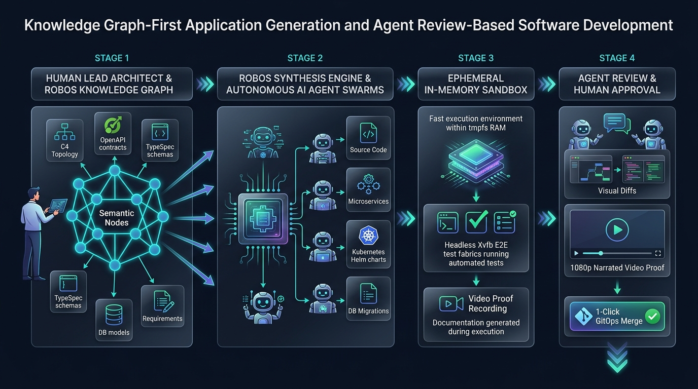
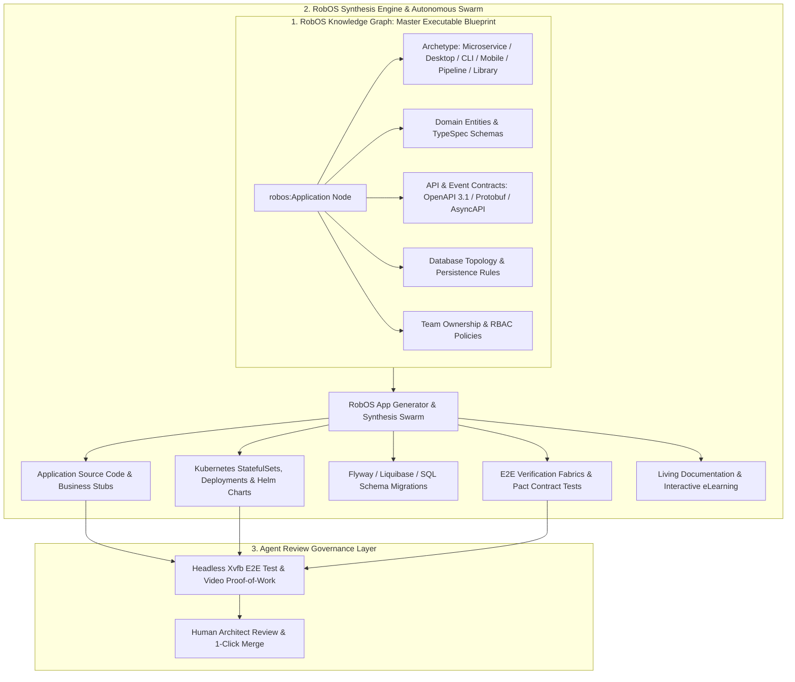
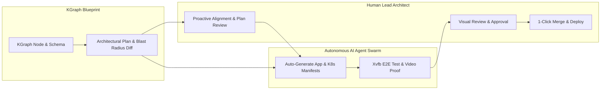

# RobOS — Knowledge Graph-First Developer OS & Application Suite

[](LICENSE)
[](https://github.com/nddipiazza/robos/stargazers)
[](packages/robos-test)
[](https://nddipiazza.github.io/robos/)

> **RobOS is the developer-first operating system and 30+ application suite engineered for Knowledge Graph-First (KGraph-First) Application Generation and Agent Review-Based Development.** 
> In RobOS, the Knowledge Graph is the executable semantic blueprint: just as an OpenAPI contract automatically generates a typed REST web service client, a RobOS Knowledge Graph following our schema enables full applications to become, for all intents and purposes, **auto-generated**. Human engineers act as System Architects designing and evolving the KGraph, while autonomous AI agent swarms synthesize source code, scaffold databases, verify contracts, and deliver video proof-of-work under an Agent Review governance layer.

---

## 🧬 The Core Paradigm: KGraph-First Application Generation



In modern software engineering, developers rely on contracts to eliminate manual boilerplate:
- An **OpenAPI 3.1 specification** automatically generates typed REST client SDKs, server stubs, and API gateway routing.
- A **Protobuf definition** automatically generates gRPC client/server stubs and binary serializers.
- An **SQL DDL schema** automatically generates ORM entity models and migration scripts.

**RobOS elevates this principle to the entire software application:**

> **If an API contract can automatically generate a client, a schema-validated Knowledge Graph can automatically generate an entire application.**



### How KGraph-First Generation Works

1. **Architect the System in the KGraph**: Define or import application nodes into the centralized Dual-State SDLC Knowledge Graph (`.robos/knowledge-graph.jsonld`, `.robos/packages.yaml`, and `.robos/topology.yaml`) adhering to the RobOS OSLC/SHACL ontology.
2. **Declare Archetypes, Contracts, and Schemas**: Specify the application archetype (e.g. `robos:Microservice` with OpenAPI 3.1 YAML, or `robos:DesktopApp` with IPC bridge declarations), data entities in Microsoft TypeSpec, and database connections.
3. **Auto-Generate the Application**: The RobOS synthesis engine and autonomous agent swarms compile the graph into:
   - Idiomatic polyglot project scaffolding and package dependencies
   - Strongly typed domain models, DTOs, and serialization logic
   - API endpoints, controllers, mock Prism servers, and client SDKs
   - Database migrations, connection pools, and query routines
   - Devcontainers, Dockerfiles, and Helm/Kubernetes manifests
   - Consumer contract tests (Pact) and headless E2E verification suites
4. **Agent Review-Based Governance**: The human architect reviews the synthesized application diffs against the KGraph requirements, inspects the 1080p narrated video proof-of-work, and approves the change for production deployment.

---

## 🚀 The Big Wins (Why RobOS?)

Traditional IDEs and AI tools give you autocompletions and popups. RobOS gives you an **autonomous engineering operating system and native developer application suite**:

- 🧬 **KGraph-First Application Generation**: Applications are generated from the Knowledge Graph just as web clients are generated from OpenAPI contracts. By defining system topology, entity models, and contracts in the RobOS schema, full production applications (across 6 archetypes) are synthesized automatically with zero boilerplate.
- 🧠 **Dual-State SDLC Knowledge Graph (OSLC Core 3.0 / W3C JSON-LD / SHACL)**: Models system topology, API contracts, entity schemas, devcontainers, repos, and tasks. Supports bulk-importing Git repositories into specialized application archetypes (Microservices with OpenAPI 3.1 YAML, Desktop Apps, Console CLIs, Mobile Apps, Pipelines, Libraries) with automated continuous sync from RobOS Git Projects on main updates. Live semantic diffing between Production (`main`) and Future feature states flags breaking changes and blast radius before coding begins.
- 👤 **Ephemeral Linux Agent Profiles & X11 Display Bridging**: AI agents run in isolated ephemeral Linux accounts (`/home/agent-...`) on in-memory `tmpfs` storage with zero residue, rendering UI directly to real/headless X11 displays for visual verification.
- 🎥 **Autonomous E2E-Driven Dev with Video Proof-of-Work**: Every task is validated in headless `Xvfb` compositors, generating timestamped DOM assertions, 1080p video walkthroughs, and synchronized neural voiceover subtitles (Piper TTS) before asking for human approval.
- ⚡ **100% Declarative GitOps Storage (`.robos/`)**: Topology, contracts, schemas, and data sources are stored in standard Git repositories, automatically synthesizing deployable Kubernetes manifests and Helm charts.
- 🗄️ **Comprehensive Developer Protocol & Database Suite**: DBeaver-inspired Relational DB Manager (Postgres, Oracle, MySQL), MongoDB/Redis NoSQL Manager, gRPC Client with Protobuf reflection, GraphQL Introspection Client, and Git-backed REST client.

---

## 📸 Visual Tour

### 1. System Topology & Knowledge Graph Studio
*Visually map your entire architecture across C4 zoom levels (Level 1: System Context, Level 2: Microservices & DB Containers, Level 3: Internal Components), auto-sync Spotify Backstage `catalog-info.yaml` software catalogs, and automatically synthesize ready-to-deploy Kubernetes StatefulSet/Deployment YAML manifests and Helm charts:*


### 2. RobOS Relational DB Manager (PostgreSQL, Oracle, MySQL)
*Live schema inspector, table data grid, multi-tab SQL console with sub-millisecond execution stats, and DDL generator:*


### 3. RobOS Data Sources & Multi-Provider Explorer
*Connect and query relational databases, document stores, AWS S3 contract vaults, and Kafka streaming topics:*


### 4. REST API Client & Collection Runner
*Git-backed REST collections (`.bru`), collection runner, environment matrices, and automated test assertions:*


### 5. Multi-Cluster Kube Studio & Cloud Infrastructure Navigator
*Multi-cluster Kubernetes management (Kind, EKS, GKE, AKS), Helm release matrices, ArgoCD GitOps sync, and live pod log streaming:*


---

## 🔄 The Governance Layer: Agent Review-Based Development

Agent Review-Based Development is the quality assurance and governance harness that wraps around KGraph-First generation:



1. **KGraph Synthesis & Investigation**: Grounded in the Knowledge Graph blueprint, the AI provisions an isolated workspace, investigates the task or feature requirement, reproduces edge cases at live breakpoints, and drafts an architectural plan.
2. **Proactive Human Alignment & Plan Review**: Grounded in the Knowledge Graph, RobOS workflows actively probe the lead architect on edge cases, constraints, and requirements—keeping humans intimately in the know before code is generated.
3. **Autonomous Implementation & Verification**: The AI synthesizes code, runs unit tests, updates API contracts, provisions databases, and runs headless E2E verifications.
4. **Human Final Approval**: The human reviews the PR, visual diffs, and narrated video walkthrough, then approves with 1 click.

---

## 📦 Installation Options

### ⭐️ Primary Option: Install on Current Ubuntu GNOME Desktop
Deploy all 30+ RobOS apps, GNOME desktop launchers, and shared libraries directly onto your existing Ubuntu machine (22.04, 24.04, or 26.04):
```bash
# Clone the repository
git clone https://github.com/nddipiazza/robos.git
cd robos

# Audit & install dependencies
node scripts/install-dev-deps.js

# Install all apps and desktop integration to /usr/local/share/robos/
sudo bash packages/desktop-shell/install.sh
```

### Option 2: Install Full RobOS Ubuntu OS Distro (Bare Metal & VM)
Build a dedicated bootable disk image (flashable via Rufus / Etcher) or run in a local QEMU/KVM virtual machine:
```bash
# Build the disk image + cloud-init ISO
infra/desktop/build.sh

# Run VM (16GB RAM, all host CPUs, SSH on port 2224, VNC on port 5910)
infra/desktop/run.sh
```

### Option 3: Cross-Platform Desktop App Suite (Windows & macOS Coming Soon)
- **Linux (Available Now)**: Run all 30+ Electron developer apps directly with Node.js 20+.
- **macOS / OS X (Coming Soon)**: Universal `.dmg` installer and Homebrew Cask with native Apple Silicon (M1–M4) support and top menu bar widget.
- **Windows (Coming Soon)**: One-click MSI package with WSL2 integration for ephemeral agent profile isolation.

---

## 🧪 Automated Testing & Continuous Verification

Run the full automated E2E test suite inside an isolated Docker container with Xvfb virtual framebuffers:
```bash
# Run full containerized test suite
./scripts/e2e-container.sh

# Run specific E2E test suite
xvfb-run -a node --test packages/robos-test/tests/e2e/topology-db-kube-lifecycle.test.js
xvfb-run -a node --test packages/robos-test/tests/developer-tools/developer-tools-suite.test.js
```

---

## 🌐 Open-Source Standards Integrated ("Reinvent Nothing!")

RobOS is built entirely upon established, battle-tested open standards. Instead of inventing proprietary formats, RobOS connects leading open-source specifications into a cohesive developer operating system:

| Standard / Technology | Industry Purpose | What RobOS Uses It For |
|:---|:---|:---|
| **[OASIS OSLC Core 3.0](https://open-services.net/) & [W3C JSON-LD](https://www.w3.org/TR/json-ld11/)** | Global ISO/OASIS linked-data standard for software lifecycle tool integration. | **KGraph-First Application Generation & Dual-State SDLC Knowledge Graph (`.robos/knowledge-graph.jsonld`)**: Serves as the executable master blueprint from which applications across 6 archetypes are auto-generated (analogous to OpenAPI generating API clients). Links microservices, schemas, contracts, Git repositories, tasks, and interactive eLearning courses into a unified linked-data graph. Powers semantic graph diffs, AI interactive eLearning generation with GitOps storage (`.robos/elearning.yaml`), and continuous AI living documentation synchronization whenever graph objects are updated. |
| **[Spotify Backstage](https://backstage.io/) (`catalog-info.yaml`)** | Industry-standard developer portal catalog format for service and API ownership. | **Zero-Config System Topology Discovery**: RobOS parses your existing Backstage `catalog-info.yaml` files across Git repositories to automatically populate the System Topology canvas without manual data entry. |
| **[C4 Architecture Model](https://c4model.com/) & Structurizr** | Hierarchical architecture visualization framework across 4 zooming levels. | **Visual Topology Studio & Blast Radius Inspector**: Renders polyglot microservice architectures across Level 1 (System Context), Level 2 (Containers & DBs), and Level 3 (Components), and exports C4 Structurizr PlantUML diagrams. |
| **[Microsoft TypeSpec](https://typespec.io/) & [Buf / Protobuf](https://buf.build/)** | Single-source-of-truth schema definition languages for domain models and DTOs. | **Entity Schema Studio (`schema-studio`)**: Developers and AI agents define entity schemas in TypeSpec once; RobOS compiles them into multi-language TypeScript, Java Records, and Go struct packages automatically. |
| **[OpenAPI 3.1](https://www.openapis.org/) & [AsyncAPI](https://www.asyncapi.com/)** | Global standards for documenting synchronous RESTful APIs and asynchronous event streams. | **Contract Studio & Mock Servers (`contract-studio`)**: Authors and validates API contracts with live Spectral linting, powers Prism mock servers, and auto-detects breaking API changes before code generation. |
| **[Pact](https://pact.io/) Consumer Contracts** | Consumer-driven contract testing framework guaranteeing microservice compatibility. | **Automated PR Merge Verification Gates**: Validates that changes made by AI agents or developers do not break downstream consumers or frontends before pull requests can be merged. |
| **[UseBruno](https://www.usebruno.com/) (`.bru`)** | Git-backed, open-source REST client storing plain-text `.bru` files in repositories. | **RobOS REST API Client & Collection Runner**: Automatically synthesizes `.bru` collections from OpenAPI specs, executes automated test suites, and records latency scorecards with zero cloud lock-in. |
| **[Devcontainers](https://containers.dev/) & [Docker / Kind](https://kind.sigs.k8s.io/)** | Standardized container specifications for isolated developer environments. | **Hermetic Workspace Provisioning & Local Test Fabrics**: Automatically provisions task workspaces and spins up local Kind Kubernetes clusters with pre-seeded databases and mock dependencies. |
| **[Model Context Protocol (MCP)](https://modelcontextprotocol.io/)** | Anthropic's universal JSON-RPC protocol connecting AI models to external tools. | **Unified Multi-Agent Tool Router (`robos-mcp-router`)**: Exposes system capabilities (Knowledge Graph, IDE Breakpoints, Kubernetes Deployments, Database Console) to Claude Code, Google Antigravity, Copilot CLI, and Gemini with OAuth popups. |
| **[Piper Neural TTS](https://github.com/rhasspy/piper)** | Ultra-fast, lightweight, offline neural text-to-speech synthesis engine. | **Automated Video Proof-of-Work Voiceovers**: Generates natural, synchronized neural voiceovers and WebVTT subtitle tracks for all 1080p demo walkthrough videos generated during headless E2E testing. |
| **DBeaver & DataGrip SQL Paradigms** | Professional multi-database management interfaces with schema explorers and data grids. | **RobOS Relational DB Manager (`db-manager`)**: Multi-tab SQL query consoles, table data grids, sub-millisecond execution metrics, and DDL generators for PostgreSQL, MySQL, and Oracle. |

---

## 📖 Documentation

Visit the official documentation portal for complete guides, architecture specifications, and walkthrough archives:
👉 **[https://nddipiazza.github.io/robos/](https://nddipiazza.github.io/robos/)**
