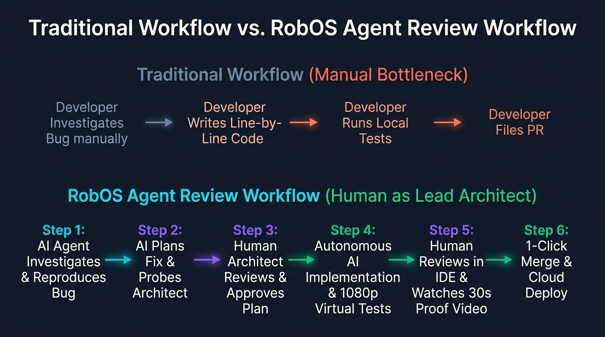

# RobOS — AI-First SDLC Platform & Autonomous Agent Governance Harness

<p align="center">
  
</p>

<p align="center">
  <strong>Autonomous AI agents that prove their work. Model your architecture once, auto-generate polyglot applications, and govern coding agents with 1080p video proof-of-work, semantic blast-radius diffs, and zero workstation pollution.</strong>
</p>

<p align="center">
  <a href="https://nddipiazza.github.io/robos/"><strong>Documentation</strong></a> ·
  <a href="https://nddipiazza.github.io/robos/getting-started.html"><strong>Quickstart</strong></a> ·
  <a href="https://nddipiazza.github.io/robos/big-wins.html"><strong>Core Innovations</strong></a> ·
  <a href="https://nddipiazza.github.io/robos/apps.html"><strong>30+ App Suite</strong></a> ·
  <a href="https://nddipiazza.github.io/robos/architecture.html"><strong>Architecture</strong></a> ·
  <a href="CONTRIBUTING.md"><strong>Contributing</strong></a> ·
  <a href="https://discord.gg/6PjxzkHujE"><strong>Discord Community</strong></a>
</p>

<p align="center">
  <a href="https://nddipiazza.github.io/robos/"></a>
  <a href="https://discord.gg/6PjxzkHujE"></a>
  <a href="LICENSE"></a>
  <a href="https://github.com/nddipiazza/robos/stargazers"></a>
  <a href="packages/robos-test"></a>
  <a href="https://nddipiazza.github.io/robos/"></a>
</p>

---

## ⚡ The Problem: AI Agents Are Coding Blind

Today's AI coding assistants (Claude Code, GitHub Copilot, Cursor, OpenAI Codex, Google Antigravity) generate code at blistering speed, but they introduce severe risks that bottleneck engineering teams:

1. **"Trust Me, It Works" (Review Fatigue)**: Agents claim `"Task complete!"` without verifying their work. Developers spend more time reviewing hallucinated diffs, broken imports, and failed edge cases than they would have spent writing the code from scratch.
2. **Invisible Blast Radiuses**: An agent working in a single file or repository has no visibility into the broader system. Renaming an entity breaks a downstream analytics pipeline; tweaking an API response violates a frontend consumer contract.
3. **Machine Pollution & Host Mutation**: Autonomous agents executing unchecked shell commands in your home directory leave behind orphaned node modules, zombie Docker containers, conflicting processes, and credential leak risks.

**RobOS fixes this by placing autonomous agents inside a verifiable governance harness.**

---

## 🎯 The 3 Killer Wedges

RobOS turns developers into **Lead System Architects** by wrapping autonomous agents in three non-negotiable verification gates:

```
┌─────────────────────────────────────────────────────────────────────────────┐
│                          ROBOS GOVERNANCE HARNESS                           │
├───────────────────────┬───────────────────────────┬─────────────────────────┤
│  1. VIDEO PROOF-OF-   │  2. DUAL-STATE SEMANTIC   │  3. EPHEMERAL IN-MEMORY │
│     WORK ENGINE       │     BLAST-RADIUS DIFFS    │     SANDBOXES (tmpfs)   │
├───────────────────────┼───────────────────────────┼─────────────────────────┤
│ Headless Xvfb virtual │ Live graph diffing of     │ Zero host pollution.    │
│ displays execute user │ World 1 (main) vs World 2 │ Agents run in isolated  │
│ flows and record 1080p│ (feature branch). Flags   │ in-memory Linux profiles│
│ narrated walkthroughs │ broken API contracts and  │ with auto-teardown and  │
│ with Piper TTS audio. │ Pact tests before code.   │ zero residual files.    │
└───────────────────────┴───────────────────────────┴─────────────────────────┘
```

### 1. Automated 1080p Video Proof-of-Work
Stop reviewing walls of blind diffs. RobOS launches agents inside a headless Xvfb virtual framebuffer with Picom compositing. Agents execute the feature, interact with live UI elements, verify API responses, and record a **1080p text-narrated video walkthrough with synchronized neural voiceovers (Piper TTS)**. You approve PRs by watching a 15-second verifiable proof video.

### 2. Dual-State Semantic Blast-Radius Checking
Before generating code, RobOS compares your production architecture (**World 1**) against your proposed feature changes (**World 2**) in the SDLC Knowledge Graph. It traces transitive dependencies across services, databases, message brokers, and consumers—alerting you to breaking contract changes, schema regressions, and test failures *before* any code is merged.

### 3. Ephemeral In-Memory Sandboxes (`tmpfs`)
AI agents never execute raw commands directly in your daily workstation environment. RobOS isolates agent swarms inside ephemeral Linux user profiles mounted directly on in-memory `tmpfs` storage. When the task is complete, the sandbox evaporates—leaving zero machine residue, zero orphaned daemons, and zero credential leaks.

---

## 🧬 The Paradigm: Knowledge Graph-First (KGraph-First) Application Generation

In modern software engineering:
- An **OpenAPI 3.1 contract** automatically generates typed REST clients and server stubs.
- A **Protobuf definition** automatically generates gRPC serializers and microservice stubs.
- An **SQL DDL schema** automatically generates typed ORMs and database migrations.

**RobOS elevates this principle to the entire software application:**

> **If an API contract can auto-generate a client, a schema-validated Knowledge Graph can auto-generate an entire application.**

```
   ┌─────────────────────────────────────────────────────────────┐
   │             1. ARCHITECT IN KNOWLEDGE GRAPH                 │
   │   Define topology, services, schemas & contracts in .robos/  │
   └──────────────────────────────┬──────────────────────────────┘
                                  ▼
   ┌─────────────────────────────────────────────────────────────┐
   │           2. SYNTHESIS ENGINE & AGENT SWARMS                │
   │   Compiles graph into polyglot code, DB migrations & tests   │
   └──────────────────────────────┬──────────────────────────────┘
                                  ▼
   ┌─────────────────────────────────────────────────────────────┐
   │         3. EPHEMERAL SANDBOX EXECUTION & PROOF              │
   │   Builds, runs headless tests, and records 1080p video demo │
   └──────────────────────────────┬──────────────────────────────┘
                                  ▼
   ┌─────────────────────────────────────────────────────────────┐
   │         4. LEAD ARCHITECT REVIEW & 1-CLICK MERGE            │
   │   Inspect blast radius, watch video proof, approve in IDE   │
   └─────────────────────────────────────────────────────────────┘
```

RobOS supports auto-generation and governance across **9 application archetypes**:
- **Microservices & Web APIs** (`robos:Microservice`): OpenAPI 3.1 YAML, Protobuf gRPC, GraphQL.
- **Frontend Web Applications** (`robos:FrontEndApp`): React, Vite, Next.js, Vue, Svelte SPAs/SSRs.
- **Desktop Applications** (`robos:DesktopApp`): Electron, Qt, GTK, Tauri local applications.
- **PC Games** (`robos:PCGame`): Godot, Unreal Engine, Unity, Bevy desktop games.
- **Mobile Games** (`robos:MobileGame`): Cross-platform mobile games with touch controls.
- **Console & CLI Tools** (`robos:ConsoleApp`): Go Cobra, Rust Clap, Python Click, Node Commander utilities.
- **Mobile Applications** (`robos:MobileApp`): React Native, Flutter, iOS, and Android clients.
- **Data Pipelines & Workers** (`robos:DataPipeline`): Kafka Streams, Celery, Spark distributed workers.
- **Shared Libraries & SDKs** (`robos:Library`): Reusable client SDKs and common packages.

---

## ⚡ Quickstart (Universal: macOS, Linux, Windows, Docker)

Get up and running with RobOS in under 60 seconds on your existing machine:

### 1. Clone the Repository
```bash
git clone https://github.com/nddipiazza/robos.git
cd robos
```

### 2. Run Autonomous E2E Tests with Video Proof-of-Work (Docker)
Run the full headless verification harness inside an isolated container:
```bash
./scripts/e2e-container.sh
```
*Captures DOM snapshots, executes integration tests, and generates proof-of-work video walkthroughs with zero host dependencies.*

### 3. Launch Standalone Native Apps (macOS, Linux, Windows WSL2)
Run any RobOS desktop application using Node.js 20+:
```bash
# Install core dependencies
npm install

# Launch the Agent Code Review Platform
npx electron packages/pr-review

# Launch the System Topology Studio
npx electron packages/topology-manager

# Launch the Knowledge Graph Explorer
npx electron packages/kgraph-explorer
```

> 💡 **Drop `.robos/` into any repository**: Add a `.robos/` directory to your existing Git projects to immediately enable semantic Knowledge Graph architecture modeling, TypeSpec schemas, and pre-code blast-radius diffs with Claude Code, Google Antigravity, GitHub Copilot, or OpenAI Codex.

---

## 🧰 Native Developer Tool Suite (30+ Apps)

RobOS includes a complete suite of lightweight, high-performance developer tools built with Electron and vanilla JavaScript (zero framework overhead). All tools are natively wired to your SDLC Knowledge Graph:

| Category | Application | Purpose |
|:---|:---|:---|
| **Core Dev** | **Dev Central** | Daily engineering dashboard: sprint board, PR health, blocker radar, AI standup. |
| | **Issue Manager** | GitHub Issues client with Kanban views and AI issue breakdown. |
| | **Git Projects** | Repository manager with Monaco editor, terminal runners, and AI dev-setup generation. |
| | **Agents Manager** | Multi-agent orchestrator for Claude Code, Antigravity, Copilot, and Gemini CLI sessions. |
| | **App Launcher** | Searchable system grid for all RobOS developer tools and workflows. |
| **Architecture** | **Topology Manager** | C4 Level 1–3 interactive architecture canvas; auto-syncs Spotify Backstage catalogs. |
| | **Knowledge Graph Explorer** | Dual-state OSLC JSON-LD knowledge graph browser with SHACL shape validation. |
| | **Schema Studio & Registry** | Microsoft TypeSpec domain modeling, W3C SHACL generation, and schema linters. |
| | **Contract Studio** | OpenAPI 3.1 & AsyncAPI specification authoring with live Prism mock servers. |
| **Data & APIs** | **Relational DB Manager** | DBeaver/DataGrip-style multi-tab SQL console and data grid for Postgres, MySQL, Oracle. |
| | **NoSQL DB Manager** | Document and key-value store manager for MongoDB, Redis, and DynamoDB. |
| | **Data Sources Explorer** | Unified inspector for relational databases, document vaults, and Kafka event streams. |
| | **REST API Client** | Git-backed UseBruno (`.bru`) REST collection runner and microservice verifier. |
| | **gRPC Client** | BloomRPC/Kreya-style Protobuf dynamic reflection microservice testing client. |
| | **GraphQL Client** | GraphiQL-style schema explorer, query editor, and variable runner. |
| **Governance** | **Agent Code Review Platform** | Autonomous AI PR auditor, semantic diffs, security audits, and IDE review bridge. |
| | **Workflow Studio** | Visual SDLC lifecycle, issue state machines, and approval pipelines. |
| | **Task Planner** | Multi-domain AI task planning with interactive web forms and Jira/GitHub sync. |
| | **Agent Scheduler** | Background cron runner for automated agent maintenance and repo housekeeping. |
| **DevOps & Cloud** | **Kube Studio** | Multi-cluster Kubernetes navigator, Helm release matrix, and ArgoCD GitOps sync. |
| | **DevOps Wizard** | 25+ provider onboarding wizard (AWS, GCP, Azure, GitHub, GitLab, Docker, Okta). |
| | **Pass Manager** | Local UNIX GPG password store (`pass`) GUI with zero plaintext KGraph secrets. |
| | **Remote Execution Studio** | REAPI v2 distributed build cluster manager for Bazel, Buck2, and Buildbarn. |

---

## 🔄 The Governance Workflow: Agent Review-Based Development

RobOS turns the traditional coding bottleneck on its head:

<p align="center">
  
</p>

1. **Grounded Investigation**: The AI agent provisions an isolated workspace, investigates the requirement against the Knowledge Graph blueprint, reproduces edge cases at live breakpoints, and drafts an architectural proposal.
2. **Proactive Human Alignment**: RobOS actively probes the Lead Architect on design trade-offs, constraints, and edge cases *before* any code is generated—keeping humans in command.
3. **Autonomous Implementation & Verification**: The agent synthesizes the code, runs unit tests, provisions temporary test databases, and executes headless end-to-end tests on an isolated virtual screen.
4. **1-Click Human Approval in Your IDE**: Review the blast radius diff and watch the 1080p narrated video proof. If you want deep code inspection, RobOS bridges the review directly into your existing **IntelliJ IDEA** or **VS Code** environment with full AST navigation, symbol lookup, and local debugging tools.

---

## 💻 Optional Power-User Appliance: Dedicated RobOS VM

For enterprise teams requiring total physical isolation, air-gapped workstations, or a dedicated developer appliance, RobOS provides a bootable **Ubuntu 26.04 LTS OS image** and **QEMU/KVM virtual machine**:

- **Hardware Specs**: 16 GB RAM, host CPU passthrough, 100 GB sparse disk.
- **Desktop Environment**: Custom GNOME desktop, dark navy/cyan theme, LightDM auto-login, Tilix terminal, zsh + oh-my-zsh.
- **Total Isolation**: Air-gapped sandbox with SSH (port 2224), VNC (port 5910), and SPICE (port 5932).
- **Stateless Reproducibility**: 100% automated first-boot provisioning via cloud-init.

```bash
# Build the disk image + cloud-init ISO
infra/desktop/build.sh

# Launch the QEMU/KVM Virtual Machine
infra/desktop/run.sh
```

*(Note: The VM is entirely optional. RobOS runs natively on macOS, Linux, Windows WSL2, and Docker.)*

---

## 🌐 Open-Source Standards ("Reinvent Nothing!")

RobOS is built entirely on battle-tested open specifications. Everything persists as declarative plain-text files in your Git repository under `.robos/`:

| Standard / Technology | Industry Purpose | RobOS Implementation |
|:---|:---|:---|
| **[OASIS OSLC Core 3.0](https://open-services.net/) & [W3C JSON-LD](https://www.w3.org/TR/json-ld11/)** | Global ISO/OASIS linked-data standard for lifecycle integration. | Powers the SDLC Knowledge Graph, modular package stores, and semantic blast-radius diffs. |
| **[Spotify Backstage](https://backstage.io/) (`catalog-info.yaml`)** | Industry-standard developer portal service catalog format. | Zero-config topology discovery: parses Backstage YAML to auto-populate system architecture. |
| **[C4 Architecture Model](https://c4model.com/) & Structurizr** | Hierarchical architecture visualization framework (Levels 1–3). | Visual System Topology Studio: renders microservices, databases, and message brokers. |
| **[Microsoft TypeSpec](https://typespec.io/)** | Single-source-of-truth schema definition language. | Schema Studio: authors entity schemas once and compiles to TypeScript, Java, and Go. |
| **[OpenAPI 3.1](https://www.openapis.org/) & [AsyncAPI](https://www.asyncapi.com/)** | API specifications for RESTful endpoints and event streams. | Contract Studio: authors API contracts, powers Spectral linting, and runs Prism mock servers. |
| **[Pact](https://pact.io/) Consumer Contracts** | Consumer-driven contract testing for microservices. | Automated PR gates: prevents agents from merging code that breaks downstream consumers. |
| **[UseBruno](https://www.usebruno.com/) (`.bru`)** | Git-backed, plain-text REST client collections. | REST API Client: executes automated test suites with zero proprietary cloud locks. |
| **[Model Context Protocol (MCP)](https://modelcontextprotocol.io/)** | Anthropic's universal protocol connecting AI to tools. | Exposes RobOS Knowledge Graph, IDE breakpoints, and Kubernetes deployments to any agent. |
| **[Piper Neural TTS](https://github.com/rhasspy/piper)** | Ultra-fast offline neural text-to-speech synthesis. | Generates synchronized narration audio and WebVTT subtitles for 1080p video proofs. |

---

## 🤖 About RobOS (*row-bose*)

- **Pronunciation**: **RobOS** is pronounced **"row-bose"** (`/ˈroʊboʊs/`), rhyming with *rose*.
- **The Lore**: Named after **Robo** (R-66Y / Prometheus) from the 1995 RPG classic *Chrono Trigger*. In the story, Robo spends **400 years** tilling and irrigating Fiona's scorched desert so it blossoms into a flourishing forest. RobOS does the same for developers: our autonomous agents tirelessly perform the grueling background labor of the SDLC (scaffolding, contracts, migrations, headless testing) so human architects can focus on creative engineering.
- **Built by Agents**: **GitHub Copilot**, **Anthropic Claude**, **OpenAI Codex**, and **Google Gemini** contributed equally to building RobOS through agentic workflows, proving that diverse AI models excel when collaborating under open standards.

👉 **[Read the complete backstory and multi-agent lore →](https://nddipiazza.github.io/robos/about.html)**

---

## 💬 Community & Discussion

Join developers, architects, and AI researchers building the future of agent-governed software development:

- 🛠️ **[Contributing Guide (Use RobOS to Build RobOS!)](CONTRIBUTING.md)** — Create prompt contracts, run workflows in community sandboxes, and submit video-proven PRs.
- 💡 **[Feature Ideas Store](docs/ideas/)** — Browse raw ideas, structured specs, and community prompt workflows.
- 🎮 **[Join the RobOS Discord Server](https://discord.gg/6PjxzkHujE)** — Live support, demo streams, and agent architecture discussions.
- 💬 **[#general Channel Discussion](https://discord.com/channels/1546926331193725029/)** — General questions and community announcements.
- 🐙 **[GitHub Discussions](https://github.com/nddipiazza/robos/discussions)** & **[Issues](https://github.com/nddipiazza/robos/issues)** — Feature proposals, bug reports, and roadmap discussions.
- 📖 **[Documentation Portal](https://nddipiazza.github.io/robos/)** — Complete guides, architecture specs, and walkthrough archives.

---

<p align="center">
  <sub>Licensed under the Apache License 2.0. Copyright &copy; 2026 RobOS Contributors.</sub>
</p>
