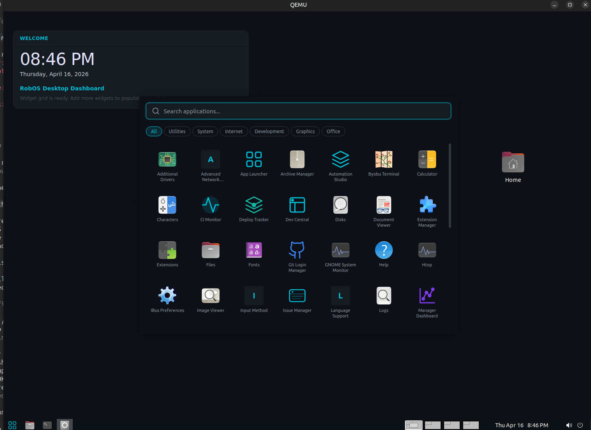

# RobOS

**The AI-Native Operating System for Software Teams**

> A purpose-built Linux desktop where AI picks up tickets, writes the code, opens the PR, and asks you to review it — while you drink your coffee.

[](LICENSE)
[](https://github.com/nddipiazza/robos/releases)
[](https://github.com/nddipiazza/robos/stargazers)
[](https://github.com/nddipiazza/robos/issues)
[](#contributing)



**[Documentation](https://nddipiazza.github.io/robos/)** | **[Getting Started](https://nddipiazza.github.io/robos/getting-started.html)** | **[App Suite](https://nddipiazza.github.io/robos/apps/)** | **[Contributing](CONTRIBUTING.md)**

---

## Two Pillars

### 1. AI-First Software Delivery

30+ purpose-built Electron apps cover every phase of the software delivery lifecycle. AI agents write code, review PRs, manage tasks, and track deployments. Every status transition, notification, and dashboard update happens automatically.

| App | Purpose |
|-----|---------|
| **Task Board** | Kanban/list view with state and assignee filters |
| **Issue Manager** | GitHub Issues client with AI breakdown and workflow transitions |
| **PR Review Board** | AI-assisted code review with interactive breakpoint inspection |
| **CI Monitor** | Pipeline monitoring with AI failure diagnosis |
| **Dev Central** | Developer dashboard: my tasks, PRs, review requests, AI standup |
| **Manager Dashboard** | Sprint board, velocity charts, deployment tracking |
| **Workspace Manager** | Auto-provisioned workspaces per task (branch, deps, dev server) |
| **AI Agent Manager** | Manage Claude, Copilot, Codex, Gemini agent sessions |
| **Desktop Customizer** | Prompt-driven GNOME customization with versioned rollback |
| + 20 more | Security, secrets, notifications, automation, widgets, search... |

### 2. Prompt-Shaped Desktop

The **Desktop Customizer** reshapes the entire GNOME experience through natural language and slash commands:

```
/move-clock left              Move the clock to the left
/taskbar height 48px          Make the taskbar bigger
/theme accent #ff6b6b         Change the accent color
/shortcut super+1 open task-board   Create a keyboard shortcut
/snapshot save "before experiment"   Save a checkpoint
/restore last                 Undo the last change
```

Every change is git-snapshotted with instant rollback. Build entirely new Electron apps from a sentence description.

---

## Quick Start

### Option A: Install on a Laptop (Bare Metal)

1. Download the **RobOS Installer** for your OS from the latest [GitHub Release](https://github.com/nddipiazza/robos/releases) (Linux AppImage, macOS dmg, Windows exe)
2. Run it — select your USB drive, click Flash
3. Boot from USB — RobOS installs unattended in ~15 minutes

Or use the CLI: `sudo bash scripts/flash-robos.sh /dev/sdX`

See the [full guide](https://nddipiazza.github.io/robos/getting-started.html) for details.

### Option B: Run as a VM

```bash
# Download pre-built image from GitHub Releases
wget https://github.com/nddipiazza/robos/releases/latest/download/robos-v0.0.2.qcow2
wget https://github.com/nddipiazza/robos/releases/latest/download/robos-v0.0.2-seed.iso

# First boot (provisions the full desktop)
qemu-system-x86_64 -m 16G -smp $(nproc) -enable-kvm -cpu host \
  -drive file=robos-v0.0.2.qcow2,format=qcow2,if=virtio \
  -drive file=robos-v0.0.2-seed.iso,format=raw,if=virtio \
  -netdev user,id=net0,hostfwd=tcp::2224-:22 \
  -device virtio-net-pci,netdev=net0 -display gtk
```

### Option C: Build from Source

```bash
git clone https://github.com/nddipiazza/robos.git
cd robos
infra/desktop/build.sh           # Build disk image + seed ISO
infra/desktop/run.sh --firstboot # First boot with provisioning
infra/desktop/run.sh             # Subsequent boots
```

**SSH**: `ssh -p 2224 robos@localhost` (password: `robos`) | **VNC**: port 5910 | **SPICE**: port 5932

---

## Architecture

```
RobOS Desktop (Ubuntu 26.04 + GNOME)
├── 30+ Electron Apps ──── dark theme, contextBridge IPC
├── Desktop Customizer ─── prompt-driven GNOME customization
├── Event Bus ──────────── automatic status transitions
├── Rule Engine ────────── event → condition → action
├── Agent Scheduler ────── background AI agent jobs
├── Desktop Manager ────── system tray + app launch IPC hub
└── Shared Libraries ───── robos-lib, robos-icons, robos-ui
```

- **OS**: Ubuntu 26.04 LTS, GNOME desktop, custom dark navy/cyan theme
- **Apps**: Electron + vanilla JS, no framework lock-in
- **IPC**: `contextBridge` + `ipcRenderer.invoke` (never `nodeIntegration: true`)
- **Events**: Event Bus + Rule Engine for automatic status transitions
- **Config**: `~/.config/robos/`, all persistent data
- **Testing**: 440+ unit tests, 22 E2E test suites, VM smoke tests

---

## Development

### Testing Apps (Dev Harness)

Run apps outside the VM in a sandboxed environment:

```bash
cd packages/robos-test
npm install

# Run all unit tests
npm run test:unit

# Run all E2E tests (requires display)
npm test
```

### Deploying to VM

```bash
# Single app update
scp -P 2224 -r packages/<app>/* robos@localhost:/tmp/<app>/
ssh -p 2224 robos@localhost "sudo rm -rf /usr/local/share/robos/<app> && \
  sudo cp -r /tmp/<app> /usr/local/share/robos/<app> && \
  sudo chmod -R a+rX /usr/local/share/robos/<app> && \
  cd /usr/local/share/robos/<app> && sudo npm install --quiet"
```

---

## The Model Problem

We validate every feature against a real project: **buildbarn-forms** — a React component library for editing Buildbarn remote build execution configurations. A team of four (Product Owner, Developer, Dev Lead, Manager) takes a story from backlog to deployed, with every status transition automatic.

[Read the full walkthrough](https://nddipiazza.github.io/robos/model-problem/)

---

## Project Status

| Wave | Epics | Status |
|------|-------|--------|
| Foundation | Desktop, App Framework, Dev Tools | Complete |
| Infrastructure | Security, Task Management, System Services | Complete |
| Workspace & Events | Workspace Manager, Event Engine | Complete |
| AI Agents | Agent Integration (Claude, Copilot, etc.) | Complete |
| Code Review & CI | PR Review Board, CI Monitor | Complete |
| Dashboards | Dev Central, Manager Dashboard | Complete |
| Desktop Customizer | Prompt-driven GNOME customization | Complete |
| Deep Testing | Expanded test harness, gh stubs, E2E | In Progress |

[Full roadmap](https://nddipiazza.github.io/robos/roadmap.html)

---

## Contributing

We welcome contributions of all sizes — new apps, bug fixes, docs, and ideas.

- 📖 Read [CONTRIBUTING.md](CONTRIBUTING.md) for the full guide
- 🐛 [Open an issue](https://github.com/nddipiazza/robos/issues/new) for bugs or feature requests
- 💬 [Start a Discussion](https://github.com/nddipiazza/robos/discussions) for ideas and questions
- 🔍 Browse [`good first issue`](https://github.com/nddipiazza/robos/issues?q=is%3Aissue+is%3Aopen+label%3A%22good+first+issue%22) for easy entry points

Quick start:

```bash
git clone https://github.com/nddipiazza/robos.git
cd robos/packages/robos-test
npm install && node harness.js --list-apps
```

---

## License

MIT
