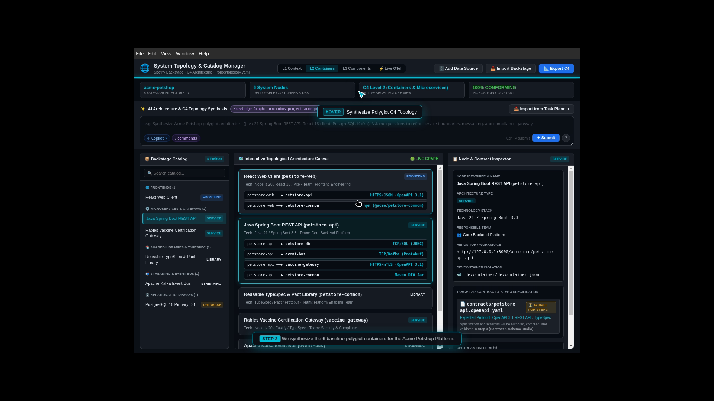
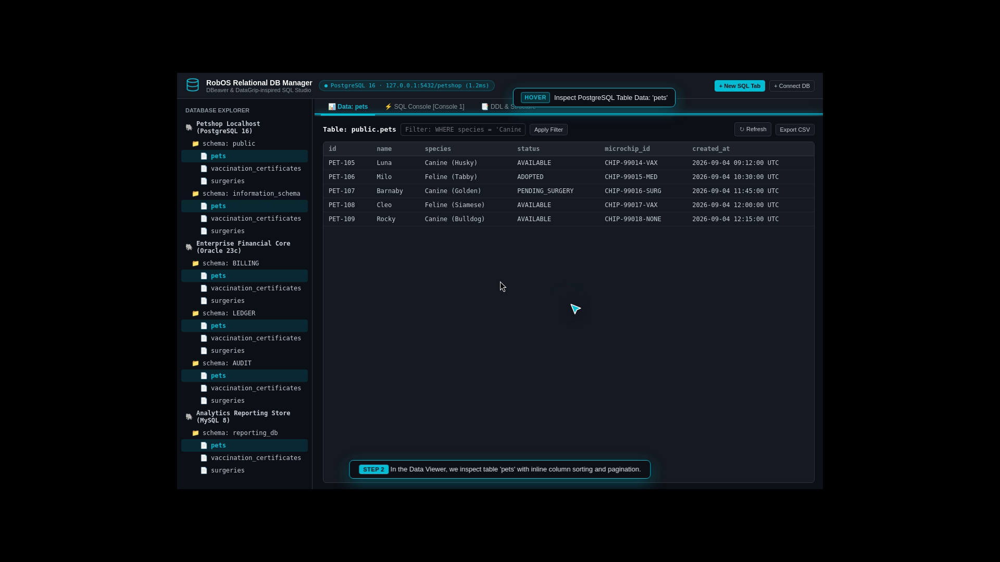
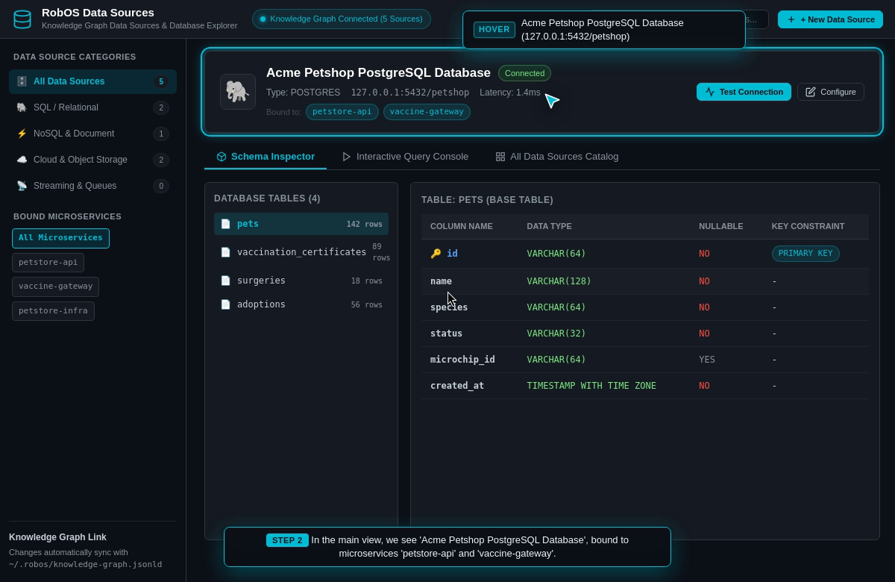
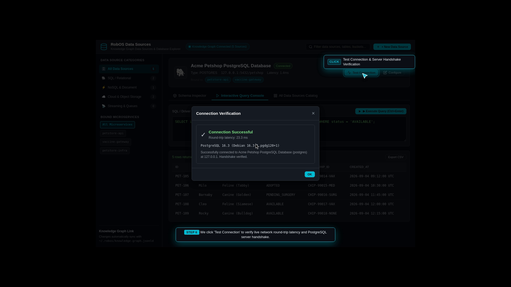
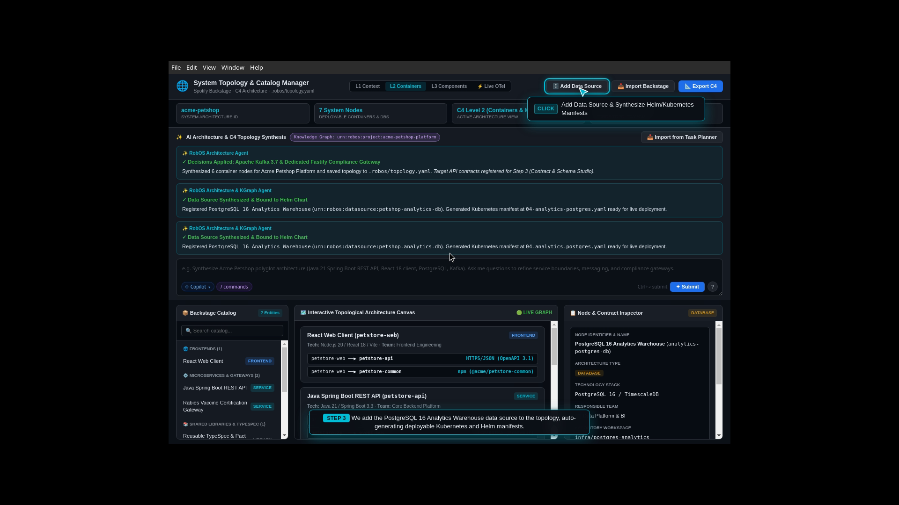
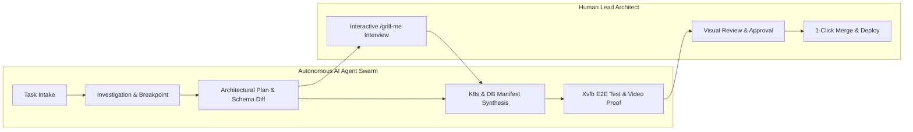

# RobOS — AI-First Software Development Operating System

[](LICENSE)
[](https://github.com/nddipiazza/robos/stargazers)
[](packages/robos-test)
[](https://nddipiazza.github.io/robos/)

> **RobOS is the developer-first operating system and desktop ecosystem engineered for AI Agent Review-Based Development.** Autonomous AI agent swarms investigate issues, plan fixes, write code, run deep E2E test fabrics, provision databases, and synthesize Kubernetes Helm infrastructure — while human developers act as Lead Architects, Reviewers, and Approvers.

---

## 🚀 The Big Wins (Why RobOS?)

Traditional IDEs and AI tools give you autocompletions and popups. RobOS gives you an **autonomous engineering operating system**:

- 🧠 **Dual-State SDLC Knowledge Graph (OSLC Core 3.0 / W3C JSON-LD / SHACL)**: Models system topology, API contracts, entity schemas, devcontainers, repos, and tasks. Live semantic diffing between Production (`main`) and Future feature states flags breaking changes and blast radius before coding begins.
- 👤 **Ephemeral Linux Agent Profiles & X11 Display Bridging**: AI agents run in isolated ephemeral Linux accounts (`/home/agent-...`) on in-memory `tmpfs` storage with zero residue, rendering UI directly to real/headless X11 displays for visual verification.
- 🎥 **Autonomous E2E-Driven Dev with Video Proof-of-Work**: Every task is validated in headless `Xvfb` compositors, generating timestamped DOM assertions, 1080p video walkthroughs, and synchronized neural voiceover subtitles (Piper TTS) before asking for human approval.
- ⚡ **100% Declarative GitOps Storage (`.robos/`)**: Topology, contracts, schemas, and data sources are stored in standard Git repositories, automatically synthesizing deployable Kubernetes manifests and Helm charts.
- 🗄️ **Comprehensive Developer Protocol & Database Suite**: DBeaver-inspired Relational DB Manager (Postgres, Oracle, MySQL), MongoDB/Redis NoSQL Manager, gRPC Client with Protobuf reflection, GraphQL Introspection Client, and Bruno-powered Git-backed REST client.

---

## 📸 Visual Tour

### 1. System Topology & Knowledge Graph Studio
*Visually map your entire architecture across C4 zoom levels (Level 1: System Context, Level 2: Microservices & DB Containers, Level 3: Internal Components), auto-sync Spotify Backstage `catalog-info.yaml` software catalogs, and automatically synthesize ready-to-deploy Kubernetes StatefulSet/Deployment YAML manifests and Helm charts:*


### 2. RobOS Relational DB Manager (PostgreSQL, Oracle, MySQL)
*Live schema inspector, table data grid, multi-tab SQL console with sub-millisecond execution stats, and DDL generator:*


### 3. RobOS Data Sources & Multi-Provider Explorer
*Connect and query relational databases, document stores, AWS S3 contract vaults, and Kafka streaming topics:*


### 4. REST API Client & Collection Runner (Bruno)
*Git-backed REST collections (`.bru`), collection runner, environment matrices, and automated test assertions:*


### 5. Multi-Cluster Kube Studio & Cloud Infrastructure Navigator
*Multi-cluster Kubernetes management (Kind, EKS, GKE, AKS), Helm release matrices, ArgoCD GitOps sync, and live pod log streaming:*


---

## 🔄 AI Agent Review-Based Development



1. **AI Investigates & Reproduces**: When a task is picked up, the AI provisions an isolated workspace, reproduces the problem at a live breakpoint, and drafts a concrete architectural plan.
2. **Interactive Plan Review (`/grill-me`)**: The lead architect reviews the plan, grills the AI on edge cases, and adjusts requirements before any code is written.
3. **Autonomous Implementation & Verification**: The AI implements code, runs unit tests, updates API contracts, provisions databases, and runs headless E2E verifications.
4. **Human Final Approval**: The human reviews the PR, visual diffs, and narrated video walkthrough, then approves with 1 click.

---

## 📦 Installation Options

### Option A: Install as Desktop App Suite (Linux, macOS, Windows)
Run all 30+ lightweight Electron developer applications on your existing development workstation:
```bash
# Clone the repository
git clone https://github.com/nddipiazza/robos.git
cd robos

# Install dependencies and setup environment
node scripts/install-dev-deps.js

# Launch any application (e.g. Relational DB Manager, System Topology)
node packages/robos-test/lib/harness.js --app db-manager
node packages/robos-test/lib/harness.js --app topology-manager
node packages/robos-test/lib/harness.js --app dev-central
```

### Option B: Install Full RobOS Ubuntu OS Distro
Build a bootable QEMU/KVM disk image or write a flashable USB drive with Rufus / Etcher for bare-metal hardware:
```bash
# Build the disk image + cloud-init ISO
infra/desktop/build.sh

# Run VM (16GB RAM, all host CPUs, SSH on port 2224, VNC on port 5910)
infra/desktop/run.sh
```

---

## 🧪 Automated Testing & Continuous Verification

Run the full automated E2E test suite inside an isolated Docker container with Xvfb virtual framebuffers:
```bash
# Run full containerized test suite
./scripts/e2e-container.sh

# Run specific E2E test suite
xvfb-run -a node --test packages/robos-test/tests/e2e/topology-db-kube-lifecycle.test.js
xvfb-run -a node --test packages/robos-test/tests/developer-tools/developer-tools-suite.test.js
```

---

## 🌐 Open-Source Standards Integrated ("Reinvent Nothing!")

| Domain | Standard / Project | How RobOS Integrates It |
|---|---|---|
| **Knowledge Graph** | [OASIS OSLC Core 3.0](https://open-services.net/), [W3C JSON-LD](https://www.w3.org/TR/json-ld11/) | Full system world state stored in `.robos/knowledge-graph.jsonld`. |
| **Architecture Topology** | [Backstage](https://backstage.io/), [C4 Model](https://c4model.com/) | Reads Backstage `catalog-info.yaml` and exports C4 Structurizr PlantUML. |
| **API Contracts** | [OpenAPI 3.1](https://www.openapis.org/), [Pact](https://pact.io/), [AsyncAPI](https://www.asyncapi.com/) | Contract-driven testing and consumer verification gates. |
| **Entity Schemas** | [Microsoft TypeSpec](https://typespec.io/), [Buf](https://buf.build/) | Single source of truth compiling to TypeScript, Java, and Go DTOs. |
| **REST Collections** | [UseBruno](https://www.usebruno.com/) | Git-backed `.bru` collections with zero cloud lock-in. |
| **Local Environments** | [Devcontainers](https://containers.dev/), [Docker](https://www.docker.com/) | Standardized `.devcontainer.json` workspace isolation. |
| **Agent Protocols** | [Model Context Protocol (MCP)](https://modelcontextprotocol.io/) | Claude Code, Antigravity, Copilot CLI, and Gemini tooling integrations. |
| **Neural TTS** | [Piper TTS](https://github.com/rhasspy/piper) | Offline neural text-to-speech for synchronized demo video voiceovers. |

---

## 📖 Documentation

Visit the official documentation portal for complete guides, architecture specifications, and walkthrough archives:
👉 **[https://nddipiazza.github.io/robos/](https://nddipiazza.github.io/robos/)**
