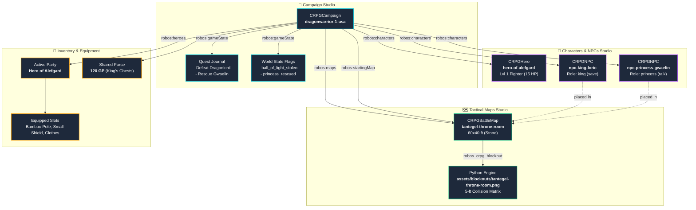

# RobOS cRPG Editor

RobOS cRPG Editor is the unified game development and authoring environment for `robos-crpg` (Realm of Heroes). It consolidates campaign orchestration, independent D&D 5e character and NPC authoring, party inventory management, and tactical 2.5D battle map level design into a cohesive, production-grade desktop application.

## Unified Architectural Model

In RobOS cRPG development, entities are decoupled as first-class, independent Knowledge Graph objects:

- **Battle Maps** are independent entities (`games/crpg-realm/maps/<slug>.jsonld`, `@type: ["robos:CRPGBattleMap", "schema:Place"]`).
- **Characters & NPCs** are independent entities (`games/crpg-realm/characters/<slug>.jsonld`, `@type: ["robos:CRPGCharacter", "schema:Person"]`).
- **Campaigns** compose independent maps (`robos:maps`) and characters (`robos:characters`), with an active starting map (`robos:startingMap`), quest log (`robos:questLog`), and world flags (`robos:worldFlags`).

## Core Modules

### 1. 📜 Campaign Management
- **Campaign Metadata**: Title, slug, setting, ruleset (D&D 5e SRD, Advanced 5e, RobOS Tactical), and difficulty mode.
- **Compositional Maps & Characters**: Checklists for selecting independent maps and characters that belong to this campaign, with automatic count badges.
- **Starting Map Selection**: Designates the primary spawn location (e.g. `tantegel-throne-room`).
- **Quest Journal & World Story Flags**: Narrative tracking with live status updates (active, completed, failed) and dynamic state flags.

### 2. 👤 Characters & NPCs Studio
- **Dual Entity Classification**: Supports full player heroes and non-player characters (NPCs) with seamless one-click switching.
- **Roster Filtering**: Instant pill filters (`All`, `Heroes`, `NPCs`) with role badges (`Hero`, `King`, `Princess`, `Guard`, `Merchant`, `Sage`).
- **NPC Scripting & Placement**: Configure NPC role, interaction type (`talk`, `save`, `shop`, `inn`, `rest`), assigned map placement, grid coordinate position (`col`, `row`), facing orientation, and multi-page dialogue scripts.
- **D&D 5e Hero Attributes**: Full ability scores (STR, DEX, CON, INT, WIS, CHA) with auto-computed modifiers, AC, HP Max, current HP, speed, initiative, prepared spells, and backstory.

### 3. 🗺️ Tactical Maps Studio
- **Independent Battle Arenas**: Author maps with customizable dimensions (width/height in feet), base terrain (stone, dirt, grass, dungeon floor), and background underlay art.
- **Object Hierarchies**: Place and manipulate obstacles, throne daises, stone archway columns, treasure chests, and doors with configurable collision (`blocked`, `difficult`, `open`) and opacity (`opaque`, `transparent`, `halfCover`).
- **Automated Blockout Compilation**: One-click `⚡ Build PNG & Grid` invokes the headless `robos_crpg_blockout` Python compiler to generate 5-ft cell collision matrices and static background PNGs in `games/crpg-realm/assets/blockouts/`.

### 4. 🎒 Party Inventory & Equipment
- **Active Party Assembly**: Check heroes into the active adventuring party and set party leader and tactical marching formations (Rank, Wedge, Line, Column, Square, Scatter).
- **Party Currency Purse**: Shared gold (GP), silver (SP), and copper (CP) purse.
- **Individual Equipment Slots**: Main hand, off hand, armor, helmet, cloak, boots, ring, and quick-access belt items with live AC impact calculations.

## Example: Dragon Warrior 1 (USA) Scaffolding

Using only user inputs in the editor, the full Dragon Warrior 1 (USA) starting campaign is authored:
1. **Map**: `tantegel-throne-room` (60×40 ft stone arena with King's throne dais, pillars, and 120 G chest).
2. **Hero**: `Hero of Alefgard` (Level 1 Fighter, descendant of Erdrick, 15 HP, 12 AC, HEAL/SIZZ spells).
3. **NPCs**:
   - `King Loric` (role: `king`, interaction: `save`, Tantegel Castle 2F placement, Ball of Light dialogue).
   - `Princess Gwaelin` (role: `princess`, interaction: `talk`, swamp cave rescue dialogue).
4. **Campaign**: `dragonwarrior-1-usa` (Alefgard world setting, Tantegel starting map, Dragonlord and Gwaelin quests).
5. **Inventory**: 120 GP starting purse, Bamboo Pole, Small Shield, Clothes, and Herb/Torch/Key stash.

### Visual Walkthrough

| 🗺️ Tantegel Throne Room Map | 👤 Hero of Alefgard |
|---|---|
|  |  |
| **👑 King Loric NPC** | **📜 Dragon Warrior 1 Campaign** |
|  |  |
| **🎒 Equipped Gear & Purse** | **⚡ Editor Overview** |
|  |  |
