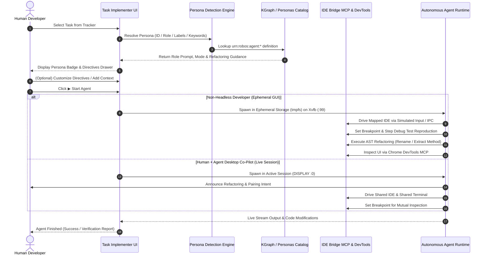

RobOS Task Implementer is the autonomous development workbench where tasks from GitHub Issues or Jira are picked up and executed by **specialized Developer Agent Personas** (`robos:AgentPersona`).

Rather than running generic AI coding loops, Task Implementer recognizes the domain requirements of each task and equips the underlying agent (Claude Code, GitHub Copilot, Google Antigravity, or Oh My Pi) with strict, role-specific RobOS architectural guidance, execution environments, and developer tool suites.

## Role-Aware Autonomous Implementation

When a task is selected from the tracker:
1. **Automatic Persona Detection**: Task Implementer inspects `task.agentPersonaId`, `task.assignedRole`, issue labels (`role:non-headless-dev`, `role:human-agent-copilot`, `role:frontend-web-dev`, `role:game-dev`), or task heuristics to resolve the designated persona.
2. **Workspace Header Role Selector**: The resolved persona is prominently displayed with its icon badge in the workspace header, with a dropdown allowing instant role switching.
3. **Custom Directives & Guidance Drawer**: Developers can toggle the **🤖 Directives** drawer to review and fine-tune the role prompt, attach task-specific architectural rules, or reset to the persona's defaults.
4. **Execution Prompt Synthesis**: Upon clicking **▶ Start Agent**, Task Implementer synthesizes the comprehensive execution prompt combining the persona directive, RobOS development guidance (e.g. Electron contextBridge security, Godot 4 LTS best practices, or Flyway migrations), issue requirements, and developer context before streaming progress live.

---

## Dual Execution Pathways

RobOS Task Implementer separates execution into distinct isolation and collaboration pathways based on the persona's designated execution mode:

### 1. Non-Headless Developer (`ephemeral-gui`)
- **Ephemeral Sandbox**: Operates inside disposable `tmpfs` in-memory storage (`/tmp/robos-workspaces/<taskKey>`) with dedicated virtual X11 framebuffers (Xvfb, `:99`).
- **Simulated IDE User Inputs**: Drives the RobOS mapped IDE (IntelliJ IDEA on port 63343 IPC / VS Code CLI / IDE Bridge MCP) via simulated keystrokes, shortcuts, and plugin hooks without stealing host window focus.
- **Real Terminal Sessions**: Executes build tools, compilers, and test suites in real Linux terminals within the isolated sandbox.
- **Interactive Step Debugger**: Proactively sets breakpoints (`robos_ide_set_breakpoint`), inspects paused thread stacks and local variable values (`robos_ide_get_thread_state`), and steps through reproduction code rather than print debugging.
- **Chrome DevTools MCP**: Leverages `chrome-devtools-mcp` tools (`take_snapshot`, `list_console_messages`, `list_network_requests`, `evaluate_script`) to inspect running frontends and live web APIs.
- **Token-Saving IDE Refactorings**: An entire suite of this personality is dedicated to using IDE AST refactorings to avoid gobbling up LLM tokens.

### 2. Human + Agent Desktop Co-Pilot (`desktop-session`)
- **Shared Desktop Pairing**: Runs alongside the human developer in their *same active session* (`DISPLAY=:0`), sharing the developer's visible IDE window, active terminal, and browser tabs.
- **Collaborative Co-Piloting**: Steps through breakpoints together with the human engineer, executes live AST refactorings directly in the developer's active project, and announces actions before making destructive changes.

---

## Token-Saving IDE Refactoring Suite

A core breakthrough in RobOS Task Implementer is the elimination of token exhaustion caused by LLMs rewriting entire files or huge multi-hundred-line diffs. Both the **Non-Headless Developer** and **Human + Agent Desktop Co-Pilot** are equipped with the **IDE Bridge MCP Refactoring Tool Suite**:

| MCP Tool | Purpose & AST Operation | Token Impact |
|----------|-------------------------|--------------|
| `robos_ide_refactor_rename` | Renames classes, methods, fields, and variables across the entire AST with reference updates | Zero file rewrites; 95% token savings |
| `robos_ide_refactor_extract_method` | Extracts code range into a new function/method with parameter deduction | Avoids full function regeneration |
| `robos_ide_refactor_extract_variable` | Extracts expressions into local variables | Targeted AST mutation |
| `robos_ide_refactor_move` | Moves classes or modules to target packages with auto-import fixes | Preserves package-wide consistency |
| `robos_ide_refactor_safe_delete` | Verifies usages before deleting symbols to prevent regressions | Fast compiler-backed safety check |
| `robos_ide_execute_action` | Runs IDE native actions (`ReformatCode`, `OptimizeImports`, `RenameElement`) | Native IDE formatting without LLM tokens |

---

## Architecture Flow & Execution Pathways

---

## Supported Developer Personas

| Role | URN ID | Execution Mode | Domain Guidance & Tooling Focus |
|------|--------|----------------|---------------------------------|
| **Non-Headless Developer** | `urn:robos:agent:non-headless-dev` | `ephemeral-gui` | Isolated Xvfb (`:99`), mapped IDE via IPC/simulated input, step debugger, Chrome DevTools MCP, token-saving AST refactorings |
| **Human + Agent Desktop Co-Pilot** | `urn:robos:agent:human-agent-copilot` | `desktop-session` | Same active session (`:0`), shared IDE & terminal pairing, collaborative breakpoint stepping, token-saving refactorings |
| **Software Architect** | `urn:robos:agent:software-architect` | `headless` | C4 models, ADR authoring, KGraph blast-radius diffs, contract boundaries |
| **Frontend Web Developer** | `urn:robos:agent:frontend-web-dev` | `headless` | Electron preload security, React 18, accessible DOM, RobOS dark theme CSS |
| **Game Developer** | `urn:robos:agent:game-dev` | `headless` | Godot 4 LTS, GDScript, isometric turn combat, D&D 5e SRD, Flare RPG sprites |
| **Backend Systems Developer** | `urn:robos:agent:backend-dev` | `headless` | Java 21 / Spring Boot 3, Node.js / Fastify, OpenAPI 3.1, gRPC Protobuf |
| **Data & Storage Engineer** | `urn:robos:agent:data-engineer-dev` | `headless` | PostgreSQL schemas, Flyway versioned migrations, Kafka event streaming |
| **DevOps & Cloud Engineer** | `urn:robos:agent:devops-engineer` | `headless` | Kubernetes manifests, Helm charts, ArgoCD GitOps, CI/CD pipelines |
