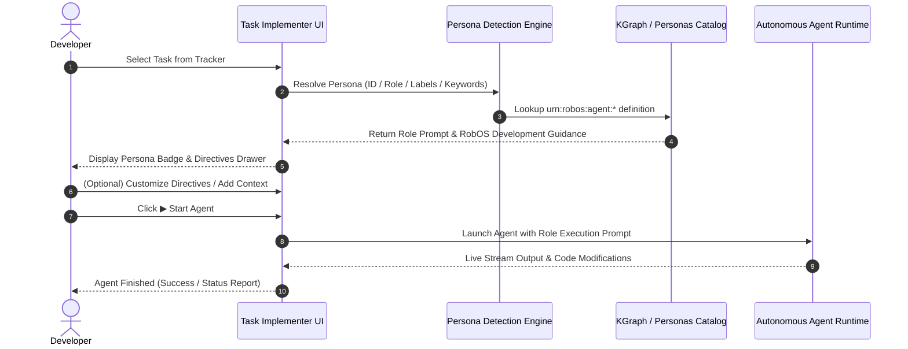

---
title: "Task Implementer"
package: task-implementer
category: ai-agents
icon: task-implementer.svg
RobOS Task Implementer is the autonomous development workbench where tasks from GitHub Issues or Jira are picked up and executed by **specialized Developer Agent Personas** (`robos:AgentPersona`).

Rather than running generic AI coding loops, Task Implementer recognizes the domain requirements of each task and equips the underlying agent (Claude Code, GitHub Copilot, or Oh My Pi) with strict, role-specific RobOS architectural guidance and execution constraints.

## Role-Aware Autonomous Implementation

When a task is selected from the tracker:
1. **Automatic Persona Detection**: Task Implementer inspects `task.agentPersonaId`, `task.assignedRole`, issue labels (`role:frontend-web-dev`, `role:game-dev`, etc.), or task heuristics to resolve the designated persona.
2. **Workspace Header Role Selector**: The resolved persona is prominently displayed with its icon badge in the workspace header, with a dropdown allowing instant role switching.
3. **Custom Directives & Guidance Drawer**: Developers can toggle the **🤖 Directives** drawer to review and fine-tune the role prompt, attach task-specific architectural rules, or reset to the persona's defaults.
4. **Execution Prompt Synthesis**: Upon clicking **▶ Start Agent**, Task Implementer synthesizes the comprehensive execution prompt combining the persona directive, RobOS development guidance (e.g. Electron contextBridge security, Godot 4 LTS best practices, or Flyway migrations), issue requirements, and developer context before streaming progress live.

### Execution Architecture Flow

## Supported Developer Personas

| Role | URN ID | Domain Guidance & Tooling Focus |
|------|--------|---------------------------------|
| **Software Architect** | `urn:robos:agent:software-architect` | C4 models, ADR authoring, KGraph blast-radius diffs, contract boundaries |
| **Frontend Web Developer** | `urn:robos:agent:frontend-web-dev` | Electron preload security, React 18, accessible DOM, RobOS dark theme CSS |
| **Game Developer** | `urn:robos:agent:game-dev` | Godot 4 LTS, GDScript, isometric turn combat, D&D 5e SRD, Flare RPG sprites |
| **Backend Systems Developer** | `urn:robos:agent:backend-dev` | Java 21 / Spring Boot 3, Node.js / Fastify, OpenAPI 3.1, gRPC Protobuf |
| **Data & Storage Engineer** | `urn:robos:agent:data-engineer-dev` | PostgreSQL schemas, Flyway versioned migrations, Kafka event streaming |
| **DevOps & Cloud Engineer** | `urn:robos:agent:devops-engineer` | Kubernetes manifests, Helm charts, ArgoCD GitOps, CI/CD pipelines |

