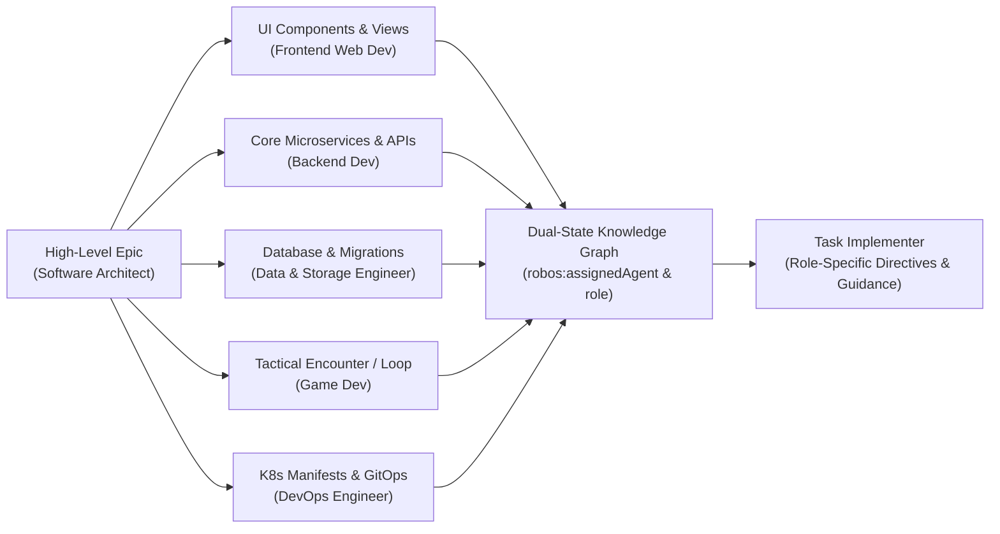

Tell the AI what you want to build in plain English, or choose from a library of **interactive task templates** spanning Services & APIs, Front-End Applications, Game Development (Godot, Unity, Unreal), Mobile Apps (React Native, Flutter), Libraries, Knowledge Graph & Schemas, Cloud Infrastructure, and DevOps. Each template provides an interactive web form tailored to the target domain, and developers can author and persist custom task templates in `~/.config/robos/task-planner/custom-templates/`. RobOS breaks goals down into structured Epics and child stories, synchronizing tickets to GitHub Issues, Gitea, or Jira.

## First-Class Developer Agent Personas

In RobOS, development work is not treated as generic code generation. Every task is governed by a **specialized Developer Agent Persona** (`robos:AgentPersona`), an entity in the Knowledge Graph conforming to W3C SHACL shape validation:

- **🏛️ Software Architect** (`urn:robos:agent:software-architect`): Governs C4 domain models, system boundaries, ADRs, KGraph blast-radius diffs, and modular service decomposition. Automatically assigned to high-level Epics.
- **🎨 Frontend Web Developer** (`urn:robos:agent:frontend-web-dev`): User interface and client specialist for Electron desktop DOM, React 18, accessible web components, RobOS dark navy/cyan design tokens, and contextBridge IPC security.
- **⚔️ Game Developer** (`urn:robos:agent:game-dev`): Game systems developer specializing in Godot 4 LTS, GDScript, isometric turn-based combat, D&D 5e SRD rules, Flare RPG sprite integration, and headless scenario tests.
- **⚙️ Backend Systems Developer** (`urn:robos:agent:backend-dev`): Distributed microservices engineer specializing in Java 21 / Spring Boot 3, Node.js / Fastify, OpenAPI 3.1 contracts, gRPC Protobuf stubs, and zero-leak secrets.
- **💾 Data & Storage Engineer** (`urn:robos:agent:data-engineer-dev`): Relational schema designer for PostgreSQL, versioned Flyway migrations, Kafka event streaming pipelines, NoSQL collections, and ACID indexing.
- **☁️ DevOps & Cloud Engineer** (`urn:robos:agent:devops-engineer`): Infrastructure engineer managing multi-cluster Kubernetes manifests, Helm charts, Dockerfiles, ArgoCD GitOps pipelines, and Prometheus monitoring.

### Role-Aware Epic Breakdown Workflow

### Interactive Persona Management & Directives

Developers can inspect and customize agent personas directly within the Task Planner UI:
1. **Personas Modal (`🤖 Agent Personas`)**: Review and edit core system prompts, RobOS development guidance, epic breakdown directives, and implementation instructions for any role, or create custom personas.
2. **Card-Level Role Selector**: Each generated task card displays its assigned agent role and allows instant re-assignment across specialized personas.
3. **Editable Implementation Directives**: Expanding a task card's directives box lets developers override prompts and attach custom constraints (e.g., WCAG compliance, memory optimization, or specific rule variants) before syncing to GitHub or Jira.

