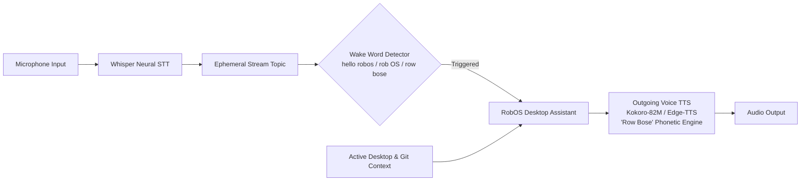

A bi-directional, privacy-first voice assistant engineered for hands-free AI interaction, ambient stream listening, and lifelike neural speech generation:
- **Natural Outgoing Neural Voice (TTS)**: Features high-fidelity neural speech engines including **Kokoro-82M** (24kHz warm open-source offline TTS) and **Edge-TTS** (studio-grade neural voices with zero API keys), with phonetic calibration ensuring RobOS is pronounced as *"Row Bose"*.
- **Continuous Topic Stream Listening**: Operates in an ephemeral background stream mode where ambient speech is emitted to subscriber topics without filling local prompt disk storage unless explicitly consumed.
- **Wake-Word Detection**: Listens directly on the live audio stream for `"hello robos"`, `"rob OS"`, and `"row bose"` triggers to wake the assistant hands-free.
- **RobOS Desktop Assistant**: Streams recognized speech in real time, enriches developer queries with active window and Git repository context, and responds out loud using the natural voice engine.
- **100% On-Device Neural Whisper STT**: Transcribes developer speech offline with `@xenova/transformers` ONNX runtime models (`whisper-tiny.en`), keeping proprietary enterprise codebase discussions safe from cloud data leaks.
- **Universal REST API (`:19188`), Node.js Library (`robos-lib/voice`), & CLI (`robos-voice`)**: Full programmatic control over speech generation, microphone capture, wake-word activation, and assistant dialogues.

### Architecture Overview

  
  

    <strong>RobOS Voice Architecture</strong>: Bi-directional neural voice pipeline connecting ambient Whisper stream listening, wake-word detection, context-aware desktop assistant, and lifelike Kokoro/Edge-TTS speech output.
  

Read the complete [RobOS Voice Guide]({{ site.baseurl }}).
