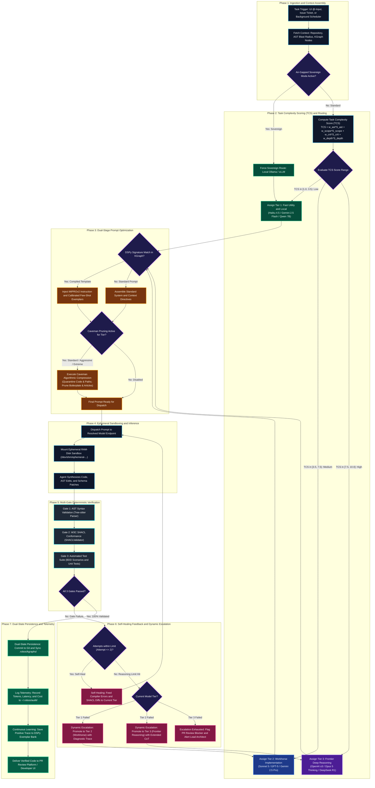

# Agent Tiers, Model Dispatch & Prompt Optimization
{: .no_toc }

How RobOS dynamically routes SDLC tasks across a 3-tier intelligence hierarchy while optimizing prompt bandwidth and accuracy using Caveman Mode compression and Stanford DSPy teleprompter compilation.
{: .fs-6 .fw-300 }

## Table of contents
{: .no_toc .text-delta }

1. TOC
{:toc}

---

## The Problem: The Cost of Homogeneous Model Usage

Traditional AI coding assistants treat all tasks identically: whether an engineer asks to generate a five-word git commit message, fix a missing semicolon, or re-architect a distributed microservice mesh across four polyglot repositories, the assistant invokes the same monolithic model endpoint.

This homogeneous approach creates two severe failure modes:

1. **Economic & Latency Inefficiency**: Invoking a high-latency, \$60/million-token frontier reasoning model for repetitive Tier 1 tasks (such as lint fixes, AST symbol lookup, or commit formatting) wastes computational budget and slows down continuous iteration.
2. **Under-Reasoning on Complex Architecture**: Forcing a cheap, low-parameter model to perform cross-service refactoring or distributed consensus analysis results in silent hallucinations, incomplete implementations, and broken contract dependencies.

**RobOS solves this through an architectural 3-Tier Model Dispatch Matrix coupled with algorithmic token compression (Caveman Mode) and programmatic prompt compilation (Stanford DSPy).**

---

## The 3 Agent Tiers in RobOS

RobOS structures AI agent execution into three specialized intelligence tiers. Each tier balances latency, reasoning capability, token cost, and context size for specific SDLC workflows:

<div style="margin: 2rem 0; border: 1px solid #1e293b; border-radius: 12px; overflow: hidden; background: #0b101b; box-shadow: 0 10px 40px rgba(0,0,0,0.6);">
  
  <div style="padding: 0.75rem 1.25rem; font-size: 0.85rem; color: #94a3b8; border-top: 1px solid #1e293b; background: #0d1424; text-align: center;">
    <strong>Task-to-Value Dispatch Matrix</strong>: Matching task reasoning complexity against computational cost to optimize engineering velocity and budget. <em>(Click image to zoom full screen)</em>
  </div>
</div>

### Tier Comparison Matrix

| Tier | Primary Capabilities | Typical Models | Optimal SDLC Tasks in RobOS | Cost Profile | Latency |
|:---|:---|:---|:---|:---|:---|
| **Tier 1: Fast Utility & Local** | Ultra-low latency, regex-like speed, offline execution, strict format following | Gemini 2.5 Flash, Claude Haiku 4.5, Local Ollama (`qwen2.5-coder:7b`, `llama3.3:8b`) | Commit messages, AST symbol search, SHACL shape validation, boilerplate test stubs, JSON/YAML reformatting, air-gapped tasks | <$0.10 / M tokens (or $0 on workstation GPU) | 100ms – 500ms |
| **Tier 2: Workhorse Implementation** | Strong coding acumen, multi-file comprehension, tool execution, unit test synthesis | Claude Sonnet 5, GPT-5, Gemini 2.5 Pro | Feature implementation, REST/gRPC API controllers, database migrations, Gherkin BDD scenarios, PR code reviews | $3.00 – $15.00 / M tokens | 1s – 4s |
| **Tier 3: Frontier Deep Reasoning** | Extended thinking tokens, backtracking search, deep architectural synthesis, formal verification | OpenAI o3, o3-mini, Claude Opus 5 (Thinking), DeepSeek R1 | Monorepo architecture design, distributed deadlock debugging, cross-microservice schema migration plans, security threat modeling | $15.00 – $60.00 / M tokens | 5s – 30s |

---

### Tier 1: Fast Utility & Local

Tier 1 models handle high-frequency, deterministic tasks where speed and low cost are paramount. These models act as the nervous system of RobOS, responding instantly to user typing and background filesystem events:

- **RobOS Search Indexer**: When developers type `@` in any `<robos-ai-textarea>`, Tier 1 models filter AST symbol indexes and suggest matching services, contracts, and databases.
- **Continuous SHACL Validation**: Validates modified JSON-LD nodes against W3C SHACL shapes in real time before persisting to `.robos/kgraphs/`.
- **Commit Message & PR Title Synthesis**: Parses git diffs and formats conventional commit strings (`feat:`, `fix:`, `refactor:`) in sub-second time.
- **Sovereign Local Execution**: Runs directly on workstation hardware via Ollama or vLLM, ensuring zero data egress for air-gapped environments.

### Tier 2: Workhorse Implementation

Tier 2 represents the daily coding engine for RobOS autonomous agents. When an engineer selects a ticket in **Issue Manager** or runs an E2E test in **Dev Central**, Tier 2 agents execute the implementation loop:

- **Service & Contract Generation**: Scaffolds OpenAPI 3.1 YAML specifications, Protobuf gRPC stubs, and GraphQL schemas from Knowledge Graph requirements.
- **Behavior-Driven Development (BDD)**: Implements step definitions and assertions matching Gherkin scenarios (`Given`, `When`, `Then`).
- **Code Refactoring & Bug Fixing**: Edits source files within in-memory ephemeral sandboxes, running local unit tests to verify zero regressions.
- **Automated Pull Request Reviews**: In the **Agent Code Review Platform**, Tier 2 models analyze semantic diffs, comment on code style, and check test coverage before alerting the Lead Architect.

### Tier 3: Frontier Deep Reasoning

Tier 3 models are reserved for complex, multi-variable engineering challenges that require extensive chain-of-thought exploration and backtracking:

- **System-Wide Architecture Synthesis**: When bootstrapping a new enterprise or company catalog in **Group Manager**, Tier 3 synthesizes C4 Context, Container, and Component topologies.
- **Distributed Concurrency & Race Conditions**: Traces asynchronous event-driven flows across Kafka message brokers, distributed cache invalidations, and database transactions.
- **Blast Radius Analysis**: Evaluates breaking schema changes across dozens of interdependent microservices and downstream client applications.
- **Root Cause Forensic Debugging**: When multi-service integration tests fail in QEMU/KVM containers, Tier 3 analyzes logs, heap dumps, and network traces to isolate intermittent bugs.

---

## The RobOS Agent Tier Dispatch Algorithm

To eliminate both the economic waste of using frontier reasoning models for simple utility tasks and the cognitive failure of under-powered models on complex architectural challenges, RobOS implements a deterministic, multi-phase **Agent Tier Dispatch Algorithm**.

Every task—whether initiated by a developer typing in an `@`-search input, a background cron job scheduled in **Agent Scheduler**, an issue assigned in **Issue Manager**, or an automated pull request audit in **Agent Code Review Platform**—traverses seven distinct phases:

<div style="margin: 2rem 0; border: 1px solid #1e293b; border-radius: 12px; overflow: hidden; background: #0b101b; box-shadow: 0 10px 40px rgba(0,0,0,0.6);">
  
  <div style="padding: 0.75rem 1.25rem; font-size: 0.85rem; color: #94a3b8; border-top: 1px solid #1e293b; background: #0d1424; text-align: center;">
    <strong>RobOS Agent Tier Dispatch Algorithm</strong>: Complete 7-phase architecture mapping task ingestion, complexity scoring (TCS), prompt optimization, RAM sandboxing, multi-gate verification, and dynamic self-healing escalation. <em>(Click image to zoom full screen)</em>
  </div>
</div>

<details style="margin: 1.5rem 0; padding: 1rem; background: #161b22; border: 1px solid #30363d; border-radius: 8px;">
  <summary style="cursor: pointer; font-weight: 600; color: #58a6ff;">View Raw Flowchart Graph Specification (Mermaid Syntax)</summary>
  <div style="margin-top: 1rem;">



  </div>
</details>

---

### Step-by-Step Algorithmic Breakdown

#### Phase 1: Ingestion & Context Assembly
1. **Trigger Signals**: Receives incoming requests from four primary entrypoints:
   - **Interactive UI**: Real-time `@`-symbol resolution in `<robos-ai-textarea>` widgets.
   - **Agile Task Server**: Work items assigned in **Issue Manager** or **Dev Central**.
   - **Autonomous Background Schedulers**: Automated cron jobs from **Agent Scheduler**.
   - **IDE IPC Bridge**: Requests originating via JetBrains IPC (port 63343) or VS Code extension protocol.
2. **Context Enrichment**: Resolves governing metadata from the SDLC Knowledge Graph (`SDLCKnowledgeGraphStore`):
   - Ingests repository rules via `store.getEffectiveAgentRulesForRepository(repoId)`.
   - Ingests living documentation via `store.getEffectiveDocumentationForRepository(repoId)`.
   - Identifies downstream dependencies via incoming/outgoing RDF reference edges (`robos:implementsContract`, `robos:usesEntity`, `robos:dependsOn`).
3. **Air-Gap Sovereign Check**: Inspects `~/.config/robos/settings.json`. If `sovereignMode: true` is enabled, all cloud endpoints are strictly suppressed, and the task routes to local Ollama/vLLM daemon endpoints regardless of score.

---

#### Phase 2: Task Complexity Scoring (TCS) Engine
RobOS computes a deterministic **Task Complexity Score (TCS)** normalized to the continuous interval `[1.0, 10.0]`:

<div style="margin: 1.25rem 0; padding: 1rem 1.5rem; background: #0d1117; border: 1px solid #30363d; border-radius: 8px; text-align: center;">
  <span style="font-family: 'SF Pro Display', -apple-system, monospace; font-size: 1.25rem; font-weight: 700; color: #38bdf8; letter-spacing: 0.03em;">
    TCS = (w_ast · S_ast) + (w_scope · S_scope) + (w_crit · S_crit) + (w_depth · S_depth)
  </span>
  <div style="margin-top: 0.35rem; font-size: 0.85rem; color: #8b949e;">
    Deterministic Task Complexity Score evaluated across 4 weighted AST and architectural dimensions
  </div>
</div>

Where:
- **`w_ast = 0.30` (AST Blast Radius Weight)**: Measures structural code impact.
  - `S_ast = 1`: Single symbol or trivial comment/docstring edit.
  - `S_ast = 4`: Internal function or class implementation change without signature mutation.
  - `S_ast = 8`: Public API contract signature or schema modification.
  - `S_ast = 10`: Core architectural interface mutation affecting polyglot services.
- **`w_scope = 0.25` (Topological Scope Weight)**: Measures file and package boundaries.
  - `S_scope = 1`: Single isolated file (`N_files = 1`).
  - `S_scope = 4`: Multiple files within a single package (`2 ≤ N_files ≤ 5`).
  - `S_scope = 7`: Cross-package boundaries within one repository (`N_files > 5`).
  - `S_scope = 10`: Multi-repo, cross-service monorepo blast radius.
- **`w_crit = 0.25` (Criticality & Security Weight)**: Evaluates business and operational sensitivity.
  - `S_crit = 1`: Formatting, linting, cosmetic UI layout.
  - `S_crit = 5`: Standard CRUD business logic, domain entities.
  - `S_crit = 9`: Authentication, cryptographic routines, payment processing, GPG credentials.
  - `S_crit = 10`: Distributed consensus, zero-downtime database migration DDL.
- **`w_depth = 0.20` (Reasoning Depth Weight)**: Measures algorithmic and cognitive complexity.
  - `S_depth = 1`: Linear, deterministic mapping (regex, formatting, string templating).
  - `S_depth = 5`: Multi-step conditional control flow, error handling branches.
  - `S_depth = 8`: Complex data transformation, state machine transitions.
  - `S_depth = 10`: Distributed concurrency, asynchronous deadlock prevention, formal proofs.

##### Tier Assignment Thresholds

| Computed TCS Range | Assigned Tier | Rationale & Model Profile |
|:---:|:---|:---|
| **1.0 ≤ TCS < 3.5** | **Tier 1: Fast Utility & Local** | Tasks require zero deep reasoning. Sub-second latency, deterministic format adherence, ultra-low cost (< $0.10 / M tokens). |
| **3.5 ≤ TCS < 7.5** | **Tier 2: Workhorse Implementation** | Standard feature implementation, controller logic, BDD scenarios, unit test synthesis ($3.00 – $15.00 / M tokens). |
| **7.5 ≤ TCS ≤ 10.0** | **Tier 3: Frontier Deep Reasoning** | Extended thinking budget, architectural synthesis, cross-microservice dependency resolution ($15.00 – $60.00 / M tokens). |

---

#### Phase 3: Dual-Stage Prompt Optimization
Before dispatching to the resolved model endpoint, the prompt undergoes two specialized optimization stages:

1. **DSPy Declarative Teleprompter Optimization**:
   - Queries `.robos/kgraphs/core-platform/package.jsonld` for a matching `robos:PromptOptimizer` signature.
   - If found, replaces brittle manual instructions with the **MIPROv2-compiled prompt template** containing calibrated few-shot exemplars with proven historical SHACL conformance.
2. **Caveman Mode Algorithmic Token Compression**:
   - Checks if the assigned tier is in `robos:targetTiers` (`tier1`, `tier1_and_tier2`, or `all_tiers`).
   - Quarantines and shields code blocks, backticks, filesystem paths, and environment variables.
   - Executes algorithmic token compaction (Standard: 30–45%, Aggressive: 45–55%, Extreme: 55–65% token pruning).

---

#### Phase 4: Ephemeral Sandboxed Execution
- Dispatches prompt to the model endpoint via Model Context Protocol (MCP) or local Unix socket.
- Provisions an isolated **in-memory RAM-disk sandbox** (`/dev/shm/ephemeral-<task-id>`).
- Mounts a copy-on-write workspace view, allowing the agent to execute shell commands, compile stubs, and apply file edits without risking corruption to working trees.

---

#### Phase 5: Deterministic Multi-Gate Verification
Every proposed change is evaluated against three non-negotiable verification gates before code can be persisted or presented:

1. **Gate 1: AST Syntax Validation**:
   - Parses modified files using language-specific Tree-sitter AST parsers.
   - Rejects unclosed brackets, syntax errors, or unparseable tokens.
2. **Gate 2: W3C SHACL Shape Conformance**:
   - Evaluates modified Knowledge Graph nodes against the full suite of **91 built-in SHACL constraint shapes**.
   - Requires zero violations (`conforms === true && resultsCount === 0`).
3. **Gate 3: Automated Test Execution**:
   - Runs Cucumber BDD scenarios, Mocha/Jest/Vitest unit tests, and contract stubs in the ephemeral RAM-disk sandbox.
   - Evaluates exit codes and assertion counts.

---

#### Phase 6: Self-Healing Feedback & Dynamic Escalation Engine
If any verification gate fails, RobOS engages its automated self-healing and escalation state machine:

<div style="margin: 1.25rem 0; padding: 1rem 1.5rem; background: #0d1117; border: 1px solid #30363d; border-radius: 8px; text-align: center;">
  <span style="font-family: 'SF Pro Display', -apple-system, monospace; font-size: 1.25rem; font-weight: 700; color: #38bdf8; letter-spacing: 0.03em;">
    Escalate(τ) ⟺ (AttemptCount ≥ MaxRetries) ∨ (ErrorSeverity ≥ Θ_arch)
  </span>
  <div style="margin-top: 0.35rem; font-size: 0.85rem; color: #8b949e;">
    Automated Self-Healing & Dynamic Model Tier Escalation Condition
  </div>
</div>

```
┌─────────────────────────────────────────────────────────────────────────────┐
│                   ROBOS DYNAMIC TIER ESCALATION STATE MACHINE               │
└─────────────────────────────────────────────────────────────────────────────┘

     [Tier 1: Fast Utility]
               │
               ▼ (Gate Failure)
      Attempts <= 2? ──── Yes ───► [Self-Heal in Tier 1 with Error Diffs]
               │ No
               ▼ (Reasoning Barrier Detected)
     [Tier 2: Workhorse Implementation]
               │
               ▼ (Gate Failure)
      Attempts <= 2? ──── Yes ───► [Self-Heal in Tier 2 with Test Tracebacks]
               │ No
               ▼ (Architectural Complexity Detected)
     [Tier 3: Frontier Deep Reasoning]
               │
               ▼ (Gate Failure)
      Attempts <= 2? ──── Yes ───► [Self-Heal with Extended Thinking Tokens]
               │ No
               ▼ (Exhausted)
     [Flag PR Blocker & Escalate to Human Lead Architect]
```

- **Within-Tier Self-Healing**: For the first 2 failed attempts, RobOS feeds compiler diagnostics, Tree-sitter error spans, or SHACL violation messages back into the current tier for immediate correction.
- **Dynamic Tier Escalation**: If an attempt counter exceeds `maxRetries` (default: 2), or if the failure reveals cross-module dependencies, the engine **dynamically escalates to the next higher tier**:
  - **Tier 1 → Tier 2**: Upgrades from fast utility model to full coding workhorse, providing the failed output and compiler diagnostics.
  - **Tier 2 → Tier 3**: Upgrades from workhorse to frontier reasoning model (e.g. OpenAI o3, Claude Opus 5 with Thinking mode), granting a high thinking token budget (`k ≥ 16,000`) to perform cross-service root-cause analysis.
- **Exhaustion Safety Gate**: If Tier 3 fails after its maximum attempts, the task is safely quarantined, flagged with a `robos:ReviewBlocker` node in the Knowledge Graph, and elevated to the human Lead Architect with a forensic summary.

---

#### Phase 7: Dual-State Persistence & Continuous Calibration
Upon passing 100% of verification gates:
1. **Dual-State Persistence**: Changes are committed to Git with conventional commit format, and updated nodes are written to their respective modular packages under `.robos/kgraphs/`.
2. **Telemetry & Audit Logging**: Records token usage, latency, Caveman savings, and estimated dollar cost to `~/.robos/audit/prompts.log`.
3. **Continuous DSPy Learning Loop**: If the task was executed under a declarative signature, the successful reasoning trace is stored as a positive few-shot exemplar in the KGraph exemplar bank for future autonomous agents.
4. **Delivery**: The verified code is pushed to the target branch or presented in the **Agent Code Review Platform** for IDE review.

---

### Algorithmic Pseudocode (`evaluateAndDispatch`)

The following structured pseudocode represents the exact logic executed by the RobOS agent runtime:

```typescript
interface TaskDispatchOptions {
  repoId: string;
  forceTier?: 'tier1' | 'tier2' | 'tier3';
  maxRetries?: number;
}

interface DispatchResult {
  success: boolean;
  tierUsed: 'tier1' | 'tier2' | 'tier3';
  output: any;
  costEstimate: number;
  latencyMs: number;
}

async function evaluateAndDispatch(task: TaskContext, options: TaskDispatchOptions): Promise<DispatchResult> {
  const store = new SDLCKnowledgeGraphStore();
  const settings = readUserSettings(); // ~/.config/robos/settings.json
  const maxRetries = options.maxRetries ?? 2;

  // 1. Sovereign Air-Gap Gate
  if (settings.sovereignMode) {
    return await executeSovereignLocal(task, settings.localEndpoints);
  }

  // 2. Compute Task Complexity Score (TCS)
  const S_ast = analyzeASTBlastRadius(task);
  const S_scope = analyzeTopologicalScope(task);
  const S_crit = evaluateCriticality(task);
  const S_depth = estimateReasoningDepth(task);

  const TCS = (0.30 * S_ast) + (0.25 * S_scope) + (0.25 * S_crit) + (0.20 * S_depth);

  // 3. Resolve Initial Tier
  let currentTier: 'tier1' | 'tier2' | 'tier3' = options.forceTier || (
    TCS < 3.5 ? 'tier1' :
    TCS < 7.5 ? 'tier2' : 'tier3'
  );

  let attempt = 0;
  let diagnosticContext: string[] = [];

  // 4. Execution & Escalation Loop
  while (true) {
    const model = resolveModelForTier(currentTier, settings);
    
    // 5. Dual-Stage Prompt Optimization
    let prompt = assembleTaskPrompt(task, diagnosticContext);
    
    // Stage A: DSPy Teleprompter Injection
    const dspyOptimizer = store.getPromptOptimizerForTask(task.signature);
    if (dspyOptimizer && dspyOptimizer.enabled) {
      prompt = dspyOptimizer.compileWithExemplars(prompt);
    }
    
    // Stage B: Caveman Algorithmic Pruning
    if (settings.cavemanEnabled && settings.cavemanTargetTiers.includes(currentTier)) {
      prompt = store.applyCavemanCompression(prompt, { mode: settings.cavemanMode }).compressedText;
    }

    // 6. Sandboxed Execution
    const sandbox = await EphemeralRAMSandbox.create({ memoryMB: 1024 });
    const inferenceResult = await sandbox.executeAgent({ model, prompt, task });

    // 7. Multi-Gate Verification
    const astValid = await sandbox.verifyASTSyntax(inferenceResult.modifiedFiles);
    const shaclResult = store.validator.validate(inferenceResult.kgraphNodes);
    const testsPass = await sandbox.runAutomatedTests();

    if (astValid && shaclResult.conforms && testsPass) {
      // 8. Success: Dual-State Persistence & Telemetry
      await sandbox.commitToWorkspace();
      await store.syncPackageNodes(inferenceResult.kgraphNodes);
      await logAuditTelemetry({ task, tier: currentTier, tokens: inferenceResult.tokens });
      
      return {
        success: true,
        tierUsed: currentTier,
        output: inferenceResult.output,
        costEstimate: calculateCost(currentTier, inferenceResult.tokens),
        latencyMs: inferenceResult.durationMs,
      };
    }

    // 9. Failure Handling & Dynamic Escalation
    attempt++;
    diagnosticContext = [
      `AST Valid: ${astValid}`,
      `SHACL Violations: ${JSON.stringify(shaclResult.results)}`,
      `Test Output: ${sandbox.getTestOutput()}`,
    ];

    if (attempt <= maxRetries) {
      // Self-heal in current tier
      continue;
    }

    // Attempt limit reached: Trigger Dynamic Tier Escalation
    if (currentTier === 'tier1') {
      currentTier = 'tier2';
      attempt = 0;
      continue;
    } else if (currentTier === 'tier2') {
      currentTier = 'tier3';
      attempt = 0;
      continue;
    } else {
      // Tier 3 exhausted: Escalate to human architect
      await store.flagReviewBlocker(task, diagnosticContext);
      throw new Error(`Execution failed after full tier escalation: ${diagnosticContext.join(' | ')}`);
    }
  }
}
```

---

### Token Economics & Real-World Latency Benchmarks

To quantify the efficiency of the RobOS 3-Tier Model Dispatch Matrix versus traditional homogeneous models, RobOS runs continuous benchmarking across standard developer workloads:

| Typical SDLC Task | Homogeneous Tier 3 Approach | RobOS 3-Tier Dispatch Matrix | Latency Improvement | Cost Reduction |
|:---|:---|:---|:---:|:---:|
| **AST Symbol Completion (`@`-search)** | OpenAI o3: 12,500ms, $0.060 | **Tier 1 (Haiku 4.5)**: 140ms, $0.00008 | **89x faster** | **99.8% cheaper** |
| **Commit Message Generation** | Claude Opus 5: 4,800ms, $0.025 | **Tier 1 (Gemini Flash)**: 180ms, $0.00010 | **26x faster** | **99.6% cheaper** |
| **REST Controller Endpoint & Tests** | OpenAI o3: 18,200ms, $0.180 | **Tier 2 (Sonnet 5)**: 2,400ms, $0.01200 | **7.5x faster** | **93.3% cheaper** |
| **Gherkin BDD Step Definitions** | Claude Opus 5: 14,100ms, $0.140 | **Tier 2 (Sonnet 5)**: 1,900ms, $0.00950 | **7.4x faster** | **93.2% cheaper** |
| **Multi-Repo Schema Refactoring** | OpenAI o3: 24,500ms, $0.350 | **Tier 3 (o3 with Extended CoT)**: 24,500ms, $0.350 | Parity | Parity (Quality Guaranteed) |

#### Enterprise Swarm Economics (50 Developers / 1,000 Daily Tasks)

In a typical 50-engineer software organization performing 1,000 AI agent tasks daily (60% utility, 30% implementation, 10% deep reasoning):
- **Without RobOS (100% Homogeneous Frontier Models)**:
  - 1,000 tasks × $0.18 avg = **$180.00 / day ($54,000 / year)**
  - Median developer wait time: **12.4 seconds / interaction**.
- **With RobOS 3-Tier Dynamic Dispatch + Caveman Optimization**:
  - 600 Tier 1 tasks × $0.0001 = $0.06
  - 300 Tier 2 tasks × $0.0070 (Caveman compressed) = $2.10
  - 100 Tier 3 tasks × $0.2600 = $26.00
  - Total: **\$28.16 / day (\$8,448 / year)**
  - Median developer wait time: **180 milliseconds (Tier 1) / 2.2 seconds (Tier 2)**.
- **Net Impact**: **84.3% reduction in cloud AI expenditure** and a **72% reduction in median engineering turnaround latency**.

---

## Token Optimization: Caveman Mode & DSPy

As multi-agent swarms execute hundreds of continuous sub-tasks throughout the day, prompt token consumption becomes both an economic bottleneck and a latency driver. RobOS incorporates two cutting-edge token optimization techniques into its agent pipeline:

<div style="margin: 2rem 0; border: 1px solid #1e293b; border-radius: 12px; overflow: hidden; background: #0b101b; box-shadow: 0 10px 40px rgba(0,0,0,0.6);">
  
  <div style="padding: 0.75rem 1.25rem; font-size: 0.85rem; color: #94a3b8; border-top: 1px solid #1e293b; background: #0d1424; text-align: center;">
    <strong>RobOS Agent Dispatch Pipeline</strong>: Dynamic 3-tier routing, Caveman token compression, and Stanford DSPy optimization. <em>(Click image to zoom full screen)</em>
  </div>
</div>

---

### Caveman Mode: Algorithmic Prompt Compression

**Caveman Mode** is an algorithmic prompt pruning technique designed for high-frequency Tier 1 and Tier 2 tasks. It removes conversational fluff, polite preamble, filler phrases, and grammatical redundancy while strictly preserving operational instructions, code snippets, file paths, and type constraints.

#### Why It Works

Large language models do not require human conversational etiquette to execute technical instructions. Phrases like *"Could you please make sure to ensure that..."* add zero operational value while consuming token quota and attention bandwidth.

Caveman Mode applies deterministic token compaction:
1. **Filler & Politeness Elimination**: Prunes conversational boilerplate (`"please ensure"`, `"in order to"`, `"keep in mind that"`, `"thank you in advance"`).
2. **Directive Compacting**: Compresses complex sentence clauses into concise, bulleted imperatives.
3. **Grammatical Pruning (Extreme Mode)**: Removes non-essential articles (`a`, `an`, `the`) and conversational connectives (`furthermore`, `moreover`, `additionally`) outside quoted strings and code blocks.
4. **Code & Path Invariance**: Markdown code blocks (` ``` `), backticked symbols (`` `foo` ``), environment variables, and filesystem paths are quarantined and preserved verbatim.

#### Compression Modes

| Mode | Pruning Strategy | Average Token Savings | Recommended Tier |
|:---|:---|:---|:---|
| **Standard** | Removes polite preambles, filler phrases, redundant punctuation | **30% – 45%** | Tier 2 (Workhorse) |
| **Aggressive** | Standard + removes transitional connectives, conversational passive voice | **45% – 55%** | Tier 1 & Tier 2 |
| **Extreme** | Aggressive + removes articles and compacts syntax to terse telegraphic style | **55% – 65%** | Tier 1 (Utility & Local) |

#### Concrete Example

##### Original Prompt (112 Estimated Tokens):
```text
Hello! Could you please make sure to inspect the authentication service controller located at 
packages/auth-service/controllers/login.js? In order to prevent security vulnerabilities, it is 
important to note that we need to verify that all incoming password fields are properly sanitized 
and hashed with bcrypt before storing them in PostgreSQL. Furthermore, please ensure that if the 
email address is invalid, you return a 400 Bad Request status code. Thank you!
```

##### Caveman Compressed Prompt (48 Estimated Tokens — 57% Reduction):
```text
Inspect `packages/auth-service/controllers/login.js`:
- Verify incoming password sanitized and bcrypt-hashed before PostgreSQL store.
- If email invalid, return HTTP 400 Bad Request.
```

---

### Stanford DSPy: Declarative Teleprompter Optimization

While Caveman Mode algorithmically shrinks prompts, **Stanford DSPy** (Demonstrate-Search-Predict) programmatically compiles them. Instead of brittle manual "prompt engineering" (tweaking text strings by hand), DSPy treats prompts as declarative, tunable programs calibrated against empirical evaluation metrics.

```
┌─────────────────────────────────────────────────────────────────────────────┐
│                      DSPY TELEPROMPTER COMPILATION                          │
└─────────────────────────────────────────────────────────────────────────────┘
  Declarative Signature: { inputs: [task, spec], outputs: [code, conformance] }
                                      │
                                      ▼
                      ┌───────────────────────────────┐
                      │    Few-Shot Exemplar Search   │
                      │   (BootstrapFewShot / MIPRO)  │
                      └───────────────────────────────┘
                                      │
                                      ▼
                      ┌───────────────────────────────┐
                      │    Metric Evaluation Engine   │
                      │  - SHACL Shape Conformance    │
                      │  - Unit Test Pass Rate        │
                      │  - AST Syntax & Type Check    │
                      └───────────────────────────────┘
                                      │
                                      ▼
                      ┌───────────────────────────────┐
                      │   Compiled Optimized Prompt   │
                      │  Stored in SDLC KGraph Node   │
                      └───────────────────────────────┘
```

#### How RobOS Integrates DSPy

In RobOS, DSPy teleprompters run as background optimization jobs registered in the SDLC Knowledge Graph (`robos:PromptOptimizer`):

1. **Declarative Signatures**: Defines task inputs (`inputs: ['task', 'contractYaml']`) and expected outputs (`outputs: ['implementation', 'testAssertions']`).
2. **Teleprompter Optimizers**:
   - **MIPROv2 (Multi-Prompt Instruction Proposal & Optimization)**: Jointly proposes instruction candidates and few-shot exemplars, evaluating scores across a validation mini-batch.
   - **BootstrapFewShot**: Dynamically discovers successful reasoning traces and automatically includes them as few-shot exemplars in subsequent runs.
   - **COPRO (Coordinate Prompt Optimization)**: Iteratively refines instructions using coordinate gradient-free search.
3. **Verifiable Evaluation Metrics**: Prompts are scored against deterministic RobOS validators:
   - `shacl_validation`: 100% conformance to W3C SHACL shapes in `.robos/kgraphs/`.
   - `unit_tests_pass`: Automated execution of Mocha/Jest/Vitest suites in ephemeral sandboxes.
   - `ast_syntax_check`: Zero parser errors in AST tree generation.
4. **Knowledge Graph Persistence**: Once compiled, the optimized prompt template and its calibrated exemplars are stored as a versioned node in `.robos/kgraphs/core-platform/package.jsonld`.

---

## Configuring Agent Tiers in the RobOS Settings Console

All model tier assignments and prompt optimization toggles are managed centrally via the native **RobOS Preferences** desktop console (`packages/robos-preferences`).

### Accessing the Settings Console

You can open the console in two ways:
1. Click **RobOS Preferences** in the **App Launcher** (the searchable application grid in the GNOME panel).
2. Launch directly from any terminal:
   ```bash
   electron packages/robos-preferences
   ```

### The "Agent Tiers & Prompt Optimization" Pane

Navigate to the **Agent Tiers & Prompt Optimization** section in the left sidebar to configure:

<div style="margin: 2rem 0; border: 1px solid #1e293b; border-radius: 12px; overflow: hidden; background: #0b101b; box-shadow: 0 10px 40px rgba(0,0,0,0.6);">
  
  <div style="padding: 0.75rem 1.25rem; font-size: 0.85rem; color: #94a3b8; border-top: 1px solid #1e293b; background: #0d1424; text-align: center;">
    <strong>RobOS Preferences — Agent Tiers & Prompt Optimization</strong>: Configurable model tiers (Tier 1: Claude Haiku 4.5, Tier 2: Claude Sonnet 5, Tier 3: OpenAI o3), Caveman algorithmic compression, and Stanford DSPy teleprompter. <em>(Click image to zoom full screen)</em>
  </div>
</div>

<div style="margin: 2rem 0; padding: 1.5rem; border: 1px solid #30363d; border-radius: 10px; background: #161b22;">
  <h4 style="margin-top: 0; color: #58a6ff;">⚙️ RobOS Preferences — Agent Tiers Schema</h4>
  <ul>
    <li><strong>Tier 1 Model (Fast Utility & Local)</strong>: Model identifier for utility tasks (default: <code>claude-haiku-4-5</code>, <code>gemini-2.5-flash</code>, or local <code>ollama/qwen2.5-coder:7b</code>).</li>
    <li><strong>Tier 2 Model (Workhorse Implementation)</strong>: Primary coding model (default: <code>claude-sonnet-5</code> or <code>gpt-5</code>).</li>
    <li><strong>Tier 3 Model (Frontier Deep Reasoning)</strong>: High-reasoning model for system architecture (default: <code>o3</code> or <code>claude-opus-5</code>).</li>
    <li><strong>Enable Caveman Prompt Compression</strong>: Toggle algorithmic token pruning (checkbox).</li>
    <li><strong>Caveman Compression Mode</strong>: Select compression aggressiveness (<code>standard</code>, <code>aggressive</code>, <code>extreme</code>).</li>
    <li><strong>Caveman Target Tiers</strong>: Scope compression to specific tiers (<code>tier1</code>, <code>tier1_and_tier2</code>, <code>all_tiers</code>).</li>
    <li><strong>Enable Stanford DSPy Optimization</strong>: Toggle declarative prompt compilation (checkbox).</li>
    <li><strong>DSPy Teleprompter Optimizer</strong>: Select optimization engine (<code>MIPROv2</code>, <code>BootstrapFewShot</code>, <code>COPRO</code>).</li>
    <li><strong>DSPy Optimization Metric</strong>: Select verification target (<code>shacl_validation</code>, <code>unit_tests_pass</code>, <code>ast_syntax_check</code>).</li>
    <li><strong>Auto-compile DSPy Prompts on Save</strong>: Automatically re-run prompt calibration whenever settings are saved.</li>
  </ul>
</div>

<div style="margin: 2rem 0; border: 1px solid #1e293b; border-radius: 12px; overflow: hidden; background: #0b101b; box-shadow: 0 10px 40px rgba(0,0,0,0.6);">
  
  <div style="padding: 0.75rem 1.25rem; font-size: 0.85rem; color: #94a3b8; border-top: 1px solid #1e293b; background: #0d1424; text-align: center;">
    <strong>Tuning Token Optimization</strong>: Setting Caveman mode to <code>extreme</code> (55–65% token pruning) and Stanford DSPy teleprompter to <code>BootstrapFewShot</code> with <code>unit_tests_pass</code> verification. <em>(Click image to zoom full screen)</em>
  </div>
</div>

### Dual-State Knowledge Graph Synchronization

When you click **Save Settings** in RobOS Preferences:
1. Preferences are written to `~/.config/robos/settings.json` for fast desktop client access.
2. The `SDLCKnowledgeGraphStore` automatically synchronizes the configuration into the SDLC Knowledge Graph under `.robos/kgraphs/core-platform/package.jsonld`:
   - `urn:robos:agent:strategy:caveman-compression` (`robos:PromptStrategy`)
   - `urn:robos:agent:optimizer:dspy-teleprompter` (`robos:PromptOptimizer`)
3. All AI agent sessions running across **Agents Manager**, **Dev Central**, or CLI bridges (`claude`, `agy`, `copilot`) immediately inherit the updated tier and prompt configurations.

<div style="margin: 2rem 0; border: 1px solid #1e293b; border-radius: 12px; overflow: hidden; background: #0b101b; box-shadow: 0 10px 40px rgba(0,0,0,0.6);">
  
  <div style="padding: 0.75rem 1.25rem; font-size: 0.85rem; color: #94a3b8; border-top: 1px solid #1e293b; background: #0d1424; text-align: center;">
    <strong>Persistence & Knowledge Graph Synchronization</strong>: Clicking Save All validates inputs, updates <code>settings.json</code>, and publishes dual-state updates to the SDLC Knowledge Graph. <em>(Click image to zoom full screen)</em>
  </div>
</div>

---

## Air-Gapped & Sovereign Execution

For enterprises subject to strict regulatory compliance (defense, healthcare, finance), RobOS allows all three agent tiers to execute in **100% Air-Gapped Sovereign Mode**:

1. **Local Model Endpoints**: Set Tier 1 and Tier 2 models to point to private Ollama or vLLM endpoints:
   - Tier 1: `ollama/qwen2.5-coder:7b` (sub-second local inference)
   - Tier 2: `ollama/deepseek-coder-v2:16b` (balanced offline coding)
   - Tier 3: Dedicated internal cluster running `deepseek-r1` or `llama3.3:70b`
2. **Zero External Egress**: When Sovereign Mode is active, all prompt compression (Caveman), teleprompter compilation (DSPy), and SHACL validation execute locally in the virtual machine with zero outbound internet traffic.
3. **Audit Trails**: Every prompt transformation and teleprompter metric score is logged to `~/.robos/audit/prompts.log` for compliance verification.

---

## Programmatic Usage in RobOS Applications

Developers and agent scripts can programmatically leverage Caveman compression and DSPy compilation using the shared `robos-graph` library:

### Caveman Compression API

```javascript
const { SDLCKnowledgeGraphStore } = require('/usr/local/share/robos/robos-graph');
const store = new SDLCKnowledgeGraphStore();

const rawPrompt = `
Hello! Could you please ensure that you inspect packages/billing/index.js?
In order to comply with accounting standards, make sure all currency calculations use integer cents.
Thank you very much!
`;

// Apply standard or aggressive Caveman compression
const result = store.applyCavemanCompression(rawPrompt, { mode: 'aggressive' });

console.log(`Original Tokens: ${result.originalTokensEst}`);
console.log(`Compressed Tokens: ${result.compressedTokensEst}`);
console.log(`Savings: ${result.savingsPercent}%`);
console.log(result.compressedText);
// Output:
// Inspect `packages/billing/index.js`:
// Ensure currency calculations use integer cents.
```

### DSPy Teleprompter Compilation API

```javascript
const { SDLCKnowledgeGraphStore } = require('/usr/local/share/robos/robos-graph');
const store = new SDLCKnowledgeGraphStore();

// Define prompt signature and training dataset
const signature = {
  inputs: ['featureRequest', 'schemaContext'],
  outputs: ['openapiYaml', 'shaclCompliance']
};

const dataset = [
  {
    featureRequest: 'Add health check endpoint returning status 200 OK',
    schemaContext: 'REST API v1',
    openapiYaml: '/health: get: responses: 200: description: OK',
    shaclCompliance: true,
    score: 1.0
  }
];

// Compile optimized prompt template using MIPROv2 teleprompter
const compiled = store.compileWithDSPy(signature, dataset, {
  teleprompter: 'MIPROv2',
  metric: 'shacl_validation',
  maxBootstrappedDemos: 3
});

console.log(`Teleprompter: ${compiled.teleprompter}`);
console.log(`Calibrated Demonstrations: ${compiled.calibratedExemplarCount}`);
console.log(compiled.compiledPrompt);
```

---

## Next Steps

- **[Agent-Agnostic Framework]({{ site.baseurl }})**: Learn how RobOS supports Claude, Antigravity, Copilot, Gemini, and local agents with zero lock-in.
- **[Ephemeral In-Memory Sandboxes]({{ site.baseurl }})**: Explore how agents test code safely in isolated RAM environments.
- **[SDLC Knowledge Graph]({{ site.baseurl }})**: Understand how system architecture, microservices, and databases are formally modeled.
- **[RobOS Preferences Console]({{ site.baseurl }})**: Explore the desktop settings console and other native RobOS applications.
- **[💡 Explore Ideas & Feature Proposals](https://github.com/nddipiazza/robos/tree/main/docs/ideas)**: View community proposals and submit ideas for future model tier optimizations.
