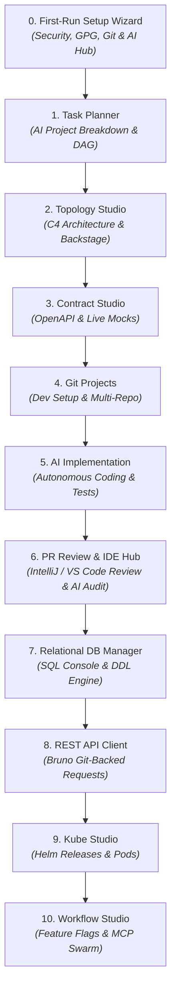
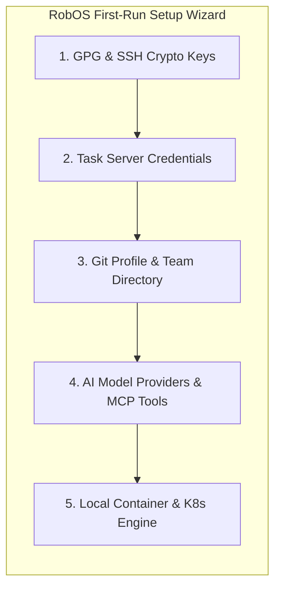

# The Flow of RobOS Apps Used to Create an Application
{: .no_toc }

The complete step-by-step journey: from running the initial First-Run Setup Wizard to progressively using each RobOS application to plan, design, code, test, and deploy a full-stack web application.
{: .fs-6 .fw-300 }

## Table of contents
{: .no_toc .text-delta }

1. TOC
{:toc}

---

## Overview: The Power of an Integrated App Lifecycle

In traditional software development, building a new application requires juggling a dozen disconnected browser tabs, desktop windows, and terminal tools: Jira or GitHub for tickets, Figma or Miro for architecture sketches, Postman for API testing, DBeaver for database queries, IntelliJ or VS Code for writing code, terminal scripts for Docker/Kubernetes, and cloud web consoles for monitoring deployments. 

Every time you switch between these separate tools, context is lost. Information entered in a ticket never makes it to the API designer; database changes made in a local console don't update the architecture diagram; and AI assistants only see isolated code snippets without understanding the bigger picture.

**RobOS changes this entirely.** RobOS provides a synchronized desktop suite where **every application shares the same underlying Git-backed architecture knowledge graph**. 

Below is the complete walkthrough of how you use RobOS to build a real-world enterprise application—such as the **Acme Pet Store Web Platform**—starting with your very first login.

---

## Part 1: The RobOS Setup Wizard (Your Day-1 Launchpad)

Before you write your first line of code or launch an AI agent swarm, the **RobOS First-Run Setup Wizard** establishes a secure, encrypted, and fully configured engineering environment on your machine.

### Why the Setup Wizard is Critical

Setting up a new development machine usually takes days of troubleshooting. Developers have to generate SSH keys, configure GPG commit signing, setup `.env` secrets, configure cloud credentials, and connect AI coding tokens.

The **RobOS Setup Wizard** consolidates this entire onboarding process into a single 3-minute guided workflow:

### What the Setup Wizard Configures:

1. **Cryptographic Identity & Commit Signing (`security-setup`)**:
   * Generates or imports your personal **GPG keypair** and **SSH keys**.
   * Integrates with the standard Unix `pass` encrypted password manager so passwords, database credentials, and API tokens are never saved in plaintext.
   * Enables automatic, hardware-verified Git commit signing so every pull request created by you or your AI agents is cryptographically authenticated.

2. **Task Server Integration (`task-servers`)**:
   * Connects directly to your organization's issue tracking system (**GitHub Issues**, **Gitea**, **GitLab**, or **Jira**).
   * Authenticates using secure OAuth or API tokens, enabling RobOS to fetch sprint backlogs, assign issue tickets, and update Kanban task boards in real time.

3. **Git Identity & Organization Permissions (`group-manager` / `git-login-manager`)**:
   * Sets up your global Git author name, email, and branch signing rules.
   * Pulls team rosters, repository write permissions, and reviewer group policies.

4. **Universal AI Hub & MCP Tool Routing (`robos-preferences` / `agents-manager`)**:
   * Configures API keys and model preferences for your AI engines (**Claude 3.7 / 3.5 Sonnet**, **Google Antigravity / Gemini 2.0 Flash**, **OpenAI GPT-4o / Codex**, or **Local Offline Ollama Models**).
   * Registers local **Model Context Protocol (MCP)** tool servers (`system-mcp`, `task-manager-mcp`, `workspace-manager-mcp`, `ide-bridge-mcp`) so AI assistants can safely inspect system resources and execute commands under human oversight.

5. **Local Cloud & Container Engine (`kube-studio` / Docker / Kind)**:
   * Verifies local Docker socket connectivity and initializes a lightweight local Kubernetes development cluster (Kind/K3s) with Helm package management ready to deploy microservices.

6. **Project Workspace Bootstrap**:
   * Initializes the `.robos/` project metadata folder in your workspace repository, creating the initial **Dual-State Knowledge Graph (`.robos/knowledge-graph.jsonld`)**.

---

## Part 2: The Progressive Sequence of RobOS Apps

Once the Setup Wizard completes, you build the **Acme Pet Store Web Application** by stepping through the specialized RobOS applications in a structured, progressive sequence.

Here is the exact sequence of applications used to turn a product idea into a running cloud system:

---

### Step 1: AI Task Planner & Backlog Breakdown

**Primary Application**: **`Task Planner`** *(with `Issue Manager`)*  
**Category**: Planning & Project Management  
**Open Standards**: OASIS OSLC 3.0 Change Management, GitHub REST API, Jira REST API

* **What Happens**: You type the high-level business goal into the AI prompt window (e.g., *"Build a distributed pet store web application with a Java Spring Boot backend, a PostgreSQL relational database, an mTLS rabies vaccination verification gateway, an interactive React frontend, and an analytics warehouse"*).
* **The App's Job**: The AI analyzes the requirements and breaks the project into an ordered, step-by-step dependency graph (**Directed Acyclic Graph / DAG**). It identifies prerequisite tasks (e.g., *"Database Schema must be defined before creating the REST API"*) and automatically syncs numbered tickets (e.g., `PET-101` through `PET-116`) to GitHub Issues or Jira.
* **Handoff to Next Step**: The generated task list and dependency graph are saved directly to `.robos/knowledge-graph.jsonld`, creating the blueprint for the architecture.

---

### Step 2: Visual Architecture & System Topology

**Primary Application**: **`Topology Studio`**  
**Category**: Visual Architecture & Modeling  
**Open Standards**: C4 Architecture Model (Levels 1–3), Spotify Backstage (`catalog-info.yaml`)

* **What Happens**: You open **Topology Studio** to inspect and customize the visual system map.
* **The App's Job**: Reads the declarative Spotify Backstage `catalog-info.yaml` files to render a zoomable architecture diagram:
  * **Level 1 (System Context)**: Shows pet owners, veterinary clinics, and store staff interacting with the platform.
  * **Level 2 (Containers)**: Shows the React Web Frontend, the Pet Inventory Service, the PostgreSQL Database, the Apache Kafka Event Stream, and the Rabies Vaccine Gateway.
  * **Level 3 (Components)**: Shows internal controllers, repositories, and authentication filters.
* **Impact Analysis (Blast Radius)**: If you add a new analytics microservice or alter an API connection, RobOS immediately highlights every connected component in purple/red, showing what other services could be impacted before any code is written.
* **Handoff to Next Step**: Topology Studio writes clean `catalog-info.yaml` service manifests directly into the Git repositories.

---

### Step 3: Contract Studio & Live API Mock Testing

**Primary Application**: **`Contract Studio`**  
**Category**: API Design & Contract Testing  
**Open Standards**: OpenAPI 3.1, Microsoft TypeSpec, AsyncAPI, Prism Mock Servers

* **What Happens**: Before writing backend Java code or frontend React components, you define the exact data structures and HTTP endpoints that services will use to communicate.
* **The App's Job**: Using **Microsoft TypeSpec** or **OpenAPI 3.1**, Contract Studio defines schemas for pets, orders, and vaccination certificates. It immediately spins up an instant **Prism Mock Server** on `http://localhost:4010`.
* **Why This Matters**: Frontend developers and AI agents can start building the React web UI against live mock data immediately, without waiting for the backend Java service to be written.
* **Handoff to Next Step**: Contract Studio saves `.tsp` data models and `openapi.yaml` contracts into the Git repository.

---

### Step 4: Multi-Repo Git Hub & Automated Dev Setup

**Primary Application**: **`Git Projects`**  
**Category**: Workspace & Repository Management  
**Open Standards**: Git, POSIX Shell, GPG Vault

* **What Happens**: You open the multi-repo management hub to link the frontend, backend, and infrastructure repositories together.
* **The App's Job**: **Git Projects** connects all related repositories in one window. It automatically generates a zero-friction developer setup script (`dev-setup.sh`) that installs dependencies, verifies runtime SDKs (Java JDK 21, Node.js 20, Docker), and securely pulls environment variables from your GPG-encrypted vault (`pass`).
* **Handoff to Next Step**: One click on a task ticket (e.g., `PET-105: Implement Vaccine Gateway`) provisions an isolated, clean Git branch workspace.

---

### Step 5: Autonomous AI Implementation & Automated Test Verification

**Primary Application**: **`AI Coding Agent & RobOS Swarm`** *(Claude Code, Antigravity, Copilot, Gemini)*  
**Category**: Development & Automated Implementation  
**Open Standards**: Model Context Protocol (MCP), Language Server Protocol (LSP), Git

* **What Happens**: The AI agent picks up the task ticket (`PET-105: Implement Vaccine Gateway`) from the backlog, provisions an isolated Git branch workspace, and formulates a concrete implementation plan.
* **The Agent's Job**:
  1. **Autonomous Code Generation**: Writes the required application logic, compiles TypeSpec data models, and configures endpoints (e.g. `VaccineGatewayClient.java`).
  2. **Automated Test Generation & Execution**: Synthesizes and executes unit tests, integration tests, and consumer-driven contract tests (Pact) against live mock servers.
  3. **Interactive Breakpoint Debugging Feature**: When reproducing a bug or investigating complex runtime state, RobOS agents can run a test and pause execution directly at a **live debugger breakpoint in the IDE**. This is a targeted developer feature that lets developers inspect live memory variables on demand during investigation.
* **Handoff to Next Step**: Once the code compiles and all test suites pass, the agent opens a Pull Request for human review.

---

### Step 6: PR Review Process & The IDE Review Hub

**Primary Application**: **`RobOS Agent Code Review Platform`** *(with `CI Monitor` & IDE Review Plugins)*  
**Category**: Human Review, Code Auditing & IDE Quality Gates  
**Open Standards**: Unified Git Diffs, GitHub Pull Requests, JetBrains IDE REST API, VS Code URI Scheme

* **What Happens**: The human developer / lead architect reviews the AI-generated pull request before any code merges to `main`.
* **The RobOS Review Experience**:
  1. **Automated AI Security & Contract Audits**: The platform automatically audits modified code for cryptographic safety (e.g., mTLS keystore parsing), verifies 100% OpenAPI 3.1 Spectral schema compliance, and checks CI test rollups.
  2. **Reviewing in RobOS Desktop**: View side-by-side color-coded file diffs, chat with the AI reviewer to clarify implementation decisions, and inspect Knowledge Graph architecture diffs.
  3. **Optionally Reviewing in the IDE with Full Context in Tow**:
     * **IntelliJ IDEA Review Plugin**: Click **Review in IntelliJ** to dispatch port `63343` IPC, opening the branch straight into IntelliJ IDEA's native **Pull Request review tool window**. The developer reviews the PR with all IDE context in tow—symbol lookups, type checking, syntax highlighting, live debugging, and inline PR comments.
     * **VS Code Review Plugin**: Click **Review in VS Code** to trigger the standard `GitHub Pull Requests and Issues` extension (`vscode://github.vscode-pull-request-github/open-pr`), providing deep in-editor review capabilities.
* **One-Click Merge & Dual Sync**: Approving the PR merges the code into `main` and synchronizes the system Knowledge Graph topology.
* **Handoff to Next Step**: The merged pull request triggers automated database migrations and deployment tracking.

---

### Step 7: Relational DB Manager & Schema Console

**Primary Application**: **`Relational DB Manager`** *(with `Data Sources Explorer`)*  
**Category**: Database Management & Data Modeling  
**Open Standards**: ANSI SQL, PostgreSQL Wire Protocol, JDBC

* **What Happens**: You inspect and manage the live database backing the Acme Pet Store.
* **The App's Job**: Provides a responsive SQL console and table inspector (inspired by DBeaver and DataGrip):
  * Inspect table columns, foreign keys, and indexes for `pets`, `vaccination_records`, and `orders`.
  * Browse and edit table rows in an interactive data grid.
  * Run multi-tab SQL queries with instant syntax highlighting and execution timing.
  * Generate and apply automated database schema creation (DDL) and migration scripts.
* **Handoff to Next Step**: With the database schema active and populated with seed data, the live API endpoints can be tested.

---

### Step 8: Bruno-Powered REST API Client & Collection Runner

**Primary Application**: **`REST API Client`** *(with `REST Collection Runner`)*  
**Category**: API Testing & Microservice Verification  
**Open Standards**: Bruno (`.bru` plain text format), OpenAPI 3.1, HTTP/1.1 & HTTP/2

* **What Happens**: You verify that the live backend endpoints respond correctly to real HTTP requests.
* **The App's Job**: Powered by the open-source **Bruno** engine, the REST API Client organizes API tests into plain-text `.bru` files saved directly in your Git repository (no proprietary cloud sync):
  * Synthesizes ready-to-run API request suites from your OpenAPI specifications.
  * Executes automated test assertions (verifying status codes `200 OK`, JSON response payloads, and authorization headers).
  * Runs entire test suites in batch using the **Collection Runner** to benchmark latency and verify edge cases.
* **Handoff to Next Step**: With API endpoints verified, the application is packaged for containerized cloud deployment.

---

### Step 9: Kube Studio & Cloud Infrastructure Navigator

**Primary Application**: **`Kube Studio`** *(with `Deploy Tracker`)*  
**Category**: Cloud Infrastructure & Container Orchestration  
**Open Standards**: Kubernetes API, Helm Charts, ArgoCD GitOps

* **What Happens**: You monitor the deployment of your microservices and databases to Kubernetes.
* **The App's Job**: **Kube Studio** acts as a visual control room for Kubernetes clusters (local Kind clusters, AWS EKS, Google Cloud GKE, or Azure AKS):
  * Automatically compiles the Backstage service topology into production-ready Kubernetes manifests and Helm release charts.
  * Displays running Pods, Deployments, ReplicaSets, and Ingress routes with live health status badges.
  * Streams real-time container log output and resource utilization metrics (CPU/RAM).
* **Deploy Tracker Integration**: Tracks release versions across Development, Staging, and Production with one-click canary rollouts and instant rollbacks.
* **Handoff to Next Step**: With the application running live in the cluster, runtime feature toggles and agent swarms are managed.

---

### Step 10: Workflow Studio & MCP Agent Swarms

**Primary Application**: **`Workflow Studio`** *(with `Agents Manager`)*  
**Category**: Automation & AI Agent Orchestration  
**Open Standards**: Model Context Protocol (MCP), OpenFeature Specification, JSON Schema

* **What Happens**: You manage dynamic feature flags and orchestrate background AI agent swarms.
* **The App's Job**: 
  * **Workflow Studio** configures runtime feature toggles (e.g., enabling the *mTLS Rabies Vaccine Verification Gateway* with a single switch without redeploying code).
  * **Agents Manager** triggers background autonomous cron jobs and agent swarms (e.g., automated dependency vulnerability scanners, database performance profilers, and end-to-end regression runners) that communicate securely through local MCP endpoints.
* **Complete Lifecycle Loop**: Any bugs, security vulnerabilities, or performance bottlenecks discovered by the background agents are automatically formatted into new structured issue tickets and sent back to **Step 1 (Task Planner)**, closing the continuous development loop.

---

## Summary Table: The Complete Application Pipeline

| Sequence | RobOS Application | Primary Purpose | Key Open Standard | Output Artifact |
|:---|:---|:---|:---|:---|
| **0. Setup** | **Setup Wizard** (`security-setup`) | Cryptographic keys, Git identity & AI Hub | GPG, SSH, `pass` | `~/.config/robos/`, GPG Keyring |
| **1. Planning** | **Task Planner** (`issue-manager`) | Business prompt to ordered task roadmap | OSLC 3.0, GitHub Issues | `.robos/knowledge-graph.jsonld` |
| **2. Architecture** | **Topology Studio** | C4 multi-level visual system architecture | C4 Model, Spotify Backstage | `catalog-info.yaml` |
| **3. Contracts** | **Contract Studio** | API contracts & live mock server testing | OpenAPI 3.1, TypeSpec, Prism | `models.tsp`, `openapi.yaml` |
| **4. Repositories** | **Git Projects** | Multi-repo linking & automated dev setup | Git, POSIX Shell | `dev-setup.sh` |
| **5. Coding** | **AI Coding Agent** | Autonomous code implementation & automated tests | Model Context Protocol (MCP), LSP | Verified Code & Tests |
| **6. Review** | **Agent Code Review Platform** | PR review with optional IntelliJ / VS Code review | Unified Diff, GitHub PR, IntelliJ / VS Code | Merged Pull Request |
| **7. Databases** | **Relational DB Manager** | Schema explorer, data grid & SQL queries | ANSI SQL, PostgreSQL | Migration DDL Scripts |
| **8. API Testing** | **REST API Client** | Git-backed request suites & batch runner | Bruno (`.bru`), HTTP/2 | `.bru` Request Collections |
| **9. Deployment** | **Kube Studio** | Kubernetes navigator & Helm management | Kubernetes API, Helm, ArgoCD | Production Pods & Services |
| **10. Operations** | **Workflow Studio** | Feature toggles & AI agent scheduler | OpenFeature, MCP | Live Feature Flags |

---

## What to Explore Next

Now that you understand how the RobOS application suite flows together, see this exact sequence executed with real test code, high-definition videos, and spoken audio walkthroughs:

* [👉 **Real-World E2E Walkthroughs & Proof of Work (The 16-Step Acme Petshop)**]({{ site.baseurl }})
* [🏗️ **System Architecture & The Dual-State Comparison Engine**]({{ site.baseurl }})
* [🤖 **AI Agent Review-Based Software Development (The 5-Stage Lifecycle)**]({{ site.baseurl }})
* [📦 **Browse All 30+ Applications in the RobOS Suite**]({{ site.baseurl }})
