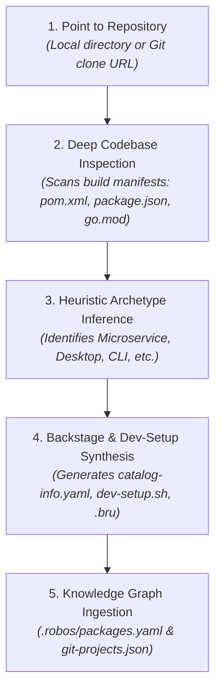

# Existing App Import Wizard
{: .no_toc }

How application developers import existing codebases and Git repositories into RobOS using the App Import Wizard: deep automated code inspection, heuristic archetype detection, Backstage `catalog-info.yaml` generation, `dev-setup.sh` synthesis, and Knowledge Graph mapping.
{: .fs-6 .fw-300 }

## Table of contents
{: .no_toc .text-delta }

1. TOC
{:toc}

---

## Overview: Bring Any Existing App Into RobOS

Most engineering teams have existing repositories that were built before adopting RobOS. Bringing these projects into RobOS should not require rewriting code, converting folder structures, or manually authoring dozens of metadata files.

The **RobOS App Import Wizard** (`packages/app-wizard` in import mode) automatically inspects existing codebases, extracts their capabilities and contracts, and integrates them into the RobOS ecosystem in seconds:

---

## Deep Inspection & Archetype Detection Engine

When an existing project directory is provided, the inspection engine analyzes build files and dependency trees using heuristic detection rules:

### Manifest Scanning Rules:
- **`pom.xml` / `build.gradle`**:
  - Detects Java version (e.g., Java 17, Java 21).
  - Identifies Spring Boot, Quarkus, or Micronaut dependencies.
  - Classifies as `robos:Microservice`.
- **`package.json`**:
  - Scans dependencies:
    - If `electron` is present: classifies as `robos:DesktopApp`.
    - If `react-native` is present: classifies as `robos:MobileApp`.
    - If `express`, `fastify`, `koa`, or `nest`: classifies as `robos:Microservice`.
    - Otherwise: classifies as `robos:Library` or frontend client.
- **`go.mod`**:
  - Detects Go version.
  - Scans for Gin, Echo, or Chi (Microservice) or Cobra (ConsoleApp).
- **`Cargo.toml`**:
  - Scans for Tokio, Actix, or Axum (Microservice) or Clap (ConsoleApp).
- **`requirements.txt` / `pyproject.toml`**:
  - Scans for FastAPI, Flask, Django (Microservice) or Celery (DataPipeline).

### API Contract & Migration Extraction:
The engine also scans for:
- Existing OpenAPI / Swagger specifications (`openapi.yaml`, `swagger.json`).
- GraphQL schemas (`schema.graphql`).
- Protobuf RPC definitions (`*.proto`).
- Database migration directories (`db/migration`, Flyway, Liquibase, Prisma, Alembic).

---

## Interactive AI Prompt Refinement (`<robos-ai-textarea>`)

Automated heuristic detection is fast, but real-world enterprise codebases frequently have special architectural requirements or polyglot structures.

In **Panel 2: Deep Inspection Results**, RobOS equips developers with an interactive `<robos-ai-textarea>` prompt bar alongside direct editable controls:

Developers can type natural language instructions to immediately alter the detected parameters:
- *"Treat this as a Microservice using Spring Boot instead of a library"*
- *"Change the runtime stack to Node 20 with Fastify and TypeScript"*
- *"Assign this component to team core-platform with package slug auth-gateway"*

Clicking **Apply AI Refinement** (or directly modifying the form fields) updates the archetype, technology stack, package name, and team assignment in real time before generating any configuration files.

---

## Step-by-Step Codebase Ingestion Workflow

The import workflow follows four concise panels:

### 1. Select Existing Project Path
Enter the absolute directory path to the existing repository or local clone. RobOS verifies filesystem accessibility and branch status.

### 2. Deep Inspection & AI Refinement
The inspection engine scans package manifests, detects API schemas and database migrations, and exposes the `<robos-ai-textarea>` prompt bar to refine properties.

### 3. Team Ownership Assignment
Assign the imported application to an existing stream-aligned, platform, or enabling team defined in `.robos/teams.yaml`.

### 4. Metadata Synthesis & Knowledge Graph Mapping
RobOS generates Backstage `catalog-info.yaml`, synthesizes `dev-setup.sh`, creates Bruno `.bru` request collections, and registers the component into `.robos/packages.yaml` and `.robos/knowledge-graph.jsonld`.

---

## What RobOS Generates on Import

1. **Backstage Catalog Component (`catalog-info.yaml`)**:
   If the repository doesn't already contain a Backstage manifest, RobOS generates one with the detected archetype, technology, and team ownership.
2. **Zero-Friction Dev Setup Script (`dev-setup.sh`)**:
   Synthesizes an executable environment verification script checking required runtimes (e.g. Node, Java JDK, Docker) and pulling credentials from the GPG vault.
3. **Registration in Git Projects (`~/.config/robos/git-projects.json`)**:
   Links the local directory into the multi-repo Git Projects manager for one-click branch switching and Monaco editor inspection.
4. **Knowledge Graph Ingestion**:
   Registers the package into `.robos/packages.yaml` and links the service into the live visual architecture map.
5. **Bruno REST API Test Collections (`.bru`)**:
   For microservices with OpenAPI contracts, RobOS automatically generates plain-text `.bru` request collections ready for batch execution in the REST API Client.

---

## E2E Walkthrough Video & Proof of Work

Watch the live end-to-end verification video showing deep inspection, AI prompt refinement, and Backstage synthesis with zero mocking:

<video controls width="100%" style="border-radius: 8px; border: 1px solid #30363d; margin-top: 1rem; margin-bottom: 1.5rem;" poster="{{ '/assets/images/screenshots/import-app-deep-inspection_frame.png' | relative_url }}">
  <source src="{{ '/assets/videos/app-import-wizard-final.webm' | relative_url }}" type="video/webm">
  Your browser does not support the video tag.
</video>

* [👉 **Full Walkthrough Archive & Audio Script**]({{ site.baseurl }}#step-20-import-existing-apps--codebase-ingestion--archetype-detection)

