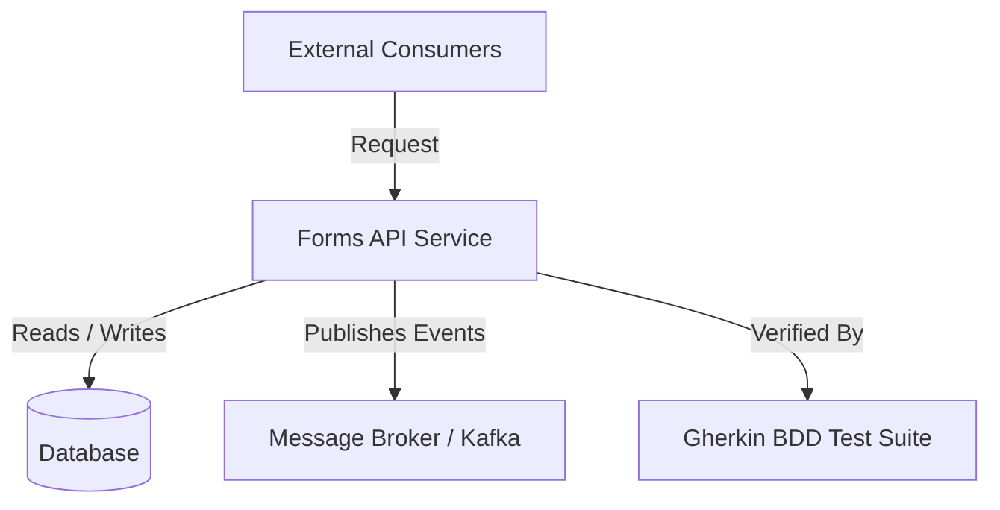

# Forms API Service — Living Architecture Guide

> **Knowledge Graph Entity**: `urn:robos:service:forms-api`  
> **Owner Team**: `core-platform`  
> **Repository**: `github.com/acme/buildbarn-forms`  
> **Technology Stack**: `Polyglot`

## 1. System Overview

Forms API Service is a mission-critical component in the RobOS platform.

## 2. Architecture & Runtime Flow



## 3. Contracts & Interfaces

- **Implements Contract**: `urn:robos:contract:forms-api-v1`
- **Owner Team**: `core-platform`
- **Repository**: `github.com/acme/buildbarn-forms`

## 4. Interactive Training & Verification

This application has an attached interactive **eLearning Masterclass** (`urn:robos:elearning:app:forms-api`).
Launch via the Knowledge Graph Explorer or run:
```bash
electron packages/forms-api-elearning
```
