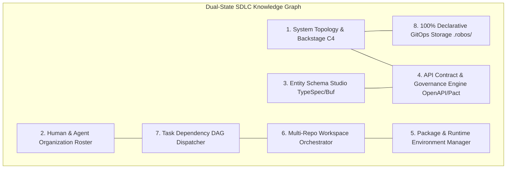
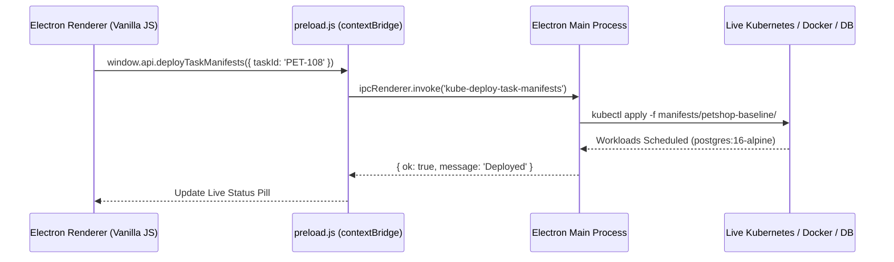

# System Architecture
{: .no_toc }

The 8-pillar declarative architecture, Dual-State Knowledge Graph, and IPC communications powering RobOS.
{: .fs-6 .fw-300 }

## Table of contents
{: .no_toc .text-delta }

1. TOC
{:toc}

---

## The 8 Pillars of the RobOS SDLC Engine

RobOS organizes the Software Delivery Lifecycle around 8 declarative linked-data pillars stored in Git:

1. **System Topology & Backstage C4 Graph**: Models all microservices, frontends, databases, and message brokers with upstream/downstream dependencies and blast-radius tracking.
2. **Human & Agent Roster**: Stream-aligned team models with role bindings and MCP tool capabilities.
3. **Entity Schema Studio**: Single source of truth in Microsoft TypeSpec compiling to TypeScript, Java, and Go domain models.
4. **API Contract & Governance Engine**: OpenAPI 3.1, AsyncAPI, and Pact consumer-driven contract testing.
5. **Package & Runtime Manager**: Standardized Devcontainer and Nix runtime environments.
6. **Multi-Repo Workspace Orchestrator**: Git worktree branch checkouts sharing underlying object stores.
7. **Task Dependency DAG Dispatcher**: Directed Acyclic Graph (DAG) task trees with automated state transitions.
8. **100% Declarative GitOps Storage**: Everything stored in human-readable `.robos/` YAML/JSON-LD files.

---

## Dual-State World Modeling (Prod vs. Future)

Traditional developer environments only know about the files currently on disk. RobOS introduces **Dual-State Worlds**:

- **World 1 (Live Production `main`)**: Represents currently deployed production topology, active contracts, and released database schemas.
- **World 2 (Future Feature Branch)**: Represents the state of the world when the current task or pull request is merged.

RobOS computes **Semantic Graph Diffs** between the two states:
- Breaking API contract changes are flagged before code is written.
- Missing database migration steps are identified during planning.
- Required downstream service updates are automatically scheduled as dependent tasks.

---

## IPC Architecture & Shared Libraries

RobOS uses Electron's secure IPC bridge (`contextBridge`) with zero framework overhead:

### Shared Libraries (`/usr/local/share/robos/`)
- **`robos-lib`**: Desktop parsing, app categories, and DOM snapshot debug server.
- **`robos-icons`**: Central Lucide-style SVG icon registry.
- **`robos-graph`**: OSLC JSON-LD knowledge graph parser and diff engine.
- **`robos-mcp-router`**: High-performance MCP tool request router.
