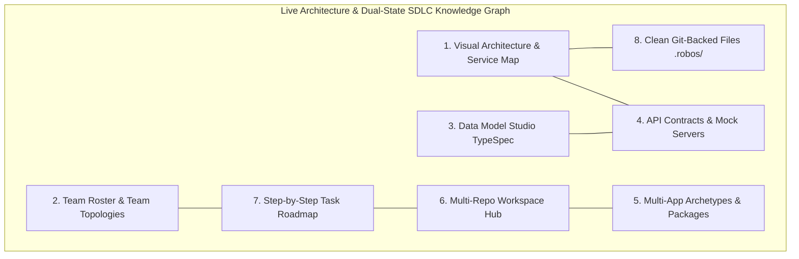
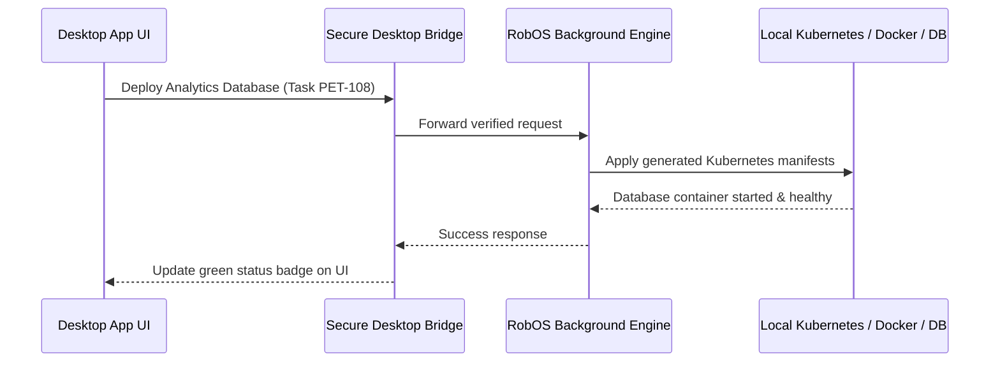

# System Architecture (How RobOS Works Under the Hood)
{: .no_toc }

The 8 architectural pillars, the Dual-State Comparison Engine, multi-app archetypes, and the secure desktop bridge powering RobOS.
{: .fs-6 .fw-300 }

## Table of contents
{: .no_toc .text-delta }

1. TOC
{:toc}

---

## The 8 Pillars of RobOS

RobOS structures all development lifecycle information into 8 connected, plain-text categories stored directly in your Git repositories:

1. **Visual Architecture & Service Map**: Visualizes all microservices, frontends, databases, and message queues with live dependency maps and blast radius impact tracking.
2. **Team Roster & Team Topologies**: Clear directory of engineering squads (stream-aligned, platform, enablement, complicated-subsystem), service ownership, and enterprise directory sync (Okta, Azure AD, LDAP) stored in `.robos/teams.yaml`.
3. **Data Model Studio (TypeSpec)**: Define domain data models once and generate TypeScript, Java, and Go types automatically.
4. **API Contracts & Mock Servers**: Define REST APIs (OpenAPI 3.1), gRPC Protobuf, and event streams with live mock servers for instant testing.
5. **Multi-App Archetypes & Packages**: Standardized scaffolding and runtime definitions across 6 archetypes (`robos:Microservice`, `robos:DesktopApp`, `robos:ConsoleApp`, `robos:MobileApp`, `robos:DataPipeline`, `robos:Library`) stored in `.robos/packages.yaml`.
6. **Multi-Repo Workspace Hub**: Switch between Git branches across multiple repositories simultaneously without duplicate disk storage.
7. **Step-by-Step Task Roadmap**: Breaks high-level feature goals down into a clean checklist of prerequisite and dependent tasks (OASIS OSLC Change Management).
8. **Clean Git-Backed Files**: Everything is saved in human-readable plain text files under `.robos/` (`knowledge-graph.jsonld`, `teams.yaml`, `packages.yaml`, `topology.yaml`) with zero proprietary cloud databases.

---

## Today vs. Tomorrow (The Dual-State Engine)

Traditional developer tools only understand the files currently on your laptop. RobOS tracks two versions of your system at the same time:

- **World 1 (Live Production `main`)**: What is running in production right now — deployed services, active API contracts, and live databases.
- **World 2 (Your Feature Branch)**: What the system will look like once your feature branch merges.

RobOS automatically computes the difference between the two states:
- **Breaking API Changes**: Flagged before any code is written via Spectral and SHACL validators.
- **Missing Database Migrations**: Caught and planned upfront.
- **Affected Downstream Apps**: Automatically identified so you can update client apps before releasing.
- **Living Documentation Sync**: System documentation (`docs/`) and interactive training courses (`.robos/elearning.yaml`) are updated in lockstep with architectural changes.

---

## Fast, Secure Desktop Bridge

RobOS applications are built using lightweight vanilla JavaScript and Electron, communicating through secure desktop channels:

### Shared System Libraries (`/usr/local/share/robos/`)
- **`robos-lib`**: Desktop application management, `.desktop` file parsers, and live visual testing tools (`snapshot-cli.js`).
- **`robos-icons`**: Central SVG icon registry for all RobOS applications.
- **`robos-graph`**: Open-standard OASIS OSLC 3.0 / W3C JSON-LD architecture parser, SHACL validator, and dual-state difference engine.
- **`robos-test`**: Containerized headless test fabric (`Xvfb + Picom`), automated DOM assertions, and neural text-to-speech voiceover generator (Piper TTS).
- **`robos-mcp-router`**: Fast tool router connecting AI models (Claude, Antigravity, Copilot, Gemini) to local developer tools.

### Core Architectural Applications
- **RobOS App Wizard (`packages/app-wizard`)**: Scaffolds greenfield apps and ingests brownfield codebases across 6 multi-app archetypes with Spotify Backstage `catalog-info.yaml` synthesis and runnable `dev-setup.sh`.
- **RobOS Group Manager (`packages/group-manager`)**: Enterprise directory sync (SCIM 2.0, Okta, Azure AD, LDAP) and Team Topologies management with active identity cards and role-based access control.
- **IDE Review Bridges**: Native IPC servers and extensions bridging RobOS reviews to IntelliJ IDEA (port `63343`) and VS Code (`vscode://github.vscode-pull-request-github/open-pr`).

