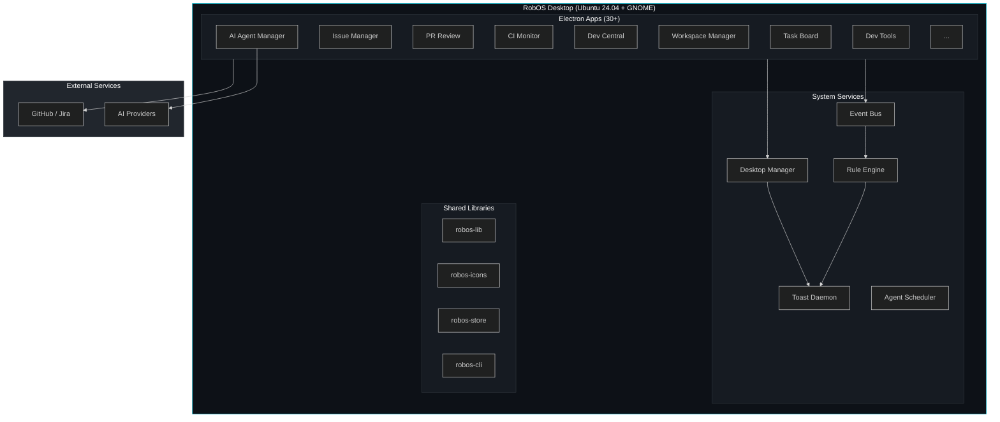
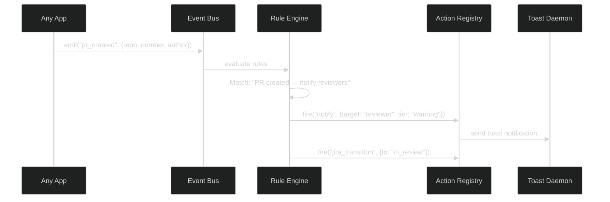

# Architecture
{: .no_toc }

Technical design of the RobOS platform.
{: .fs-6 .fw-300 }

## Table of contents
{: .no_toc .text-delta }

1. TOC
{:toc}

---

## System Overview



---

## OS Stack

| Layer | Technology | Purpose |
|:------|:-----------|:--------|
| Base OS | Ubuntu 24.04 LTS | Stable, well-supported desktop Linux |
| Virtualization | QEMU/KVM | Host-isolated VM with `/dev/kvm` passthrough |
| Desktop | GNOME | Panel, systray, window management |
| Auto-login | LightDM | Passwordless desktop access |
| Terminal | Tilix + zsh + oh-my-zsh | Developer-friendly terminal |
| Theme | Custom dark navy/cyan | Consistent `#0d1117` / `#00bcd4` throughout |
| Provisioning | cloud-init | Stateless first-boot setup |

### VM Specs

| Resource | Value |
|:---------|:------|
| RAM | 16 GB |
| CPUs | All host CPUs |
| Disk | 100 GB sparse qcow2 |
| SSH | Port 2224 |
| VNC | Port 5910 |
| SPICE | Port 5932 (clipboard sharing) |

---

## Application Architecture

All apps are **Electron + vanilla JavaScript** (no React/Vue/Angular). This keeps the stack simple and the bundle size small.

### IPC Pattern

Every app uses `contextBridge` + `ipcRenderer.invoke` — never `nodeIntegration: true`:

```
┌─────────────────────┐    ┌──────────────────┐    ┌─────────────────┐
│   Renderer (HTML)   │───▶│   preload.js     │───▶│    main.js      │
│   app.js            │    │   contextBridge   │    │    IPC handlers │
│   style.css         │    │   ipcRenderer     │    │    Node.js APIs │
└─────────────────────┘    └──────────────────┘    └─────────────────┘
```

### DOM Snapshot Debug Server

Every app exposes an HTTP debug server (ports 19100-19135) for automated testing:

| Endpoint | Method | Returns |
|:---------|:-------|:--------|
| `/health` | GET | `{ ok: true, appId, title }` |
| `/snapshot` | GET | JSON DOM tree |
| `/text-snapshot` | GET | Text accessibility tree |
| `/screenshot` | GET | PNG image |
| `/eval` | POST | Execute JS in renderer, return result |

### Config Storage

All persistent data lives in `~/.config/robos/`:

```
~/.config/robos/
├── settings.json          # Global settings (task servers, preferences)
├── workflows/             # Workflow definitions (YAML)
├── journal-events.json    # Work Journal entries
├── rules.json             # Automation Studio rules
├── workspace-states/      # Per-workspace state files
└── electron/              # Per-app Electron userData
    ├── task-board/
    ├── issue-manager/
    └── ...
```

---

## Event-Driven Architecture

The Event Bus is the nervous system of RobOS. Every significant action emits an event, and the Rule Engine matches events to automated actions.



### Event Types

| Category | Events |
|:---------|:-------|
| Task | `task_started`, `task_completed`, `task_blocked` |
| Code | `pr_created`, `pr_merged`, `pr_review_received` |
| CI/CD | `ci_started`, `ci_passed`, `ci_failed`, `deploy` |
| System | `app_launched`, `notification_sent`, `config_changed` |

### Rule Structure

Rules are defined in Automation Studio:

```json
{
  "event": "ci_completed",
  "condition": "payload.status eq failure",
  "actions": [
    { "type": "notify", "tier": "critical", "category": "ci_cd" }
  ]
}
```

---

## Repository Structure

```
robos/
├── packages/
│   ├── <app-id>/                # Each Electron app
│   │   ├── main.js              # Electron main process
│   │   ├── preload.js           # contextBridge IPC
│   │   ├── renderer/            # HTML, JS, CSS
│   │   ├── icon.svg             # 48x48 Lucide-style icon
│   │   └── <app-id>.desktop     # freedesktop launcher entry
│   ├── robos-lib/               # Shared utilities
│   ├── robos-icons/             # SVG icon registry
│   ├── robos-store/             # Distributed config store
│   ├── robos-event-bus/         # Event pub/sub system
│   ├── robos-rule-engine/       # Event → condition → action
│   ├── robos-action-registry/   # Available automated actions
│   ├── robos-scheduler/         # Cron-based agent jobs
│   ├── robos-test/              # Test framework + harness
│   └── robos-cli/               # CLI tools
├── infra/
│   └── desktop/
│       ├── build.sh             # Build QEMU disk + cloud-init ISO
│       ├── run.sh               # Launch VM
│       └── cloud-init/          # Provisioning config
└── docs/                        # This documentation site
```

---

## Test Architecture

The test system is designed for **autonomous verification** — an AI agent can run tests and confirm features work without manual intervention.

### Three Test Layers

| Layer | Tool | What It Tests |
|:------|:-----|:--------------|
| **Unit** | `node:test` + `node:assert` | Pure logic — utilities, adapters, parsers |
| **E2E** | Dev Harness + DOM Snapshots | App launches, data renders, interactions work |
| **VM Smoke** | SSH + debug servers | Full deployment + health check on live VM |

### Dev Harness

The harness launches Electron apps in a sandboxed `$HOME` with:
- Fake credentials (SSH keys, GitHub auth, GPG keys)
- CLI stubs (`gh`, `git`, `pass`, `gpg`, `ssh`) returning realistic test data
- Isolated `~/.config/robos/settings.json` per scenario
- 17 test scenarios covering credential and config permutations

### Current Coverage

| Metric | Count |
|:-------|:------|
| Unit tests | 432 (all passing) |
| E2E test suites | 22 apps |
| Test scenarios | 17 |
| CLI stubs | 8 tools, 24+ command patterns |
| Debug server ports | 23 apps |

---

## Design Conventions

### CSS Theme Variables

```css
:root {
  --bg-primary: #0d1117;    /* main background */
  --bg-card: #161b22;       /* card/panel background */
  --accent: #00bcd4;        /* primary accent (cyan) */
}
```

### Icons

All app icons are 48x48 SVG with Lucide style:
- `stroke="#00bcd4"`
- `stroke-width="1.5"`
- `stroke-linecap="round"`
- `stroke-linejoin="round"`

### Commits

Conventional Commits format: `feat:`, `fix:`, `chore:`, `docs:`, `refactor:`
