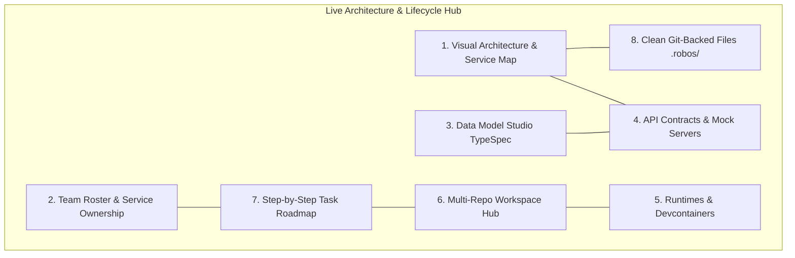
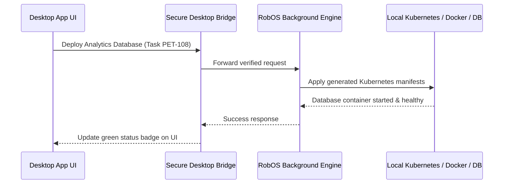

# System Architecture (How RobOS Works Under the Hood)
{: .no_toc }

The 8 architectural pillars, the Dual-State Comparison Engine, and the secure desktop bridge powering RobOS.
{: .fs-6 .fw-300 }

## Table of contents
{: .no_toc .text-delta }

1. TOC
{:toc}

---

## The 8 Pillars of RobOS

RobOS structures all development lifecycle information into 8 connected, plain-text categories stored directly in your Git repositories:

1. **Visual Architecture & Service Map**: Visualizes all microservices, frontends, databases, and message queues with live dependency maps and impact tracking.
2. **Team Roster & Service Ownership**: Clear directory of engineering teams, who owns which service, and what tools each team uses.
3. **Data Model Studio (TypeSpec)**: Define domain data models once and generate TypeScript, Java, and Go types automatically.
4. **API Contracts & Mock Servers**: Define REST APIs and event streams with live mock servers for instant frontend testing.
5. **Runtimes & Devcontainers**: Standardized Docker devcontainers so every developer has an identical build environment.
6. **Multi-Repo Workspace Hub**: Switch between Git branches across multiple repositories simultaneously without duplicate disk storage.
7. **Step-by-Step Task Roadmap**: Breaks high-level feature goals down into a clean checklist of prerequisite and dependent tasks.
8. **Clean Git-Backed Files**: Everything is saved in human-readable plain text files under `.robos/` with zero proprietary cloud databases.

---

## Today vs. Tomorrow (The Dual-State Engine)

Traditional developer tools only understand the files currently on your laptop. RobOS tracks two versions of your system at the same time:

- **World 1 (Live Production `main`)**: What is running in production right now — deployed services, active API contracts, and live databases.
- **World 2 (Your Feature Branch)**: What the system will look like once your feature branch merges.

RobOS automatically computes the difference between the two states:
- **Breaking API Changes**: Flagged before any code is written.
- **Missing Database Migrations**: Caught and planned upfront.
- **Affected Downstream Apps**: Automatically identified so you can update client apps before releasing.

---

## Fast, Secure Desktop Bridge

RobOS applications are built using lightweight vanilla JavaScript and Electron, communicating through secure desktop channels:

### Shared System Libraries (`/usr/local/share/robos/`)
- **`robos-lib`**: Desktop application management and live visual testing tools.
- **`robos-icons`**: Complete SVG icon registry.
- **`robos-graph`**: Open-standard architecture parser and difference engine.
- **`robos-mcp-router`**: Fast tool router connecting AI models (Claude, Antigravity, Copilot, Gemini) to local developer tools.
