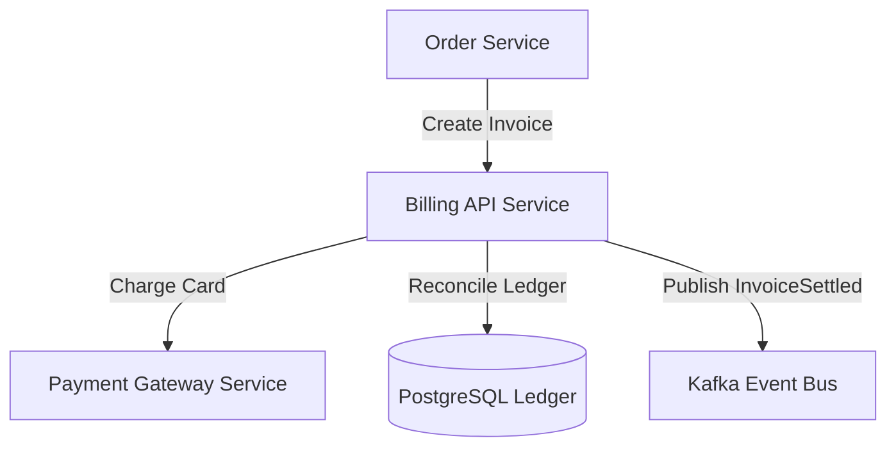

# Billing API Microservice — Living Architecture Documentation

> **Knowledge Graph Entity**: `urn:robos:service:billing-api`  
> **Type**: `robos:Microservice, oslc:Resource`  
> **Owner Team**: `Finance & Payments`  
> **Repository**: `github.com/robos-inc/billing-service`  
> **Technology Stack**: `Java 21 / Spring Boot 3 / PostgreSQL`  
> **Last Synchronized**: 2026-09-25T12:00:00.000Z

---

## 1. Executive Architecture Overview

The **Billing API Service** governs customer invoicing, subscription billing schedules, and ledger reconciliation within the RobOS ecosystem. It interfaces with external merchant gateways (Stripe, Adyen) and publishes billing lifecycle events for financial reporting.

---

## 2. Component Topology & Data Flow

---

## 3. Specifications, Contracts & Interfaces

- **Target Component URI**: `urn:robos:service:billing-api`
- **Owner Team**: `Finance & Payments`
- **Source Repository**: `github.com/robos-inc/billing-service`
- **Contract Standard**: `OpenAPI 3.1 / Protobuf gRPC`
