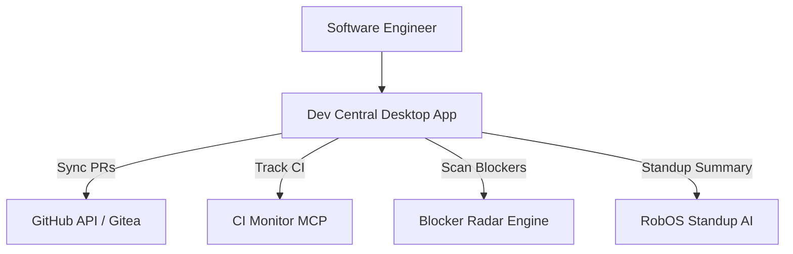

# Dev Central Command Center — Architecture Specification

> **Knowledge Graph Entity**: `urn:robos:app:dev-central`  
> **Type**: `robos:DesktopApp, oslc:Resource`  
> **Owner Team**: `Developer Experience Guild`  
> **Repository**: `github.com/robos-inc/robos`  
> **Technology Stack**: `Electron / Vanilla JS / Monaco Editor`  
> **Last Synchronized**: 2026-09-25T12:00:00.000Z

---

## 1. Executive Architecture Overview

**Dev Central** is the daily developer mission control in RobOS. It aggregates sprint boards, GitHub pull requests, real-time CI status, system notifications, and blocker radar into a unified high-productivity developer dashboard.

---

## 2. Component Topology & Data Flow

---

## 3. Specifications, Contracts & Interfaces

- **Target Component URI**: `urn:robos:app:dev-central`
- **Owner Team**: `Developer Experience Guild`
- **Source Package**: `packages/dev-central`
- **Debug Port**: `19101`
