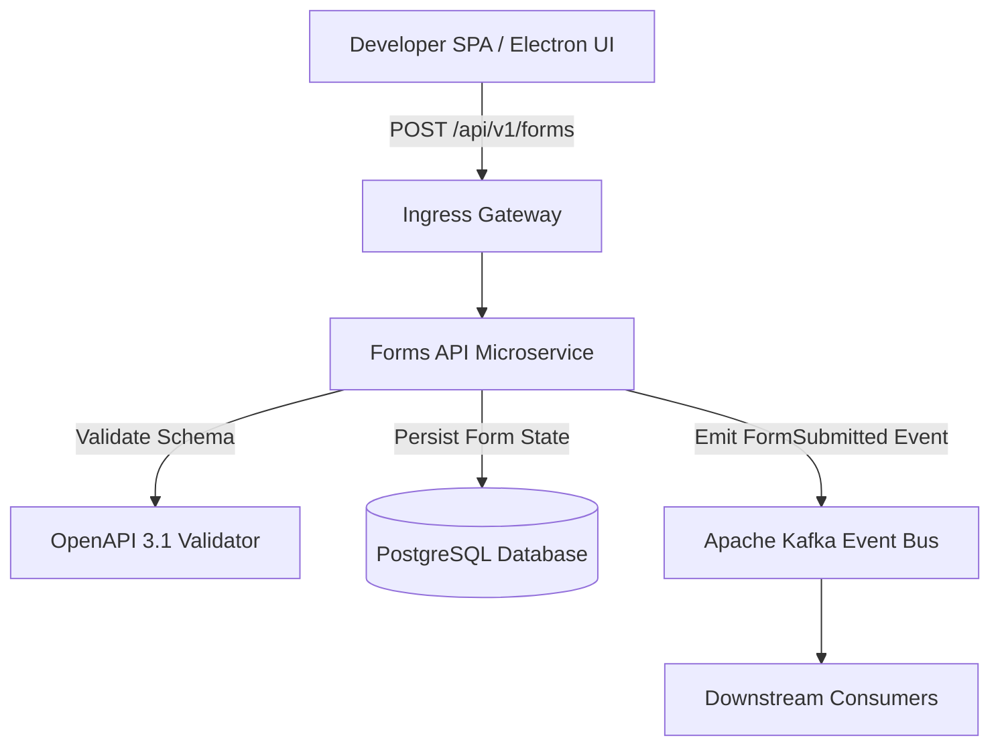

# Forms API Microservice — Living Architecture Documentation

> **Knowledge Graph Entity**: `urn:robos:service:forms-api`  
> **Type**: `robos:Microservice, oslc:Resource`  
> **Owner Team**: `Core Platform`  
> **Repository**: `github.com/robos-inc/forms-api`  
> **Technology Stack**: `TypeScript / Express / Node.js`  
> **Last Synchronized**: 2026-09-25T12:00:00.000Z

---

## 1. Executive Architecture Overview

The **Forms API Service** is the central ingress and processing gateway for dynamic multi-step developer intake forms, contract verification, and event publication in the RobOS platform. It validates form submissions against OpenAPI 3.1 schemas, enforces access control policies, and publishes event notifications onto Apache Kafka topics for downstream service ingestion.

---

## 2. Component Topology & Data Flow

---

## 3. Specifications, Contracts & Interfaces

- **Target Component URI**: `urn:robos:service:forms-api`
- **Owner Team**: `Core Platform`
- **Source Repository**: `github.com/robos-inc/forms-api`
- **Contract Standard**: `OpenAPI 3.1 / Pact Consumer-Driven Contracts`
- **Port Registry**: `18081`

---

## 4. Verification & SHACL Governance

This system documentation is governed by W3C SHACL shape `urn:robos:shape:DocumentationShape` registered in `.robos/kgraphs/documentation/package.jsonld` and declaratively tracked in `.robos/documentation.yaml`.
