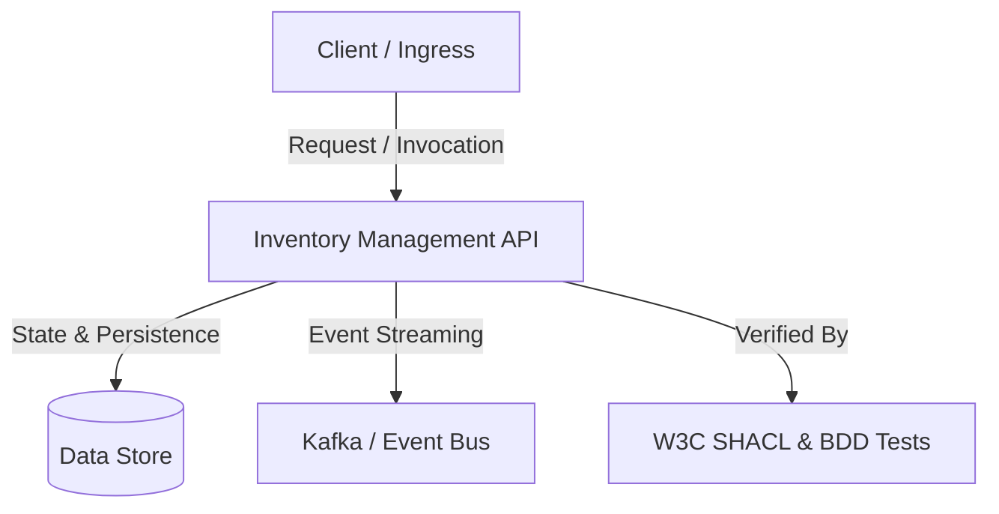

# Inventory Management API — System Documentation

> **Knowledge Graph Entity**: `urn:robos:service:inventory-api`  
> **Type**: `robos:Microservice, oslc_am:Resource`  
> **Owner Team**: `Supply Chain Squad`  
> **Repository**: `github.com/robos-inc/inventory-api`  
> **Technology Stack**: `Go 1.22 / gRPC / Redis`  
> **Last Synchronized**: 2026-09-25T17:08:00.826Z

---

## 1. Executive Architecture Overview

Real-time stock reservation and warehouse SKU availability service.

---

## 2. Component Topology & Data Flow

---

## 3. Specifications, Contracts & Interfaces

- **Target Component URI**: `urn:robos:service:inventory-api`
- **Owner Team**: `Supply Chain Squad`
- **Source Repository**: `github.com/robos-inc/inventory-api`
- **Contract / API Standard**: `Canonical RobOS Contract`

---

## 4. Verification & SHACL Governance

This system documentation is registered as an official `robos:Documentation` entity in the RobOS Knowledge Graph governed by W3C SHACL shape `urn:robos:shape:DocumentationShape` and declaratively cataloged in `.robos/documentation.yaml`.
