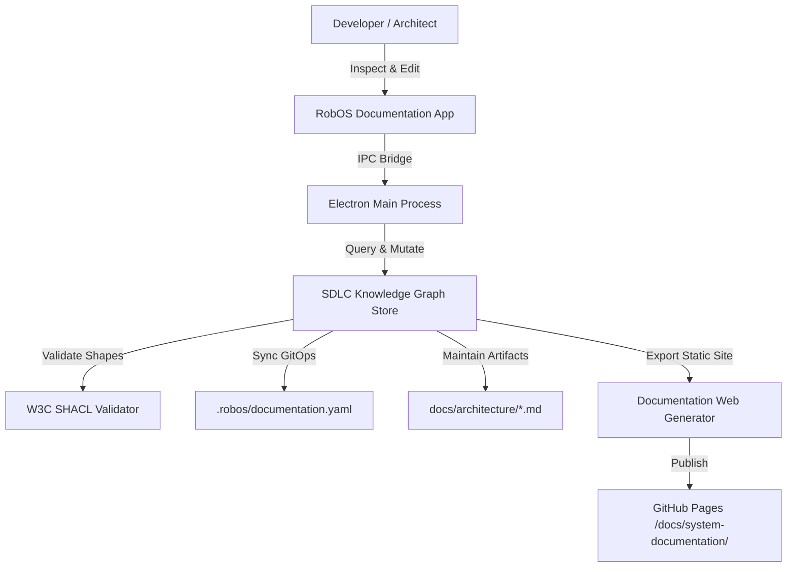

# RobOS Documentation Hub — Architecture Specification

> **Knowledge Graph Entity**: `urn:robos:app:robos-documentation`  
> **Type**: `robos:DesktopApp, oslc:Resource`  
> **Owner Team**: `Architecture & Tools Guild`  
> **Repository**: `github.com/robos-inc/robos`  
> **Technology Stack**: `Electron / Vanilla JS / DOM Snapshot`  
> **Last Synchronized**: 2026-09-25T12:00:00.000Z

---

## 1. Executive Architecture Overview

**RobOS Documentation** is the official desktop documentation application for the RobOS platform. Operating directly atop the Dual-State Knowledge Graph, it discovers documentable architectural assets (Microservices, Desktop/FrontEnd Apps, Databases, Message Brokers, Clusters, Platforms), tracks documentation coverage, provides an interactive reading and editing workbench, and maintains documentation in persistent repository markdown artifacts backed by declarative GitOps (`.robos/documentation.yaml`).

---

## 2. Component Topology & Data Flow

---

## 3. Specifications, Contracts & Interfaces

- **Target Component URI**: `urn:robos:app:robos-documentation`
- **Owner Team**: `Architecture & Tools Guild`
- **Source Package**: `packages/robos-documentation`
- **Debug Port**: `19197`
- **Viewer HTTP Port**: `3089`
- **SHACL Governance**: `urn:robos:shape:DocumentationShape`
