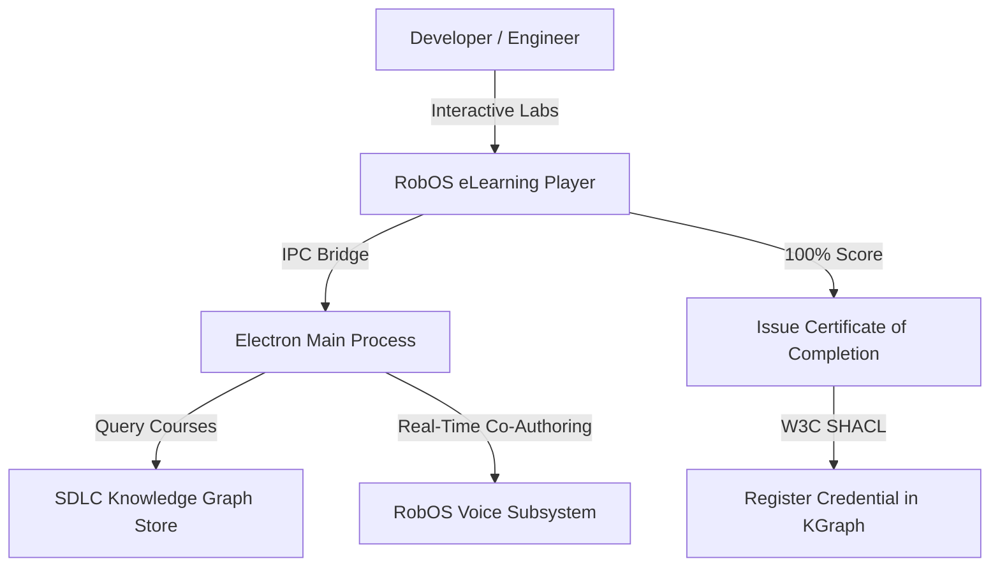

# RobOS Interactive eLearning Hub — Architecture Specification

> **Knowledge Graph Entity**: `urn:robos:app:robos-elearning`  
> **Type**: `robos:DesktopApp, oslc:Resource`  
> **Owner Team**: `Developer Experience Guild`  
> **Repository**: `github.com/robos-inc/robos`  
> **Technology Stack**: `Electron / Vanilla JS / Web Audio`  
> **Last Synchronized**: 2026-09-25T12:00:00.000Z

---

## 1. Executive Architecture Overview

**RobOS eLearning** is the native interactive course player, lab runner, and completion credential hub. It renders rich curricula defined as `robos:ELearning` graph nodes, walks developers through verified hands-on labs, runs knowledge checks, and issues cryptographically verified `robos:CertificateOfCompletion` credentials registered in the Knowledge Graph.

---

## 2. Component Topology & Data Flow

---

## 3. Specifications, Contracts & Interfaces

- **Target Component URI**: `urn:robos:app:robos-elearning`
- **Owner Team**: `Developer Experience Guild`
- **Source Package**: `packages/robos-elearning`
- **Debug Port**: `19185`
- **GitOps Catalog**: `.robos/elearning.yaml`
