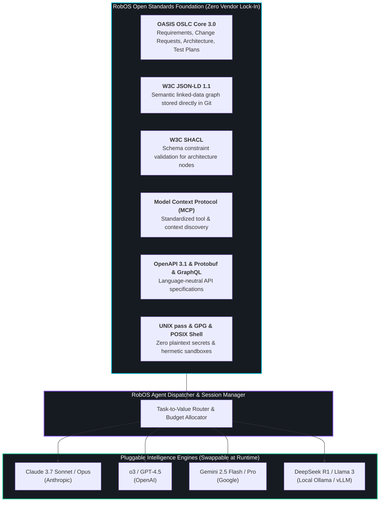

# Agent-Agnostic Open Framework & Algorithmic Independence
{: .no_toc }

How RobOS decouples the developer operating system and SDLC architecture from proprietary AI models—using open global standards to eliminate vendor lock-in and assign the right agent to the right task for optimal value and cost.
{: .fs-6 .fw-300 }

## Table of contents
{: .no_toc .text-delta }

1. TOC
{:toc}

---

## The Strategic Advantage: Breaking Free from Vendor Lock-In

The rapid acceleration of generative AI has created a severe risk for engineering organizations: **proprietary vendor capture**.

When an engineering team builds its workflows around a single closed ecosystem:
- **Proprietary Prompt & Rule Lock-In**: Instructions and skills are formatted for one specific tool's proprietary syntax. Migrating to another model requires rewriting thousands of lines of prompts.
- **Algorithmic Obsolescence**: The AI model leader changes every 6 months. Teams bound to a single vendor cannot easily swap to a superior, faster, or cheaper reasoning model.
- **Overpaying for Low-Complexity Tasks**: High-tier frontier reasoning models ($15–$60 per million tokens) are wastefully invoked for trivial tasks like lint fixing, unit test boilerplates, and schema formatting.
- **Data Sovereignty & Privacy Barriers**: Regulated industries (healthcare, finance, defense) cannot use external commercial APIs and need strict, offline, air-gapped local model execution.

**The RobOS Big Win: Algorithmic Independence**

> **RobOS is completely agent-, model-, and algorithm-agnostic. By building upon open global standards implemented out in the open, RobOS separates developer workstation context, SDLC architecture, and task orchestration from the underlying intelligence engine.**

Engineering teams maintain complete sovereignty: swap underlying models at will, dispatch the right agent to the right task based on complexity and cost, and run fully offline when necessary.

<div style="margin: 2rem 0; border: 1px solid #1e293b; border-radius: 12px; overflow: hidden; background: #0b101b; box-shadow: 0 10px 40px rgba(0,0,0,0.6);">
  
  <div style="padding: 0.75rem 1.25rem; font-size: 0.85rem; color: #94a3b8; border-top: 1px solid #1e293b; background: #0d1424; text-align: center;">
    <strong>Agent-Agnostic Architecture & Dispatcher</strong>: Connecting open-standard SDLC context to any AI model (Claude, OpenAI, Gemini, DeepSeek, local Ollama) based on task value and cost. <em>(Click image to zoom full screen)</em>
  </div>
</div>

---

## The Open Standards Foundation

Instead of inventing proprietary formats, RobOS anchors every layer of the Software Delivery Lifecycle to **battle-tested global open standards** developed by international standards bodies (OASIS, W3C, Linux Foundation):



### 1. OASIS Open Services for Lifecycle Collaboration (OSLC)
RobOS structures software lifecycle objects using **OASIS OSLC Core 3.0**:
- `oslc_rm:Requirement`: Business requirements and functional specifications linked to Gherkin BDD scenarios.
- `oslc_cm:ChangeRequest`: Epics, user stories, and GitHub/Jira task servers.
- `oslc_am:Resource`: Architecture components, microservices, databases, and client apps.
- `oslc_qm:TestPlan`: Verification suites, automated E2E tests, and contract verification checks.

Because OSLC is an open standard, your project knowledge is not trapped in a proprietary AI vendor's database.

### 2. W3C JSON-LD 1.1 & W3C SHACL
System topology lives in human-readable JSON-LD directly within your Git repository (`.robos/kgraphs/`). Constraints are validated with W3C SHACL (Shapes Constraint Language), guaranteeing that any agent, regardless of vendor, adheres to strict structural integrity rules.

### 3. Model Context Protocol (MCP)
RobOS implements Anthropic's open **Model Context Protocol (MCP)** across all desktop applications, task managers, and developer tools. Any MCP-compliant client or agent can discover and invoke RobOS tools without custom integrations.

---

## Right Agent for the Right Task: Value & Cost Optimization

Not every programming task requires a massive frontier reasoning model. Invoking an expensive model to fix a syntax typo or reformat YAML wastes engineering budget.

RobOS incorporates a **Task-to-Value Dispatch Matrix**, routing tasks to the optimal intelligence tier:

```mermaid
quadrantChart
    title Task Complexity vs. Model Cost Optimization
    x-axis Low Reasoning Complexity --> High Reasoning Complexity
    y-axis Low Computational Cost --> High Computational Cost
    quadrant-1 Frontier Heavy Reasoning
    quadrant-2 Inefficient Overkill (Avoid)
    quadrant-3 Fast Utility / Local Execution
    quadrant-4 Cost-Optimized Workhorses
    "Syntax formatting": [0.15, 0.20]
    "Unit test boilerplate": [0.30, 0.25]
    "Schema SHACL validation": [0.20, 0.15]
    "REST API client generation": [0.45, 0.35]
    "Microservice refactoring": [0.85, 0.85]
    "Cross-service blast radius analysis": [0.75, 0.70]
    "Multi-repo architectural synthesis": [0.92, 0.90]
    "Security vulnerability mitigation": [0.80, 0.75]
```

### The 3 Agent Tiers in RobOS

| Tier | Typical Models | Optimal SDLC Tasks | Cost Profile |
|:---|:---|:---|:---|
| **Tier 1: Fast Utility & Local** | Gemini 2.5 Flash, Claude 3.5 Haiku, Local Ollama (Llama 3, DeepSeek) | Commit message generation, lint fixing, schema validation, test stub boilerplate, and offline air-gapped tasks. | Ultra-low cost (<$0.10/M tokens) or $0 (Local GPU). |
| **Tier 2: Workhorse Implementation** | Claude 3.7 Sonnet, GPT-4.5, Gemini 2.5 Pro | Feature implementation, REST/gRPC API controllers, database migrations, and component unit tests. | Balanced efficiency ($3–$15/M tokens). |
| **Tier 3: Frontier Deep Reasoning** | Claude 3.7 Thinking / Opus, OpenAI o3, DeepSeek R1 | Multi-app architectural synthesis, cross-microservice refactoring, distributed consensus tracing, and security audits. | Premium high-reasoning tier ($15–$60/M tokens). |

---

## Universal Cross-Agent Skill Marketplace

All RobOS skills and automation plugins under `plugins/robos/skills/` and `.agents/skills/` are designed with universal compatibility:

- **Works Across All Major Agent Tools**: Compatible with Claude Code, OpenAI Codex, Google Antigravity, GitHub Copilot CLI, Gemini CLI, Cursor, and Windsurf.
- **Consistent Tool Declarations**: Skills declare standard `SKILL.md` frontmatter, parameter schemas, and shell execution scripts.
- **Decoupled Business Logic**: Skill logic executes through standard Linux shell commands, Node.js scripts, and CLI binaries inside the RobOS desktop environment.

### Example: Invoking Skills from Any Agent

```bash
# In Claude Code:
claude "Run e2e-driven-dev skill on billing-service"

# In Google Antigravity / Gemini CLI:
agy "Deploy latest kgraph changes using sync-kgraph-docs skill"

# In GitHub Copilot CLI:
copilot-cli exec "Run create-feature-spec for OpenSearch studio"
```

No matter which AI assistant your organization prefers today—or adopts tomorrow—your skills, workflows, and Knowledge Graph blueprints remain 100% operational.

---

## Sovereign & Air-Gapped Local Model Execution

For enterprises with strict data sovereignty, GDPR, HIPAA, or defense compliance requirements, RobOS provides **100% on-premise execution**:

1. **Local LLM Backends**: Seamless connection to local Ollama, vLLM, or llama.cpp servers running on workstation GPUs or private corporate clusters.
2. **Zero External Telemetry**: In Sovereign Mode, RobOS disables all external network calls; Knowledge Graph parsing, SHACL validation, and agent reasoning execute entirely within the local QEMU/KVM virtual machine.
3. **Local Video Proof & Speech**: Screen recording (FFmpeg) and audio narration (Piper TTS) run completely offline without cloud speech APIs.

---

## Next Steps

- **[Explore All RobOS Big Wins]({{ site.baseurl }})**: Return to the Big Wins executive overview.
- **[Ephemeral In-Memory Sandboxes]({{ site.baseurl }})**: Learn how agents execute safely in RAM with zero machine clutter.
- **[Universal Web & API Clients]({{ site.baseurl }})**: Explore Git-backed REST, gRPC, and GraphQL client tools.
- **[RobOS Skills Catalog]({{ site.baseurl }})**: Review the open catalog of cross-agent developer skills.
- **[💡 Explore the Ideas Store on GitHub](https://github.com/nddipiazza/robos/tree/main/docs/ideas)**: View raw idea dumps, feature proposals, and community specifications.
