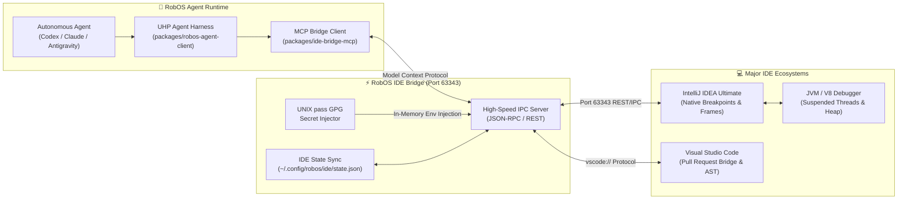

# Improved AI-Enhanced DevTools & IDEs
{: .no_toc }

When autonomous agents are struggling with deep runtime failures, RobOS agents + deep plugins to all major IDEs (IntelliJ IDEA, VS Code, JetBrains) assist FAR more than you are used to.
{: .fs-6 .fw-300 }

## Table of contents
{: .no_toc .text-delta }

1. TOC
{:toc}

---

## The Core Dilemma: When Autonomous Coding Agents Hit The Wall

Every software engineer who has pushed autonomous coding agents (Claude Code, OpenAI Codex, Google Antigravity, GitHub Copilot CLI, Cursor) into real-world codebases knows the frustrating wall they inevitably hit:

1. **The Flailing Guesswork Loop**: When a reproduction test fails with an ambiguous stack trace, an unexpected `NullPointerException`, or a subtle thread race condition, standalone agents don't have eyes on the live runtime. They guess. They mutate random lines of code, introduce subtle regressions, comment out failing assertions, or hallucinate mocks.
2. **Context Blindness Across Multi-Repo Architectures**: Real enterprise applications don't live in a single flat file. A feature in a backend Java/Spring service might depend on a schema contract in a shared Protobuf repo, an active Redis stream, and an mTLS gateway. Standalone agents cannot orchestrate multi-project roots without polluting the developer's machine.
3. **The Disconnected Debugging Gap**: Today, when an agent is stuck, the developer must stop the agent, manually open their personal IDE, checkout the branch, re-configure local environment variables, set breakpoints by hand, run the debugger, step through frames, and then copy-paste stack traces and variable dumps back into an LLM prompt.

> [!IMPORTANT]
> **The RobOS Paradigm Shift**:
> In RobOS, autonomous agents do not code in a vacuum or an isolated command-line silo. RobOS bridges AI agents directly into your existing development environment—connecting to **JetBrains IntelliJ IDEA** (via port `63343` IPC & MCP) and **VS Code** (via native PR deep-links and extensions). When an agent struggles, it doesn't flail: **it leverages native IDE debugging engines to pause execution, inspect live thread memory, evaluate expressions against the running runtime, and invite the human architect to co-debug with a single click.**

<div style="margin: 2rem 0; border: 1px solid #1e293b; border-radius: 12px; overflow: hidden; background: #0b101b; box-shadow: 0 10px 40px rgba(0,0,0,0.6);">
  
  <div style="padding: 0.75rem 1.25rem; font-size: 0.85rem; color: #94a3b8; border-top: 1px solid #1e293b; background: #0d1424; text-align: center;">
    <strong>RobOS IDE Bridge &amp; Breakpoint Co-Debugging</strong>: Real-time synchronization between RobOS Agent Chat, the Model Context Protocol bridge (port 63343), and IntelliJ IDEA. <em>(Click image to zoom full screen)</em>
  </div>
</div>

---

## Pillars of Deep IDE & Agent Co-Debugging



---

### 1. Interactive Breakpoint Reproduction & Thread Freeze

When an agent is tasked with fixing a defect or investigating a customer-reported bug, it doesn't just read static source code. Over the `ide-bridge-mcp` service, the agent can:

* **Programmatically Set Breakpoints**: Automatically insert breakpoints at suspected failure lines or reproduction test assertions (`robos_ide_add_breakpoint`).
* **Attach Native Debuggers**: Launch the project in debug mode (`robos_ide_run_config` with `mode: "debug"`).
* **Freeze Live Execution**: When the test triggers the breakpoint, execution suspends. The agent receives an instant webhook notification (`robos_ide_register_breakpoint_webhook`).
* **Unwind Stack Frames & Variables**: Inspect the call stack, parameter values, evaluated expressions, and heap objects from suspended Java or Node.js threads (`robos_ide_get_thread_state`).

```json
// Example: Live thread frame payload captured by Agent over ide-bridge-mcp
{
  "threadId": "thread-exec-1",
  "threadName": "http-nio-8080-exec-1",
  "status": "SUSPENDED",
  "suspendedAtFile": "PetService.java",
  "suspendedAtLine": 48,
  "frames": [
    { "file": "PetService.java", "className": "com.acme.petshop.service.PetService", "methodName": "adoptPet", "line": 48 },
    { "file": "PetController.java", "className": "com.acme.petshop.web.PetController", "methodName": "processAdoption", "line": 104 }
  ],
  "variables": {
    "pet": "{Pet@1402} id=a81b2c-91, species=Canine, status=PENDING",
    "tagId": "\"VAX-2026-9814\"",
    "vaccineGateway": "{VaccineGatewayClient@1499} (target: https://localhost:8443)",
    "stateCompliant": "false"
  }
}
```

Instead of guessing why an adoption failed, the agent reads the actual runtime memory: `stateCompliant` evaluated to `false` because the vaccine gateway rejected the mTLS certificate.

<div style="margin: 2rem 0; border: 1px solid #1e293b; border-radius: 12px; overflow: hidden; background: #0b101b; box-shadow: 0 10px 40px rgba(0,0,0,0.6);">
  
  <div style="padding: 0.75rem 1.25rem; font-size: 0.85rem; color: #94a3b8; border-top: 1px solid #1e293b; background: #0d1424; text-align: center;">
    <strong>IntelliJ IDEA Native Breakpoint Debugger</strong>: Agent-orchestrated debug session paused on line with live frame inspection and watch expressions. <em>(Click image to zoom full screen)</em>
  </div>
</div>

---

### 2. Secret-Managed Run Configurations (Zero Plaintext Secrets)

Running complex microservices often requires staging database passwords, API tokens, or mTLS keystore paths. In traditional setups, agents either fail due to missing environment variables or commit plaintext credentials into repository configuration files.

RobOS bridges the local UNIX `pass` GPG encrypted password store directly into IDE run configurations:
* Run/debug configurations (`Application`, `JUnit`, `Maven`, `Gradle`) are generated programmatically with secret URI references (e.g. `pass:acme/vaccine-gateway-mTLS`).
* Secrets are decrypted in-memory during process launch and injected directly into the running process's environment.
* **Zero plaintext secrets are written to `.idea/runConfigurations/` XML or committed to Git.**

---

### 3. Ephemeral Multi-Project Workspaces (Zero IDE Clutter)

When debugging microservices, an agent frequently needs to examine the backend service, the client library, and the shared API contract repository simultaneously.

In traditional tools, opening multiple repositories leaves your IDE project history permanently cluttered with temporary folders and broken caches.

RobOS provides **Ephemeral Multi-Project Workspaces** (`robos_ide_create_ephemeral_workspace`):
* Provisions an isolated, unified workspace grouping sibling project roots.
* Configures shared module dependencies, SDK paths, and build tools automatically.
* When the agent completes the task or submits the pull request, the ephemeral workspace auto-destroys itself (`robos_ide_destroy_ephemeral_workspace`), leaving your IDE clean and uncluttered.

---

### 4. The 1-Click IDE Pull Request Review Bridge

When the agent finishes implementing a fix and generates the pull request, the human review doesn't happen in a cramped web browser textarea:

* From the **RobOS Agent Code Review Platform** (`packages/pr-review`), developers can click **"Review in IntelliJ IDEA"** or **"Review in VS Code"**.
* **IntelliJ Bridge**: Sends an IPC command to port `63343`, automatically opening the project, checking out the branch, and launching the JetBrains Pull Request tool window.
* **VS Code Bridge**: Triggers deep protocol links (`vscode://github.vscode-pull-request-github/open-pr`) to open the exact file diffs inside the developer's native editor.
* Developers review the code with full AST symbol navigation, jump-to-definition, local test execution, and inline commenting—submitting approvals directly from their editor.

<div style="margin: 2rem 0; border: 1px solid #1e293b; border-radius: 12px; overflow: hidden; background: #0b101b; box-shadow: 0 10px 40px rgba(0,0,0,0.6);">
  
  <div style="padding: 0.75rem 1.25rem; font-size: 0.85rem; color: #94a3b8; border-top: 1px solid #1e293b; background: #0d1424; text-align: center;">
    <strong>Stage 4 IDE Review Bridge</strong>: Seamless transition from RobOS PR Review Theater into IntelliJ IDEA and VS Code native review environments. <em>(Click image to zoom full screen)</em>
  </div>
</div>

---

## Real-World Scenario: When The Agent Struggles

Consider a real-world scenario from the **Acme Petshop** project:
An autonomous agent is assigned ticket `PET-101`: *"Fix broken pet adoption status updates during high-concurrency state transitions."*

```text
┌─────────────────────────────────────────────────────────────────────────────┐
│ 1. Agent runs reproduction test -> Fails with intermittent HTTP 500         │
│ 2. Instead of hallucinating mock fixes, Agent sets breakpoint in PetService │
│ 3. Agent launches IntelliJ IDEA debug session via ide-bridge-mcp (port 63343)│
│ 4. Execution freezes at line 48; Webhook notifies Agent with live memory    │
│ 5. Agent inspects variables: discovers mutex deadlock on vaccine verification│
│ 6. Agent prompts Lead Architect: "Paused at breakpoint. Want to step in?"   │
│ 7. Architect clicks 'Open in IDE' -> IntelliJ focuses directly on suspended │
│    thread with full call stack ready to inspect.                            │
│ 8. Agent and Architect resolve the concurrency lock together in 2 minutes.  │
└─────────────────────────────────────────────────────────────────────────────┘
```

Without the RobOS IDE Bridge, this bug would have taken hours of context-switching, stale log analysis, and guesswork. With RobOS, it is resolved interactively in minutes.

---

## Model Context Protocol (MCP) Tool Reference

The `ide-bridge-mcp` service exposes standard MCP tools consumable by Claude Code, Google Antigravity, OpenAI Codex, and GitHub Copilot:

| MCP Tool Name | Arguments | Description |
|:--------------|:----------|:------------|
| `robos_ide_status` | *(none)* | Returns connected IDE name, version, active project, and IPC port status. |
| `robos_ide_open_file` | `file`, `line`, `column` | Focuses the specified file and scrolls the cursor to the target line in the active IDE. |
| `robos_ide_add_breakpoint` | `file`, `line` | Dynamically injects a breakpoint into the running IDE debugger session. |
| `robos_ide_remove_breakpoint` | `file`, `line` | Removes an active breakpoint. |
| `robos_ide_create_run_config` | `name`, `type`, `target`, `env`, `passSecrets` | Configures a secret-secured Maven, Gradle, Spring Boot, or Node run configuration. |
| `robos_ide_run_config` | `name`, `mode` (`"run"` or `"debug"`) | Dispatches execution in the IDE and attaches the debugger. |
| `robos_ide_get_thread_state` | `threadId` *(optional)* | Returns suspended thread details, call stack frames, and evaluated local variables. |
| `robos_ide_evaluate_expression` | `expression` | Evaluates arbitrary expressions against the active suspended thread runtime frame. |
| `robos_ide_register_breakpoint_webhook` | `webhookUrl` | Registers an HTTP callback to receive instant JSON alerts when breakpoints trigger. |
| `robos_ide_create_ephemeral_workspace` | `projects`, `autoDebug` | Provisions a temporary multi-repo workspace that cleanly self-destructs on task completion. |

---

## Strategic Comparison: Standalone Coding Assistants vs. RobOS IDE Bridge

| Capability | Cursor / Copilot / Raw Chatbots | RobOS Autonomous Agent + IDE Bridge |
|:-----------|:-------------------------------|:-----------------------------------|
| **Debugging Strategy** | Static text analysis & blind code editing | Native runtime debugger attachment & live breakpoint halts |
| **Thread Memory Inspection** | ❌ None (blind to runtime state) | ✅ Full stack frames, evaluated variables & heap inspection |
| **Breakpoint Synchronization** | ❌ None | ✅ Programmatic breakpoint setting & instant webhook alerts |
| **Credential Management** | Plaintext in `.env` or hardcoded in XML | 🔒 UNIX `pass` GPG in-memory runtime secret injection |
| **Multi-Repo Management** | Clutters developer's global project list | 🧼 Ephemeral workspaces with auto-destroy cleanup |
| **PR Review Experience** | Confined to web browser diff viewer | 🚀 Direct bridge to JetBrains PR window & VS Code PR plugin |
| **Assistance When Stuck** | Agent hallucinates mocks or loops | 🤝 Seamless co-debugging handoff to human Lead Architect |

---

👉 **[Back to All RobOS Big Wins →]({{ site.baseurl }})**
