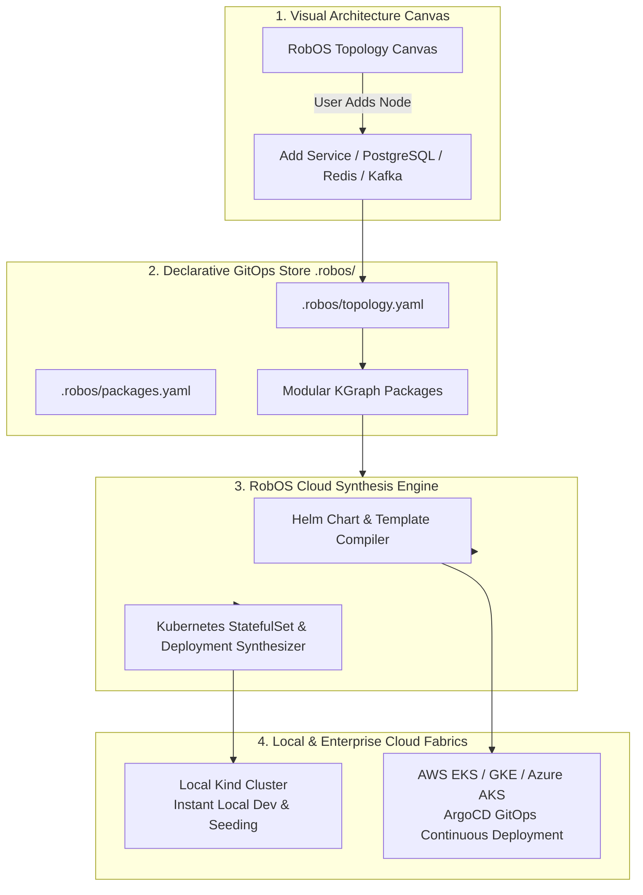

# 100% Declarative GitOps Storage & Zero-YAML Synthesis
{: .no_toc }

How RobOS eliminates YAML sprawl and configuration complexity by synthesizing production-ready Kubernetes manifests and Helm charts directly from Git-backed architectural models.
{: .fs-6 .fw-300 }

## Table of contents
{: .no_toc .text-delta }

1. TOC
{:toc}

---

## The Strategic Advantage: Ending YAML Sprawl & Fragility

In standard cloud-native engineering, developers spend a disproportionate amount of time authoring, copying, pasting, and debugging hundreds of lines of fragile YAML:
- Kubernetes `Deployment`, `Service`, `ConfigMap`, `Secret`, `StatefulSet`, and `Ingress` manifests.
- Multi-tier Helm charts with complex values files and Go template expressions.
- Slight indentation mistakes or misaligned port mappings cause silent container boot loops and failed rollouts.

**RobOS introduces Zero-YAML Declarative GitOps Synthesis:**

Instead of manually editing verbose YAML manifests, you design your architecture visually or describe it via clean, semantic declarations in the Knowledge Graph. RobOS automatically **compiles and synthesizes complete, ready-to-deploy Kubernetes StatefulSets, Deployments, Services, and Helm charts**. Everything remains 100% declarative, version-controlled in plain-text Git files under `.robos/`, with zero proprietary lock-in.

<div style="margin: 2rem 0; border: 1px solid #1e293b; border-radius: 12px; overflow: hidden; background: #0b101b; box-shadow: 0 10px 40px rgba(0,0,0,0.6);">
  
  <div style="padding: 0.75rem 1.25rem; font-size: 0.85rem; color: #94a3b8; border-top: 1px solid #1e293b; background: #0d1424; text-align: center;">
    <strong>Zero-YAML GitOps Flowchart</strong>: Visual Architecture Canvas synthesizes Git-backed definitions into automated Kubernetes and Helm deployments across clouds. <em>(Click image to zoom full screen)</em>
  </div>
</div>

---

## Technical Architecture: From Visual Canvas to Cloud Deployments



### 1. Clean Git-Backed Declarations (`.robos/`)
RobOS stores all architectural declarations in human-readable YAML/JSON-LD files directly inside your Git repository:
- `.robos/topology.yaml`: Container topology, services, databases, exposed ports, and network policies.
- `.robos/packages.yaml`: Software packages, archetypes, source directories, and build scripts.
- `.robos/teams.yaml`: Team Topologies, code ownership, and GPG commit signers.
- `.robos/kgraphs/`: Modular Knowledge Graph packages with formal linked-data semantics.

### 2. Automated Manifest Synthesis
When you add a node to the visual architecture canvas—such as a PostgreSQL database or a Spring Boot microservice—RobOS automatically generates:
- **Kubernetes StatefulSets**: Complete with persistent volume claim (PVC) templates, volume mounts, readiness probes, and liveness probes.
- **Kubernetes Deployments**: Rolling update strategies, resource CPU/memory limits, environment variable bindings, and secret references.
- **Kubernetes Services & Ingress**: ClusterIP and NodePort bindings, routing annotations, and TLS termination definitions.
- **Helm Charts**: Standardized Helm structure with `Chart.yaml`, `values.yaml`, and templated resource manifests.

### Sample Synthesized Manifest

```yaml
# Auto-synthesized by RobOS from .robos/topology.yaml
apiVersion: apps/v1
kind: StatefulSet
metadata:
  name: orders-db
  labels:
    app.kubernetes.io/name: orders-db
    robos.dev/managed-by: robos-synthesis
spec:
  serviceName: orders-db-service
  replicas: 1
  selector:
    matchLabels:
      app: orders-db
  template:
    metadata:
      labels:
        app: orders-db
    spec:
      containers:
        - name: postgres
          image: postgres:16-alpine
          ports:
            - containerPort: 5432
          env:
            - name: POSTGRES_DB
              value: orders_production
            - name: POSTGRES_USER
              valueFrom:
                secretKeyRef:
                  name: db-credentials
                  key: username
  volumeClaimTemplates:
    - metadata:
        name: postgres-data
      spec:
        accessModes: ["ReadWriteOnce"]
        resources:
          requests:
            storage: 20Gi
```

---

## Local to Cloud Continuum: Kind to AWS, GCP & Azure

RobOS seamlessly spans the entire spectrum from single-developer laptops to multi-cloud enterprise deployments:

- **Local Kind Kubernetes**: RobOS spins up ephemeral or persistent local **Kind** (Kubernetes in Docker) clusters. Developers test full microservice networks, seeded databases, and mock Prism endpoints on localhost with zero cloud costs.
- **Enterprise Multi-Cluster Kube Studio**: Connect live to AWS EKS, Google Cloud GKE, or Azure AKS. **RobOS Kube Studio** (`packages/kube-studio`) provides real-time pod log streaming, container exec terminals, and **ArgoCD GitOps synchronization** to observe live rollouts and deployment health across staging and production.

---

## Next Steps

- **[Explore All 10 RobOS Big Wins]({{ site.baseurl }})**: Return to the Big Wins executive overview.
- **[Unified Data Sources Management]({{ site.baseurl }})**: Explore the native relational, NoSQL, and cloud storage management suite.
- **[Universal Web & API Clients]({{ site.baseurl }})**: Learn about Git-backed REST, gRPC, and GraphQL verification tooling.
- **[Multi-Cluster Kube Studio]({{ site.baseurl }})**: Read the application guide for Kube Studio.
- **[💡 Explore the Ideas Store on GitHub](https://github.com/nddipiazza/robos/tree/main/docs/ideas)**: View raw idea dumps, community feature proposals, and structured architecture specs.

