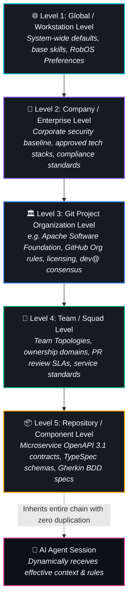

# Dual-State SDLC Knowledge Graph & Automated Blast Radius
{: .no_toc }

How RobOS maintains simultaneous models of production reality and proposed feature branches, calculating the exact blast radius of every change across microservices, schemas, and contracts before coding begins.
{: .fs-6 .fw-300 }

## Table of contents
{: .no_toc .text-delta }

1. TOC
{:toc}

---

## The Strategic Advantage: Seeing the System Beyond the File

Traditional developer environments suffer from severe myopia: an editor only understands plain text files within a single working folder. When an engineer or autonomous coding assistant modifies a database column or alters an API payload:
- It has no awareness that a downstream mobile app will crash upon receiving the updated response.
- It doesn't know that an analytics data pipeline depends on the renamed column.
- It cannot determine which consumer contracts or documentation pages are broken until runtime defects occur in production.

**RobOS solves this through the Dual-State SDLC Knowledge Graph:**

Instead of treating codebases as isolated silos, RobOS maintains an executable, connected architecture graph linking systems, services, data entities, contracts, teams, tasks, and documentation. Powered by international open standards—**OASIS OSLC Core 3.0**, **W3C JSON-LD 1.1**, and **W3C SHACL**—the Knowledge Graph models not just what code exists today, but how the entire ecosystem changes tomorrow.

<div style="margin: 2rem 0; border: 1px solid #1e293b; border-radius: 12px; overflow: hidden; background: #0b101b; box-shadow: 0 10px 40px rgba(0,0,0,0.6);">
  
  <div style="padding: 0.75rem 1.25rem; font-size: 0.85rem; color: #94a3b8; border-top: 1px solid #1e293b; background: #0d1424; text-align: center;">
    <strong>Dual-State Living Architecture Diagram</strong>: Comparing Live Production State (World 1) against Proposed Feature State (World 2) with automated blast radius calculation and schema drift detection. <em>(Click image to zoom full screen)</em>
  </div>
</div>

---

## The Dual-State Model: World 1 vs. World 2

RobOS leverages Git branching to maintain two simultaneous representations of architectural reality:

```mermaid
graph LR
    subgraph World1 [World 1: Live Production Reality (main branch)]
        P_Svc[Order Service v2.4]
        P_DB[(PostgreSQL orders table)]
        P_API[OpenAPI 3.1: /orders POST]
        P_Consumer[Mobile App Consumer v1.8]
        P_Svc --> P_DB
        P_Svc --> P_API
        P_Consumer --> P_API
    end

    subgraph World2 [World 2: Proposed Feature Branch (feature/order-tax)]
        F_Svc[Order Service v2.5]
        F_DB[(PostgreSQL orders table + tax_rate)]
        F_API[OpenAPI 3.1: /orders POST + tax_cents]
        F_Svc --> F_DB
        F_Svc --> F_API
    end

    subgraph DiffEngine [RobOS Semantic Diff & Blast Radius Engine]
        Blast[💥 Blast Radius: Breaking change detected on Mobile App Consumer v1.8]
    end

    World1 -.-> DiffEngine
    World2 -.-> DiffEngine
```

### World 1: Production Reality (`main`)
World 1 represents what is actively running in production:
- Deployed microservice versions and container configurations
- Live database schemas, indices, and connection strings
- Active consumer contracts and verified Pact agreements
- Team ownership boundaries and on-call rotations

### World 2: Proposed Feature Branch (`feature/*`)
World 2 represents the proposed state of the universe once a pull request, spike, or architectural change is merged:
- Altered TypeSpec domain schemas
- Updated OpenAPI endpoints or gRPC Protobuf definitions
- New database tables or added columns
- Newly registered microservices, frontends, or background pipelines

---

## Automated Pre-Code Blast Radius Calculation

Before an autonomous agent or human engineer writes a single line of application code, RobOS executes **Semantic Graph Diffing**:

1. **Entity Drift Detection**: RobOS compares the JSON-LD triples between the active branch and the `main` branch.
2. **Dependency Edge Traversal**: The engine traverses dependency edges (`robos:consumesAPI`, `robos:dependsOnService`, `robos:persistsTo`, `robos:tracksRequirement`).
3. **Consumer Contract Verification**: If an endpoint schema change violates an existing consumer contract (e.g. removing a required JSON field or changing a type from `integer` to `string`), RobOS immediately flags a **Breaking Contract Violation**.
4. **Impact Visualization in Dev Central**: The lead architect sees a color-coded blast radius map:
   - 🔴 **High Risk**: Broken downstream consumer contracts requiring coordination.
   - 🟡 **Medium Risk**: Database schema alterations requiring migration scripts.
   - 🟢 **Low Risk**: Additive non-breaking endpoints or documentation updates.

```json
{
  "@type": "robos:BlastRadiusReport",
  "sourceChange": "urn:robos:contract:orders-api#OrderCreateRequest",
  "changeType": "BreakingFieldTypeChanged",
  "field": "tax_cents",
  "impactedConsumers": [
    {
      "appId": "mobile-checkout-ios",
      "team": "checkout-squad",
      "consumerContract": "urn:pact:orders-mobile-contract-v4"
    }
  ],
  "remediation": "Generate backward-compatible API adapter or bump major API version to /v2/orders."
}
```

---

## Hierarchical Agent Context & Multi-Level Rules Inheritance (Eliminating Duplicate Skills)

In traditional AI coding setups, software engineering organizations face an unsustainable maintenance bottleneck: **prompt rule and skill duplication across repositories**.

When developers rely on file-local configurations (`.cursorrules`, `CLAUDE.md`, `.github/copilot-instructions.md`, or custom skill manifests):
- **Excessive Duplication**: Security guidelines, license requirements, commit formatting rules, and testing standards are copy-pasted across dozens or hundreds of individual repositories.
- **Rule Drift & Stale Agents**: When a company-wide policy changes (e.g. banning a compromised dependency, enforcing GPG-signed commits, or updating an API authentication standard), dozens of repositories remain outdated.
- **Context Blindness**: An autonomous agent operating in a microservice has no awareness of the parent organization's open-source bylaws, foundation rules (e.g., Apache Software Foundation policies), or team-level ownership protocols.

### The Big Win: Graph-Inherited Agent Context

RobOS leverages the Knowledge Graph hierarchy to define agent context, skills, and rules **once at the appropriate level**, dynamically synthesizing the effective context whenever an agent session starts:



### The 5 Hierarchical Context Levels

| Level | Knowledge Graph Store | Scope & Injected Capabilities | Duplicate Maintenance Eliminated |
|:---|:---|:---|:---|
| **1. Global / System** | `robos.core` / RobOS Preferences | System-wide developer defaults, base agent skills (`add-ai-text-area-to-app`, `app-snapshot`, etc.), global shell environments, and standard SDLC conventions. | Eliminates re-declaring base skills and toolchains across individual developer workstations. |
| **2. Company / Enterprise** | `robos:Company` / Enterprise Sync | Corporate security baseline, allowed dependencies/registries, SSO SCIM policies, and enterprise-wide architectural review mandates. | Eliminates copying corporate compliance policies into 100+ separate service repositories. |
| **3. Git Project Organization** | `robos:GitProjectOrganization` (`robos.org`) | Forge-level governance (e.g. `https://github.com/apache`), org-wide documentation hubs (`docsUrl`), open-source licenses (`license`), and org agent rules (`robos:agentRules` e.g. ASF license headers, public dev@ consensus tracing). | Prevents copy-pasting foundation or forge guidelines across 350+ member repos (Kafka, Spark, Lucene). |
| **4. Team / Squad** | `robos:Team` (`robos.org`) | Team Topologies (`stream-aligned`, `platform`), code ownership boundaries, team lead approvers, and on-call escalation procedures. | Configured once in the team topology node; all squad repositories inherit ownership context. |
| **5. Repository / Component** | `robos:Microservice`, `robos:FrontEndApp` | Service-specific OpenAPI 3.1 contracts, Protobuf stubs, TypeSpec models, and Gherkin `.feature` acceptance criteria. | Individual repositories focus solely on their distinct business logic and contract models. |

### Dynamic Downward Traversal in Action

When an autonomous agent investigates a bug or opens a pull request on `https://github.com/apache/kafka`:
1. **Forge Organization Rules Injected**: RobOS traverses to `urn:robos:git-org:apache`, injecting `RULE-APACHE-001` (ASF license header verification) and `RULE-APACHE-002` (dev@ consensus citation).
2. **Enterprise & Team Policies Merged**: Corporate security rules (secret leak prevention) and team approver rosters are automatically merged into the session prompt.
3. **Local Component Contracts Linked**: The microservice's local OpenAPI contracts and TypeSpec schemas provide exact AST-level context.
4. **Zero Skill Duplication**: The repository maintains zero redundant prompt files or duplicated skill definitions. Updating a rule at the organization level in the Knowledge Graph takes effect instantly across all 350+ repositories.

---

## Living Documentation Continuous Synchronization

A major disease of enterprise software is **Documentation Rot**—system architecture diagrams, READMEs, and wiki pages drift out of date within weeks of being written.

In RobOS, the Knowledge Graph is the living heartbeat of system documentation:

```
┌────────────────────────────────────────────────────────┐
│ 1. Ingest Knowledge Graph Deltas                       │
│    Inspect added/modified nodes in Modular KGraph Pkgs │
└──────────────────────────┬─────────────────────────────┘
                           │
┌──────────────────────────▼─────────────────────────────┐
│ 2. Discern Noticeable Documentation Impacts            │
│    Identify impacted docs: README.md, docs/index.md,   │
│    docs/project-plan/, specs, and .robos/ GitOps files │
└──────────────────────────┬─────────────────────────────┘
                           │
┌──────────────────────────▼─────────────────────────────┐
│ 3. Apply Synchronized Documentation Updates            │
│    Update markdown files, tables, and architecture     │
│    diagrams to reflect latest graph entities           │
└────────────────────────────────────────────────────────┘
```

**The RobOS Cardinal Rule for AI Agents**:
Whenever Knowledge Graph objects are updated (added, altered, or deleted), the AI is prompted to discern any noticeable updates needed across system documentation (`docs/index.md`, `README.md`, `docs/project-plan/`, API specs) and update them automatically.

---

## Standards-Based Foundation: OASIS OSLC & W3C JSON-LD

RobOS builds upon established, battle-tested open standards rather than proprietary formats:

- **OASIS OSLC Core 3.0**: Standardizes requirements management (`oslc_rm:Requirement`), change management (`oslc_cm:ChangeRequest`), architecture management (`oslc_am:Resource`), and quality management (`oslc_qm:TestPlan`).
- **W3C JSON-LD 1.1**: Human-readable JSON format with semantic linked-data semantics, allowing graphs to be stored directly in Git repositories under `.robos/kgraphs/`.
- **W3C SHACL (Shapes Constraint Language)**: Enforces schema correctness before graphs are committed, preventing malformed nodes, missing fields, or invalid enum values.

---

## Next Steps

- **[Explore All RobOS Big Wins]({{ site.baseurl }})**: Return to the Big Wins executive overview.
- **[Ephemeral In-Memory Sandboxes]({{ site.baseurl }})**: Learn how agents execute safely in RAM with zero machine clutter.
- **[Video Proof-of-Work]({{ site.baseurl }})**: Understand automated headless screen recordings and neural voiceovers.
- **[Dedicated Knowledge Graph Guide]({{ site.baseurl }})**: Read the full technical specification for RobOS Knowledge Graph packages and schemas.
