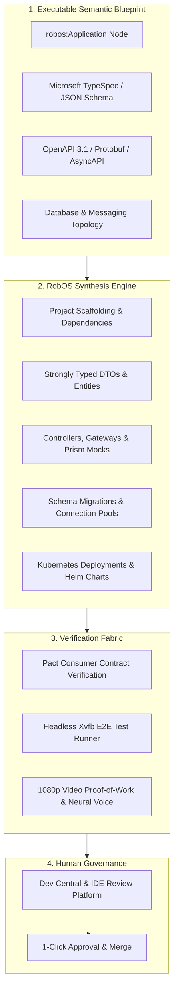

# Knowledge Graph-First (KGraph-First) Application Generation
{: .no_toc }

How RobOS elevates contract-driven engineering to the entire application lifecycle, automatically synthesizing full production applications across 9 archetypes from schema-validated Knowledge Graph blueprints.
{: .fs-6 .fw-300 }

## Table of contents
{: .no_toc .text-delta }

1. TOC
{:toc}

---

## The Strategic Advantage: Beyond Code Autocompletion

In traditional software development, AI tools act as glorified autocompletions or chat sidebars. They generate isolated functions or single-file code snippets upon request, but they have no holistic understanding of system topology, database persistence, API contracts, deployment manifests, or consumer expectations. The developer is left with the exhausting task of manually typing boilerplate, configuring project scaffolding, stitching together ORMs, authoring Dockerfiles, and wiring up Kubernetes configurations.

**RobOS introduces a fundamental paradigm shift:**

> **Just as an OpenAPI specification automatically generates a typed REST client SDK, a schema-validated RobOS Knowledge Graph automatically generates an entire application.**

In RobOS, human software engineers act as **Lead System Architects**. Instead of manually writing repetitive code, you define and evolve the executable semantic blueprint in the Knowledge Graph. RobOS's synthesis engine and autonomous agent swarms then compile the graph into production-grade polyglot applications, complete with strongly typed domain models, database migrations, controllers, devcontainers, and Helm charts.

  
  

    <strong>KGraph-First Application Generation Architecture</strong>: The Knowledge Graph serves as the master executable blueprint compiling into scaffolding, typed models, API controllers, database migrations, and verification test fabrics under an Agent Review governance layer. <em>(Click image to zoom full screen)</em>
  

---

## The 9 Supported Application Archetypes

RobOS treats applications as first-class, typed architectural nodes rather than generic directories. When you scaffold or import an application into the Knowledge Graph, you declare its explicit archetype:

| Archetype Node | Primary Frameworks & Languages | Synthesized Artifacts |
|:---|:---|:---|
| **`robos:Microservice`** | Java (Spring Boot), TypeScript (NestJS/Fastify), Python (FastAPI), Go (Gin/Chi) | OpenAPI 3.1 contracts, Prism mock servers, controller stubs, Prisma/JPA entities, Flyway/Liquibase migrations, Kubernetes StatefulSets. |
| **`robos:FrontEndApp`** | React 18+, Vite, Next.js, Vue 3, SvelteKit | Component hierarchy, typed API clients from OpenAPI specs, responsive CSS theme tokens, Vitest unit suites, Playwright E2E tests. |
| **`robos:DesktopApp`** | Electron, Tauri, Qt, GTK | Main and preload IPC bindings, contextBridge security isolation, system menu integration, `.desktop` launcher registrations, DOM snapshot debug ports. |
| **`robos:PCGame`** | Unreal Engine 5, Unity 6, Godot 4, Bevy (Rust) | DirectX 12 / Vulkan engine projects, scene hierarchies, asset manifests, gameplay scripts, input mapping configs. |
| **`robos:MobileGame`** | Unity, Unreal, Godot | iOS and Android build profiles, touch/accelerometer input controllers, texture atlases, mobile performance budgets. |
| **`robos:ConsoleApp`** | Go (Cobra), Rust (Clap), Python (Click), Node (Commander) | Subcommand trees, flag specifications, shell auto-completions, man pages, cross-platform binary release scripts. |
| **`robos:MobileApp`** | React Native, Flutter, Swift, Kotlin | Native navigation stacks, offline SQLite caches, biometric auth bridges, app store metadata. |
| **`robos:DataPipeline`** | Kafka Streams, Apache Spark, Celery, Flink | Stream consumers, event schemas (Avro/Protobuf), Dead Letter Queues (DLQ), idempotency filters, backpressure policies. |
| **`robos:Library`** | TypeScript (npm), Java (Maven/Gradle), Python (PyPI), Rust (Crates) | Strongly typed public APIs, documentation generators, multi-target build matrices, semver changelog bots. |

---

## The Synthesis Engine Pipeline

When an application node is registered or modified in the Knowledge Graph, the RobOS synthesis pipeline executes four automated phases:

### 1. Scaffolding & Polyglot Dependencies
RobOS synthesizes idiomatic project structures according to best-in-class language conventions:
- Configures package manifests (`package.json`, `pom.xml`, `go.mod`, `Cargo.toml`).
- Sets up standard linting, formatting, and compiler configs (TypeScript `tsconfig.json`, ESLint, Checkstyle).
- Injects standard `.devcontainer/devcontainer.json` for hermetic container execution.

### 2. Typed Domain Models from TypeSpec
Developers author entity models once in **Microsoft TypeSpec** or Protobuf. RobOS compiles those schemas directly into:
- TypeScript interfaces and Zod validation schemas
- Java 21 immutable records with Jackson annotations
- Go structs with JSON and BSON struct tags
- Database ORM entities (Prisma, Hibernate/JPA, GORM)

### 3. API Controllers, Routes & Mock Servers
API specifications (OpenAPI 3.1 YAML) are not treated as static documentation—they actively drive code generation:
- Server routes, controllers, and parameter validation middleware are auto-generated.
- Client SDKs are synthesized and distributed to consuming applications.
- **Stoplight Prism** mock servers spin up instantly in local test fabrics, allowing frontend developers to build against live mock endpoints before backend logic is written.

### 4. Database Migrations & Persistence
When a relational database (`robos:RelationalDatabase`) or NoSQL store is linked to the application node:
- RobOS synthesizes SQL DDL migration files (Flyway / Liquibase / SQL migrations).
- Creates connection pools and transactional persistence repositories.
- Automatically generates seed data fixtures for hermetic local testing.

---

## The Governance Layer: Agent Review-Based Software Development

Auto-generation without rigorous governance leads to chaos. RobOS wraps the entire synthesis engine in the **Agent Review-Based Development** harness:

1. **Proactive Alignment**: Grounded in the Knowledge Graph, RobOS workflows actively probe the lead engineer regarding edge cases, trade-offs, and constraints *before* code is generated.
2. **Autonomous Implementation**: Agents write the code, wire dependencies, update contracts, and generate tests.
3. **Headless Verification**: The implementation is executed in an isolated virtual framebuffer (`Xvfb`), clicking real buttons, executing API calls, and verifying database mutations.
4. **Verifiable Proof-of-Work**: The agent records a 1080p video walkthrough accompanied by a neural voiceover (Piper TTS) and timestamped transcript.
5. **Human Approval**: The lead architect watches the 30-second walkthrough in Dev Central or jumps into **IntelliJ IDEA** or **VS Code** with full language server AST navigation, then approves the pull request with one click.

---

## Next Steps

- **[Explore All RobOS Big Wins]({{ site.baseurl }})**: Return to the Big Wins executive overview.
- **[Dual-State SDLC Knowledge Graph]({{ site.baseurl }})**: Discover how RobOS models World 1 vs. World 2 and detects blast radius.
- **[Ephemeral In-Memory Sandboxes]({{ site.baseurl }})**: Learn how agents execute safely in RAM with zero machine clutter.
- **[New App Development Wizard]({{ site.baseurl }})**: Walk through scaffolding a greenfield application step-by-step.
