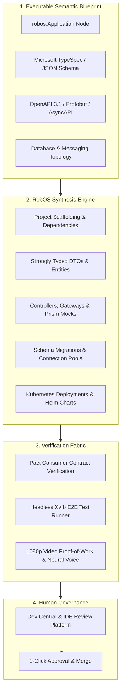

# Knowledge Graph-First (KGraph-First) App Generation & Modular Architecture
{: .no_toc }

How RobOS elevates contract-driven engineering to the entire application lifecycle, automatically synthesizing full production applications across 9 archetypes from schema-validated, modular namespaced Knowledge Graph blueprints.
{: .fs-6 .fw-300 }

## Table of contents
{: .no_toc .text-delta }

1. TOC
{:toc}

---

## The Strategic Advantage: Beyond Code Autocompletion

In traditional software development, AI tools act as glorified autocompletions or chat sidebars. They generate isolated functions or single-file code snippets upon request, but they have no holistic understanding of system topology, database persistence, API contracts, deployment manifests, or consumer expectations. The developer is left with the exhausting task of manually typing boilerplate, configuring project scaffolding, stitching together ORMs, authoring Dockerfiles, and wiring up Kubernetes configurations.

**RobOS introduces a fundamental paradigm shift:**

> **Just as an OpenAPI specification automatically generates a typed REST client SDK, a schema-validated RobOS Knowledge Graph automatically generates an entire application.**

In RobOS, human software engineers act as **Lead System Architects**. Instead of manually writing repetitive code, you define and evolve the executable semantic blueprint in the Knowledge Graph. RobOS's synthesis engine and autonomous agent swarms then compile the graph into production-grade polyglot applications, complete with strongly typed domain models, database migrations, controllers, devcontainers, and Helm charts.

<div style="margin: 2rem 0; border: 1px solid #1e293b; border-radius: 12px; overflow: hidden; background: #0b101b; box-shadow: 0 10px 40px rgba(0,0,0,0.6);">
  
  <div style="padding: 0.75rem 1.25rem; font-size: 0.85rem; color: #94a3b8; border-top: 1px solid #1e293b; background: #0d1424; text-align: center;">
    <strong>KGraph-First Application Generation Architecture</strong>: The Knowledge Graph serves as the master executable blueprint compiling into scaffolding, typed models, API controllers, database migrations, and verification test fabrics under an Agent Review governance layer. <em>(Click image to zoom full screen)</em>
  </div>
</div>

---

## The 9 Supported Application Archetypes

RobOS treats applications as first-class, typed architectural nodes rather than generic directories. When you scaffold or import an application into the Knowledge Graph, you declare its explicit archetype:

| Archetype Node | Primary Frameworks & Languages | Synthesized Artifacts |
|:---|:---|:---|
| **`robos:Microservice`** | Java (Spring Boot), TypeScript (NestJS/Fastify), Python (FastAPI), Go (Gin/Chi) | OpenAPI 3.1 contracts, Prism mock servers, controller stubs, Prisma/JPA entities, Flyway/Liquibase migrations, Kubernetes StatefulSets. |
| **`robos:FrontEndApp`** | React 18+, Vite, Next.js, Vue 3, SvelteKit | Component hierarchy, typed API clients from OpenAPI specs, responsive CSS theme tokens, Vitest unit suites, Playwright E2E tests. |
| **`robos:DesktopApp`** | Electron, Tauri, Qt, GTK | Main and preload IPC bindings, contextBridge security isolation, system menu integration, `.desktop` launcher registrations, DOM snapshot debug ports. |
| **`robos:PCGame`** | Unreal Engine 5, Unity 6, Godot 4, Bevy (Rust) | DirectX 12 / Vulkan engine projects, scene hierarchies, asset manifests, gameplay scripts, input mapping configs. |
| **`robos:MobileGame`** | Unity, Unreal, Godot | iOS and Android build profiles, touch/accelerometer input controllers, texture atlases, mobile performance budgets. |
| **`robos:ConsoleApp`** | Go (Cobra), Rust (Clap), Python (Click), Node (Commander) | Subcommand trees, flag specifications, shell auto-completions, man pages, cross-platform binary release scripts. |
| **`robos:MobileApp`** | React Native, Flutter, Swift, Kotlin | Native navigation stacks, offline SQLite caches, biometric auth bridges, app store metadata. |
| **`robos:DataPipeline`** | Kafka Streams, Apache Spark, Celery, Flink | Stream consumers, event schemas (Avro/Protobuf), Dead Letter Queues (DLQ), idempotency filters, backpressure policies. |
| **`robos:Library`** | TypeScript (npm), Java (Maven/Gradle), Python (PyPI), Rust (Crates) | Strongly typed public APIs, documentation generators, multi-target build matrices, semver changelog bots. |

---

## The Synthesis Engine Pipeline

When an application node is registered or modified in the Knowledge Graph, the RobOS synthesis pipeline executes four automated phases:



### 1. Scaffolding & Polyglot Dependencies
RobOS synthesizes idiomatic project structures according to best-in-class language conventions:
- Configures package manifests (`package.json`, `pom.xml`, `go.mod`, `Cargo.toml`).
- Sets up standard linting, formatting, and compiler configs (TypeScript `tsconfig.json`, ESLint, Checkstyle).
- Injects standard `.devcontainer/devcontainer.json` for hermetic container execution.

### 2. Typed Domain Models from TypeSpec
Developers author entity models once in **Microsoft TypeSpec** or Protobuf. RobOS compiles those schemas directly into:
- TypeScript interfaces and Zod validation schemas
- Java 21 immutable records with Jackson annotations
- Go structs with JSON and BSON struct tags
- Database ORM entities (Prisma, Hibernate/JPA, GORM)

### 3. API Controllers, Routes & Mock Servers
API specifications (OpenAPI 3.1 YAML) are not treated as static documentation—they actively drive code generation:
- Server routes, controllers, and parameter validation middleware are auto-generated.
- Client SDKs are synthesized and distributed to consuming applications.
- **Stoplight Prism** mock servers spin up instantly in local test fabrics, allowing frontend developers to build against live mock endpoints before backend logic is written.

### 4. Database Migrations & Persistence
When a relational database (`robos:RelationalDatabase`) or NoSQL store is linked to the application node:
- RobOS synthesizes SQL DDL migration files (Flyway / Liquibase / SQL migrations).
- Creates connection pools and transactional persistence repositories.
- Automatically generates seed data fixtures for hermetic local testing.

---

## Modular Namespaced Packages (`.robos/kgraphs/`)

To scale application generation across enterprise teams without merge conflicts, RobOS decomposes the Knowledge Graph into **modular, namespaced package stores** under `.robos/kgraphs/<pkg>/package.jsonld` indexed by `.robos/kgraph.yaml`.

In large engineering organizations, storing an entire enterprise architecture in a single, monolithic file or centralized database creates severe bottlenecks:
- **Git Merge Conflicts**: Multiple teams attempting to add services, contracts, or schemas concurrently experience constant merge collisions.
- **Blurred Team Boundaries**: Monolithic files lack namespace isolation, making it impossible to enforce team ownership or clear package boundaries.
- **No Independent Versioning**: Teams cannot lock external dependencies to immutable release versions, risking unexpected architectural drift.

<div style="margin: 2rem 0; border: 1px solid #1e293b; border-radius: 12px; overflow: hidden; background: #0b101b; box-shadow: 0 10px 40px rgba(0,0,0,0.6);">
  
  <div style="padding: 0.75rem 1.25rem; font-size: 0.85rem; color: #94a3b8; border-top: 1px solid #1e293b; background: #0d1424; text-align: center;">
    <strong>RobOS Modular Packages Studio</strong>: Managing isolated, namespaced package stores, inspecting package dependencies, and configuring external Git-tag versioned repositories. <em>(Click image to zoom full screen)</em>
  </div>
</div>

### The 6 Standard RobOS Namespaced Packages

```
.robos/
├── kgraph.yaml                      # Master package manifest & registry
└── kgraphs/
    ├── core-platform/
    │   └── package.jsonld          # robos.core: C4 topology, databases, queues
    ├── organization/
    │   └── package.jsonld          # robos.org: Team Topologies, members, GPG keys
    ├── services/
    │   └── package.jsonld          # robos.services: Microservices, OpenAPI, stubs
    ├── applications/
    │   └── package.jsonld          # robos.apps: Frontends, desktop apps, CLIs
    ├── devops/
    │   └── package.jsonld          # robos.devops: Cloud providers, CI/CD, pass credentials
    └── learning/
        └── package.jsonld          # robos.learning: eLearning courses, interactive labs
```

| Package ID | Namespace URI | Description & Scope |
|:---|:---|:---|
| **`core-platform`** | `urn:robos:pkg:core` (`robos.core`) | System architecture, C4 Level 1 & 2 topology, shared databases, Kafka message brokers, and container definitions. |
| **`organization`** | `urn:robos:pkg:org` (`robos.org`) | Team Topologies (Stream-aligned, Platform, Complicated Subsystem, Enabling), human architects, AI personas, and directory sync. |
| **`services`** | `urn:robos:pkg:services` (`robos.services`) | Backend microservices, OpenAPI 3.1 contracts, Protobuf gRPC stubs, BDD feature specifications, and REST endpoints. |
| **`applications`** | `urn:robos:pkg:apps` (`robos.apps`) | Client applications: Frontend SPAs, desktop programs, mobile clients, games, and terminal CLI tools. |
| **`devops`** | `urn:robos:pkg:devops` (`robos.devops`) | Cloud providers (AWS, GCP, Azure), CI/CD pipelines, container registries, OAuth apps, DNS domains, and secure GPG credentials. |
| **`learning`** | `urn:robos:pkg:learning` (`robos.learning`) | Interactive developer eLearning courses, guided labs, audio voiceover scripts, and architectural knowledge modules. |

### Hierarchical Context & Eliminating Duplicate Skills

This modular package architecture directly powers **Hierarchical Context & Rules Inheritance**:

- **`core-platform` (`robos.core`)**: Defines Global and Workstation-level defaults, standard development conventions, and base AI agent skills.
- **`organization` (`robos.org`)**: Houses Company and Git Project Organization (`robos:GitProjectOrganization`) policies, open-source governance guidelines, licensing standards, and Team Topologies.
- **`services` (`robos.services`) & `applications` (`robos.apps`)**: Capture repository-specific contracts (OpenAPI, gRPC), TypeSpec schemas, and microservice definitions.

Instead of duplicating identical skill files, `.cursorrules`, or prompt instructions across dozens of individual repositories, architectural guidelines and agent rules are authored once at the organization or package level and automatically inherited downward across all child repositories.

---

## Multi-Repo Composition & Git-Tag Version Pinning

RobOS goes far beyond single-repository monorepos: it natively supports **distributed, multi-repo knowledge graphs**:

```mermaid
graph TD
    subgraph LocalWorkspace [Local Repository: .robos/kgraph.yaml]
        LocalCore[Local Package: core-platform]
        LocalServices[Local Package: services]
    end

    subgraph ExternalRepos [External Git Forges Pinned to Tags]
        SharedContracts[github.com/enterprise/shared-contracts@v2.1.0]
        PlatformInfra[github.com/enterprise/cloud-infra@v1.4.0]
    end

    subgraph LocalCache [Cached Package Store: ~/.robos/cache/kgraphs/]
        Cache1[~/.robos/cache/kgraphs/shared-contracts@v2.1.0/]
        Cache2[~/.robos/cache/kgraphs/cloud-infra@v1.4.0/]
    end

    subgraph UnifiedView [Unified Semantic Graph View]
        Engine[RobOS Graph Engine & Blast Radius Analyzer]
    end

    LocalCore --> Engine
    LocalServices --> Engine
    SharedContracts -->|Git Clone & Cache| Cache1
    PlatformInfra -->|Git Clone & Cache| Cache2
    Cache1 --> Engine
    Cache2 --> Engine
```

### Manifest Configuration (`.robos/kgraph.yaml`)

```yaml
version: "1.0"
workspace: local
packages:
  - id: core-platform
    path: .robos/kgraphs/core-platform/package.jsonld
    namespace: robos.core
  - id: services
    path: .robos/kgraphs/services/package.jsonld
    namespace: robos.services

dependencies:
  - id: enterprise-shared-contracts
    repository: "https://github.com/acme-corp/shared-contracts.git"
    tag: "v2.1.0"
    namespace: acme.contracts
    cachedPath: "~/.robos/cache/kgraphs/shared-contracts@v2.1.0/"
```

- **Semver Immutability**: External dependencies are pinned to semantic Git tags (e.g., `v2.1.0`), guaranteeing reproducible builds and eliminating unexpected contract shifts.
- **On-Demand Caching**: Remote repositories are fetched and cached into `~/.robos/cache/kgraphs/<repo>@<tag>/`, allowing agents and IDEs to query external contracts instantly even when offline.
- **Backwards-Compatible Aggregation**: While each package is stored in its own isolated file, RobOS automatically maintains an aggregated compilation view in memory and as a cached artifact (`.robos/knowledge-graph.jsonld`) for legacy tools and Backstage catalog sync.

---

## The Governance Layer: Agent Review-Based Software Development

Auto-generation without rigorous governance leads to chaos. RobOS wraps the entire synthesis engine in the **Agent Review-Based Development** harness:

1. **Proactive Alignment**: Grounded in the Knowledge Graph, RobOS workflows actively probe the lead engineer regarding edge cases, trade-offs, and constraints *before* code is generated.
2. **Autonomous Implementation**: Agents write the code, wire dependencies, update contracts, and generate tests.
3. **Headless Verification**: The implementation is executed in an isolated virtual framebuffer (`Xvfb`), clicking real buttons, executing API calls, and verifying database mutations.
4. **Verifiable Proof-of-Work**: The agent records a 1080p video walkthrough accompanied by a neural voiceover (Piper TTS) and timestamped transcript.
5. **Human Approval**: The lead architect watches the 30-second walkthrough in Dev Central or jumps into **IntelliJ IDEA** or **VS Code** with full language server AST navigation, then approves the pull request with one click.

---

## Next Steps

- **[Explore All 10 RobOS Big Wins]({{ site.baseurl }})**: Return to the Big Wins executive overview.
- **[Dual-State SDLC Knowledge Graph]({{ site.baseurl }})**: Discover how RobOS models World 1 vs. World 2 and detects blast radius.
- **[Ephemeral In-Memory Sandboxes]({{ site.baseurl }})**: Learn how agents execute safely in RAM with zero machine clutter.
- **[New App Development Wizard]({{ site.baseurl }})**: Walk through scaffolding a greenfield application step-by-step.
- **[💡 Explore the Ideas Store on GitHub](https://github.com/nddipiazza/robos/tree/main/docs/ideas)**: View raw idea dumps, community feature proposals, and structured architecture specs.

