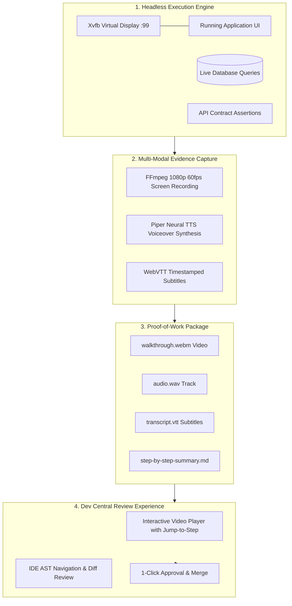

# Autonomous E2E-Driven Dev with 1080p Video Proof-of-Work
{: .no_toc }

How RobOS eliminates AI hallucinations and developer review fatigue by generating deterministic end-to-end verification evidence, 1080p recorded video walkthroughs, and synchronized neural voiceovers for every code change.
{: .fs-6 .fw-300 }

## Table of contents
{: .no_toc .text-delta }

1. TOC
{:toc}

---

## The Strategic Advantage: Ending Review Fatigue & "Trust Me" Claims

The single greatest bottleneck in AI-assisted software development is **Verification & Review Fatigue**:
- Autonomous coding agents output enormous walls of text and diffs claiming *"I have implemented the requested feature and all tests pass!"*
- When the human developer tests the branch, they discover that buttons don't click, modals render off-screen, API response formatting is mismatched, or the database migration failed to apply.
- To verify a change, the developer must spend 20 to 30 minutes manually checking out the branch, installing dependencies, seeding database fixtures, starting services, and manually clicking through the application.

**RobOS introduces the Proof-of-Work Governance Standard:**

> **In RobOS, no pull request or feature branch reaches human review without automated, verifiable, and visually recorded proof that the code actually works.**

Whenever an autonomous agent implements a task, it executes an End-to-End Driven Development (EDD) loop inside an isolated virtual display. It interacts with real DOM elements, submits forms, verifies database mutations, and records a crisp **1080p video walkthrough accompanied by an offline neural voiceover (Piper TTS) and synchronized WebVTT subtitles**. The lead architect watches a 30-second video demonstrating the running application, transforming code review from an exhausting chore into a rapid, confident approval.

<div style="margin: 2rem 0; border: 1px solid #1e293b; border-radius: 12px; overflow: hidden; background: #0b101b; box-shadow: 0 10px 40px rgba(0,0,0,0.6);">
  
  <div style="padding: 0.75rem 1.25rem; font-size: 0.85rem; color: #94a3b8; border-top: 1px solid #1e293b; background: #0d1424; text-align: center;">
    <strong>Video Proof-of-Work Flowchart</strong>: From task goal through headless DOM assertions and neural voiceovers to 30-second human reviews. <em>(Click image to zoom full screen)</em>
  </div>
</div>

---

## The 4-Stage Proof-of-Work Pipeline



### 1. Deterministic Multi-Layer Assertions
The test harness (`packages/robos-test`) runs deterministic assertions across every architectural layer:
- **UI Layer**: Asserts element visibility, text contents, input field values, button click states, and modal transitions.
- **Data Layer**: Executes direct SQL or NoSQL queries against the test database to assert that records were created or modified with the expected values.
- **Contract Layer**: Verifies that outgoing HTTP/gRPC network calls adhere strictly to OpenAPI and Protobuf schemas.

### 2. Headless 1080p Video Recording (FFmpeg)
Inside the `Xvfb` virtual display, **FFmpeg** captures high-definition 1080p video at 60 frames per second:
- Smooth cursor movements and visual click ripples demonstrate exact user interactions.
- Window resizing, dropdown menus, and CSS transitions render with complete visual fidelity.
- Produces lightweight, highly compressed **WebM** video files that load instantaneously.

### 3. Local Offline Neural Voiceovers (Piper TTS)
To make video walkthroughs accessible and immediately understandable, RobOS embeds **Piper TTS**, an ultra-fast, local neural text-to-speech engine:
- The AI agent authors a step-by-step narration script describing what the test is doing and why.
- Piper synthesizes a natural, pleasant voiceover in under 2 seconds completely offline without third-party cloud API latency or costs.
- Automatically generates synchronized **WebVTT** subtitle tracks aligned with the video timeline.

### 4. Step-by-Step Historical Walkthrough Archive
Every recorded walkthrough is archived permanently in the local GitOps directory:
```
~/.robos/development/walkthroughs/<feature-slug>/
├── walkthrough.webm        # 1080p video demonstration
├── audio.wav               # Neural voiceover audio
├── transcript.vtt          # Synchronized subtitles
├── summary.md              # Markdown breakdown with step timestamps
└── history/                # Timestamped historical snapshots
    └── 2026-09-08T08-30/
```

---

## The Dev Central Review Experience: 30-Second Approvals

In **RobOS Dev Central** (`packages/dev-central`), pull requests are presented with an embedded, interactive **Proof-of-Work Player**:

- **Synchronized Video & Subtitles**: The lead architect watches the application interactively perform the requested user flow.
- **Jump-to-Step Navigation**: Clicking any step in the markdown checklist jumps the video directly to that assertion's timestamp.
- **AST-Aware Review**: Developers can review the diffs in the PR Platform, or launch the branch into **IntelliJ IDEA** or **VS Code** with full AST navigation, symbol lookup, and local debugging tools.
- **1-Click Merge**: If the video proof and diff look solid, one click merges the branch and dispatches deployment.

---

## Next Steps

- **[Explore All 10 RobOS Big Wins]({{ site.baseurl }})**: Return to the Big Wins executive overview.
- **[100% Declarative GitOps Storage]({{ site.baseurl }})**: Learn how visual topologies compile into cloud-ready Kubernetes manifests.
- **[Unified Data Sources Management]({{ site.baseurl }})**: Discover RobOS's integrated relational and NoSQL database suite.
- **[Real-World Walkthroughs]({{ site.baseurl }})**: Watch recorded video walkthroughs and view sample test suites.
- **[💡 Explore the Ideas Store on GitHub](https://github.com/nddipiazza/robos/tree/main/docs/ideas)**: View raw idea dumps, community feature proposals, and structured architecture specs.

