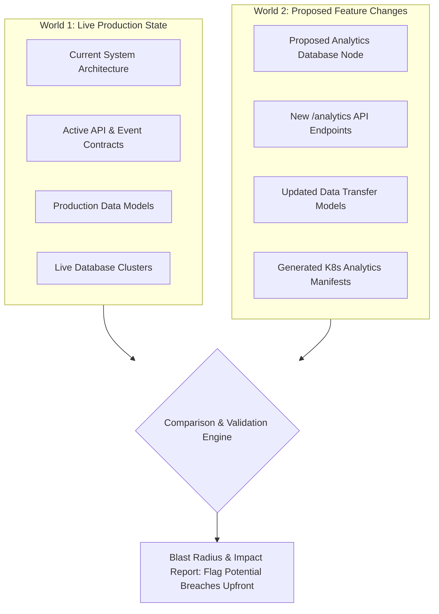
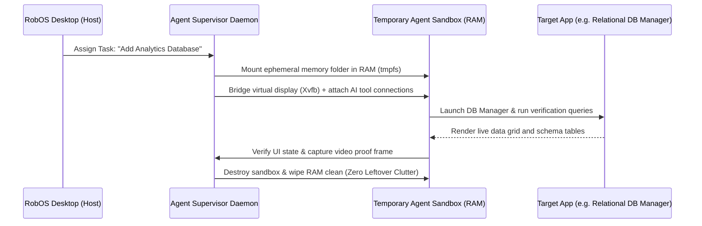
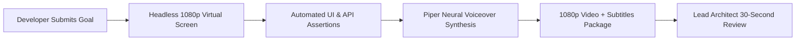

# The 4 Architectural Pillars of RobOS
{: .no_toc }

The core engineering innovations that transform software development from manual typing bottlenecks into Knowledge Graph-First generation and agent review.
{: .fs-6 .fw-300 }

## Table of contents
{: .no_toc .text-delta }

1. TOC
{:toc}

---

## Overview

RobOS is built around 4 architectural pillars that separate a true AI-first developer operating system from traditional coding assistants and disconnected extensions:

<h3 style="margin-top: 0; color: #00bcd4;">🧠 1. Dual-State Living Architecture & KGraph Generation</h3>

RobOS maintains a linked knowledge graph comparing <strong>World 1 (Live Production)</strong> against <strong>World 2 (Your Feature Branch)</strong>. It serves as both the master blueprint from which applications are auto-generated and the semantic engine calculating the exact blast radius of every change across microservices, schemas, and contracts <em>before</em> any code is merged.

<h3 style="margin-top: 0; color: #8b5cf6;">👤 2. Ephemeral In-Memory Agent Sandboxes</h3>

AI agents run in isolated Linux profiles mounted in high-speed RAM (<code>tmpfs</code>) on private virtual X11 displays. When the task finishes, the memory is wiped clean with zero leftover temporary files, stray ports, or rogue background processes.

<h3 style="margin-top: 0; color: #10b981;">🎥 3. Automated Video Proof-of-Work</h3>

No code change reaches human review without automated visual proof. Agents run end-to-end verifications, click real buttons, query real databases, and record 1080p narrated videos so you can review complex features in under 30 seconds.

<h3 style="margin-top: 0; color: #f59e0b;">⚡ 4. Zero-YAML Declarative GitOps</h3>

System topology, data sources, and contracts are saved in clean, human-readable Git files under <code>.robos/</code>. Adding a database or service to your visual architecture automatically synthesizes ready-to-deploy <strong>Kubernetes manifests and Helm charts</strong>.

---

## Pillar 1: Dual-State Living Architecture (Today vs. Tomorrow)

Traditional code editors only understand plain text files in a single folder. RobOS maintains an executable, connected architecture knowledge graph based on **OASIS OSLC 3.0** and **W3C JSON-LD**:

### Key Capabilities
- **World 1 (Live Production `main`)**: Tracks deployed services, active API contracts, and live database tables.
- **World 2 (Feature Branch)**: Models what the system will look like once your pull request or spike is merged.
- **KGraph as Master Blueprint**: Just as OpenAPI contracts generate API clients, the KGraph node defines application archetypes (Microservices, Desktop Apps, CLIs, Mobile Apps, Pipelines, Libraries) from which full applications are auto-generated.
- **Automated Blast Radius**: When an AI agent or developer modifies an endpoint or schema, RobOS immediately flags which downstream services, mobile apps, or web frontends are affected before coding even begins.
- **Continuous Documentation Sync**: When architecture nodes change, RobOS automatically prompts and synchronizes system documentation (`docs/`) and training curriculums in lockstep.

---

## Pillar 2: Ephemeral In-Memory Agent Sandboxes (Zero Machine Clutter)

Instead of letting agents execute commands directly in your primary desktop user account, RobOS dynamically spawns **hermetic, disposable agent sandboxes**:

### Key Capabilities
- **Zero-Residue Storage**: Agent workspaces live entirely in high-speed RAM (`tmpfs`). When a task is complete or cancelled, the memory is reclaimed instantly. No orphaned `node_modules`, stray Docker containers, or lingering cache files.
- **Virtual Display Isolation**: Automated visual tests run on private headless displays (`Xvfb + Picom`), leaving your active monitor completely uninterrupted.
- **Live DOM & UI Inspection**: Dedicated debug ports (`19100–19183`) allow agents to inspect real DOM trees and verify user interfaces with sub-pixel precision.
- **Credential Protection**: Agents operate under scoped ephemeral user accounts, shielding your private SSH keys, GPG keys, and personal shell configurations.

---

## Pillar 3: Automated Video Proof-of-Work (AI Proves Its Code Works)

In RobOS, no code reaches human review on trust alone. Every pull request comes with an automated, verifiable **proof-of-work package**:

### Key Capabilities
1. **Deterministic Assertions**: The test fabric waits for real DOM elements, tests interactive forms, queries live databases, and verifies HTTP status codes.
2. **Synchronized 1080p Video**: Records a smooth 1080p video demonstrating the application running end-to-end.
3. **Local Neural Voiceovers**: Generates spoken explanations using offline, private neural text-to-speech (Piper TTS) with synchronized WebVTT subtitles.
4. **Fast Approvals**: Lead architects watch a 30-second video walkthrough rather than spending 20 minutes manually cloning, building, and seeding test data.

---

## Pillar 4: Zero-YAML Declarative GitOps

RobOS stores your entire architecture in standard, human-readable Git files under `.robos/`. When you design or modify services visually, RobOS manages the underlying infrastructure automatically:

### Key Capabilities
- **Instant Cloud Manifests**: Adding a PostgreSQL, MySQL, Redis, or Kafka node to the visual architecture canvas generates ready-to-deploy Kubernetes StatefulSets, Deployments, and Helm charts.
- **Local & Enterprise Clusters**: Connect to local Kind clusters for instant development, or target enterprise clouds (AWS EKS, Google Cloud GKE, Azure AKS) with real-time pod log streaming and ArgoCD GitOps sync.
- **Git-Backed API Testing**: API endpoints and test suites are stored directly in your repository as plain-text files, versioned alongside your application code.
- **No Vendor Lock-In**: Everything is backed by open formats: `.robos/knowledge-graph.jsonld`, `.robos/topology.yaml`, `.robos/packages.yaml`, and `.robos/teams.yaml`.

---

## Next Steps

- **[Installation & Getting Started]({{ site.baseurl }})**: Set up RobOS on your workstation.
- **[System Architecture]({{ site.baseurl }})**: Learn how the internal engine and desktop bridges operate under the hood.
- **[Browse 30+ Apps]({{ site.baseurl }})**: Explore the full suite of native desktop applications.
