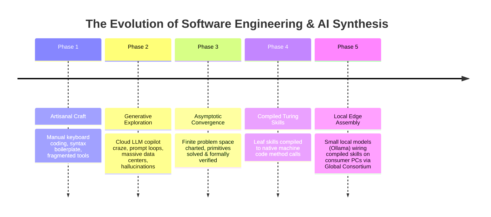
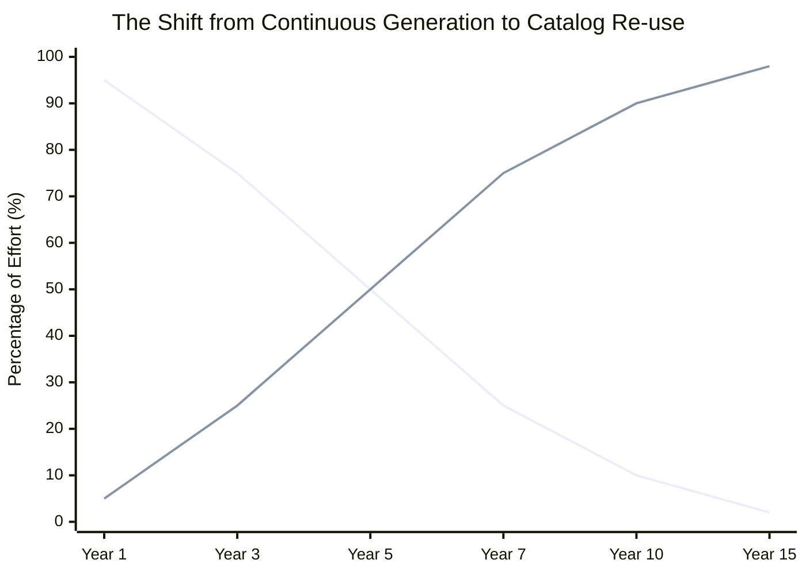

# The Future of Software Development: Turing Skills, Compiled Machine Code & Local Edge Assembly
{: .no_toc }

A vision for the post-cloud era of engineering: transitioning from continuous data center prompt loops to a planetary commons of standardized, Turing machine-inspired skills—where verified leaf primitives are compiled down to native machine code and assembled into complete applications directly on consumer hardware using local models.
{: .fs-6 .fw-300 }

<div style="margin: 1.5rem 0 2rem; padding: 1.25rem; background: #161b22; border: 1px solid #30363d; border-radius: 8px; display: flex; flex-wrap: wrap; align-items: center; justify-content: space-between; gap: 1rem;">
  <div>
    <h3 style="margin: 0 0 0.5rem; color: #58a6ff; font-size: 1.15rem;">Beyond the Data Center Treadmill</h3>
    <p style="margin: 0; color: #8b949e; font-size: 0.92rem;">Why re-generating the same algorithms a billion times a day in hyperscaler clouds is a transient phase—and how software reaches a deterministic, compiled, and air-gapped equilibrium.</p>
  </div>
  <a href="{{ site.baseurl }}" class="btn btn-primary">Explore Current RobOS Skills →</a>
</div>

## Table of contents
{: .no_toc .text-delta }

1. TOC
{:toc}

---

## 1. Executive Vision: The Finite Horizon of Code Generation

Today, the software industry is caught on a **data center treadmill**. Every developer keystroke or feature request triggers queries to massive 70B+ or 400B+ parameter models running in centralized, multi-megawatt hyperscaler clusters. These models consume enormous energy and introduce round-trip network latency, recurrent token fees, vendor lock-in, and unpredictable hallucinations—frequently to regenerate the exact same sorting routines, HTTP handlers, cryptographic wrappers, or SQL queries that have already been written millions of times.

This approach treats software generation as an unending, stochastic guessing game.



RobOS envisions a different trajectory—an **asymptotic convergence** where software engineering evolves through three distinct laws of technological maturation:

1. **The Asymptotic Horizon of Primitive Problems**: Every foundational computational problem (parsing a protocol, traversing a tree, validating a shape, ciphering a payload, rendering a button widget) is finite. Over time, as global developer swarms and generative models explore every domain, every conceivable leaf capability will be solved, verified, and hardened.
2. **The Machine-Code Compilation Boundary**: Once an atomic capability is solved and verified, it must never be re-prompted or interpreted through an expensive neural network again. It should be compiled down to deterministic, native machine code (`.so`, `.dylib`, ELF, or WebAssembly AOT) and invoked like a standard, zero-overhead method call.
3. **Local Edge Assembly Without Data Centers**: When every leaf primitive exists as verified machine code with strict typed inputs and outputs, consumer hardware running lightweight, open-weight models (e.g. Ollama, llama.cpp, 3B–8B local models) can assemble, route, and wire together complete, functional applications locally. No hyperscaler clouds. No recurring subscriptions. No data center egress.

---

## 2. Standardized Turing Machine-Inspired Skill Repositories

To make skills mechanically composable, they cannot remain informal prose prompts or vendor-specific chat instructions. They must be grounded in formal computation theory: the **Turing Machine**.

A classic Turing machine consists of a tape divided into discrete cells, a head that reads and writes symbols, a state register storing the finite state, and a deterministic finite state transition function:

$$\delta: Q \times \Gamma \rightarrow Q \times \Gamma \times \{L, R\}$$

In the RobOS future architecture, every skill is structured as a **Standardized Turing Skill**:

```mermaid
flowchart LR
    subgraph TuringSkill["Standardized Turing Skill (Formal Specification)"]
        direction TB
        INPUT["Input Tape<br/><code>Strict OSLC / JSON-LD / TypeSpec</code>"]
        STATE["State Machine & Invariants<br/><code>Hermetic Context & Pre-conditions</code>"]
        EXEC["Deterministic Transition<br/><code>Leaf Execution Unit</code>"]
        OUTPUT["Output Tape<br/><code>Strict Return Schema & Post-conditions</code>"]

        INPUT --> STATE
        STATE --> EXEC
        EXEC --> OUTPUT
    end

    CALLER["Caller / Orchestrator"] -->|Provides Typed Payload| INPUT
    OUTPUT -->|Emits Deterministic Value| RESULT["Next State / Caller"]

    style TuringSkill fill:#0d1424,stroke:#38bdf8,stroke-width:2px;
    style EXEC fill:#1e293b,stroke:#10b981,stroke-width:2px;
```



### The 4 Formal Pillars of a Turing Skill

| Element | Turing Analogue | RobOS Skill Implementation | Guarantee |
|:---|:---|:---|:---|
| **Input Tape** | Input Alphabet $\Sigma$ & Tape Symbols $\Gamma$ | Formally typed, schema-validated input contract (W3C JSON-LD, SHACL shape, or TypeSpec contract). | Zero ambiguous arguments. Rejects malformed invocations before execution starts. |
| **State Register & Invariants** | Finite Set of States $Q$ | Hermetic, reproducible execution context with explicit pre-conditions and environmental bounds. | No hidden global state; zero side-effect leakage outside declared boundaries. |
| **Transition Function** | Transition Rule $\delta$ | The algorithmic logic mapping input and current state to the next state and output payload. | Deterministic execution paths with provable invariants. |
| **Output Tape & Halting** | Halting States $q_{accept}, q_{reject}$ | Strongly typed return schema with explicit success/error invariants and formal bounds on step count / runtime. | Provable termination guarantees; eliminates infinite loops and runaway agent processes. |

### Hierarchical Decomposition: Meta-Skills Down to Leaf Primitives

Skills form a strict directed acyclic graph (DAG):

- **Composite / Workflow Skills**: High-level orchestrators that decompose large user intentions (e.g., *"Deploy an encrypted multi-tenant billing service with stripe webhooks"*).
- **Sub-Workflow Skills**: Mid-level pipelines (e.g., *"Validate OAuth token and provision tenant schema"*).
- **Leaf Skills (Atomic Primitives)**: Irreducible, pure computational units (e.g., *"Compute SHA-256 HMAC of UTF-8 buffer"*, *"Parse OpenAPI 3.1 YAML AST"*, *"Derive Ed25519 public key from seed"*).

It is at the **Leaf Skill level** where the compilation breakthrough occurs.

---

## 3. The Compilation Boundary: Turning Leaf Skills into Machine Code

In traditional AI workflows, an agent calls a tool by serializing JSON over a socket to a Python or Node.js interpreter, or worse, re-synthesizes the entire routine in code from scratch. This introduces multiple layers of overhead: prompt tokenization, LLM sampling latency, JSON serialization, process spawn overhead, and runtime interpretation.

The RobOS future establishes a rigorous **Compilation Boundary**:

> **The Law of Leaf Compilation**: Once an atomic leaf skill's Turing contract is satisfied and passes automated formal verification, it is compiled into **native machine code** and exported through a standard C-Application Binary Interface (C-ABI) or ahead-of-time WebAssembly (Wasm AOT) module.

```mermaid
flowchart TD
    A["Raw Idea / Problem Statement"] --> B["LLM Synthesis & Exploration<br/><i>(Generative Phase)</i>"]
    B --> C["Formal Verification & BDD Proof<br/><i>(Headless Xvfb / Test Harness)</i>"]
    C -->|Fails Tests| B
    C -->|100% Proven| D["Turing Machine Formalization<br/><i>(Typed Input/Output Schemas)</i>"]
    D --> E["Compiler Pipeline<br/><i>(Rust / C / LLVM / Wasm AOT)</i>"]
    E --> F["Native Machine Code Leaf Skill<br/><code>.so / .dylib / ELF / Wasm</code>"]
    F --> G["Global Consortium Registry<br/><i>(Cryptographically Signed Binary)</i>"]

    style F fill:#064e3b,stroke:#10b981,stroke-width:2px;
    style G fill:#1e1b4b,stroke:#818cf8,stroke-width:2px;
```



### From Interpretation to Direct Method Invocations

When compiled to native machine code:
1. **Sub-Microsecond Invocations**: Invoking a compiled leaf skill is literally a C-ABI method call (`dlopen` / `dlsym` / dynamic link / Wasm linear memory call). Execution takes nanoseconds or microseconds rather than hundreds of milliseconds.
2. **Zero Hallucination Risk**: Machine code cannot hallucinate. It executes the exact compiled assembly instructions validated against its formal Turing specification.
3. **Hermetic Memory Safety**: Compiled leaf skills operate in bounded memory spaces with explicit allocations, preventing buffer overflows and machine pollution.
4. **Universal Interoperability**: Whether the surrounding application is written in Go, Rust, C, Python, JavaScript, or Zig, the compiled leaf skill links seamlessly without language runtime impedance.

```c
/* Standardized C-ABI Leaf Skill Export */
typedef struct {
    const uint8_t* payload_ptr;
    size_t payload_len;
    const char* schema_uri;
} RobOSTuringTape;

typedef struct {
    uint32_t status_code;
    const uint8_t* result_ptr;
    size_t result_len;
    const char* error_msg;
} RobOSTuringResult;

/* Direct Machine-Code Invocation: Zero LLM Overhead */
RobOSTuringResult robos_leaf_skill_execute(
    const char* skill_id, 
    const RobOSTuringTape* input_tape
);
```

---

## 4. Local Edge Assembly via Consumer Hardware (Zero Data Centers)

When thousands of verified leaf skills are already pre-compiled into native machine code, the role of Large Language Models changes completely.

### The Misallocation of Cloud LLMs Today
Currently, we ask massive cloud LLMs to act as **typists**—spending millions of GPU cycles predicting tokens character by character:
```
function calculateTax(amount, rate) {
    if (typeof amount !== 'number' || typeof rate !== 'number') {
        throw new Error('Invalid input');
    ...
```
This is an enormous waste of computational capacity. An LLM should not be asked to generate standard syntax boilerplate that has existed for decades.

### The Local Model as an Assembler & Linker
In the future architecture, an open-weight model running on consumer hardware (via **Ollama**, **llama.cpp**, or native Apple Silicon / desktop GPU runtimes) does not generate raw source code character-by-character. 

Instead, the local model acts as a **Semantic Graph Linker**:

```mermaid
flowchart TB
    USER["User Request<br/><i>'Build a private, encrypted sync daemon for my SQLite databases'</i>"] --> LOCAL_LLM["Local Open-Weight Model<br/><i>(Ollama / llama.cpp on Consumer PC)</i>"]
    
    subgraph EdgeDevice["Local Consumer Workstation (Offline / Air-Gapped)"]
        LOCAL_LLM --> ARCH["1. Synthesizes Application Topology<br/><i>(Nodes, Dataflow, Inputs/Outputs)</i>"]
        ARCH --> RESOLVER["2. Skill Registry Lookup & Contract Matcher<br/><i>(Local Turing Skill Cache)</i>"]
        
        subgraph SkillRepo["Local Pre-Compiled Skill Cache"]
            S1["Compiled Leaf Skill: SQLite WAL Ingest<br/><code>[lib_sqlite_ingest.so]</code>"]
            S2["Compiled Leaf Skill: ChaCha20-Poly1305 Encrypt<br/><code>[lib_chacha_encrypt.so]</code>"]
            S3["Compiled Leaf Skill: Noise Protocol Handshake<br/><code>[lib_noise_transport.so]</code>"]
            S4["Compiled Leaf Skill: P2P mDNS Discovery<br/><code>[lib_mdns_peer.so]</code>"]
        end
        
        RESOLVER --> S1
        RESOLVER --> S2
        RESOLVER --> S3
        RESOLVER --> S4
        
        LINKER["3. RobOS Local Native Linker"]
        S1 --> LINKER
        S2 --> LINKER
        S3 --> LINKER
        S4 --> LINKER
        
        LINKER --> RUNTIME["4. Running, Fully-Compiled Native Application<br/><i>(Sub-millisecond latency, zero cloud dependencies)</i>"]
    end

    style EdgeDevice fill:#0b101b,stroke:#0284c7,stroke-width:2px;
    style RUNTIME fill:#064e3b,stroke:#10b981,stroke-width:2px;
```



### Why Local Hardware Can Assemble Any Conceivable Application

1. **Massive Token Reduction**: Instead of generating 100,000 tokens of fragile JavaScript or Python, the local model generates a compact **wiring manifest** of 200–500 tokens specifying which compiled leaf skills to link together and how their input/output tapes connect.
2. **Accessible to 3B–8B Parameter Models**: You do not need a trillion-parameter cluster to solve graph matching and type routing. A quantized 3B–8B model running on a consumer laptop CPU, an M-series Mac, or a budget GPU handles topological wiring with near-100% precision.
3. **Instantaneous Synthesis**: Because compilation of leaf skills was already done ahead of time by the global consortium, assembly takes seconds, not hours of iterative debugging.
4. **Zero-Trust Privacy & Absolute Air-Gap**: Application creation and execution occur entirely on-premise. Sensitive intellectual property, health data, financial ledgers, and proprietary trade secrets never traverse the public internet.

---

## 5. The Asymptotic Endpoint: When LLMs Have Solved Every Problem

A fundamental philosophical shift underpins this vision:

> **The Finite Primitive Hypothesis**: The set of primitive computational problems required to construct all conceivable software applications is asymptotically finite.



### The 3 Stages of the Transition

1. **Stage 1: Generative Exploration (The Present)**  
   Developers use cloud LLMs like Claude, GPT, and Gemini to explore new problem domains, experiment with prompt formulations, and write code from scratch. Novel solutions are discovered, but most effort is wasted re-solving solved problems.
2. **Stage 2: Systematic Formalization & Compilation (The Bridge)**  
   RobOS, open repositories, and autonomous verification sandboxes capture working solutions, strip away stochastic variance, formalize them as Turing skills with typed schemas, and compile them into native machine-code libraries.
3. **Stage 3: Equilibrium & The Planetary Commons (The Destination)**  
   Virtually every primitive computational problem has an optimal, formally verified, pre-compiled leaf skill in existence. At this point, generative LLM exploration is reserved only for frontier science, novel hardware paradigms, or brand-new mathematical conjectures. Daily application engineering becomes **deterministic assembly**.

---

## 6. The Global Consortium: A Planetary Commons of Compiled Skills

How is this vast repository of compiled skills governed, secured, and distributed without falling into the hands of a single proprietary corporate monopolist?

The answer is a **Global Open Source Consortium**: an open, decentralized federation operating under peer-reviewed open governance (similar to the Linux Foundation, W3C, and IETF).

```mermaid
graph TD
    subgraph Consortium["Global Consortium & Decentralized Registry"]
        SPEC["Turing Skill Standard Specification<br/><i>(OASIS OSLC / W3C JSON-LD)</i>"]
        ORACLE["Distributed Verification Oracles<br/><i>(Headless Matrix Testing & SHACL Proofs)</i>"]
        REGISTRY["Content-Addressed Binary Artifact Store<br/><i>(IPFS / Git / BitTorrent / Signed Mirrors)</i>"]
        CRYPTO["Ed25519 Cryptographic Signatures & SBOMs<br/><i>(Sigstore / in-toto Attestations)</i>"]
    end

    DEV["Developer / Squad / Edge AI"] -->|Submits New Leaf Skill Spec| SPEC
    SPEC --> ORACLE
    ORACLE -->|Generates Formal Proof| CRYPTO
    CRYPTO --> REGISTRY

    LOCAL_PC["Local Workstations (RobOS)"] -->|Pulls Signed Machine Code Primitives| REGISTRY
    LOCAL_PC -->|Assembles Offline via Ollama| RUN["Native Applications"]

    style Consortium fill:#0f172a,stroke:#6366f1,stroke-width:2px;
    style LOCAL_PC fill:#0b101b,stroke:#0284c7,stroke-width:2px;
```



### Core Principles of the Consortium

1. **Open, Royalty-Free Standards**: All Turing skill schemas, interface definitions, and calling conventions are published under permissive, royalty-free open standards.
2. **Reproducible, Hermetic Builds**: Every compiled binary artifact must be bit-for-bit reproducible from its declared source across target architectures (`x86_64`, `aarch64`, `riscv64`, `wasm32`).
3. **Cryptographic Provenance & Proofs of Work**: Every binary in the registry carries an immutable cryptographic attestation (in-toto / Sigstore) proving that it passed comprehensive test suites and conforms 100% to its W3C SHACL shape constraints.
4. **Federated & Air-Gappable Mirrors**: Organizations and sovereign entities can mirror the entire global registry locally—meaning a company or country can develop software indefinitely with zero external dependencies.

---

## 7. How RobOS Builds the Foundation Today

This future is not science fiction—it is the direct logical extension of architectural decisions already implemented in RobOS today:

| Future Requirement | How RobOS Implements the Foundation Today |
|:---|:---|
| **Standardized Skill Structure** | The **RobOS Skills Standard** (`plugins/robos/skills/` and `.agents/skills/`) uses portable, structured `SKILL.md` documents with validated YAML metadata and parameter contracts. |
| **Strict Typed Schemas** | RobOS models all SDLC entities using **W3C JSON-LD**, **OASIS OSLC 3.0**, and **91+ W3C SHACL shape constraints** in Modular KGraph Packages (`.robos/kgraphs/`). |
| **Hermetic Verification** | RobOS provides containerized headless testing using **Xvfb virtual framebuffers**, DOM snapshot inspection, and automated neural voiceover walkthroughs. |
| **Knowledge Graph-First Assembly** | RobOS's core premise—**"Build the KGraph, and full applications become auto-generated"**—proves that software can be synthesized from semantic relationship graphs rather than manual typing. |
| **Offline, Local-First Execution** | RobOS stores all data in plain-text files in your local Git repository (`.robos/`) with zero plaintext secrets (backed by UNIX `pass` GPG store), running fully offline on local workstations. |

---

## 8. Summary: The Inevitable Destination

Software development is about to undergo its third great transition:

- **First Transition (1950s–1970s)**: From raw manual machine-code switches to human-readable high-level compilers (Fortran, C).
- **Second Transition (1980s–2020s)**: From isolated personal scripts to modular libraries, open-source package managers, and cloud infrastructure.
- **Third Transition (Present–Future)**: From artisanal typing and non-deterministic cloud prompt loops to **standardized Turing skills, compiled machine code primitives, and local edge assembly powered by a global consortium.**

RobOS exists to lead this transformation: empowering human developers to step into their true role as **Lead System Architects**, while local, private, and deterministic machines handle the assembly of the world's software.

---

## Next Steps & Related Reading

- **[RobOS Skills Standard & Complete Catalog]({{ site.baseurl }})**: Learn how RobOS packages vendor-agnostic AI agent capabilities today.
- **[RobOS Product Roadmap]({{ site.baseurl }})**: Review the near-term and medium-term tactical initiatives currently in development.
- **[SDLC Knowledge Graph Architecture]({{ site.baseurl }})**: Understand how semantic linked data and SHACL validation drive application synthesis.
- **[RobOS Main Wins]({{ site.baseurl }})**: Explore the core innovations that set RobOS apart from traditional IDEs.
- **[💡 Explore the Ideas Store on GitHub](https://github.com/nddipiazza/robos/tree/main/docs/ideas)**: Propose new feature specifications and join the discussion.
