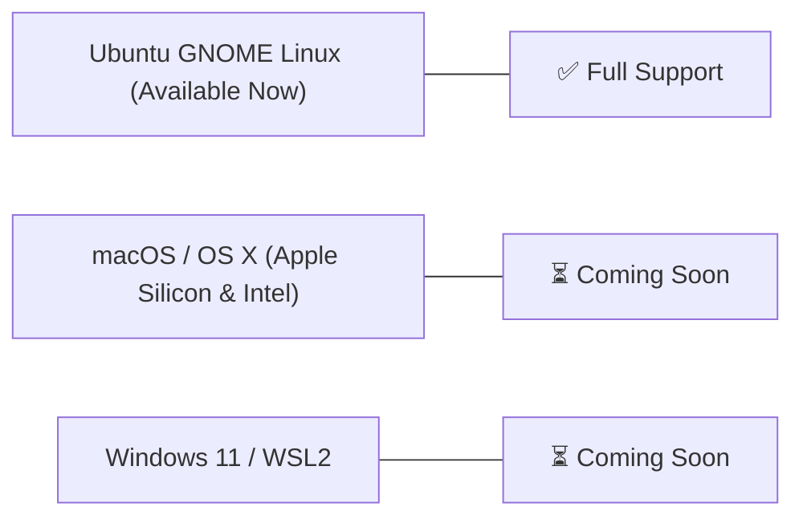

# Installation & Getting Started
{: .no_toc }

Install RobOS directly on your existing Ubuntu GNOME desktop, flash the full RobOS Ubuntu Developer OS Distro to bare metal or a VM, or explore upcoming cross-platform desktop packages.
{: .fs-6 .fw-300 }

## Table of contents
{: .no_toc .text-delta }

1. TOC
{:toc}

---

## Primary Option: Install on Current Ubuntu GNOME Desktop

If you already run an **Ubuntu Linux (22.04 LTS, 24.04 LTS, or 26.04)** workstation with the GNOME desktop environment, you can install the complete RobOS desktop suite, app launchers, system tray daemons, and shared libraries directly onto your existing machine with a single setup command.

### 1. Prerequisites
- **Ubuntu Linux** with GNOME desktop
- **Node.js 20+** and **npm** (`sudo apt install -y nodejs npm` or via `nvm`)
- **Git**, **curl**, and **build-essential**

### 2. One-Line Desktop Installation
```bash
# Clone the RobOS repository
git clone https://github.com/nddipiazza/robos.git
cd robos

# Audit & install dev machine dependencies
node scripts/install-dev-deps.js

# Install all 30+ apps, .desktop entries, and shared libraries to /usr/local/share/robos/
sudo bash packages/desktop-shell/install.sh
```

### 3. Launching Applications
Once installed, all RobOS applications appear directly in your standard GNOME App Launcher, application grid, and system menu. You can also launch any application directly from the CLI or dev harness:

```bash
# Launch Dev Central daily command center
node packages/robos-test/lib/harness.js --app dev-central

# Launch Relational DB Manager
node packages/robos-test/lib/harness.js --app db-manager

# Launch System Topology Studio
node packages/robos-test/lib/harness.js --app topology-manager

# Launch Bruno REST API Client
node packages/robos-test/lib/harness.js --app rest-client
```

---

## Option 2: Install Full RobOS Ubuntu OS Distro (Bare Metal & VM)

For a dedicated, fully provisioned AI engineering workstation, RobOS provides a complete Ubuntu 26.04 LTS OS image with automated first-boot cloud-init provisioning, LightDM auto-login, Tilix terminal, dark navy/cyan theme, and ephemeral agent session daemons.

### A. Bare Metal Deployment (Flash via Rufus / Etcher / dd)
1. Download the latest `robos-v0.1.0.iso` from [GitHub Releases](https://github.com/nddipiazza/robos/releases).
2. Write to a USB flash drive:
   - **Windows**: Use [Rufus](https://rufus.ie/) (Select GPT partition scheme and UEFI target).
   - **macOS / Linux**: Use [balenaEtcher](https://etcher.balena.io/) or standard `dd`:
     ```bash
     sudo dd if=robos-v0.1.0.iso of=/dev/sdX bs=4M status=progress conv=fsync
     ```
3. Insert the USB drive into your PC / ThinkPad, boot into UEFI, and let cloud-init configure the environment.
4. Default credentials: `robos` / `robos`.

### B. Virtual Machine Deployment (QEMU / KVM)
```bash
# Build the sparse disk image + cloud-init ISO
infra/desktop/build.sh

# Run VM (16GB RAM, all host CPUs, SSH on port 2224, VNC on port 5910)
infra/desktop/run.sh

# Connect via SSH
ssh -p 2224 robos@localhost
```

---

## Option 3: Cross-Platform Desktop App Suite (Windows & macOS Coming Soon)

RobOS applications are built using pure Electron and vanilla JavaScript with zero framework overhead, making them inherently cross-platform.



### 🍎 macOS / OS X Support (Coming Soon)
- **Native Apple Silicon & Intel Packages**: Universal `.dmg` installers and Homebrew Cask distribution (`brew install --cask robos-desktop`).
- **macOS Menu Bar Widget**: System-wide status item in the top macOS menu bar with instant task switching and AI standup notifications.
- **Darwin IPC & Keychain**: Native integration with macOS Keychain for GPG/SSH secret vaults.

### 🪟 Windows Support (Coming Soon)
- **Windows 11 Installer & AppX**: One-click MSI installer and Windows Package Manager (`winget install RobOS.Desktop`).
- **WSL2 Integration**: Ephemeral agent sessions execute inside lightweight WSL2 Linux containers with zero-residue tmpfs RAM mounts while bridging to native Windows GUI windows.
- **Windows Terminal & Taskbar**: Native jumplists and system tray widgets.

---

## First-Run Onboarding & AI Provisioning

When you first launch RobOS or log into the desktop, the **Unified Setup & Onboarding Wizard** guides you through:

1. **Security & GPG Keys**: Initializing the GPG key store and SSH identity for GitHub / Gitea servers.
2. **AI Model & MCP Configuration**: Connecting your AI API keys (Anthropic Claude, Google Antigravity/Gemini, OpenAI) and authenticating Model Context Protocol (MCP) servers with OAuth flows.
3. **Task Server & Git Workspace**: Connecting your Jira or GitHub issue trackers and checking out target project repositories.
4. **Knowledge Graph Initialization**: Synthesizing the dual-state SDLC graph in `.robos/knowledge-graph.jsonld`.

---

## Testing & Verifying Applications

Run the containerized headless test suite or local scenario walkers:

```bash
# Run full automated test suite inside Docker container with Xvfb
./scripts/e2e-container.sh

# Run unit & scenario tests
npm --prefix packages/robos-test test

# Run developer tools test suite
xvfb-run -a node --test packages/robos-test/tests/developer-tools/developer-tools-suite.test.js

# Run full end-to-end topology & kubernetes lifecycle test
xvfb-run -a node --test packages/robos-test/tests/e2e/topology-db-kube-lifecycle.test.js
```

---

## Next Steps

- [**App Development Flow**]({{ site.baseurl }}) — Learn the progressive flow of RobOS apps used to build an application.
- [**System Architecture**]({{ site.baseurl }}) — Explore the 8-pillar SDLC architecture and Knowledge Graph.
- [**AI Agent Review-Based Development**]({{ site.baseurl }}) — Learn the plan-code-review-verify workflow.
- [**App Suite Catalog**]({{ site.baseurl }}) — Explore all 30+ applications.
- [**Master Walkthroughs**]({{ site.baseurl }}) — View recorded video walkthroughs and test proof-of-work.
