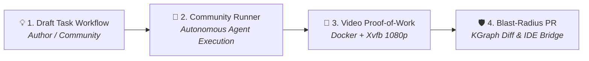

# 💡 RobOS Feature Ideas Store
{: .no_toc }

The open repository of community feature proposals, raw idea notes, structured architectural specifications, and implementation plans.
{: .fs-6 .fw-300 }

<div style="margin: 1.5rem 0 2rem; padding: 1.25rem; background: #161b22; border: 1px solid #30363d; border-radius: 8px; display: flex; flex-wrap: wrap; align-items: center; justify-content: space-between; gap: 1rem;">
  <div>
    <h3 style="margin: 0 0 0.5rem; color: #58a6ff; font-size: 1.15rem;">Browse the Complete Ideas Store on GitHub</h3>
    <p style="margin: 0; color: #8b949e; font-size: 0.92rem;">Inspect raw text dumps in the inbox, structured feature specifications, and approved project epics directly in the Git repository.</p>
  </div>
  <a href="https://github.com/nddipiazza/robos/tree/main/docs/ideas" class="btn btn-primary" target="_blank" rel="noopener">Open Ideas Store on GitHub ↗</a>
</div>

## Table of contents
{: .no_toc .text-delta }

1. TOC
{:toc}

---

## The Ideas Workflow Pipeline

RobOS turns rough thoughts into executable software blueprints through a 4-stage automated pipeline:

<div style="margin: 2rem 0; border: 1px solid #1e293b; border-radius: 12px; overflow: hidden; background: #0b101b; box-shadow: 0 10px 40px rgba(0,0,0,0.6);">
  
  <div style="padding: 0.75rem 1.25rem; font-size: 0.85rem; color: #94a3b8; border-top: 1px solid #1e293b; background: #0d1424; text-align: center;">
    <strong>RobOS Ideas & Specs Pipeline</strong>: 4-stage automated lifecycle from raw notes in inbox to structured specs, approved project epics, and verified software implementations. <em>(Click image to zoom full screen)</em>
  </div>
</div>

1. **Inbox / Raw Ideas ([`docs/ideas/inbox/`](https://github.com/nddipiazza/robos/tree/main/docs/ideas/inbox))**: Dump quick bullet points, voice recordings, raw user feedback, or terminal logs.
2. **Structured Feature Specs ([`docs/ideas/specs/`](https://github.com/nddipiazza/robos/tree/main/docs/ideas/specs))**: AI agents use the `create-feature-spec` skill to convert raw notes into formalized requirements, SHACL schema impacts, and architecture diagrams.
3. **Approved Plans ([`docs/project-plan/`](https://github.com/nddipiazza/robos/tree/main/docs/project-plan))**: Once reviewed, feature specs graduate into official development epics and phased task plans.
4. **Implementation & Proof-of-Work**: Agents execute in isolated sandboxes, producing code, consumer contract tests, and narrated 1080p video proofs.

---

## Active Feature Proposals & Specifications

| Feature Proposal | Raw Idea Note | Structured Feature Spec | Target Subsystems |
|:---|:---:|:---:|:---|
| **RobOS Desktop Agents** | [raw note](https://github.com/nddipiazza/robos/blob/main/docs/ideas/inbox/robos-desktop-agents.txt) | [feature spec](https://github.com/nddipiazza/robos/blob/main/docs/ideas/specs/robos-desktop-agents.md) | Linux OS Base, `robos-agent-session`, `desktop-agents` |
| **Dual-Context eLearning & Interactive Reviewer** | [raw note](https://github.com/nddipiazza/robos/blob/main/docs/ideas/inbox/robos-elearning-and-interactive-reviewer.txt) | [feature spec](https://github.com/nddipiazza/robos/blob/main/docs/ideas/specs/robos-elearning-and-interactive-reviewer.md) | `context-manager`, `robos-reviewer`, Chrome DevTools MCP |
| **Contract-Driven Project Graph & Agent Deployment Engine** | [raw note](https://github.com/nddipiazza/robos/blob/main/docs/ideas/inbox/robos-contract-driven-project-graph.txt) | [feature spec](https://github.com/nddipiazza/robos/blob/main/docs/ideas/specs/robos-contract-driven-project-graph.md) | `project-graph`, `robos-graph`, `dev-central` |
| **Unified RobOS Setup Assistant & AI Provisioner** | [raw note](https://github.com/nddipiazza/robos/blob/main/docs/ideas/inbox/robos-onboarding-setup-flow.txt) | [feature spec](https://github.com/nddipiazza/robos/blob/main/docs/ideas/specs/robos-onboarding-setup-flow.md) | `robos-onboarding`, `security-setup`, `git-login-manager` |
| **Ephemeral Agent User Profiles with Direct Host Display Bridging** | [raw note](https://github.com/nddipiazza/robos/blob/main/docs/ideas/inbox/ephemeral-agent-user-profiles.txt) | [feature spec](https://github.com/nddipiazza/robos/blob/main/docs/ideas/specs/ephemeral-agent-user-profiles.md) | `robos-profiled`, `packages/desktop-shell`, `agents-manager` |
| **Dev Central — AI Agent Review-Based Development Hub** | [raw note](https://github.com/nddipiazza/robos/blob/main/docs/ideas/inbox/dev-central-ai-agent-review-development.txt) | [feature spec](https://github.com/nddipiazza/robos/blob/main/docs/ideas/specs/dev-central-ai-agent-review-development.md) | `packages/dev-central`, `robos-agent-session`, IDE Plugin |
| **Dual-State SDLC Knowledge Graph & E2E-Driven Verification** | [raw note](https://github.com/nddipiazza/robos/blob/main/docs/ideas/inbox/dual-state-sdlc-knowledge-graph.txt) | [feature spec](https://github.com/nddipiazza/robos/blob/main/docs/ideas/specs/dual-state-sdlc-knowledge-graph.md) | Knowledge Graph Engine, Dev Central, Graph Studio |
| **Hermetic Gitea Git Forge for E2E Test Suite** | [raw note](https://github.com/nddipiazza/robos/blob/main/docs/ideas/inbox/e2e-gitea-support.txt) | [feature spec](https://github.com/nddipiazza/robos/blob/main/docs/ideas/specs/e2e-gitea-support.md) | Test Harness, `packages/robos-test`, Container Runner |
| **RobOS People & Groups — Multi-Cloud Identity & Guided OAuth** | [raw note](https://github.com/nddipiazza/robos/blob/main/docs/ideas/inbox/robos-people-groups-cloud-identity.txt) | [feature spec](https://github.com/nddipiazza/robos/blob/main/docs/ideas/specs/robos-people-groups-cloud-identity.md) | `people-directory`, `group-manager`, `robos-preferences` |
| **RobOS File Storage & MCP Agent-Driven File Sharing** | [raw note](https://github.com/nddipiazza/robos/blob/main/docs/ideas/inbox/robos-file-storage-and-agent-sharing.txt) | [feature spec](https://github.com/nddipiazza/robos/blob/main/docs/ideas/specs/robos-file-storage-and-agent-sharing.md) | `packages/file-storage`, `robos-file-storage-mcp` |
| **RobOS Learning Management System (LMS) & SDLC Course Player** | [raw note](https://github.com/nddipiazza/robos/blob/main/docs/ideas/inbox/robos-learning-management-system.txt) | [feature spec](https://github.com/nddipiazza/robos/blob/main/docs/ideas/specs/robos-learning-management-system.md) | `packages/robos-lms`, `context-manager`, `workspace-manager` |
| **Local Open-Source Task Server & Task Servers Integration** | [raw note](https://github.com/nddipiazza/robos/blob/main/docs/ideas/inbox/local-open-source-task-server.txt) | [feature spec](https://github.com/nddipiazza/robos/blob/main/docs/ideas/specs/local-open-source-task-server.md) | `packages/task-servers`, `packages/robos-task-client`, MCP |
| **AI-Generated Implementation Plan as First-Class KGraph Object** | [raw note](https://github.com/nddipiazza/robos/blob/main/docs/ideas/inbox/ai-generated-implementation-plan.txt) | [feature spec](https://github.com/nddipiazza/robos/blob/main/docs/ideas/specs/ai-generated-implementation-plan.md) | `packages/task-planner`, `packages/robos-graph`, Git Store |
| **First-Class KGraph Object for Prompt & Run Logging** | [raw note](https://github.com/nddipiazza/robos/blob/main/docs/ideas/inbox/prompt-knowledge-graph-logging.txt) | [feature spec](https://github.com/nddipiazza/robos/blob/main/docs/ideas/specs/prompt-knowledge-graph-logging.md) | `packages/robos-graph`, `packages/ai-prompt`, Shell Hooks |
| **Terraform & OpenTofu Infrastructure as Code (IaC) Synthesis** | [raw note](https://github.com/nddipiazza/robos/blob/main/docs/ideas/inbox/terraform-opentofu-iac-synthesis.txt) | [feature spec](https://github.com/nddipiazza/robos/blob/main/docs/ideas/specs/terraform-opentofu-iac-synthesis.md) | `packages/kube-studio`, `packages/devops`, Git Store |
| **Search Studio — OpenSearch, Elasticsearch, Solr & Vector Analytics** | [raw note](https://github.com/nddipiazza/robos/blob/main/docs/ideas/inbox/search-engine-and-log-analytics-studio.txt) | [feature spec](https://github.com/nddipiazza/robos/blob/main/docs/ideas/specs/search-engine-and-log-analytics-studio.md) | `packages/search-studio`, `packages/data-sources`, KGraph |

---

## Prompt-Driven Open Source: How RobOS Changes Community Contribution

RobOS fundamentally changes how open-source software is conceived, specified, and built:

> **"RobOS changes how open source works: we just create task workflows we want to run, and ask someone in the community (or their autonomous AI agent) to run them for us!"**

In traditional open source, feature proposals often become abandoned text threads. Someone requests a capability, maintainers ask for an implementation, and contributors struggle with complex local setup, missing dependencies, and unverified diffs that linger in PR purgatory.

In RobOS, every feature idea is an **executable prompt contract**. Because RobOS provides disposable in-memory sandboxes (`tmpfs`), containerized headless E2E verification (`scripts/e2e-container.sh`), and the Dual-State Knowledge Graph, **anyone in the community can act as an AI Task Runner**. You don't need to spend 40 hours hand-writing boilerplate. You simply trigger an AI agent workflow, review the automated 1080p video proof-of-work, and submit an airtight pull request.

---

### The 4-Stage Prompt-Driven Workflow



#### Stage 1: Authoring the Feature Specification

If you have a feature idea or architectural improvement, create an executable specification in `docs/ideas/specs/`. Provide your agent (Claude Code, Google Antigravity, GitHub Copilot, or Gemini CLI) with this prompt:

```text
You are a Lead System Architect for RobOS. I want to specify a new feature:
"<BRIEF_IDEA_DESCRIPTION>"

Please execute the following:
1. Run the `create-feature-spec` skill (or read docs/ideas/TEMPLATE.md guidelines).
2. Save a raw concept summary to `docs/ideas/inbox/<spec-slug>.txt`.
3. Synthesize a formal engineering specification at `docs/ideas/specs/<spec-slug>.md` containing:
   - Problem statement and high-leverage architectural rationale
   - C4 component topology diagram (Mermaid) showing impacted RobOS apps/services
   - W3C SHACL shape impacts and OASIS OSLC JSON-LD Knowledge Graph node updates
   - Concrete BDD Gherkin user scenarios (Given/When/Then)
   - Step-by-step implementation plan across packages/
   - Verification plan using containerized headless E2E tests and 1080p video proofs
4. Register the new specification in docs/ideas/README.md and docs/ideas.md.
```

#### Stage 2: The Community Runner Execution (Run for Us!)

Found an idea in [`docs/ideas/specs/`](https://github.com/nddipiazza/robos/tree/main/docs/ideas/specs) that you want to see in RobOS? **You can be the hero who runs it!**

Feed this prompt to your local AI coding agent inside the RobOS repository:

```text
You are an autonomous RobOS Core Engineer. We need you to implement the approved specification:
`docs/ideas/specs/<spec-slug>.md`

Follow the RobOS Agent Review-Based Development harness (AGENTS.md):
1. Workspace Isolation: Create a git branch `feat/<spec-slug>`.
2. Architecture & KGraph:
   - If new apps or services are added, register them in `.robos/kgraphs/` conforming to W3C SHACL shapes.
   - Follow standard Electron conventions: contextBridge IPC (no nodeIntegration), config strictly in ~/.config/robos/, and shared robos-lib requires wrapped in try/catch.
3. Code Implementation:
   - Implement the required Electron apps or modules under `packages/<app-id>/`.
   - Register the app icon in `packages/robos-icons/index.js` (alphabetical order).
   - Assign a DOM snapshot debug port in `packages/robos-lib/snapshot-cli.js`.
4. E2E Verification:
   - Add automated BDD tests in `packages/robos-test/tests/`.
   - Ensure DOM tree snapshots and event handlers are validated.
```

#### Stage 3: Automated Verification & 1080p Video Proof-of-Work

RobOS eliminates blind trust in AI diffs. Before submitting code, the agent generates undeniable visual proof:

```text
Run the RobOS containerized headless verification fabric:
1. Execute `./scripts/e2e-container.sh` to run the test suite inside an isolated Docker container with Xvfb virtual framebuffer and Picom compositor.
2. Record a 1080p narrated video walkthrough proof using the `record-demo` skill or `packages/robos-test/demos/`.
3. Verify that the video recording, WebVTT subtitles, and test pass assertions are generated in `~/.robos/development/walkthroughs/` or test output logs.
4. Ensure all unit and integration tests pass with 0 regressions.
```

#### Stage 4: Dual-State Blast-Radius Diff & PR Submission

The agent produces a clean, architecturally validated pull request:

```text
Prepare the Pull Request for RobOS maintainers:
1. Run `kgraph-diff` to compare the feature branch against `main`. Ensure zero unauthorized schema drift or orphan nodes.
2. Format commit messages following Conventional Commits (`feat(<app-id>): ...` or `fix(<app-id>): ...`).
3. Draft a PR description linking to the spec `docs/ideas/specs/<spec-slug>.md`, embedding test run logs, the 1080p walkthrough video, and the RobOS IDE Review Bridge URI (IntelliJ IDEA / VS Code).
```

---

### Ready to Contribute?

See [**CONTRIBUTING.md**](https://github.com/nddipiazza/robos/blob/main/CONTRIBUTING.md) for the complete guide to using RobOS to contribute to RobOS, including pre-configured agent commands and development best practices.

---

## Next Steps

- **[Browse Raw Ideas on GitHub](https://github.com/nddipiazza/robos/tree/main/docs/ideas/inbox)**: Read unformatted notes and community feature brainstorms.
- **[View All Feature Specs on GitHub](https://github.com/nddipiazza/robos/tree/main/docs/ideas/specs)**: Inspect detailed architectural specifications.
- **[RobOS Main Wins]({{ site.baseurl }})**: Discover core architectural advantages powering RobOS.
