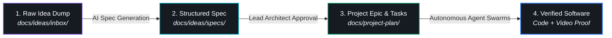

# 💡 RobOS Feature Ideas Store
{: .no_toc }

The open repository of community feature proposals, raw idea notes, structured architectural specifications, and implementation plans.
{: .fs-6 .fw-300 }

<div style="margin: 1.5rem 0 2rem; padding: 1.25rem; background: #161b22; border: 1px solid #30363d; border-radius: 8px; display: flex; flex-wrap: wrap; align-items: center; justify-content: space-between; gap: 1rem;">
  <div>
    <h3 style="margin: 0 0 0.5rem; color: #58a6ff; font-size: 1.15rem;">Browse the Complete Ideas Store on GitHub</h3>
    <p style="margin: 0; color: #8b949e; font-size: 0.92rem;">Inspect raw text dumps in the inbox, structured feature specifications, and approved project epics directly in the Git repository.</p>
  </div>
  <a href="https://github.com/nddipiazza/robos/tree/main/docs/ideas" class="btn btn-primary" target="_blank" rel="noopener">Open Ideas Store on GitHub ↗</a>
</div>

## Table of contents
{: .no_toc .text-delta }

1. TOC
{:toc}

---

## The Ideas Workflow Pipeline

RobOS turns rough thoughts into executable software blueprints through a 4-stage automated pipeline:



1. **Inbox / Raw Ideas ([`docs/ideas/inbox/`](https://github.com/nddipiazza/robos/tree/main/docs/ideas/inbox))**: Dump quick bullet points, voice recordings, raw user feedback, or terminal logs.
2. **Structured Feature Specs ([`docs/ideas/specs/`](https://github.com/nddipiazza/robos/tree/main/docs/ideas/specs))**: AI agents use the `create-feature-spec` skill to convert raw notes into formalized requirements, SHACL schema impacts, and architecture diagrams.
3. **Approved Plans ([`docs/project-plan/`](https://github.com/nddipiazza/robos/tree/main/docs/project-plan))**: Once reviewed, feature specs graduate into official development epics and phased task plans.
4. **Implementation & Proof-of-Work**: Agents execute in isolated sandboxes, producing code, consumer contract tests, and narrated 1080p video proofs.

---

## Active Feature Proposals & Specifications

| Feature Proposal | Raw Idea Note | Structured Feature Spec | Target Subsystems |
|:---|:---:|:---:|:---|
| **RobOS Desktop Agents** | [raw note](https://github.com/nddipiazza/robos/blob/main/docs/ideas/inbox/robos-desktop-agents.txt) | [feature spec](https://github.com/nddipiazza/robos/blob/main/docs/ideas/specs/robos-desktop-agents.md) | Linux OS Base, `robos-agent-session`, `desktop-agents` |
| **Dual-Context eLearning & Interactive Reviewer** | [raw note](https://github.com/nddipiazza/robos/blob/main/docs/ideas/inbox/robos-elearning-and-interactive-reviewer.txt) | [feature spec](https://github.com/nddipiazza/robos/blob/main/docs/ideas/specs/robos-elearning-and-interactive-reviewer.md) | `context-manager`, `robos-reviewer`, Chrome DevTools MCP |
| **Contract-Driven Project Graph & Agent Deployment Engine** | [raw note](https://github.com/nddipiazza/robos/blob/main/docs/ideas/inbox/robos-contract-driven-project-graph.txt) | [feature spec](https://github.com/nddipiazza/robos/blob/main/docs/ideas/specs/robos-contract-driven-project-graph.md) | `project-graph`, `robos-graph`, `dev-central` |
| **Unified RobOS Setup Assistant & AI Provisioner** | [raw note](https://github.com/nddipiazza/robos/blob/main/docs/ideas/inbox/robos-onboarding-setup-flow.txt) | [feature spec](https://github.com/nddipiazza/robos/blob/main/docs/ideas/specs/robos-onboarding-setup-flow.md) | `robos-onboarding`, `security-setup`, `git-login-manager` |
| **Ephemeral Agent User Profiles with Direct Host Display Bridging** | [raw note](https://github.com/nddipiazza/robos/blob/main/docs/ideas/inbox/ephemeral-agent-user-profiles.txt) | [feature spec](https://github.com/nddipiazza/robos/blob/main/docs/ideas/specs/ephemeral-agent-user-profiles.md) | `robos-profiled`, `packages/desktop-shell`, `agents-manager` |
| **Dev Central — AI Agent Review-Based Development Hub** | [raw note](https://github.com/nddipiazza/robos/blob/main/docs/ideas/inbox/dev-central-ai-agent-review-development.txt) | [feature spec](https://github.com/nddipiazza/robos/blob/main/docs/ideas/specs/dev-central-ai-agent-review-development.md) | `packages/dev-central`, `robos-agent-session`, IDE Plugin |
| **Dual-State SDLC Knowledge Graph & E2E-Driven Verification** | [raw note](https://github.com/nddipiazza/robos/blob/main/docs/ideas/inbox/dual-state-sdlc-knowledge-graph.txt) | [feature spec](https://github.com/nddipiazza/robos/blob/main/docs/ideas/specs/dual-state-sdlc-knowledge-graph.md) | Knowledge Graph Engine, Dev Central, Graph Studio |
| **Hermetic Gitea Git Forge for E2E Test Suite** | [raw note](https://github.com/nddipiazza/robos/blob/main/docs/ideas/inbox/e2e-gitea-support.txt) | [feature spec](https://github.com/nddipiazza/robos/blob/main/docs/ideas/specs/e2e-gitea-support.md) | Test Harness, `packages/robos-test`, Container Runner |
| **RobOS People & Groups — Multi-Cloud Identity & Guided OAuth** | [raw note](https://github.com/nddipiazza/robos/blob/main/docs/ideas/inbox/robos-people-groups-cloud-identity.txt) | [feature spec](https://github.com/nddipiazza/robos/blob/main/docs/ideas/specs/robos-people-groups-cloud-identity.md) | `people-directory`, `group-manager`, `robos-preferences` |
| **RobOS File Storage & MCP Agent-Driven File Sharing** | [raw note](https://github.com/nddipiazza/robos/blob/main/docs/ideas/inbox/robos-file-storage-and-agent-sharing.txt) | [feature spec](https://github.com/nddipiazza/robos/blob/main/docs/ideas/specs/robos-file-storage-and-agent-sharing.md) | `packages/file-storage`, `robos-file-storage-mcp` |
| **RobOS Learning Management System (LMS) & SDLC Course Player** | [raw note](https://github.com/nddipiazza/robos/blob/main/docs/ideas/inbox/robos-learning-management-system.txt) | [feature spec](https://github.com/nddipiazza/robos/blob/main/docs/ideas/specs/robos-learning-management-system.md) | `packages/robos-lms`, `context-manager`, `workspace-manager` |
| **Local Open-Source Task Server & Task Servers Integration** | [raw note](https://github.com/nddipiazza/robos/blob/main/docs/ideas/inbox/local-open-source-task-server.txt) | [feature spec](https://github.com/nddipiazza/robos/blob/main/docs/ideas/specs/local-open-source-task-server.md) | `packages/task-servers`, `packages/robos-task-client`, MCP |
| **AI-Generated Implementation Plan as First-Class KGraph Object** | [raw note](https://github.com/nddipiazza/robos/blob/main/docs/ideas/inbox/ai-generated-implementation-plan.txt) | [feature spec](https://github.com/nddipiazza/robos/blob/main/docs/ideas/specs/ai-generated-implementation-plan.md) | `packages/task-planner`, `packages/robos-graph`, Git Store |
| **First-Class KGraph Object for Prompt & Run Logging** | [raw note](https://github.com/nddipiazza/robos/blob/main/docs/ideas/inbox/prompt-knowledge-graph-logging.txt) | [feature spec](https://github.com/nddipiazza/robos/blob/main/docs/ideas/specs/prompt-knowledge-graph-logging.md) | `packages/robos-graph`, `packages/ai-prompt`, Shell Hooks |
| **Terraform & OpenTofu Infrastructure as Code (IaC) Synthesis** | [raw note](https://github.com/nddipiazza/robos/blob/main/docs/ideas/inbox/terraform-opentofu-iac-synthesis.txt) | [feature spec](https://github.com/nddipiazza/robos/blob/main/docs/ideas/specs/terraform-opentofu-iac-synthesis.md) | `packages/kube-studio`, `packages/devops`, Git Store |
| **Search Studio — OpenSearch, Elasticsearch, Solr & Vector Analytics** | [raw note](https://github.com/nddipiazza/robos/blob/main/docs/ideas/inbox/search-engine-and-log-analytics-studio.txt) | [feature spec](https://github.com/nddipiazza/robos/blob/main/docs/ideas/specs/search-engine-and-log-analytics-studio.md) | `packages/search-studio`, `packages/data-sources`, KGraph |

---

## How to Submit a New Idea

You can submit raw ideas by creating a `.txt` file in `docs/ideas/inbox/` or prompting your AI agent directly:

```bash
# Add a raw note in your local repository:
echo "Add support for Apache Iceberg table format in RobOS Data Sources" > docs/ideas/inbox/apache-iceberg-support.txt

# Or instruct your AI agent:
"Create a new feature spec in docs/ideas/specs/ for Apache Iceberg table management"
```

The agent will run the `create-feature-spec` skill to produce a validated specification linked to Knowledge Graph schemas and user workflows.

---

## Next Steps

- **[Browse Raw Ideas on GitHub](https://github.com/nddipiazza/robos/tree/main/docs/ideas/inbox)**: Read unformatted notes and community feature brainstorms.
- **[View All Feature Specs on GitHub](https://github.com/nddipiazza/robos/tree/main/docs/ideas/specs)**: Inspect detailed architectural specifications.
- **[RobOS Big Wins]({{ site.baseurl }})**: Discover the 10 core architectural advantages powering RobOS.
