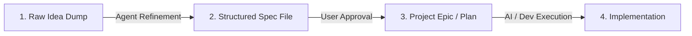

# Feature Ideas & Knowledgebase

Welcome to the RobOS Feature Knowledgebase! This directory stores raw project ideas, structured feature specifications, and implementation plans.

## Workflow Pipeline

1. **Inbox / Raw Ideas (`docs/ideas/inbox/`)**: Dump quick notes, bullet points, audio transcripts, or rough thoughts here.
2. **Refined Feature Specs (`docs/ideas/specs/`)**: Agents refine raw ideas into structured specifications using `TEMPLATE.md`.
3. **Approved Plans (`docs/project-plan/`)**: Once approved, ideas get added as official epics or task items in `docs/project-plan/`.

## Directory Structure

- `inbox/`: Storage for quick notes, raw text dumps, and unformatted thoughts.
- `specs/`: Detailed, standardized `.md` specifications generated by AI agents.
- `TEMPLATE.md`: Standard feature proposal template used by AI agents.

## Current Feature Specs & Ideas

| Spec Title | Raw Note | Feature Spec | Status | Target Components |
|------------|----------|--------------|--------|-------------------|
| **RobOS Desktop Agents** | [raw note](inbox/robos-desktop-agents.txt) | [feature spec](specs/robos-desktop-agents.md) | Draft | Linux OS Base, `robos-agent-session`, `desktop-agents`, `agent-sidebar` |
| **Dual-Context eLearning & Interactive Reviewer** | [raw note](inbox/robos-elearning-and-interactive-reviewer.txt) | [feature spec](specs/robos-elearning-and-interactive-reviewer.md) | Draft | `context-manager`, `robos-reviewer`, `desktop-agents`, Chrome DevTools MCP |
| **Contract-Driven Project Graph & Agent Deployment Engine** | [raw note](inbox/robos-contract-driven-project-graph.txt) | [feature spec](specs/robos-contract-driven-project-graph.md) | Draft | `project-graph`, `robos-graph`, `desktop-agents`, `dev-central` |
| **Unified RobOS Setup Assistant & AI Project Provisioner** | [raw note](inbox/robos-onboarding-setup-flow.txt) | [feature spec](specs/robos-onboarding-setup-flow.md) | Draft | `robos-onboarding`, `security-setup`, `git-login-manager`, `desktop-manager`, `agents-manager` |
| **Ephemeral Agent User Profiles with Direct Host Display Bridging** | [raw note](inbox/ephemeral-agent-user-profiles.txt) | [feature spec](specs/ephemeral-agent-user-profiles.md) | Approved ([Plan](../project-plan/ephemeral-agent-user-profiles/epic.md)) | `robos-profiled`, `packages/desktop-shell`, `desktop-manager`, Toolbar Widgets, `agents-manager` |
| **Dev Central — AI Agent Review-Based Development Hub** | [raw note](inbox/dev-central-ai-agent-review-development.txt) | [feature spec](specs/dev-central-ai-agent-review-development.md) | In Plan ([Plan](../project-plan/dev-central-review-hub/epic.md)) | `packages/dev-central`, `robos-agent-session`, RobOS IDE Plugin, `desktop-manager` |
| **RobOS — The Agent-First Software Lifecycle OS** | [raw note](inbox/agent-first-software-lifecycle-os.txt) | [feature spec](specs/agent-first-software-lifecycle-os.md) | In Plan ([Plan](../project-plan/agent-first-software-lifecycle-os/epic.md)) | Full App Suite, `.robos/` GitOps Store, Desktop OS Shell, Agent Bridge |
| **Dual-State SDLC Knowledge Graph & E2E-Driven Verification Engine** | [raw note](inbox/dual-state-sdlc-knowledge-graph.txt) | [feature spec](specs/dual-state-sdlc-knowledge-graph.md) | In Plan ([Plan](../project-plan/dual-state-sdlc-knowledge-graph/epic.md)) | Knowledge Graph Engine, Dev Central, Graph Studio, Test Harness |
| **Hermetic Gitea Git Forge for E2E Test Suite** | [raw note](inbox/e2e-gitea-support.txt) | [feature spec](specs/e2e-gitea-support.md) | Draft | Test Harness, `packages/robos-test`, `scripts/e2e-container.sh` |
| **RobOS People & Groups — Multi-Cloud Identity & Guided OAuth Integrations** | [raw note](inbox/robos-people-groups-cloud-identity.txt) | [feature spec](specs/robos-people-groups-cloud-identity.md) | Draft | `people-directory`, `group-manager`, `security-setup`, `robos-preferences`, `robos-lib` |
| **RobOS File Storage & MCP Agent-Driven File Sharing** | [raw note](inbox/robos-file-storage-and-agent-sharing.txt) | [feature spec](specs/robos-file-storage-and-agent-sharing.md) | Draft | `packages/file-storage`, `robos-file-storage-mcp`, `people-directory`, `group-manager` |
| **RobOS Learning Management System (LMS) & SDLC Course Player** | [raw note](inbox/robos-learning-management-system.txt) | [feature spec](specs/robos-learning-management-system.md) | Draft | `packages/robos-lms`, `packages/context-manager`, `packages/workspace-manager`, `packages/people-directory` |
| **Local Open-Source Task Server & RobOS Task Servers Integration** | [raw note](inbox/local-open-source-task-server.txt) | [feature spec](specs/local-open-source-task-server.md) | Draft | `packages/task-servers`, `packages/robos-task-client`, `packages/task-board`, MCP Tools |

## Working with AI Agents

### Turn a Raw Idea into a Specification
You can ask your AI agent:
> *"I added a new idea in `docs/ideas/inbox/my-idea.txt`. Please turn it into a feature spec in `docs/ideas/specs/`."*

or give a prompt directly:
> *"Create a new feature spec in `docs/ideas/specs/` for [your idea concept]."*
