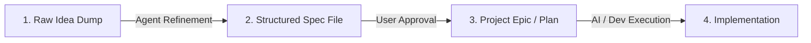

# Feature Ideas & Knowledgebase

Welcome to the RobOS Feature Knowledgebase! This directory stores raw project ideas, structured feature specifications, and implementation plans.

## Workflow Pipeline

1. **Inbox / Raw Ideas (`docs/ideas/inbox/`)**: Dump quick notes, bullet points, audio transcripts, or rough thoughts here.
2. **Refined Feature Specs (`docs/ideas/specs/`)**: Agents refine raw ideas into structured specifications using `TEMPLATE.md`.
3. **Approved Plans (`docs/project-plan/`)**: Once approved, ideas get added as official epics or task items in `docs/project-plan/`.

## Directory Structure

- `inbox/`: Storage for quick notes, raw text dumps, and unformatted thoughts.
- `specs/`: Detailed, standardized `.md` specifications generated by AI agents.
- `TEMPLATE.md`: Standard feature proposal template used by AI agents.

## Current Feature Specs & Ideas

| Spec Title | Raw Note | Feature Spec | Status | Target Components |
|------------|----------|--------------|--------|-------------------|
| **RobOS Desktop Agents** | [raw note](inbox/robos-desktop-agents.txt) | [feature spec](specs/robos-desktop-agents.md) | Draft | Linux OS Base, `robos-agent-session`, `desktop-agents`, `agent-sidebar` |
| **Dual-Context eLearning & Interactive Reviewer** | [raw note](inbox/robos-elearning-and-interactive-reviewer.txt) | [feature spec](specs/robos-elearning-and-interactive-reviewer.md) | Draft | `context-manager`, `robos-reviewer`, `desktop-agents`, Chrome DevTools MCP |

## Working with AI Agents

### Turn a Raw Idea into a Specification
You can ask your AI agent:
> *"I added a new idea in `docs/ideas/inbox/my-idea.txt`. Please turn it into a feature spec in `docs/ideas/specs/`."*

or give a prompt directly:
> *"Create a new feature spec in `docs/ideas/specs/` for [your idea concept]."*
