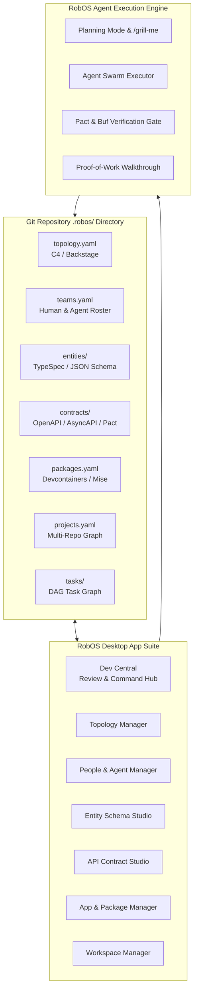

# Feature Spec: RobOS — The Agent-First Software Lifecycle Operating System

- **Status**: Approved
- **Created Date**: 2026-09-01
- **Target Component**: Full RobOS Desktop Suite, OS Shell, GitOps Storage Layer, AI Agent Bridge, IDE Plugin
- **Author/Idea Source**: User & Antigravity Agent

## 1. Overview & Vision

In the era of generative AI, software engineering has fundamentally evolved. Developers no longer spend the majority of their time typing boilerplate syntax. Instead, modern software development is the continuous orchestration and governance of:
1. **System & Service Topologies** (Microservices, boundaries, event brokers, infrastructure graphs)
2. **Human Resources & AI Agent Personnel** (Team topologies, human-agent pair rosters, persona definitions, MCP skill sets, permission boundaries)
3. **Entity Schemas** (Universal data modeling via JSON Schema, TypeSpec, JSON-LD, Protocol Buffers, and database ORMs)
4. **Contracts & API Interfaces** (OpenAPI 3.1, AsyncAPI, Pact consumer-driven contract testing, gRPC definitions, breaking-change drift detection)
5. **Applications & Package Lifecycles** (Electron desktop applications, daemons, backend microservices, containers, runtime manifests)
6. **Development Projects & Multi-Repo Workspaces** (Git worktrees, polyrepo/monorepo graphs, containerized dev environments)
7. **Work Items, Tasks & AI Goal Dispatching** (DAG task graphs, epic breakdowns, Planning Mode review gates with `/grill-me`, automated lifecycle transitions)
8. **Git-Backed Single Source of Truth (GitOps for SDLC)** (100% declarative files stored in `.robos/`, zero proprietary database lock-in, PR-reviewed changesets)

**Core Mandate: "Reinvent Nothing! Steal from OSS!"**
RobOS does not build proprietary silos. It adopts and integrates proven open-source industry standards:
- **Backstage / C4 Model / Cytoscape.js** for Topology & Service Catalogs
- **Team Topologies / Model Context Protocol (MCP)** for Personnel & Agent Skills
- **TypeSpec (Microsoft) / Buf (Protobuf) / JSON Schema** for Entity Schemas
- **Pact / Prism / Spectral** for Contract Testing & API Governance
- **Devcontainers / Mise / Devenv / Nix** for App & Package Runtimes
- **Git Worktrees / Simple-Git** for Workspace Isolation & Version Storage

The entire RobOS desktop environment and application suite acts as the command center where human engineers function primarily as **Lead Architects and Code Reviewers**, reviewing AI-generated implementation plans and walkthrough proof-of-work, while autonomous configured RobOS Agents execute the heavy lifting.

---

## 2. User Stories & Use Cases

- **As a Lead Architect**, I want to define and visualize our system topology, microservice boundaries, and API contracts in Git-backed declarative files, so that any configured RobOS Agent can autonomously build features without violating architectural boundaries or breaking contracts.
- **As an Engineering Manager**, I want a unified Human & Agent Roster where human devs and AI agents are assigned to specific team topologies (stream-aligned, platform, enabling), so that task assignments and permission boundaries are crystal clear.
- **As a Developer / Code Reviewer**, I want to interact with agents via a structured review workflow (Planning Mode -> Interactive `/grill-me` -> Execution -> Proof-of-Work Walkthrough verification), so that I approve designs before code is modified and verify results through reproducible evidence.
- **As a DevOps / Platform Engineer**, I want all entity schemas, contracts, project graphs, and task states to be committed directly into Git repositories (`.robos/`), so that our team has total version history, zero vendor lock-in, and full auditability via standard Git PRs.

---

## 3. Key Capabilities & Scope

### In Scope
- [x] **Declarative GitOps SDLC Schema (`.robos/`)**: Standardized directory structure and schema for topology (`topology.yaml`), teams/personnel (`teams.yaml`), entity models (`entities/`), API contracts (`contracts/`), packages (`packages.yaml`), projects (`projects.yaml`), and tasks (`tasks/`).
- [x] **Topology & Service Catalog Studio**: Visual node-link diagram editor (Cytoscape.js/C4 Model) showing service dependencies, event streams, and live health status.
- [x] **Human & Agent Personnel Manager**: Team Topologies modeling, agent skill/MCP bindings, and ephemeral sub-agent execution roles.
- [x] **Entity Schema Studio & Registry**: Multi-format schema designer supporting TypeSpec, JSON Schema, and Protobuf with real-time validation and cross-language code generation.
- [x] **API Contract & Governance Engine**: OpenAPI 3.1 & AsyncAPI editor, Pact consumer-driven contract testing integration, and automated PR breaking-change gates.
- [x] **App & Package Runtime Manager**: Devcontainer lifecycle management, mise/asdf runtime detection, and Electron application registry.
- [x] **Multi-Repo Workspace Orchestrator**: Git worktree branch isolation, automated dev server startup, and multi-repo project graph coordination.
- [x] **Task Graph & AI Planning Dispatcher**: DAG-based task dependency viewer, Planning Mode prompt dispatcher, interactive `/grill-me` design review hub, and automated PR generation.
- [x] **OSS Ecosystem Adapters**: Turnkey adapters importing and exporting Backstage catalogs, C4 diagrams, Pact contracts, Buf protobuf registries, and Devcontainers.

### Out of Scope
- Creating a proprietary cloud-hosted SaaS database (all data is 100% local and Git-backed).
- Forcing a single proprietary programming language (multi-language by design).

---

## 4. Architectural & System Integration

### Impacted Packages/Apps
- `packages/dev-central`: Central orchestrator for planning, task dispatching, review gates, and blocker radar.
- `packages/project-graph`: Visual graph modeling of multi-repo dependencies and service topology.
- `packages/agents-manager`: Management of agent personas, models, MCP tools, and skills.
- `packages/workspace-manager`: Local workspace provisioning via Git worktrees and devcontainers.
- `packages/task-manager`: Work item lifecycle, task graphs, and Jira/GitHub sync.
- `packages/robos-lib`: Shared DOM snapshots, GitOps parser, and schema validation utilities.

### Data & Configuration Storage
All data is stored directly in repository roots under `.robos/`:
- `.robos/topology.yaml` — Service mesh, microservices, databases, and message brokers.
- `.robos/teams.yaml` — Team topologies, human engineers, AI agents, and MCP skill matrices.
- `.robos/entities/*.typespec` / `*.json` — Entity schemas and domain models.
- `.robos/contracts/*.yaml` / `*.pact.json` — OpenAPI specs, AsyncAPI specs, and consumer contracts.
- `.robos/packages.yaml` — Application targets, devcontainer definitions, build scripts.
- `.robos/projects.yaml` — Multi-repo workspace mappings and dependency graphs.
- `.robos/tasks/*.md` — Task specifications, planning documents, and walkthrough records.

---

## 5. Proposed Implementation Plan

The implementation is tracked under **Epic 31: RobOS — Agent-First Software Lifecycle OS** in `docs/project-plan/agent-first-software-lifecycle-os/`:

1. **Story 01**: Declarative GitOps SDLC Schema Specification (`.robos/`)
2. **Story 02**: System Topology & Catalog Manager (Backstage / C4 Model)
3. **Story 03**: Human & Agent Roster Manager (Team Topologies & MCP Skills)
4. **Story 04**: Entity Schema Studio & Registry (TypeSpec / JSON Schema / Buf Protobuf)
5. **Story 05**: API Contract & Governance Engine (OpenAPI 3.1, AsyncAPI, Pact)
6. **Story 06**: App, Package & Runtime Manager (Devcontainers, Mise, Nix)
7. **Story 07**: Multi-Repo Project Workspace Orchestrator (Git Worktrees)
8. **Story 08**: Task Graph & AI Planning Dispatcher (DAGs, Planning Mode, `/grill-me`)
9. **Story 09**: Open-Source Ecosystem Adapter Suite (Backstage, Pact, Buf, Devcontainer bridges)
10. **Story 10**: End-to-End Agent-First SDLC Walkthrough & Test Suite

---

## 6. Acceptance Criteria

- [x] Declarative `.robos/` specification established with JSON Schema validation for all 8 lifecycle domains.
- [x] Zero proprietary storage lock-in: all state can be committed to Git, branched, merged, and PR-reviewed.
- [x] Direct open-source compatibility with Backstage catalog format, C4 diagrams, Pact contract tests, TypeSpec, and Devcontainers.
- [x] Complete integration with RobOS Dev Central and Desktop Agent execution engine for review-first development.
