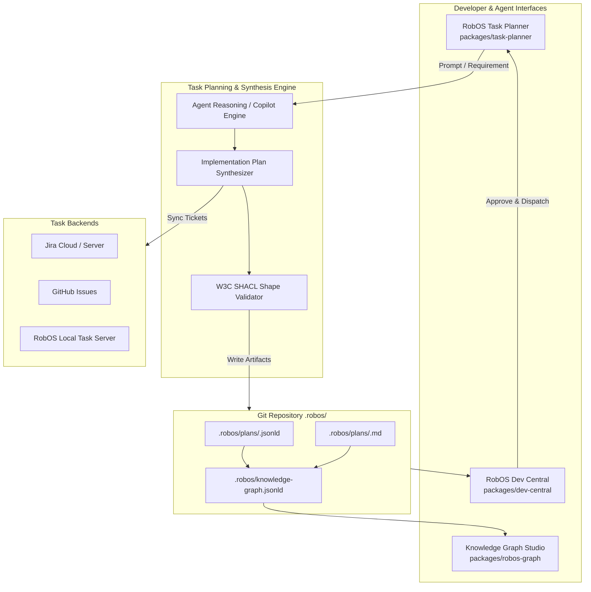

# Feature Spec: AI-Generated Implementation Plan as a First-Class Knowledge Graph Object

- **Status**: Draft
- **Created Date**: 2026-09-05
- **Target Component**: `packages/task-planner`, `packages/robos-graph`, `packages/dev-central`, `.robos/` Git Store (`.robos/plans/`, `.robos/knowledge-graph.jsonld`), `packages/agents-manager`
- **Author/Idea Source**: User & Antigravity Agent

---

## 1. Overview & Vision

In autonomous, agentic software engineering, a high-level user prompt or architectural requirement cannot be reliably executed through ad-hoc task lists alone. When developers or agents plan a feature, they need a structured, deterministic representation of:
- **Architectural Scope**: What services, libraries, contracts, APIs, databases, and UI surfaces are affected.
- **Task Hierarchy & Dependencies**: Epics, user stories, subtasks, and the directed acyclic graph (DAG) of execution order.
- **Verification Gates**: Automated tests, BDD scenarios, and proof-of-work criteria required at each milestone.
- **Auditability & Review**: An immutable, human- and machine-readable record of the implementation strategy prior to writing code.

Currently, task planners often push tickets directly into issue trackers (Jira, GitHub Issues, Linear) or hold ephemeral in-memory state. While useful for external issue tracking, this disconnects the implementation strategy from the codebase itself.

### The Solution: First-Class Knowledge Graph Object (`robos:ImplementationPlan`)
This feature establishes the **AI-Generated Implementation Plan** as an official, first-class linked-data entity within the **RobOS Dual-State SDLC Knowledge Graph**. 

Whenever the **RobOS Task Planner** (`packages/task-planner`) analyzes a requirement and produces a project breakdown:
1. It synthesizes a formal `robos:ImplementationPlan` object complying with **OASIS OSLC Core 3.0** and **W3C JSON-LD / SHACL**.
2. It persists the plan directly into the repository's Git store under `.robos/plans/<plan-id>.jsonld` accompanied by a human-friendly markdown summary (`.robos/plans/<plan-id>.md`).
3. It links the plan into the central `.robos/knowledge-graph.jsonld` index, associating it with the driving requirements, impacted microservices/apps, contracts, epics, and verification test suites.
4. Because the plan resides in Git, it automatically benefits from RobOS's **Dual-State World Representation** (`main` vs `feature/*` branches), allowing architects and reviewers to semantically diff proposed plans across branches before execution.

---

## 2. User Stories & Use Cases

- **As a Software Architect / Tech Lead**, I want the Task Planner to produce a version-controlled implementation plan in `.robos/plans/`, so that architectural decisions, impacted service boundaries, and contract revisions are committed to Git and peer-reviewed in pull requests.
- **As a Developer / Project Manager**, I want to open **Dev Central** or **RobOS Graph Studio** and inspect the implementation plan's dependency DAG, milestone checkpoints, and issue tracker links in a visual canvas.
- **As an Autonomous AI Agent**, I want to read the structured `robos:ImplementationPlan` from the Git store via MCP or local filesystem APIs to understand execution phases, run verification commands, and transition task states from `Draft` to `InExecution` to `Verified`.
- **As a Code Reviewer**, I want to review the exact AI-generated plan diff alongside code changes on a feature branch, verifying that the delivered implementation matches the planned architectural boundaries.

---

## 3. Key Capabilities & Scope

### In Scope

- [ ] **First-Class KGraph Ontology (`robos:ImplementationPlan`)**:
  - Formal OSLC / JSON-LD schema and W3C SHACL shape (`ImplementationPlanShape`).
  - Linked properties: `dcterms:title`, `dcterms:description`, `robos:planStatus` (`Draft`, `UnderReview`, `Approved`, `InExecution`, `Verified`, `Superseded`), `robos:authorAgent`, `robos:sourcePrompt`, `robos:affectedPackage`, `robos:affectedContract`, `robos:tracksRequirement`, `robos:hasPhase`, `robos:hasTaskDAG`, `robos:verificationPlan`.
- [ ] **Task Planner Artifact Generation Pipeline**:
  - Enhanced planning runner in `packages/task-planner` that outputs structured JSON-LD and readable markdown artifacts upon running.
  - Multi-tier synthesis: High-level architectural impact analysis $\rightarrow$ execution phases $\rightarrow$ concrete issue tracker tickets $\rightarrow$ automated verification gates.
- [ ] **Git Store Persistence (`.robos/plans/`)**:
  - Declarative storage under `.robos/plans/<plan-slug>.jsonld` and `.robos/plans/<plan-slug>.md`.
  - Automatic registration in `.robos/knowledge-graph.jsonld` nodes index.
  - Automated staging/committing to the current Git branch.
- [ ] **Dual-State Semantic Plan Diffing**:
  - Comparison of implementation plans between `main` (baseline) and feature/pilot branches.
  - Visualization of scope creep, added dependencies, or altered verification gates.
- [ ] **Interactive Visual Integration in RobOS Apps**:
  - **Task Planner**: Preview and edit the plan artifact before committing or dispatching.
  - **RobOS Graph Studio (`packages/robos-graph`)**: Visual node representation with clickable edges to affected services, contracts, and tasks.
  - **Dev Central (`packages/dev-central`)**: Plan approval gate and agent dispatch trigger.

### Out of Scope (Initial Release)

- Real-time multi-agent collaborative live-editing (Git-based branch merge workflow is used instead).
- Proprietary cloud-only plan registries (all plans remain 100% local and Git-backed).

---

## 4. Architectural & System Integration

### System Architecture Flow



### JSON-LD Object Representation (`robos:ImplementationPlan`)

```json
{
  "@context": {
    "oslc": "http://open-services.net/ns/core#",
    "oslc_rm": "http://open-services.net/ns/rm#",
    "oslc_cm": "http://open-services.net/ns/cm#",
    "oslc_qm": "http://open-services.net/ns/qm#",
    "dcterms": "http://purl.org/dc/terms/",
    "robos": "https://robos.dev/ns/sdlc#"
  },
  "@id": "urn:robos:plan:order-cancellation-saga",
  "@type": ["oslc:Plan", "robos:ImplementationPlan"],
  "dcterms:identifier": "PLAN-2026-0042",
  "dcterms:title": "Distributed Order Cancellation Saga Implementation",
  "dcterms:description": "Architectural implementation plan for distributed saga orchestration across order, inventory, and payment microservices.",
  "robos:planStatus": "Draft",
  "robos:authorAgent": {
    "@type": "robos:AgentSession",
    "name": "TaskPlannerAgent-4",
    "model": "gemini-3.8-flash"
  },
  "robos:sourcePrompt": "Implement distributed order cancellation saga with compensation transactions",
  "robos:tracksRequirement": "urn:robos:requirement:REQ-882",
  "robos:affectedPackage": [
    "urn:robos:service:order-processing-java-service",
    "urn:robos:service:payment-gateway-go-service",
    "urn:robos:pipeline:event-bus"
  ],
  "robos:affectedContract": [
    "urn:robos:contract:order-events-v2",
    "urn:robos:contract:payment-cancel-v1"
  ],
  "robos:phases": [
    {
      "phaseIndex": 1,
      "title": "Contract Definition & Compensating Event Schemas",
      "status": "TODO",
      "tasks": ["urn:robos:task:PET-201", "urn:robos:task:PET-202"]
    },
    {
      "phaseIndex": 2,
      "title": "Service Compensation Endpoints & State Machine",
      "status": "TODO",
      "tasks": ["urn:robos:task:PET-203", "urn:robos:task:PET-204"]
    },
    {
      "phaseIndex": 3,
      "title": "E2E Failure Injection & Integration Verification",
      "status": "TODO",
      "tasks": ["urn:robos:task:PET-205"]
    }
  ],
  "robos:verificationPlan": {
    "testFramework": "Cucumber / Gherkin + Jest",
    "testFeature": "features/order-cancellation-saga.feature",
    "e2eCommand": "./scripts/e2e-container.sh --test order-cancellation",
    "recordDemo": true
  },
  "robos:artifactPath": ".robos/plans/order-cancellation-saga.jsonld",
  "robos:markdownPath": ".robos/plans/order-cancellation-saga.md",
  "dcterms:created": "2026-09-05T12:00:00Z",
  "dcterms:modified": "2026-09-05T12:00:00Z"
}
```

### W3C SHACL Shape Definition

```turtle
@prefix sh: <http://www.w3.org/ns/shacl#> .
@prefix robos: <https://robos.dev/ns/sdlc#> .
@prefix dcterms: <http://purl.org/dc/terms/> .
@prefix xsd: <http://www.w3.org/2001/XMLSchema#> .

robos:ImplementationPlanShape
    a sh:NodeShape ;
    sh:targetClass robos:ImplementationPlan ;
    sh:property [
        sh:path dcterms:title ;
        sh:datatype xsd:string ;
        sh:minCount 1 ;
        sh:maxCount 1 ;
        sh:message "ImplementationPlan must have a single dcterms:title." ;
    ] ;
    sh:property [
        sh:path robos:planStatus ;
        sh:datatype xsd:string ;
        sh:in ( "Draft" "UnderReview" "Approved" "InExecution" "Verified" "Superseded" ) ;
        sh:minCount 1 ;
        sh:message "ImplementationPlan must have a valid robos:planStatus." ;
    ] ;
    sh:property [
        sh:path robos:affectedPackage ;
        sh:nodeKind sh:IRI ;
        sh:minCount 1 ;
        sh:message "ImplementationPlan must link to at least one affected package/service." ;
    ] ;
    sh:property [
        sh:path robos:phases ;
        sh:minCount 1 ;
        sh:message "ImplementationPlan must contain phased execution tasks." ;
    ] .
```

---

## 5. Proposed Implementation Plan

1. **Phase 1: Knowledge Graph Core & SHACL Schema**
   - Define `robos:ImplementationPlan` in `packages/robos-graph/lib/oslc-parser.js` and `packages/robos-graph/lib/shacl-validator.js`.
   - Update `.robos/knowledge-graph.jsonld` context definitions to map `oslc:Plan` and `robos:ImplementationPlan`.

2. **Phase 2: Task Planner Plan Synthesis Engine**
   - Enhance `packages/task-planner/main.js` prompt engineering to generate comprehensive plan metadata (architectural scope, affected packages/contracts, phased DAG, verification plan) alongside raw ticket objects.
   - Implement `.robos/plans/` file generator producing `<plan-slug>.jsonld` and companion `<plan-slug>.md`.

3. **Phase 3: Git Store Integration & KGraph Node Synchronization**
   - Update `packages/task-planner/main.js:syncProjectToKGraph()` to register the new implementation plan node directly into `~/.robos/knowledge-graph.jsonld`.
   - Add Git staging/committing helper to track `.robos/plans/` in the active repository workspace.

4. **Phase 4: Visual Plan Explorer in Task Planner & Graph Studio**
   - Add "Implementation Plan" tab/drawer in `packages/task-planner/renderer/` allowing developers to inspect the generated plan, edit phases, and export markdown.
   - Render `robos:ImplementationPlan` nodes with distinct icons and dependency links in `packages/robos-graph`.

5. **Phase 5: Dev Central Review, Approval Gate & Agent Dispatch**
   - Integrate plan preview into `packages/dev-central`, enabling 1-click "Approve Plan & Dispatch Agent" which feeds the structured plan DAG into the autonomous agent runner.

---

## 6. Acceptance Criteria

- [ ] Task Planner generates an `ImplementationPlan` artifact (`.robos/plans/<plan-slug>.jsonld` and `.robos/plans/<plan-slug>.md`) in the repository Git store whenever a planning session runs.
- [ ] The generated plan is registered as a first-class `robos:ImplementationPlan` node in `.robos/knowledge-graph.jsonld`.
- [ ] The plan object validates against `robos:ImplementationPlanShape` using the SHACL validator.
- [ ] The plan accurately links to affected services (`robos:Microservice`), contracts (`robos:Contract`), and child change requests (`oslc_cm:ChangeRequest`).
- [ ] Plans are version-controlled in Git, enabling branch diffing between `main` and feature branches.
- [ ] Task Planner UI provides a visual review of the plan artifact before finalizing tasks.
