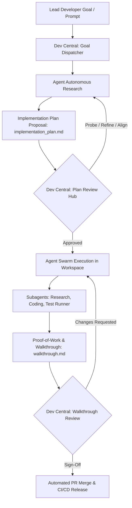

# Feature Spec: RobOS Dev Central — AI Agent Review-Based Development Hub

- **Status**: In Plan ([Epic 29](../../project-plan/dev-central-review-hub/epic.md))
- **Created Date**: 2026-08-31
- **Target Component**: Electron App (`packages/dev-central`), Shared Agent Libraries (`packages/robos-agent-session`, `packages/robos-lib`), RobOS IDE Plugin (IPC port 63343), Desktop Shell & Widgets
- **Author/Idea Source**: User / Antigravity Paradigm

---

## 1. Overview & Vision

**RobOS Dev Central** is rebranded and re-architected from a traditional developer dashboard into the **Mission Control and Driving Force for AI Agent Review-Based Development**. Inspired by the Antigravity IDE workflow, Dev Central inverts the legacy software development lifecycle:

Instead of developers writing code line-by-line and conducting post-hoc pull request reviews, **developers operate as Lead Engineers and Directors**. Lead developers steer AI agent swarms using strategic prompts, establish organization and architectural boundaries, review and approve AI-generated **Implementation Plans** before code execution, monitor multi-agent workflows in real-time, and verify interactive **Proof-of-Work Walkthroughs** before deployment.

Dev Central serves as the operational headquarters where lead developers manage organizations, oversee interconnected projects/apps, dispatch high-level goals, and orchestrate the review-driven lifecycle across local workspaces, RobOS IDE instances, and isolated Desktop Agent sessions.



---

## 2. User Stories & Use Cases

- **As a Lead Developer / Engineering Manager**, I want to manage my organization hierarchy, team spaces, repositories, and global AI agent rules (`AGENTS.md`) so that all spawned agents adhere to company standards and security policies.
- **As a Lead Architect**, I want to map out multiple applications, services, and shared libraries within project graphs, defining architectural boundaries and test suites for agents to target.
- **As a Lead Developer**, I want to dispatch high-level prompts and goals (`/goal`) with Planning Mode enforced, ensuring agents produce a structured `implementation_plan.md` with explicit architectural trade-offs before modifying source code.
- **As a Technical Reviewer**, I want a dedicated **Plan Review Hub** to inspect AI implementation plans, probe assumptions and edge cases, request revisions, or approve execution with a single click.
- **As a Lead Developer**, I want a **Live Agent Swarm Monitor** showing active subagents, running tool calls, token budgets, and live session links to peek into IDE workspaces or desktop agent sessions.
- **As a Quality Lead**, I want agents to submit rich **Proof-of-Work Walkthroughs** containing test execution logs, visual DOM snapshots, and live web previews for interactive verification before committing code.
- **As a Developer**, I want a **Blocker & Escalation Radar** that alerts me whenever an agent requires clarification, hits ambiguity, or requests permissions, allowing me to unblock agents instantly.

---

## 3. Key Capabilities & Scope

### In Scope

#### 1. Organization & Policy Management
- **Organization & Team Spaces**: Configure organizations, companies, business units, and team domains.
- **Agent Governance & Rules**: Manage global and project-level AI rules (`AGENTS.md`, `GEMINI.md`, coding conventions, lint standards).
- **Credentials & Access Vault**: Integration with `pass-manager` / GPG keyrings for GitHub tokens, API keys, and repository deploy keys.
- **Agent Permissions & Safety Boundaries**: Configure tool permissions (e.g., terminal command sandboxing, write restrictions, network access rules).

#### 2. Project & Multi-App Portfolio Management
- **App & Service Catalog**: Visual inventory of all applications, backend microservices, Electron desktop apps, and shared libraries.
- **Project Graph Integration**: Track dependencies, contracts, and interfaces across internal packages.
- **Workspace Provisioner**: One-click provisioning of isolated workspaces/worktrees tied to specific task IDs and IDE instances.
- **Environment & Harness Config**: Preconfigured dev-server startup commands, test runners, and DOM snapshot endpoints for each app.

#### 3. Agent Prompt & Goal Dispatcher
- **Strategic Goal Composer**: Integrated `<robos-ai-textarea>` with `@`-mention typeahead for repositories, files, issue tickets, and schema definitions.
- **Execution Modes**:
  - **Planning Mode (Default)**: Mandates research and `implementation_plan.md` generation before any write actions.
  - **Direct Goal (`/goal`)**: For autonomous long-running tasks with proactive progress heartbeats.
  - **Multi-Agent Swarm**: Dispatches concurrent subagents (e.g., Research Subagent, Implementation Subagent, QA/Test Subagent).
- **Context Curation**: Attach context sources from `context-manager`, design docs, and issue trackers.

#### 4. Implementation Plan Review Hub (The Review Engine)
- **Central Plan Review Queue**: Real-time inbox of pending AI implementation plans across all active tasks.
- **Rich Plan Inspector**:
  - Rendered Markdown with GitHub-style callouts (`[!IMPORTANT]`, `[!WARNING]`, `[!NOTE]`).
  - Architecture and flow diagrams rendered via Mermaid.
  - Impacted files table with categorized badges (`[NEW]`, `[MODIFY]`, `[DELETE]`).
  - Verification & testing strategy breakdown.
  - Open Questions section highlighting decisions requiring human input.
- **Proactive Human Alignment & Probing Engine**: Chat drawer grounded in the Knowledge Graph that actively probes design assumptions, presents "what-if" trade-offs, and lets the human architect refine specific phases of the plan before execution.
- **Review Actions**: `Approve & Execute`, `Request Revision`, `Edit Plan Manually`, `Fork Plan`, `Reject`.

#### 5. Live Agent Swarm & Subagent Telemetry
- **Agent Hierarchy Visualizer**: Tree view showing parent agents, delegated subagents, and their real-time state (`running`, `idle`, `waiting_for_input`, `waiting_for_message`).
- **Telemetry & Tool Call Stream**: Live feed of tool executions (`run_command`, `replace_file_content`, `grep_search`, `view_file`) with elapsed time and status.
- **Session Jump Points**:
  - Open target workspace directly in RobOS IDE at active line/file.
  - Launch live Desktop Agent stream viewer (`packages/desktop-agents`).
  - Inspect terminal output and logs via `read-error-logs`.

#### 6. Proof-of-Work & Walkthrough Verification
- **Walkthrough Sign-off Hub**: Dedicated interface for reviewing agent completed work (`walkthrough.md`).
- **Multi-Modal Verification**:
  - Automated test run summaries (unit, integration, E2E container tests).
  - Visual DOM snapshot and UI screenshot carousels.
  - Embedded diff inspector showing before/after code changes.
  - Interactive live preview links (e.g., local web app port, SPICE display).
- **Sign-Off Pipeline**: Approve changes, trigger automated PR creation, run squash-and-merge, or deploy to staging.

#### 7. Blocker Radar & Escalation Hub
- **Proactive Blocker Detection**: Scans active agents for stalled executions, repeated test failure loops, or unanswered questions.
- **Quick-Resolution Modals**: In-app dialogs to provide instant answers to agent questions or grant sandbox bypass permissions without context-switching.

---

### Out of Scope (v1)

- Cloud-only multi-tenant SaaS backend (Dev Central runs locally on the developer machine / RobOS VM).
- Closed-source proprietary agent protocols (standardized on open JSON-RPC, MCP, and CLI/IPC protocols).

---

## 4. Architectural & System Integration

### Impacted Packages & Apps

| Package / App | Role & Integration |
|---------------|-------------------|
| `packages/dev-central` | Primary application. Overhauled UI, IPC handlers, review queue, and dispatcher. |
| `packages/robos-agent-session` | Shared library for spawning, messaging, and monitoring agent processes/subagents. |
| `packages/desktop-manager` | App launcher registry, workspace coordination, and window focus management. |
| `packages/robos-lib` | DOM snapshot capture, desktop file parsing, and shared utility helpers. |
| RobOS IDE Plugin (Port 63343) | Bidirectional IPC for opening projects, setting breakpoints, and highlighting reviewed files. |
| `packages/desktop-agents` | Display tunneling for isolated agent GUI desktop sessions. |
| `packages/toast-daemon` | System-wide toast notifications for plan approvals and agent blockers. |

### IPC Endpoints (`packages/dev-central`)

```javascript
// Organization & Project Management
ipcRenderer.invoke('dc-get-organizations');
ipcRenderer.invoke('dc-save-organization', orgData);
ipcRenderer.invoke('dc-get-project-catalog');
ipcRenderer.invoke('dc-save-project', projectData);

// Agent Goals & Dispatch
ipcRenderer.invoke('dc-dispatch-goal', { goal, projectId, mode, contextIds });
ipcRenderer.invoke('dc-get-active-swarms');
ipcRenderer.invoke('dc-stop-agent-session', sessionId);

// Implementation Plan Review
ipcRenderer.invoke('dc-get-pending-plans');
ipcRenderer.invoke('dc-get-plan-details', planId);
ipcRenderer.invoke('dc-submit-plan-review', { planId, action: 'approve'|'revise'|'reject', feedback });
ipcRenderer.invoke('dc-send-plan-chat', { planId, message }); // Proactive alignment & clarification chat

// Proof-of-Work & Walkthroughs
ipcRenderer.invoke('dc-get-pending-walkthroughs');
ipcRenderer.invoke('dc-get-walkthrough-details', walkthroughId);
ipcRenderer.invoke('dc-approve-walkthrough', { walkthroughId, mergeOptions });

// Blocker Radar
ipcRenderer.invoke('dc-get-blockers');
ipcRenderer.invoke('dc-resolve-blocker', { blockerId, resolution });
```

### Data & Configuration Storage

- `~/.config/robos/dev-central/`
  - `organizations.json` — Organization hierarchy, team spaces, and global agent rules.
  - `projects.json` — Multi-app project catalog, repo paths, build configs, and test harnesses.
  - `plans/` — Cached and active `implementation_plan.md` artifacts indexed by task/goal ID.
  - `walkthroughs/` — Completed `walkthrough.md` artifacts, verification test logs, and DOM snapshots.
  - `swarms.json` — Telemetry and session state for active agent swarms.

### UI Layout & Navigation

```
+-----------------------------------------------------------------------------------+
|  [Logo] RobOS Dev Central — AI Agent Review Command Hub            [Settings] [?] |
+-----------------------+-----------------------------------------------------------+
| [Navigation Sidebar]  | [Main Work Surface]                                       |
|                       |                                                           |
| 🏢 Organizations      |  +-----------------------------------------------------+  |
| 📦 Projects & Apps    |  |  🎯 Goal & Agent Prompt Dispatcher                  |  |
| 📋 Plan Review (3) 🔴 |  |  [ Prompt textarea with @-mentions ]  [Dispatch Goal]|  |
| 🐝 Swarm Monitor (4)  |  +-----------------------------------------------------+  |
| 🏆 Walkthroughs (2) 🟡|                                                           |
| 🚨 Blocker Radar (1)  |  +-----------------------------------------------------+  |
| ⚙️ Agent Governance   |  |  📋 Priority Plan Review Queue                      |  |
|                       |  |  - JIRA-402: Auth Refactor (Awaiting Lead Approval)  |  |
|                       |  |  - GH-88: Payment Gateway (Proactive Alignment)     |  |
|                       |  +-----------------------------------------------------+  |
|                       |                                                           |
|                       |  +-----------------------------------------------------+  |
|                       |  |  🐝 Active Agent Swarms & Proof-of-Work Status      |  |
|                       |  |  [Agent-101: Running Tests] [Agent-102: Planning]   |  |
|                       |  +-----------------------------------------------------+  |
+-----------------------+-----------------------------------------------------------+
| Status: 4 Active Agents | 1 Awaiting Review | 0 Critical Blockers | RobOS VM: Online|
+-----------------------------------------------------------------------------------+
```

---

## 5. Proposed Implementation Plan

### Phase 1: Data Model & Navigation Rebrand
- Refactor `packages/dev-central` package metadata and desktop entry to reflect "RobOS Dev Central — AI Agent Review Command Hub".
- Implement local JSON configuration stores for Organizations (`organizations.json`) and Projects (`projects.json`).
- Build the responsive multi-panel sidebar navigation supporting Organizations, Projects, Plan Review, Swarm Monitor, Walkthroughs, and Blocker Radar.

### Phase 2: Goal Dispatcher & Planning Mode Review Hub
- Integrate `<robos-ai-textarea>` into the Goal Dispatcher with `@`-mention search for repos, files, and issues.
- Build the Implementation Plan Reviewer: Markdown renderer with callouts, Mermaid diagrams, file change summary badges, and testing strategy checklists.
- Implement proactive human-in-the-loop alignment and probing interface for clarifying AI assumptions and refining plans prior to execution approval.

### Phase 3: Swarm Telemetry & Proof-of-Work Walkthrough Viewer
- Implement real-time agent swarm visualizer displaying agent trees, subagent lifecycles, and tool call logs.
- Build the Walkthrough Sign-off Hub rendering `walkthrough.md`, embedded diffs, test outputs, and screenshot/snapshot carousels.
- Integrate one-click actions for IDE workspace launch, Desktop Agent session streaming, and Git/PR merge operations.

### Phase 4: Blocker Radar & End-to-End Testing
- Build the Blocker Radar engine that monitors agent timeouts, failed test loops, and input prompts.
- Add comprehensive dev-harness test scenarios in `packages/robos-test` covering all review-based development workflows.
- Verify containerized headless execution via `scripts/e2e-container.sh`.

---

## 6. Acceptance Criteria

- [ ] Dev Central UI reflects the AI Agent Review-Based Development model with dedicated views for Organizations, Projects, Plan Review, Swarms, Walkthroughs, and Blockers.
- [ ] Lead developers can create and edit Organizations, Teams, and global agent rules (`AGENTS.md`).
- [ ] Lead developers can register multi-app project portfolios with repository paths, build targets, and test commands.
- [ ] Goal Dispatcher allows typing prompts with `@`-mentions and triggers agent planning mode.
- [ ] Implementation Plan Review Hub displays pending plans with callouts, Mermaid diagrams, file diff targets, and open questions.
- [ ] Interactive human alignment chat allows developers to probe and refine implementation plans before approving them.
- [ ] Approving a plan dispatches the agent swarm into execution mode with live tool call streaming.
- [ ] Swarm Monitor displays active subagent hierarchies and execution states in real-time.
- [ ] Walkthrough Review Hub allows verifying test runs, DOM snapshots, and signing off on PR merges.
- [ ] Blocker Radar highlights blocked agents and provides quick resolution dialogs.
- [ ] Dev-harness scenarios pass and app starts cleanly without sandbox/Electron errors.
