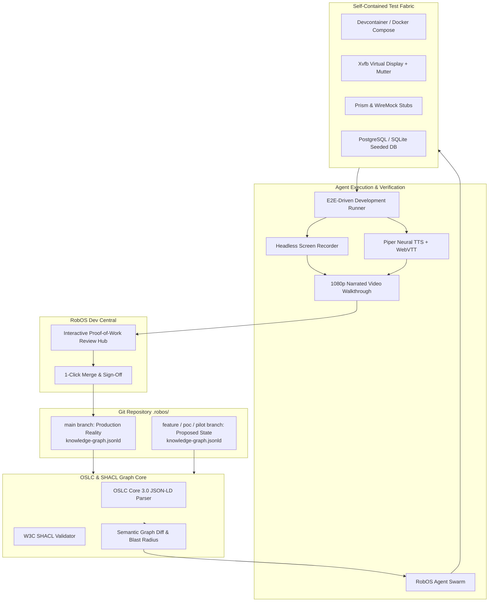

# Feature Spec: Dual-State SDLC Knowledge Graph & E2E-Driven Verification Engine

- **Status**: Approved
- **Created Date**: 2026-09-02
- **Target Component**: RobOS Knowledge Graph Core, Dev Central, Graph Studio, Test Harness, Desktop Agents
- **Author/Idea Source**: User & Antigravity Agent

---

## 1. Overview & Vision

Modern AI agent review-based software engineering requires a shared, semantically rich representation of the entire software ecosystem—a **World State Knowledge Graph**. Developers, software architects, project managers, and autonomous AI agents collaborate to build, maintain, and evolve this graph.

### Open-Source Standard: OASIS OSLC & W3C JSON-LD + SHACL
Rather than inventing a closed proprietary format, RobOS standardizes on **OASIS OSLC (Open Services for Lifecycle Collaboration) Core 3.0** and **W3C JSON-LD / SHACL (Shapes Constraint Language)**. OSLC is the proven open international standard specifically created to link software lifecycle assets (architecture, requirements, entities, contracts, change requests, test cases, builds) as connected linked data.

### Dual-State World Representation (`main` vs `future`)
- **`main` Branch (Production Reality)**: Represents what is live, running in production today.
- **`feature/*`, `poc/*`, `pilot/*`, `spike/*` Branches (Proposed Future States)**: First-class proposed branch topologies.
- **Semantic Graph Diffing**: Visualizes additions, modifications, contract changes, and downstream blast radiuses between branches before code is written.

### E2E-Driven Development (EDD) with Narrated Video Artifacts
In RobOS, agents practice End-to-End Driven Development against **fully self-contained local dev/test environments** (Docker, Devcontainers, Xvfb virtual displays, seeded test databases). When an agent completes a task, it produces a **narrated 1080p video walkthrough** featuring neural TTS audio (Piper) and WebVTT captions, allowing human reviewers to visually and audibly verify the work before signing off.

---

## 2. User Stories & Use Cases

- **As a Software Architect / Tech Lead**, I want to model our microservices, entities, and contracts in a Git-tracked OSLC JSON-LD graph on `main`, and branch out `feature/`, `pilot/`, or `poc/` graphs for new initiatives, so that the entire organization has clear visibility into current reality vs. proposed futures.
- **As a Project Manager / Product Owner**, I want agents to assist me in defining Gherkin `.feature` files, scenarios, and acceptance criteria directly linked to entities and topology nodes in the graph.
- **As an AI Agent**, I want to query the OSLC knowledge graph via MCP to discover API contracts, entity schemas, and Gherkin step definitions, spin up isolated local test environments, and run E2E verifications.
- **As a Human Code Reviewer**, I want to watch an AI-generated narrated video walkthrough and inspect step-by-step test execution evidence in Dev Central before approving a pull request.

---

## 3. Key Capabilities & Scope

### In Scope
- [x] **OSLC Core 3.0 & JSON-LD + SHACL Knowledge Graph**: Standardized `.robos/knowledge-graph.jsonld` storage format linking systems, services, entities, contracts, teams, features, and tasks.
- [x] **Multi-Branch World State Versioning**: Git-backed graph branching supporting `main` (Production) and `feature/*`, `poc/*`, `pilot/*`, `spike/*` branches.
- [x] **Semantic Graph Diffing & Blast Radius Calculation**: Automated comparison highlighting added/modified nodes, schema drift, and broken consumer contracts between branches.
- [x] **Agent-Assisted Graph Authoring Studio**: Natural-language co-pilot assisting users with authoring TypeSpec schemas, OpenAPI contracts, and C4 topologies.
- [x] **Gherkin BDD Feature & Scenario Graph**: First-class support for `.feature` specifications, scenario outlines, and executable step definitions linked directly to graph nodes.
- [x] **Self-Contained Local Test Fabric**: Ephemeral container orchestration spinning up isolated test environments with seeded databases and mocked third-party APIs.
- [x] **Automated E2E-Driven Development (EDD) Loop**: Autonomous agent test runner executing write-failing-test -> implement -> pass -> refactor cycles.
- [x] **Multi-Modal Narrated Video Walkthrough Generator**: Automated headless 1080p screen recording with Piper neural TTS narration, WebVTT subtitles, and timestamped transcripts.
- [x] **Dev Central Review & Proof-of-Work Verification Hub**: Interactive player with synchronised video playback, step inspector, and 1-click merge approvals.

### Out of Scope
- Proprietary closed-source SaaS graph databases (all graph data is 100% Git-backed and local).

---

## 4. Architectural & System Integration

---

## 5. Implementation Plan

Tracked under **Epic 32: Dual-State SDLC Knowledge Graph & E2E-Driven Verification Engine**:
1. **Story 32.01**: OSLC & JSON-LD + SHACL Standard Knowledge Graph Engine
2. **Story 32.02**: Multi-Branch World State Versioning (`main` vs `feature/poc/pilot`)
3. **Story 32.03**: Semantic Graph Diff & Blast Radius Impact Analysis
4. **Story 32.04**: Agent-Assisted World Graph Authoring Studio
5. **Story 32.05**: Gherkin BDD Feature, Scenario & Step Definition Graph
6. **Story 32.06**: Self-Contained Local Test & Dev Environment Fabric
7. **Story 32.07**: Automated E2E-Driven Development (EDD) Agent Runner
8. **Story 32.08**: Multi-Modal Narrated Video Walkthrough Generator
9. **Story 32.09**: Dev Central Interactive Proof-of-Work Review & Merge Hub

---

## 6. Acceptance Criteria

- [x] Full compliance with OASIS OSLC Core 3.0 and W3C JSON-LD/SHACL standards.
- [x] Multi-branch support allows seamless switching and diffing between `main` (Prod) and `feature/*`, `poc/*`, `pilot/*` states.
- [x] Gherkin `.feature` specifications are linked as first-class nodes in the knowledge graph.
- [x] Agents can autonomously spin up self-contained local dev/test fabrics and run E2E tests.
- [x] Agents generate 1080p narrated video walkthroughs with Piper TTS audio and WebVTT captions upon completing tasks.
- [x] Dev Central renders an interactive review UI where developers review plans, watch videos, and approve merges.
