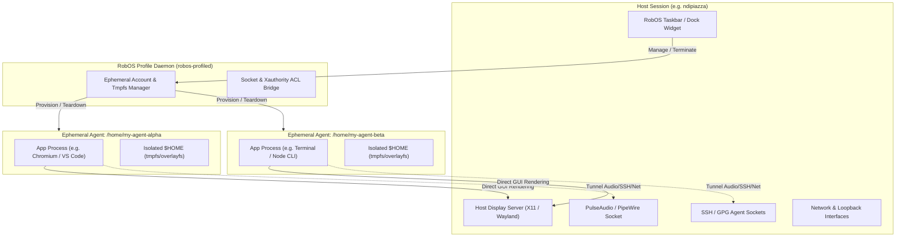

# Feature Spec: Ephemeral Agent User Profiles with Direct Host Display Bridging

- **Status**: Approved (Promoted to [Ephemeral Agent User Profiles with Direct Host Display Bridging](../../project-plan/ephemeral-agent-user-profiles/epic.md))
- **Created Date**: 2026-08-31
- **Target Component**: Linux Desktop Shell (`packages/desktop-shell`, `packages/desktop-manager`), Host Session Daemon (`robos-profiled`), Taskbar Dock / Toolbar Widgets, App Launchers
- **Author/Idea Source**: User Idea Dump

---

## 1. Overview & Vision

Developers and autonomous AI agents frequently need to launch and test multiple application instances concurrently (e.g. running 4 agent instances in parallel). Running these under the host user's account (`ndipiazza`) causes state collision, dotfile pollution, browser profile conflicts, and credential contamination.

**Ephemeral Agent User Profiles** enables the host desktop to dynamically create lightweight, temporary Linux user profiles (`/home/my-agent-{unique-name}`) that exist strictly for the lifespan of the agent's task or session. 

Key differentiator: **Direct Host Display Seamless App Rendering**. 
Instead of requiring an isolated remote desktop streaming viewer, applications launched by the temporary agent users render directly on the developer's host display (X11 / Wayland) side-by-side with native host windows. All essential subsystems (Display, Audio, GPU/DRI, Network, SSH agent, Git credentials, AI API keys) tunnel seamlessly from the host user, while `$HOME` remains completely isolated and is automatically wiped upon session termination.

A dedicated **RobOS Toolbar / Taskbar Widget** provides live visibility into all running agent accounts, their active windows and processes, and one-click session termination.

---

## 2. User Stories & Use Cases

- **As a Developer (`ndipiazza`)**, I want to spawn 4 independent AI agent sessions simultaneously, each running under its own user account (`my-agent-1`, `my-agent-2`, etc.), so that their file creations, caches, and local configurations never interfere with each other or my personal profile.
- **As a Developer**, I want GUI apps launched by agent user accounts to render directly on my primary desktop workspace as native windows without having to open a nested VNC or streaming viewer window.
- **As an Agent Runner**, I want the agent process to inherit necessary display sockets, audio devices, GPU acceleration, SSH agent, and git configuration automatically without manual permission juggling (`xhost`, socket permissions, PAM configs).
- **As a Developer**, I want a RobOS toolbar widget that displays all active ephemeral agent profiles and their running apps/windows, allowing me to monitor activity and terminate any session with instant cleanup.
- **As a System Administrator**, I want ephemeral user home directories to live in memory (`tmpfs`) or copy-on-write storage so that when an agent session exits, all temporary disk artifacts are completely purged with zero residue.

---

## 3. Key Capabilities & Scope

### In Scope

- [ ] **Dynamic Ephemeral User Account Lifecycle (`robos-profiled` / PAM helper)**:
  - Create on-demand Linux user accounts (e.g., `my-agent-a1b2c3` or `my-agent-<task-name>`) with unique UIDs/GIDs.
  - Mount temporary `$HOME` directories using `tmpfs` or `overlayfs` over a clean `/etc/skel` skeleton.
  - Automatic teardown and secure cleanup (killing processes via cgroup/systemd transient scope, unmounting, and deleting user account + home).
- [ ] **Seamless Host Subsystem Bridging & Tunneling**:
  - **Display Bridging**: Automatic `xauth` cookie injection / Wayland socket permissions allowing agent users to open windows on the host `$DISPLAY` / `$WAYLAND_DISPLAY`.
  - **Audio Bridging**: Forwarding PipeWire / PulseAudio native sockets (`PULSE_SERVER=unix:/run/user/<host-uid>/pulse/native`) via ACLs.
  - **GPU / Hardware Acceleration**: Group membership (`render`, `video`) and DRI node permissions (`/dev/dri/*`).
  - **Credentials & Identity Tunneling**:
    - `SSH_AUTH_SOCK` socket access for git cloning over SSH.
    - GPG agent socket forwarding for signing.
    - Git config inheritance (`user.name`, `user.email`, credential helpers).
    - RobOS API tokens and environment variable propagation (`ANTHROPIC_API_KEY`, `OPENAI_API_KEY`, `GEMINI_API_KEY`).
- [ ] **RobOS Toolbar / Taskbar Support (`packages/desktop-shell` & dock widget)**:
  - Taskbar widget listing all active ephemeral agent profiles.
  - Window manager tagging / badges indicating which agent account owns which window.
  - Resource usage monitor per agent profile (CPU, RAM).
  - One-click "Kill & Wipe" action for individual profiles or all active agents.
- [ ] **CLI & IPC Launch Wrappers**:
  - CLI command: `robos-run-as --agent <name> <command>` (e.g. `robos-run-as --agent test-runner npm test`, `robos-run-as --agent code-agent code .`).
  - IPC handler for Electron apps: `window.robos.spawnEphemeralAgent({ agentName, command, env, autoCleanup })`.

### Out of Scope

- Multi-seat physical hardware isolation (all agents share the host workstation GPU and monitors).
- Persistent agent home directories that survive machine reboots (persistent accounts are handled by `robos-desktop-agents.md`).
- Virtual network interface isolation / dedicated VPN per agent (agents share the host network stack).

---

## 4. Architectural & System Integration

### Impacted Packages & Components

1. **`packages/robos-profiled` (New Daemon / Sudoers Helper)**:
   - System service managing ephemeral user creation, cgroups (`systemd-run --scope -p User=my-agent-...`), and teardown.
   - Manages temporary `/home/my-agent-...` tmpfs mount and file cleanup.
2. **`packages/desktop-shell` / GNOME Shell Extension / Taskbar Widget**:
   - Status bar widget showing active agent sessions (`[ 🤖 3 Agents Active ]`).
   - Dropdown menu displaying agent IDs, active windows, CPU/memory stats, and termination buttons.
3. **`packages/desktop-manager` & `packages/robos-lib`**:
   - IPC endpoints exposing agent profile creation, process tracking, and lifecycle events.
   - DOM snapshot and window tracking hooks for agent-owned windows.
4. **`packages/agents-manager` / `packages/dev-central`**:
   - Option in agent launch dialogs: *"Run in Ephemeral Profile"* toggle.

### Plumbing & Security Mechanisms

| Subsystem | Host Bridging Mechanism |
|-----------|-------------------------|
| **X11 Display** | `xauth add` generated cookie into temporary agent `~/.Xauthority` or dynamic `setfacl` on `/tmp/.X11-unix/X0`. |
| **Wayland Display** | `setfacl -m u:my-agent-...:rw /run/user/<host_uid>/wayland-0` with `WAYLAND_DISPLAY=wayland-0`. |
| **Audio (Pulse/PipeWire)** | `setfacl -m u:my-agent-...:rw /run/user/<host_uid>/pulse/native` or PipeWire socket. |
| **SSH Agent** | `setfacl -m u:my-agent-...:rw $SSH_AUTH_SOCK` with inherited `SSH_AUTH_SOCK` env variable. |
| **Storage Isolation** | `mount -t tmpfs -o size=2G,uid=<agent_uid>,gid=<agent_gid> tmpfs /home/my-agent-...` |
| **Process Grouping** | `systemd-run --unit=robos-agent-<name> --slice=agent.slice --uid=...` for clean bulk process termination (`systemctl stop`). |

---

## 5. Proposed Implementation Plan

### Phase 1: Core Daemon & Profile Provisioning (`robos-profiled`)
- Implement `robos-profiled` CLI / service to create and destroy ephemeral user accounts (`useradd --home /home/my-agent-<id> --skel /etc/skel`).
- Set up `tmpfs` mounting for `/home/my-agent-<id>` with configurable size limits.
- Implement permission and ACL setup scripts for X11, Wayland, PipeWire, and SSH sockets.
- Build `systemd-run` execution wrapper (`robos-run-as`) ensuring all child processes belong to a traceable cgroup.

### Phase 2: Host Environment & Credential Propagation
- Create credential bridge for Git configurations (`.gitconfig`), SSH socket forwarding, and AI environment variables.
- Test GUI app launching (Chromium, Electron apps, Tilix, VS Code) from ephemeral agent accounts onto the host display.
- Verify window focus, keyboard input, copy/paste clipboard sync, and audio output.

### Phase 3: Desktop Toolbar & App Integration
- Implement RobOS Taskbar / Dock widget showing active agent sessions and process counters.
- Integrate IPC endpoints into `packages/desktop-manager` (`agentProfile:create`, `agentProfile:list`, `agentProfile:terminate`).
- Add "Run in Ephemeral Profile" action inside `packages/agents-manager`, `packages/app-launcher`, and `packages/git-projects`.
- Add window title decoration or visual badges for agent-owned windows.

### Phase 4: Container & VM E2E Testing
- Write automated test harness in `packages/robos-test` to test multiple concurrent ephemeral users.
- Verify zero-residue cleanup after session termination (`userdel`, `umount`, cgroup cleanup).
- Add cloud-init provisioning and PAM configuration in `packages/desktop-shell/install.sh`.

---

## 6. Acceptance Criteria

- [ ] A host user can launch a command/app via `robos-run-as --agent worker-1 <app>` and have it run under Linux user `my-agent-worker-1` with `$HOME=/home/my-agent-worker-1`.
- [ ] Multiple agent user accounts (e.g. 4 concurrent accounts) can run simultaneously without colliding.
- [ ] Graphical windows opened by agent accounts appear directly on the host display server as native desktop windows with normal mouse, keyboard, and audio support.
- [ ] Agent processes inherit network access, GPU acceleration, and SSH/git credentials from the host user without leaking private host keys or modifying host `$HOME`.
- [ ] When an agent session ends, all spawned child processes are killed, the ephemeral user account is removed, and the temporary home directory is completely wiped.
- [ ] The RobOS desktop taskbar displays an active agent status widget with live agent counts and a termination menu.
