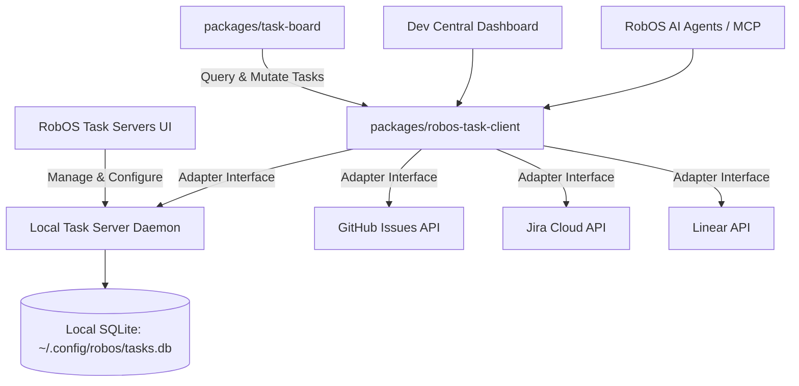

# Feature Spec: Local Open-Source Task Server & RobOS Task Servers Integration

- **Status**: Draft
- **Created Date**: 2026-09-03
- **Target Component**: Desktop Apps (`packages/task-servers`, `packages/task-board`), `packages/robos-task-client`, MCP Tools
- **Author/Idea Source**: User Idea

## 1. Overview & Vision
Currently, RobOS task management integrations (`packages/task-servers`, `packages/robos-task-client`, `packages/task-board`) connect to external cloud task trackers like GitHub Issues, Jira, and Linear. While essential for team workflows, developers often work offline, in air-gapped secure environments, on independent side projects, or want full data ownership without paying for SaaS subscriptions or managing external API keys.

This feature introduces a **Local Open-Source Task Server** embedded directly into the RobOS ecosystem, backed by a permissively licensed (MIT / Apache-2.0) lightweight database engine (SQLite/JSON-RPC), alongside first-class support in **RobOS Task Servers (`packages/task-servers`)**. The local task server runs locally as a system daemon on `localhost`, requires zero cloud configuration, and provides full parity for epics, sprint boards, subtasks, custom labels, and AI agent task dispatching.

## 2. User Stories & Use Cases
- **As a** developer working offline or on a personal project,
- **I want to** use a zero-configuration, local task server running directly on RobOS,
- **So that** I can organize tasks, sprints, and epics without signing up for external cloud services or paying SaaS subscription fees.

- **As a** developer configuring RobOS Task Servers,
- **I want to** see "Local Task Server" as a default one-click option alongside Jira, GitHub, and Linear,
- **So that** I can immediately start managing tasks or seamlessly switch between local and cloud tracking.

- **As a** RobOS AI Agent,
- **I want to** create, query, transition, and break down tasks on the local task server via standard MCP tools and REST APIs,
- **So that** I can plan and execute task workflows hermetically on the local machine.

## 3. Key Capabilities & Scope

### 3.1 Permissively Licensed Local Task Server Engine
- **Zero-License Friction Architecture**:
  - Fully open source (MIT / Apache-2.0 compliant).
  - Lightweight, single-process background daemon or embedded SQLite/REST service (Node.js/Fastify or native Go/Rust binary).
  - Minimal resource footprint (<30 MB RAM, instant cold start).
- **Core Task Management Features**:
  - Projects, Epics, Tasks, and Subtasks.
  - Kanban board workflows (Backlog, Todo, In Progress, In Review, Done).
  - Priority levels, estimations (story points / hours), due dates, and tags/labels.
  - Markdown descriptions with checklists, attachments, and activity history logs.
  - GitOps synchronization: Option to export/sync tasks as declarative YAML/JSON files in `.robos/tasks/`.

### 3.2 RobOS Task Servers App Integration (`packages/task-servers`)
- **First-Class Provider Option**:
  - Add "Local Task Server" to the list of task trackers (alongside GitHub Issues, Jira, Linear).
  - One-click "Start / Stop / Reset Local Task Server" lifecycle controls with health status indicators.
  - Automatic port assignment and local authentication token generation.
- **Unified Client Adapter (`packages/robos-task-client`)**:
  - Implement `LocalTaskServerAdapter` conforming to the `RobOSTaskClient` interface (`getTasks`, `createTask`, `updateTaskStatus`, `getProjects`, `getEpics`).

### 3.3 Task Board & Desktop Hub Integration
- `packages/task-board` and `packages/dev-central` interact with the local task server transparently.
- Real-time event notifications via local WebSockets or SSE when tasks are updated or transitioned.
- Workspaces and IDE provisioning: Picking up a local task automatically branches and prepares the local dev environment identically to a Jira or GitHub ticket.

### 3.4 MCP Server & AI Agent Tooling
- Expose local task server capabilities to Claude Code, Copilot, and Gemini agents via `task-manager-mcp`:
  - `task_create({ title, description, project, priority, labels })`
  - `task_search({ query, status, assignee })`
  - `task_transition({ taskId, newStatus })`
  - `task_breakdown_into_subtasks({ parentTaskId, subtasks })`

### Out of Scope
- Complex enterprise multi-tenant billing models (focus is on fast, private, local developer and team usage).
- Proprietary or copyleft restrictive codebases (all components must remain permissively licensed).

## 4. Architectural & System Integration

- **Impacted Packages/Apps**:
  - `packages/task-servers` (add Local Server configuration & management panel)
  - `packages/robos-task-client` (implement `LocalTaskServerAdapter`)
  - `packages/task-board` & `packages/dev-central` (display & filter local tasks)
  - `packages/task-manager-mcp` (register MCP task tools targeting local server)
  - `packages/robos-lib` (shared task schema and IPC bridge)
- **IPC / Endpoints Required**:
  - `ipcMain.handle('task-servers:get-local-status')`
  - `ipcMain.handle('task-servers:start-local-server')`
  - `ipcMain.handle('task-servers:stop-local-server')`
  - `ipcMain.handle('task-servers:export-gitops-tasks', { targetDir })`
- **Data & Configuration Storage**:
  - Local Database: SQLite at `~/.config/robos/tasks.db`
  - Config & connection info: `~/.config/robos/task-servers.json`

## 5. Proposed Implementation Plan

1. **Phase 1: Local Task Server Backend Core (`packages/local-task-server` or `robos-task-client/server`)**
   - Implement lightweight SQLite data access layer and Fastify/Express REST endpoints (Projects, Tasks, Comments, Epics).
   - Verify permissive license compatibility (MIT / Apache-2.0).

2. **Phase 2: `robos-task-client` Adapter Implementation**
   - Implement `LocalTaskServerAdapter` satisfying all standard CRUD, transition, and search contracts.

3. **Phase 3: `packages/task-servers` UI Updates**
   - Add Local Server tile, startup controls, port configurator, and database export/backup options.

4. **Phase 4: Task Board & MCP Integration**
   - Wire `task-board`, `dev-central`, and MCP agent tools to seamless local task server operations.
   - Add E2E tests validating offline task lifecycles.

## 6. Acceptance Criteria
- [ ] Users can start and stop the Local Task Server with one click from `packages/task-servers`.
- [ ] Task creation, modification, status transitions, and subtasks function seamlessly without internet access.
- [ ] `packages/task-board` and `packages/dev-central` render and manage local tasks identically to cloud providers.
- [ ] RobOS AI agents can query and create tasks on the local task server via MCP tools.
- [ ] All codebase dependencies use permissive open-source licenses (MIT/Apache-2.0).
