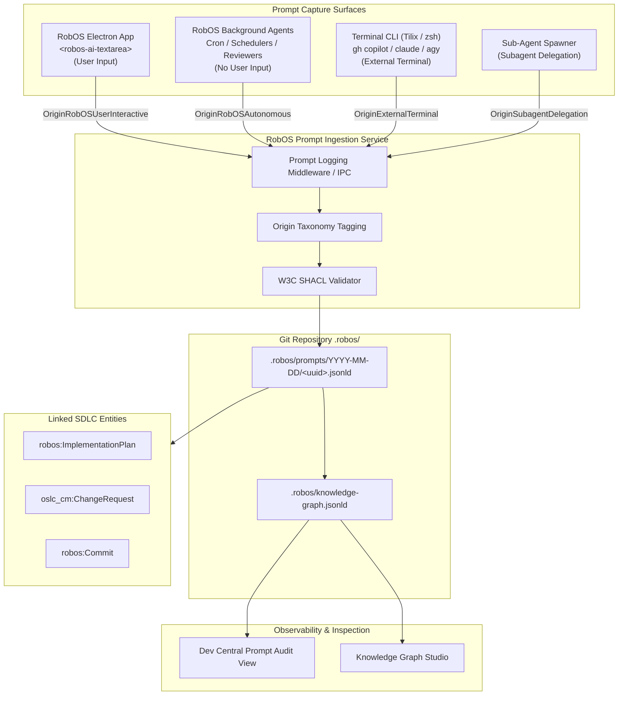

# Feature Spec: First-Class Knowledge Graph Object for Prompt & SDLC Prompt Run Logging

- **Status**: Draft
- **Created Date**: 2026-09-05
- **Target Component**: `packages/robos-graph`, `packages/ai-prompt`, `packages/dev-central`, `packages/desktop-agents`, `packages/robos-lib`, Terminal Shell Integration, `.robos/` Git Store (`.robos/prompts/`, `.robos/knowledge-graph.jsonld`)
- **Author/Idea Source**: User & Antigravity Agent

---

## 1. Overview & Vision

In an AI-first software engineering operating system like RobOS, the **Prompt** is the fundamental atomic action initiating and directing work across the Software Delivery Lifecycle (SDLC). Whether a developer types a detailed architectural prompt into `<robos-ai-textarea>`, an autonomous background scheduler evaluates pull request health at midnight, or an engineer issues a quick command in Tilix via `gh copilot` or `claude`, every interaction shapes the codebase.

Today, prompt executions are often treated as ephemeral terminal outputs or scattered across disconnected application logs. This creates several major blind spots:
1. **Lack of Provenance & Attribution**: Reviewers cannot distinguish code diffs generated by human-steered prompts from those generated by autonomous background cron jobs or rogue terminal sessions.
2. **Disconnected Architectural Lineage**: When an implementation plan or Git commit is made, there is no formal linked-data edge connecting the resulting code back to the motivating prompt.
3. **No Centralized Prompt Observability & Cost Tracking**: Token costs, latency, prompt templates, and failure rates cannot be audited across disparate developer surfaces.

### The Solution: First-Class Knowledge Graph Object (`robos:Prompt`)
This feature introduces `robos:Prompt` as an official, first-class linked-data entity in the **RobOS SDLC Knowledge Graph**. 

Every prompt executed within the operating system is intercepted, structured, categorized by its execution provenance, and committed to the Git store under `.robos/prompts/` while being indexed in `.robos/knowledge-graph.jsonld`.

### Provenance Taxonomy
Each prompt run is tagged with an explicit origin taxonomy:
- **`OriginRobOSUserInteractive` (From RobOS via `<robos-ai-textarea>` with user input)**: Dispatched from RobOS desktop applications (Task Planner, Dev Central, Issue Manager, Context Manager, etc.) where a human developer authored or edited the prompt, supplied `@-mentions`, or configured model parameters.
- **`OriginRobOSAutonomous` (From RobOS with no immediate user input)**: Dispatched by RobOS autonomous engines, scheduled background daemons, living documentation synchronizers, automated code reviewers, or triage agents operating autonomously without direct human prompting.
- **`OriginExternalTerminal` (From user terminal or external app without RobOS)**: Dispatched directly from developer command-line shells (Tilix, zsh, bash) or non-RobOS host environments running standalone CLIs (`gh copilot`, `gemini`, `claude`, `agy`, or external IDE extensions).
- **`OriginSubagentDelegation` (Agent-to-agent delegation)**: Dispatched by an autonomous parent agent delegating sub-tasks to child sessions.
- **`OriginSyntheticBench` (Automated benchmarks & evaluations)**: Generated by automated E2E test suites, regression evaluations, or synthetic performance benchmarks.
- **`OriginOther`**: Third-party incoming webhooks, external MCP tool prompts, or unclassified invocations.

---

## 2. User Stories & Use Cases

- **As a Lead Architect / Reviewer**, I want to click any pull request, implementation plan, or commit in **Dev Central** and trace the exact prompt(s) that created it, clearly seeing whether it originated from a human-crafted prompt in `<robos-ai-textarea>` or an autonomous background agent.
- **As a Security & Compliance Officer**, I want a tamper-evident, Git-tracked log of all AI prompts and model interactions across the organization to verify data-loss-prevention (DLP) compliance and model usage policies.
- **As a Developer**, I want all my prompt runs (both from RobOS UI and terminal CLI) automatically logged in `.robos/prompts/` so that I never lose a well-crafted prompt and can quickly replay or refine successful prompts.
- **As an AI Agent**, I want to query past successful prompts via Knowledge Graph MCP tools (`robos_prompt_search`) to reuse high-performing prompt templates and context assemblies for similar coding tasks.

---

## 3. Key Capabilities & Scope

### In Scope

- [ ] **First-Class KGraph Ontology (`robos:Prompt`)**:
  - Full OASIS OSLC Core 3.0 and W3C JSON-LD schema with SHACL validation (`PromptShape`).
  - Standard attributes: `@id` (`urn:robos:prompt:<uuid>`), `dcterms:title`, `robos:promptText`, `robos:systemPrompt`, `robos:promptOrigin`, `robos:appId`, `robos:agentSession`, `robos:modelName`, `robos:provider`, `robos:tokenUsage`, `robos:durationMs`, `robos:outcomeStatus`, `robos:contextAttachments`, `robos:hasArtifact`, `dcterms:created`.
- [ ] **Multi-Surface Interception & Ingestion**:
  - **RobOS UI Interceptor**: Centralized handler wrapping `<robos-ai-textarea>` submissions across Electron apps (`task-planner`, `dev-central`, `issue-manager`, etc.), automatically setting `OriginRobOSUserInteractive`.
  - **RobOS Autonomous Agent Hook**: Session wrapper in `packages/desktop-agents` and `packages/robos-agent-session` setting `OriginRobOSAutonomous` or `OriginSubagentDelegation`.
  - **Terminal Shell Wrapper**: Lightweight zsh/bash wrapper for `gh copilot`, `claude`, `gemini`, and `agy` in Tilix, logging CLI runs as `OriginExternalTerminal`.
- [ ] **Git Store Persistence (`.robos/prompts/`)**:
  - Append-only, version-controlled JSON-LD files organized by date: `.robos/prompts/YYYY-MM-DD/<prompt-id>.jsonld`.
  - Continuous index registration in `.robos/knowledge-graph.jsonld`.
- [ ] **Bidirectional Semantic Graph Linking**:
  - Links to generating user (`foaf:Person`), triggering requirement (`oslc_rm:Requirement`), implementation plan (`robos:ImplementationPlan`), created tasks (`oslc_cm:ChangeRequest`), and resulting code commits (`robos:Commit`).
- [ ] **Dev Central & KGraph Explorer Audit UI**:
  - Dedicated "Prompt History & Audit" panel in Dev Central with multi-facet filters: Origin type, App, Model, User, Date, and Outcome.
  - Interactive replay button to reload any past prompt into `<robos-ai-textarea>`.

### Out of Scope (Initial Release)

- Real-time cloud telemetry streaming (all prompt logging is 100% local, private, and GitOps-based).
- Full vector embeddings generation for every prompt (leveraging existing RobOS text and KGraph linked-data search initially).

---

## 4. Architectural & System Integration

### Ingestion Flow Diagram



### JSON-LD Object Representation (`robos:Prompt`)

```json
{
  "@context": {
    "oslc": "http://open-services.net/ns/core#",
    "dcterms": "http://purl.org/dc/terms/",
    "foaf": "http://xmlns.com/foaf/0.1/",
    "robos": "https://robos.dev/ns/sdlc#"
  },
  "@id": "urn:robos:prompt:9f83a21b-410a-4938-b7ae-78c66e2c39d8",
  "@type": ["oslc:ExecutionRecord", "robos:Prompt"],
  "dcterms:identifier": "PROMPT-20260905-0012",
  "dcterms:title": "Generate saga compensation endpoints for order cancellation",
  "robos:promptText": "Create the compensating transaction endpoints in OrderService using Spring Boot 3 StateMachine.",
  "robos:systemPrompt": "You are a senior distributed systems architect following OSLC standards.",
  "robos:promptOrigin": "robos:OriginRobOSUserInteractive",
  "robos:originLabel": "RobOS UI (ai-textarea with user input)",
  "robos:appId": "task-planner",
  "robos:triggeredBy": {
    "@type": "foaf:Person",
    "name": "RobOS Developer",
    "email": "dev@robos.local"
  },
  "robos:contextAttachments": [
    "urn:robos:service:order-processing-java-service",
    "urn:robos:contract:order-events-v2"
  ],
  "robos:modelInfo": {
    "provider": "copilot-cli",
    "model": "gemini-3.8-flash",
    "temperature": 0.2
  },
  "robos:tokenUsage": {
    "inputTokens": 1420,
    "outputTokens": 860,
    "totalTokens": 2280
  },
  "robos:executionDurationMs": 2450,
  "robos:outcomeStatus": "Completed",
  "robos:hasArtifact": [
    "urn:robos:plan:order-cancellation-saga",
    "urn:robos:task:PET-203"
  ],
  "dcterms:created": "2026-09-05T12:15:00Z"
}
```

### W3C SHACL Shape Definition

```turtle
@prefix sh: <http://www.w3.org/ns/shacl#> .
@prefix robos: <https://robos.dev/ns/sdlc#> .
@prefix dcterms: <http://purl.org/dc/terms/> .
@prefix xsd: <http://www.w3.org/2001/XMLSchema#> .

robos:PromptShape
    a sh:NodeShape ;
    sh:targetClass robos:Prompt ;
    sh:property [
        sh:path robos:promptText ;
        sh:datatype xsd:string ;
        sh:minCount 1 ;
        sh:message "Prompt must have promptText." ;
    ] ;
    sh:property [
        sh:path robos:promptOrigin ;
        sh:datatype xsd:string ;
        sh:in (
            "robos:OriginRobOSUserInteractive"
            "robos:OriginRobOSAutonomous"
            "robos:OriginExternalTerminal"
            "robos:OriginSubagentDelegation"
            "robos:OriginSyntheticBench"
            "robos:OriginOther"
        ) ;
        sh:minCount 1 ;
        sh:message "Prompt must declare a valid robos:promptOrigin category." ;
    ] ;
    sh:property [
        sh:path robos:outcomeStatus ;
        sh:datatype xsd:string ;
        sh:in ( "Completed" "Failed" "Cancelled" "Refused" ) ;
        sh:minCount 1 ;
        sh:message "Prompt must record an outcomeStatus." ;
    ] .
```

---

## 5. Proposed Implementation Plan

1. **Phase 1: Knowledge Graph Ontology & SHACL Shapes**
   - Register `robos:Prompt` and origin taxonomy URIs in `packages/robos-graph/lib/oslc-parser.js` and `packages/robos-graph/lib/shacl-validator.js`.
   - Update `.robos/knowledge-graph.jsonld` `@context` definition.

2. **Phase 2: Unified Prompt Logger Library (`robos-lib/prompt-logger.js`)**
   - Implement shared logging utility providing `logPromptExecution({ prompt, origin, appId, model, ... })`.
   - Standardize storage path `.robos/prompts/YYYY-MM-DD/<uuid>.jsonld` with atomic writes.

3. **Phase 3: Capture Integration across Surfaces**
   - **RobOS UI**: Wire prompt logging into `<robos-ai-textarea>` submit events and IPC handlers across apps (`packages/task-planner`, `packages/ai-prompt`, `packages/dev-central`).
   - **Autonomous Agents**: Inject prompt logger into `packages/desktop-agents` and `packages/agents-manager` background sessions.
   - **Terminal Shell**: Provide `zsh-robos-prompt-hook` in cloud-init and desktop shell configuring aliases/wrappers for `gh copilot`, `claude`, `gemini`, and `agy` to record terminal prompt runs.

4. **Phase 4: Dev Central & Graph Studio UI**
   - Build "Prompt Audit & Replay" panel in Dev Central.
   - Display prompt execution cards with origin badges:
     - 🟢 `RobOS Interactive` (UI with user input)
     - 🟣 `RobOS Autonomous` (No user input)
     - 🔵 `Terminal / External` (Without RobOS)
     - 🟡 `Sub-Agent / Other`
   - Provide 1-click "Replay Prompt" button to populate `<robos-ai-textarea>` with previous prompts and parameters.

---

## 6. Acceptance Criteria

- [ ] Every prompt run initiated via `<robos-ai-textarea>` is logged and tagged as `OriginRobOSUserInteractive`.
- [ ] Autonomous background agents, schedulers, and PR review runs log prompts tagged as `OriginRobOSAutonomous`.
- [ ] Terminal-initiated prompt executions via CLI tools log prompts tagged as `OriginExternalTerminal`.
- [ ] Sub-agent spawns and synthetic benchmarks are appropriately categorized (`OriginSubagentDelegation` / `OriginSyntheticBench`).
- [ ] Each prompt run produces a validated JSON-LD artifact under `.robos/prompts/YYYY-MM-DD/<uuid>.jsonld` and is indexed in `.robos/knowledge-graph.jsonld`.
- [ ] Dev Central displays an interactive prompt timeline filterable by origin taxonomy with 1-click replay capability.
