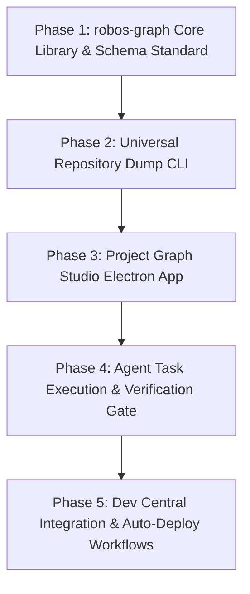

# Feature Spec: RobOS Contract-Driven Project Knowledge Graph & Autonomous Deployment Engine

- **Status**: Draft
- **Created Date**: 2026-08-26
- **Target Component**: New Electron App (`packages/project-graph`), New Shared Library (`packages/robos-graph`), IDE Plugin Integration, Desktop Agent Engine (`packages/desktop-agents`, `packages/dev-central`)
- **Author/Idea Source**: User & Antigravity

---

## 1. Overview & Vision

Modern AI coding agents often fail or hallucinate because they lack a deterministic, structured map of *what* a project is trying to achieve, *how* its components interface with each other, and *where* code changes fit into the larger architecture. File-level vector RAG and raw text specs are insufficient for complex project orchestrations (such as *"Rebuild Dragon Warrior 1 in Godot"* or migrating legacy microservices).

**RobOS Contract-Driven Project Knowledge Graph** introduces a standardized, schema-enforced, Git-tracked project specification format (`.robos/project-graph.json-ld`). It bridges **Top-Down Feature Intent** (User Stories, Tasks, Input/Output Contracts, Acceptance Criteria) with **Bottom-Up Code Intelligence** (AST nodes, Godot scenes `.tscn`, GDScript `.gd`, API routes, and Test Suites).

Furthermore, RobOS integrates an **Autonomous Deployment Engine** where RobOS AI Agents consume this graph DAG to execute tasks deterministically:
1. An agent picks up a task node from the graph.
2. The agent reads the node's strict input/output contract and verification gate.
3. The agent provisions the workspace, writes the code, and runs the contract's automated verification tests.
4. Upon passing, the task node transitions to `VERIFIED`, updating the graph state and unlocking dependent downstream tasks in real-time.

---

## 2. User Stories & Use Cases

- **As a Developer**, I want to initialize or dump any existing Git project (e.g. Godot game, Next.js app, Rust backend) into RobOS so that its features, tasks, code elements, and tests are automatically mapped into a standard Knowledge Graph.
- **As a System Architect**, I want to define features and tasks with formal Input/Output schemas, signals, and BDD acceptance criteria so that AI agents have explicit boundaries and zero ambiguity.
- **As a Lead Developer**, I want to open the **RobOS Project Graph Studio** (`packages/project-graph`) to visually inspect project progress, task dependencies, blocked nodes, and contract compliance across my team.
- **As an AI Agent**, I want to query `.robos/project-graph.json-ld` to understand exact dependency chains, API contracts, and verification commands before generating code diffs.
- **As a Developer**, I want RobOS agents to autonomously pick up unblocked graph tasks, execute them in isolated sub-agent sessions, verify them against test contracts, and deploy working code into the repository.

---

## 3. Key Capabilities & Scope

### In Scope

- [ ] **Standardized Project Knowledge Graph Schema (`.robos/project-graph.json-ld`)**:
  - Unified 3-layer schema: **Feature Layer** (Intent & User Stories) $\rightarrow$ **Contract Layer** (Inputs/Outputs, Interfaces, Signals, State Machines) $\rightarrow$ **Code & Verification Layer** (Files, AST Nodes, Scenes, GUT/Unit Tests).
  - Version-controlled directly inside the Git repository at `.robos/project-graph.json-ld`.
- [ ] **Universal Repository Dumping Engine (`robos-graph dump <repo>`)**:
  - Bottom-up code parser utilizing `tree-sitter` and `SCIP` to extract scenes, scripts, functions, types, and dependencies.
  - Top-down specification parser using schema-constrained LLM extraction (BAML / Instructor / JSON Schema enforcement) to parse READMEs, GDDs (Game Design Documents), issues, and commit histories into feature DAGs.
- [ ] **RobOS Project Graph Studio (`packages/project-graph`)**:
  - Modern Electron visual graph explorer (interactive 2D canvas with node filtering by status: `TODO`, `IN_PROGRESS`, `VERIFIED`, `BLOCKED`).
  - Contract editor & SHACL / JSON Schema validator window.
  - One-click "Dispatch RobOS Agent" button on any unblocked task node.
- [ ] **Shared Core Engine (`packages/robos-graph`)**:
  - Node.js / TypeScript shared library providing graph loading, diffing, querying, dependency resolution (topological sort), and schema validation APIs.
- [ ] **Contract-Driven Autonomous Agent Deployment Pipeline**:
  - Integration with `packages/desktop-agents` and `packages/robos-agent-session`.
  - Task execution loop: **Read Contract $\rightarrow$ Provision Workspace $\rightarrow$ Implement Code $\rightarrow$ Run Verification Gate $\rightarrow$ Update Graph State**.
  - Automatic unlocked task cascading: when a parent task is verified, dependent child tasks automatically notify available agents.

### Out of Scope (Initial Release)

- Multi-repository enterprise federated graphs (initial release targets single-repo project graphs).
- Real-time collaborative graph editing over WebSocket (initial release uses Git pull/push merge workflows).

---

## 4. Architectural & System Integration

```mermaid
graph TD
    subgraph Repository Layer (.robos/)
        GRAPH_FILE[project-graph.json-ld]
        SCHEMAS[SHACL / JSON Schemas]
    end

    subgraph Core Engine (packages/robos-graph)
        PARSER[AST & Git Ingestion Engine]
        VAL[SHACL / Schema Validator]
        DAG[Dependency Resolver & DAG Engine]
    end

    subgraph Desktop GUI (packages/project-graph)
        CANVAS[2D Interactive Canvas Explorer]
        EDITOR[Contract & Feature Editor]
        DISPATCH[Agent Dispatcher UI]
    end

    subgraph AI Execution Engine
        AGENT_MGR[packages/agents-manager]
        SUB_AGENT[packages/desktop-agents Sub-Session]
        TEST_RUNNER[Contract Verification Gate - GUT/Jest/PyTest]
    end

    GRAPH_FILE --> DAG
    PARSER --> GRAPH_FILE
    DAG --> CANVAS
    VAL --> EDITOR
    DISPATCH --> AGENT_MGR
    AGENT_MGR --> SUB_AGENT
    SUB_AGENT --> TEST_RUNNER
    TEST_RUNNER -->|Pass / Fail Gate| DAG
    DAG -->|Update State| GRAPH_FILE
```

### Impacted Packages & Repositories

| Package | Role & Changes |
|---------|----------------|
| `packages/robos-graph` | **New shared library**. Implements AST extraction (`tree-sitter`/`SCIP`), JSON-LD schema parsing, DAG sorting, and SHACL validation. |
| `packages/project-graph` | **New Electron app**. Visual 2D graph viewer, contract editor, and project task management interface. |
| `packages/desktop-agents` | Add contract execution runner mode. Reads task node contracts and executes verification gates. |
| `packages/dev-central` | Embed Project Knowledge Graph summary widget (Feature completion %, active DAG bottlenecks, unblocked tasks). |
| `packages/robos-icons` | Register icon for `project-graph` app (Network / Graph node icon). |
| `packages/desktop-manager` | Register `project-graph` executable and launcher metadata. |

---

## 5. Schema Specification (`.robos/project-graph.json-ld`)

```json
{
  "@context": "https://schema.robos.dev/sdlc/v1",
  "@type": "ProjectGraph",
  "project": {
    "id": "proj_dw1_godot",
    "name": "Dragon Warrior 1 Godot Remake",
    "domain": "Game Development",
    "engine": "Godot 4.3"
  },
  "features": [
    {
      "id": "feat_battle_system",
      "title": "Turn-Based 1v1 Battle System",
      "category": "Combat Mechanics",
      "status": "IN_PROGRESS",
      "dependencies": ["feat_stats_growth"]
    }
  ],
  "tasks": [
    {
      "id": "task_calc_turn_order",
      "featureId": "feat_battle_system",
      "title": "Calculate Turn Order Based on Agility Stat",
      "status": "UNBLOCKED",
      "contract": {
        "inputSchema": {
          "type": "object",
          "properties": {
            "playerAgility": { "type": "integer", "minimum": 1 },
            "monsterAgility": { "type": "integer", "minimum": 1 }
          },
          "required": ["playerAgility", "monsterAgility"]
        },
        "outputSchema": {
          "type": "object",
          "properties": {
            "firstAttacker": { "type": "string", "enum": ["PLAYER", "MONSTER"] }
          }
        },
        "acceptanceCriteria": [
          "Player goes first if playerAgility > monsterAgility",
          "Random speed variance of +/- 10% applied during calculation",
          "Emits 'turn_determined' signal with attacker ID"
        ]
      },
      "codeBindings": {
        "scripts": ["res://scripts/battle/turn_calculator.gd"],
        "scenes": ["res://scenes/battle/BattleEngine.tscn"],
        "tests": ["res://tests/unit/test_turn_calculator.gd"]
      },
      "verificationGate": {
        "command": "godot --headless -s addons/gut/gut_cmdln.gd -gtest=res://tests/unit/test_turn_calculator.gd",
        "expectedExitCode": 0
      }
    }
  ]
}
```

---

## 6. Proposed Implementation Plan



### Phase 1: Core Library & Schema Specification (`packages/robos-graph`)
- Define JSON Schema and JSON-LD context for `.robos/project-graph.json-ld`.
- Build DAG dependency graph parser, topological sort, and status validator.
- Write unit tests for graph loading, editing, and saving.

### Phase 2: Universal Repository Dumping Engine
- Integrate `tree-sitter` for GDScript, TypeScript, Python, and C# AST parsing.
- Build LLM-driven spec extraction pipeline (forcing output against contract JSON Schema).
- Create CLI command `robos-graph dump <repo-dir>` to convert raw codebases into structured graph specs.

### Phase 3: RobOS Project Graph Studio (`packages/project-graph`)
- Build Electron desktop app with canvas graph library (Cytoscape.js or Vis.js / React Flow).
- Implement interactive node inspector, contract editor, and status filters.
- Add "Import Project", "Validate Graph", and "Dispatch Agent" toolbar actions.

### Phase 4: Autonomous Agent Execution & Verification Gate
- Extend `packages/desktop-agents` to accept task node inputs from `robos-graph`.
- Implement automated verification loop: agent implements code diffs, executes `verificationGate.command`, and parses test outputs.
- Update task state on success and emit system toast notification.

### Phase 5: Dev Central & App Ecosystem Registration
- Register `packages/project-graph` across RobOS app registries (`APP_REGISTRY`, `BUILTIN_APPS`, install scripts).
- Add Knowledge Graph summary widget to `Dev Central` dashboard.

---

## 7. Acceptance Criteria

- [ ] Running `robos-graph dump .` in any Git project parses the codebase and generates a valid `.robos/project-graph.json-ld` file.
- [ ] Users can open the **Project Graph Studio** app in RobOS to visually view the graph, edit task contracts, and check DAG dependency status.
- [ ] RobOS agents can be dispatched directly to a graph task node, receiving strict contract inputs and acceptance criteria.
- [ ] RobOS agents run the `verificationGate` test command after modifying code; the task automatically transitions to `VERIFIED` only when tests pass.
- [ ] When a task transitions to `VERIFIED`, downstream dependent tasks in the DAG automatically become `UNBLOCKED` and ready for agent assignment.
