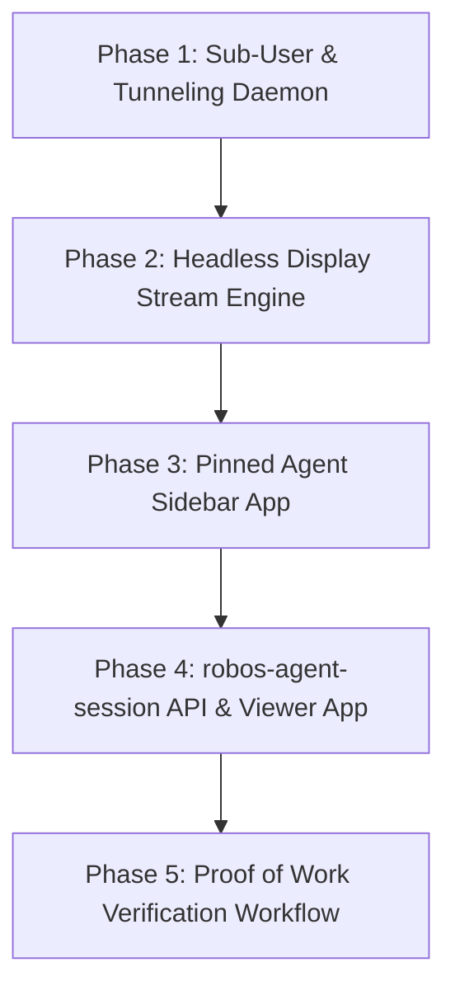

# Feature Spec: RobOS Desktop Agents & Multi-User Session Tunneling

- **Status**: Draft
- **Created Date**: 2026-08-26
- **Target Component**: Linux Desktop OS Base, Shared Library (`robos-agent-session`), Electron App (`desktop-agents`), Pinned Agent Sidebar (`agent-sidebar`), Desktop Shell Plumbing
- **Author/Idea Source**: User

---

## 1. Overview & Vision

**RobOS Desktop Agents** elevates AI coding agents from isolated CLI tools or background sub-processes into **full-fledged Linux sub-agent user sessions**. Each agent runs under its own distinct Linux user account (`agent-<task-id>`) with an isolated `/home/agent-<task-id>` workspace and a dedicated headless virtual GUI desktop session (Xvfb / Wayland virtual output / SPICE / PipeWire).

The RobOS host session allows developers to view and interact with running agent desktop sessions live inside an Electron viewer window (`packages/desktop-agents`). 

The core value proposition is **"Proof of Work" Verification**: when an agent finishes a task, it doesn't just push a commit or open a PR — it actively **proves** its solution works by presenting live application state, executing tests, showcasing UI interactions, and waiting for interactive human review on its own desktop session.

---

## 2. User Stories & Use Cases

- **As a Developer**, I want to spawn an agent to work on `JIRA-1234` in an isolated Linux desktop session so that my host workspace, terminal, and IDE context remain untouched while the agent operates independently.
- **As a Developer**, I want to peek into the agent's desktop at any time to see its live browser windows, IDE, and terminal sessions as it solves problems.
- **As a Technical Lead**, I want the agent to present an interactive "Proof of Work" (e.g., live web app preview + passing test runner) on its virtual desktop before declaring a task complete.
- **As a System Architect**, I want host settings (SSH keys, GPG keys, git identity, environment variables, AI API tokens) to seamlessly tunnel from the host user into spawned agent user sessions without manual setup or exposed secrets.

---

## 3. Key Capabilities & Scope

### In Scope

- [ ] **Dynamic Linux Sub-Agent Account Provisioning**: System daemon (`robos-agentd`) for creating, configuring, and cleaning up ephemeral or persistent `agent-<task-id>` Linux accounts (`useradd -m`, PAM policy, isolated cgroups).
- [ ] **Host-to-Agent Session Tunneling & Credential Plumbing**:
  - `SSH_AUTH_SOCK` socket bridging from host session to agent session.
  - GPG agent socket forwarding for commit signing.
  - Automatic `~/.gitconfig` and git credential helper inheritance.
  - Encrypted environment variable and API key tunneling from host `~/.config/robos/`.
  - Shared developer cache directory mounts (npm cache, cargo cache, pip cache) read-only or copy-on-write to speed up agent bootstrap.
- [ ] **Headless Desktop Display Streaming**:
  - Dedicated virtual display per agent (`:10`, `:11`, etc. via Xvfb / Wayland headless compositor).
  - Low-latency stream bridge (noVNC / PipeWire canvas stream / SPICE endpoint) embedded in the RobOS host Electron application.
- [ ] **RobOS Desktop Agent Viewer (`packages/desktop-agents`)**:
  - Grid and tabbed view of all active agent sessions.
  - Picture-in-Picture or split-screen mode to watch agents work in real-time.
  - Input pass-through toggle (allowing host developer to take manual control of agent's mouse/keyboard if needed).
- [ ] **Pinned Workflow Sidebar (`packages/agent-sidebar`)**:
  - Running inside each agent's virtual desktop session, locked to the right side of the screen.
  - Shows active goal, real-time tool calls, plan progress, execution logs, and interactive "Proof of Work" verification trigger.
  - Leaves the remaining left desktop screen space available for agent apps (VS Code / Monaco, Chromium, Tilix terminals).
- [ ] **Shared API Library (`packages/robos-agent-session`)**:
  - JS/Node API accessible by any RobOS app (`Dev Central`, `Issue Manager`, `Workflow Studio`).
  - Methods: `spawnAgentSession({ taskId, prompt, environment })`, `listAgentSessions()`, `sendAgentCommand()`, `terminateAgentSession()`.
- [ ] **Interactive "Proof of Work" Flow**:
  - Agent state machine transition to `AWAITING_PROOF_VERIFICATION`.
  - Agent positions desktop windows (e.g. Chromium opened to local web app + Terminal with passing test suite).
  - Agent highlights verification steps on the locked right sidebar and notifies the host user via Toast Daemon.

### Out of Scope (Initial Release)

- Multi-machine remote VM agent provisioning (initial release targets sub-users on the local RobOS VM/Host).
- Bare-metal hardware Passthrough for sub-agent GPUs (software rasterization / llvmpipe used for rendering).

---

## 4. Architectural & System Integration

```mermaid
graph TD
    subgraph Host Session (User: robos)
        H_APP[RobOS Apps: Dev Central / Issue Manager]
        LIB[packages/robos-agent-session]
        VIEWER[packages/desktop-agents Electron App]
        DAEMON[robos-agentd Daemon]
        CRED[Host Credentials & SSH/GPG Sockets]
    end

    subgraph Agent Session (User: agent-jira-1234)
        DISPLAY[Virtual Display :10 / Xvfb / Wayland]
        SIDEBAR[packages/agent-sidebar - Locked Right Panel]
        AGENT_APPS[Agent Apps: Chromium, VS Code, Terminals]
        AGENT_CLI[AI Agent Engine CLI / Executor]
    end

    H_APP --> LIB
    LIB --> DAEMON
    CRED -->|Unix Socket & Mount Plumbing| AGENT_CLI
    DAEMON -->|useradd & launch| DISPLAY
    DISPLAY --> SIDEBAR
    DISPLAY --> AGENT_APPS
    DISPLAY -->|VNC / PipeWire Stream| VIEWER
```

### Impacted Packages & Repositories

| Package | Role & Changes |
|---------|----------------|
| `packages/robos-agent-session` | **New shared library**. Provides session management JS API, socket client, and IPC bindings. |
| `packages/desktop-agents` | **New Electron app**. Host UI for viewing, monitoring, and controlling active agent desktop streams. |
| `packages/agent-sidebar` | **New app / panel widget**. Pinned right-hand workflow panel running inside the agent's desktop display. |
| `packages/robos-agentd` | **New system daemon / helper**. Manages Linux user creation, PAM sessions, socket tunneling, and Xvfb displays. |
| `packages/dev-central` | Update sprint & task cards with "Launch Desktop Agent" action. |
| `packages/agents-manager` | Update session list to show desktop stream status and link to agent viewer. |
| `infra/desktop/` | Add sudoers rules for `robos-agentd` host tunneling and sub-user provisioning. |

---

## 5. Proposed Implementation Plan



### Phase 1: Sub-User Spawning & Host Credential Tunneling Daemon
- Implement `robos-agentd` system daemon with root helper for `useradd`/`userdel`.
- Implement socket bridging for `SSH_AUTH_SOCK` and `gpg-agent.sock` into `/run/robos/agent-<id>/`.
- Create credential & `.gitconfig` synchronization pipeline upon session init.

### Phase 2: Virtual Display Engine & Low-Latency Streaming
- Configure Xvfb / Wayland virtual displays per agent session.
- Integrate lightweight VNC / PipeWire server bridge (`x11vnc` / `ws-vnc` or PipeWire WebRTC).
- Build Electron stream canvas renderer component.

### Phase 3: Pinned Agent Sidebar & Desktop Layout Manager
- Build `packages/agent-sidebar` Electron application.
- Configure GNOME/Openbox window manager rules to pin the sidebar to the right 320px screen area.
- Connect sidebar to live agent step event stream.

### Phase 4: `robos-agent-session` Shared Library & Viewer App
- Create `packages/robos-agent-session` library.
- Build `packages/desktop-agents` Electron viewer app with tabbed & grid streaming views.
- Integrate launch triggers into `Dev Central` and `Issue Manager`.

### Phase 5: "Proof of Work" Verification Protocol
- Implement `AWAITING_PROOF_VERIFICATION` state in agent execution lifecycle.
- Implement auto-layout agent window focus logic (arranging browser + test runner).
- Implement host user notification and one-click approval / iteration feedback IPC.

---

## 6. Acceptance Criteria

- [ ] A developer can click "Launch Agent Session" in RobOS to spawn a dedicated sub-agent Linux account (`agent-<id>`) without root password prompts.
- [ ] SSH signing keys, GPG keys, git identity, and API tokens from host user work transparently inside the sub-agent session.
- [ ] Host user can open `desktop-agents` Electron app and view 60fps real-time desktop video stream of the working agent.
- [ ] Agent desktop session displays a locked right-hand sidebar with live progress steps and plan execution.
- [ ] When a task completes, the agent arranges its desktop applications and enters "Proof of Work" mode, prompting the host user for verification.
- [ ] Host user can interactively test the agent's work directly in the stream or approve the PR with a single click.
