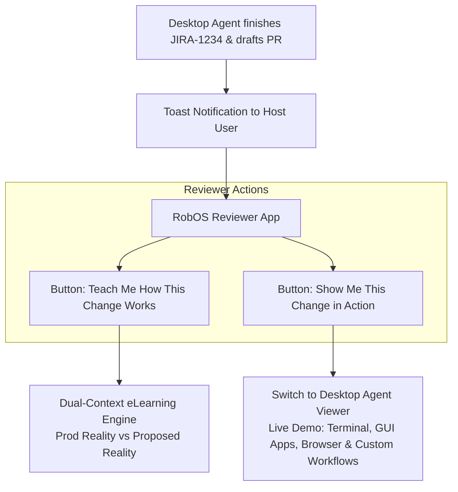

# Feature Spec: Dual-Context eLearning Engine & Interactive PR Reviewer App

- **Status**: Draft
- **Created Date**: 2026-08-26
- **Target Component**: `packages/context-manager`, `packages/robos-reviewer`, `packages/desktop-agents`, Chrome DevTools MCP Integration
- **Author/Idea Source**: User

---

## 1. Overview & Vision

This specification introduces two tightly integrated capabilities into the RobOS ecosystem:

1. **Dual-Context Knowledge Engine (`Prod Reality` vs. `Proposed Reality`)**:
   Advanced context curation that explicitly separates **Production Reality** (main branch code, live deployed apps, released features) from **Proposed Reality** (feature branches, draft PRs, spec files, unmerged ideas). This prevents AI agents and context search engines from polluting production understanding with unreleased code.
2. **RobOS Interactive Reviewer App (`packages/robos-reviewer`) & Live Presentation Protocol**:
   A dedicated review interface triggered when a RobOS Desktop Agent finishes a task and drafts a PR. The Reviewer app gives human reviewers two interactive AI actions:
   - **"Teach Me How This Change Works"**: Generates instant, interactive eLearning walkthroughs comparing the production baseline against proposed changes.
   - **"Show Me This Change in Action"**: Hands off to the desktop agent viewer, where the agent actively demonstrates the feature live across terminals, browsers (Chrome DevTools MCP/Playwright), native GUI apps, and custom workflow scripts, then invites the reviewer to try it out.

---

## 2. User Stories & Use Cases

- **As a Developer / AI Agent**, I want knowledge sources clearly split between `Prod Reality` and `Proposed Reality` so that AI model responses never confuse unreleased PR ideas with active production code.
- **As a Technical Reviewer**, when an agent notifies me that task `JIRA-1234` is ready for review, I want to click **"Teach Me How This Change Works"** to view a visual breakdown of the architecture, diffs, and rationale.
- **As a Technical Reviewer**, I want to click **"Show Me This Change in Action"** to watch the agent execute a live demonstration across any app modality (terminal output, desktop app GUI, browser UI, or CLI script) and hand over control to me for live testing.

---

## 3. Key Capabilities & Scope

### In Scope

- [ ] **Dual-Context Knowledge Engine**:
  - Tags context chunks with `realm: prod_reality` (main branch HEAD, deployed apps) or `realm: proposed_reality` (git diff, PR branch, unmerged spec).
  - eLearning material generator that builds interactive tutorials, diff diagrams, and component walkthroughs from git repositories.
- [ ] **RobOS Reviewer App (`packages/robos-reviewer`)**:
  - Panel-visible Electron app launched when an agent finishes a task.
  - Lists pending agent PR reviews with branch status, CI results, and task ticket context.
- [ ] **"Teach Me How This Change Works" Assistance**:
  - Renders a multi-tab eLearning view:
    1. *Context Delta*: What exists in Prod Reality vs What changes in Proposed Reality.
    2. *Interactive Code Walkthrough*: Guided file diffs with inline AI explanations.
    3. *Architecture Impact*: Visual Mermaid diagram of modified components.
- [ ] **"Show Me This Change in Action" Multi-Modal Presentation Protocol**:
  - Sends IPC message to `packages/desktop-agents` to focus the agent desktop stream.
  - Agent executes a tailored presentation script across relevant desktop tools:
    - **Terminal & CLI Workflows**: Spawns terminal sessions, runs test suites, executes CLI binaries, streams live output, and inspects logs.
    - **Browser Applications**: Drives Chrome via DevTools MCP or Playwright, navigates to app routes, inspects DOM elements, and highlights modified components.
    - **Desktop GUI & Custom Apps**: Launches Electron apps, native GUI binaries, or IDEs, showcasing UI actions.
    - **Multi-App Environments**: Coordinates complex setups (e.g., backend server terminal + database CLI + frontend browser window).
  - Prompts host user: *"Ready for live interactive testing!"* and enables mouse/keyboard pass-through.

---

## 4. Architectural & System Integration

### Impacted Packages

| Package | Changes |
|---------|---------|
| `packages/context-manager` | Add `prod_reality` vs `proposed_reality` metadata tagging, branch isolation indexers, and eLearning generator engine. |
| `packages/robos-reviewer` | **New Electron app**. PR review board with "Teach Me" and "Show Me" action buttons. |
| `packages/desktop-agents` | Add multi-modal presentation mode IPC handler for agent live demos. |
| `packages/robos-agent-session` | Include presentation script execution commands for terminal, browser, and GUI apps. |

---

## 5. Proposed Implementation Plan

1. **Phase 1: Dual-Context Knowledge Storage**: Extend `context-manager` with branch-aware metadata indexing (`prod_reality` vs `proposed_reality`).
2. **Phase 2: eLearning Material Generator**: Build automated Markdown/Mermaid tutorial exporter from git diffs.
3. **Phase 3: RobOS Reviewer App (`packages/robos-reviewer`)**: Build PR review UI with task card integrations and agent event listener.
4. **Phase 4: Multi-Modal Presentation Protocol**: Implement agent presentation script engine for terminals, GUI apps, browsers, and custom workflows.

---

## 6. Acceptance Criteria

- [ ] `context-manager` queries cleanly isolate production main branch knowledge from feature branch specs/PRs.
- [ ] Reviewer app receives instant notification when a sub-agent completes a task.
- [ ] Clicking "Teach Me How This Change Works" displays an interactive eLearning walkthrough contrasting Prod Reality vs Proposed Reality.
- [ ] Clicking "Show Me This Change in Action" focuses the agent's desktop stream and initiates a live demo across terminals, GUI apps, browsers, or custom workflows as appropriate for the task.
