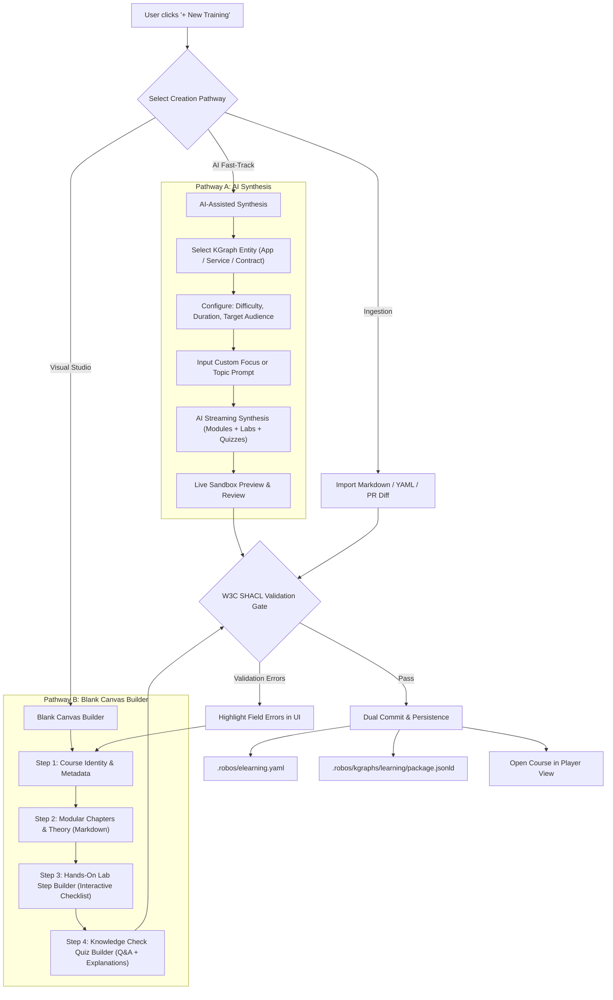
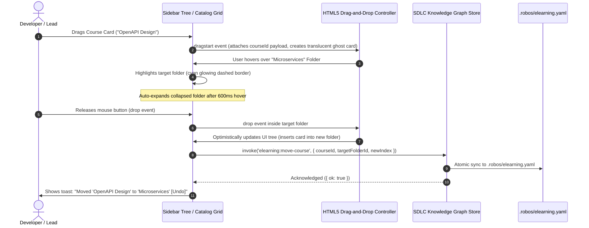
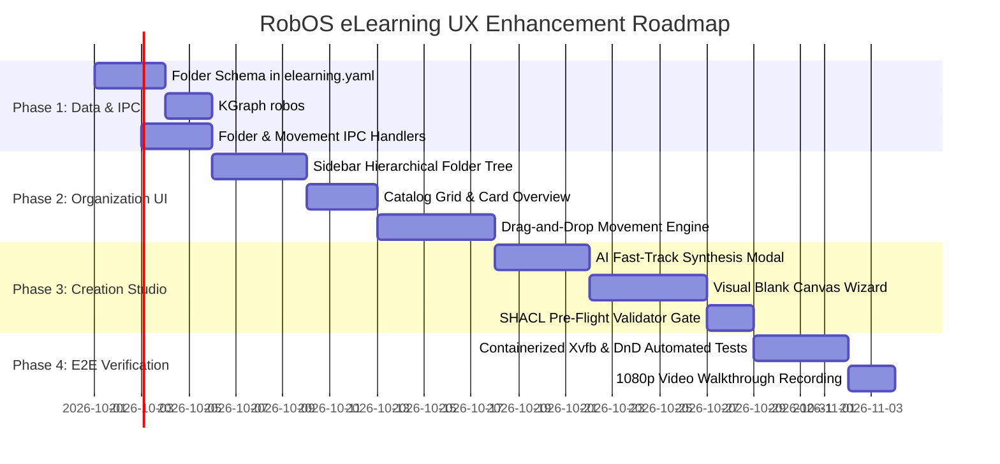

# RobOS eLearning UX Audit: Course Creation Studio & Folder Organization

This comprehensive UX audit and architectural design evaluates two core functional areas of the **RobOS Interactive eLearning Hub** (`packages/robos-elearning`):
1. **Creating New eLearning Courses from Scratch** (Authoring Studio, AI Synthesis, and Blank Canvas Workflows).
2. **Organization of eLearning** (Hierarchical Folders, Tracks, Moving Trainings, and Fluid Drag-and-Drop Reordering).

---

## 1. Executive Summary & Audit Context

RobOS positions training, masterclasses, and developer onboarding as first-class, verifiable SDLC artifacts in the Dual-State Knowledge Graph (`robos:ELearning`, governed by W3C SHACL shape `urn:robos:shape:ELearningShape`). While the current eLearning runtime player (`packages/robos-elearning`) successfully renders interactive modules, executes hands-on lab checklists, and awards cryptographically verified certificates (`robos:CertificateOfCompletion`), it suffers from two foundational UX deficiencies:

```mermaid
quadrantChart
    title RobOS eLearning Feature Maturity vs. User Need
    x-axis Low User Need --> High User Need
    y-axis Low UI Maturity --> High UI Maturity
    quadrant-1 High Value / Well Built
    quadrant-2 Niche / Over-Engineered
    quadrant-3 Low Priority
    quadrant-4 Critical UX Gaps (Action Needed)
    "Lab Step Checklists & Progress": [0.75, 0.85]
    "Knowledge Check Quizzes": [0.70, 0.80]
    "Verified Certificate Issuance": [0.65, 0.75]
    "Voice Assistant Mutations": [0.45, 0.60]
    "Creating Course from Scratch": [0.95, 0.05]
    "Folder Hierarchy & Tracks": [0.90, 0.08]
    "Drag-and-Drop Reordering": [0.85, 0.05]
    "Search, Filter & Catalog Grid": [0.80, 0.15]
```

1. **The Course Creation Vacuum**: Users cannot create an eLearning course from within the application. The system assumes courses were pre-generated via external CLI tools (`generate-app-elearning`) or programmatic Node.js scripts. If no courses exist, users hit a dead-end empty state directing them to another app.
2. **The Flat Dropdown Bottleneck**: All courses are crammed into a flat, unorganized HTML `<select>` dropdown. There are no folders, tracks, tags, or search capabilities. Furthermore, modules and lab steps cannot be shifted or reordered from the UI.

This audit applies **Nielsen Norman Group Usability Heuristics**, **Shneiderman's Direct Manipulation Principles**, and **Cognitive Load Theory** to diagnose existing friction points and specify an enterprise-grade UI/UX architecture.

---

## 2. Audit Item 1: Creating New eLearning from Scratch

### 2.1 Current State Analysis & Heuristic Violations

| Usability Heuristic | Current System Defect | Severity | Impact on User |
|---|---|---|---|
| **#1: Visibility of System Status** | When no courses exist, the app renders: *"No eLearning courses found in Knowledge Graph. Generate one from Knowledge Graph Explorer!"* There is no status on how to create one, nor any inline initiation action. | **Critical** (P0) | Users are blocked from taking action and forced to context-switch across disconnected apps. |
| **#2: Match Between System & Real World** | Course authoring requires understanding raw OSLC JSON-LD schemas (`dcterms:title`, `robos:modules`, `robos:gitopsFile`) rather than familiar curriculum concepts (Chapters, Lessons, Exercises, Quizzes). | **High** (P1) | High barrier to entry; restricts curriculum creation exclusively to AI prompt scripts or platform engineers. |
| **#3: User Control & Freedom** | Once a course is loaded, voice mutations can append a lab step or rename a title, but changes exist only in volatile JavaScript memory. There is no "Save", "Save Draft", or "Commit" button. Exiting the app discards all work. | **Critical** (P0) | Work loss anxiety; users cannot confidently author or customize training. |
| **#5: Error Prevention** | Manual authoring via YAML or JSON lacks interactive schema validation before ingestion, causing runtime parse errors or SHACL rejection. | **High** (P1) | Broken courses crash the player or fail to load silently in `SDLCKnowledgeGraphStore`. |
| **#6: Recognition Rather Than Recall** | Users must recall what microservices, databases, or contracts exist in the Knowledge Graph rather than browsing an autocompleting picker when linking courses to apps. | **Medium** (P2) | Errors in linking `robos:teachesService` or `robos:targetApplication`. |

### 2.2 Pedagogical Triad of RobOS Courses

Every RobOS eLearning course requires three distinct, interlocking components to deliver verified learning:
1. **Architectural Concept & Overview**: Markdown theory, architecture diagrams (Mermaid), and code references explaining the "Why" and "What".
2. **Hands-On Sandboxed Labs**: Step-by-step actionable instructions executed against local ephemeral containers/sandboxes (`robos-test`, Prism mocks, Tilix terminal).
3. **Knowledge Check Quizzes**: Formatted multiple-choice questions with educational explanations and passing thresholds for certificate issuance.

Without a structured creation wizard, authors miss critical components, resulting in incomplete courses.

### 2.3 Proposed Solution: Dual-Mode Course Creation Studio

To serve both rapid AI-assisted development and thoughtful manual curriculum design, RobOS eLearning must provide a unified **Course Creation Studio** accessible via a prominent **"+ New Training"** button.




#### Detailed Step Breakdown of the Creation Wizard

1. **Step 1: Course Identity & Governance**:
   - **Title**: Form input with live slug generator (`urn:robos:elearning:<slug>`).
   - **Folder / Track Assignment**: Dropdown picker to place the new training directly into a folder (e.g., *Developer Onboarding*, *Security*, *Unassigned*).
   - **Target Application / KGraph Binding**: Typeahead selector populated with registered KGraph nodes (`robos:Microservice`, `robos:FrontEndApp`, `robos:DesktopApp`, `robos:PCGame`).
   - **Difficulty & Duration Badges**: Segmented pill selectors (`Beginner`, `Intermediate`, `Advanced`) and estimated duration (e.g., `15m`, `30m`, `45m`, `60m`).
   - **SCORM / Certificate Toggle**: Option to enable verifiable RobOS Certificate issuance (`robos:CertificateOfCompletion`) upon 100% completion.

2. **Step 2: Modular Chapter Architecture**:
   - Multi-module tab strip with `+ Add Module` button.
   - Module title input with duration counter.
   - Rich Markdown editor with split-screen preview for theory, code syntax highlighting, and Mermaid diagram rendering.

3. **Step 3: Interactive Lab Step Builder**:
   - Dynamic list builder where authors add individual actionable lab tasks.
   - Per-step attributes:
     - Step action instruction text.
     - Optional runnable CLI command snippet (with 1-click "Run in Tilix/Sandbox" affordance).
     - Validation criteria or test command.
   - Drag handles (`⠿`) to shift step order up/down instantly.

4. **Step 4: Knowledge Check Quiz Builder**:
   - Question editor with support for Single-Choice, Multiple-Choice, and Code Bug Spotter formats.
   - Option input rows with radio button toggle to mark the correct answer.
   - Pedagogical explanation field (displayed to learner upon answering to reinforce concept mastery).

5. **Step 5: SHACL Pre-Flight Validation & Dual Persistence**:
   - Automated client-side check verifying `dcterms:title`, `robos:modules` (>= 1 module), `robos:topic`, and lab step formats.
   - One-click **"Publish Training"** button:
     - Serializes course to `.robos/elearning.yaml` (GitOps catalog).
     - Upserts OSLC resource node in `.robos/kgraphs/learning/package.jsonld` (Dual-State Knowledge Graph).
     - Displays success toast with instantaneous navigation to the newly created course.

---

## 3. Audit Item 2: Organization of eLearning — Folders, Moving Trainings, & Drag-and-Drop

### 3.1 Current State Analysis & Heuristic Violations

| Usability Heuristic | Current System Defect | Severity | Impact on User |
|---|---|---|---|
| **#4: Consistency & Standards** | The entire course catalog is confined to `<select class="course-picker" id="course-selector">`. Modern developer platforms (VS Code, JetBrains, GitHub, Notion) utilize collapsible sidebar trees and card boards for hierarchy. | **High** (P1) | Out-of-place interaction model; feels like an MVP prototype rather than an OS-level developer hub. |
| **#7: Flexibility & Efficiency of Use** | No search input, no tag filtering, no grouping by team or track. Finding a specific training among 20+ courses requires scrolling through an unindexed select box. | **High** (P1) | Extreme scanning friction and slow navigation. |
| **#8: Aesthetic & Minimalist Design** | Long course titles get truncated inside the `<select>` input box, hiding essential metadata like difficulty and module count. | **Medium** (P2) | Degraded visual hierarchy and truncated information. |
| **Direct Manipulation Violation** | Courses cannot be moved, grouped, or reordered via drag-and-drop. Modules inside a course are locked to static array indices. | **Critical** (P0) | Violates user expectation of fluid spatial reorganization on desktop interfaces. |

### 3.2 Information Architecture: Introducing Learning Folders & Tracks

Trainings in an enterprise environment naturally form cohesive curricula:
- **Onboarding Track**: *Company GitOps Workflow* → *Dev Sandbox Setup* → *First PR Submission*.
- **Backend Engineering**: *OpenAPI 3.1 Design* → *Gherkin BDD Verification* → *Kafka Event Streaming*.
- **Security & Compliance**: *OWASP LLM01 Injection Defense* → *Gitleaks Prompt Guard* → *GPG & Pass Management*.
- **cRPG Realm Game Dev**: *Isometric Map Blockouts* → *Flare Asset Ingestion* → *D&D 5e Combat Rule Engine*.

We introduce **`robos:LearningFolder`** as a formal linked-data entity in the `robos.learning` ontology:

```yaml
# Proposed .robos/elearning.yaml GitOps Specification (v1.1)
version: "1.1"
kind: ELearningCatalog
folders:
  - id: "onboarding"
    title: "Developer Onboarding"
    icon: "rocket"
    description: "Core setup, sandboxes, and SDLC conventions for new engineers"
    order: 1
  - id: "microservices"
    title: "Microservices & Distributed Architecture"
    icon: "server"
    description: "Contracts, Prism mocks, gRPC, and BDD verification"
    order: 2
  - id: "security-governance"
    title: "Security, Secrets & OWASP Defense"
    icon: "shield"
    description: "Zero-leak prompt defense, token management, and audit trails"
    order: 3
  - id: "crpg-masterclasses"
    title: "cRPG Realm Engine & Game Building"
    icon: "gamepad"
    description: "Tactical isometric RPG design, flare assets, and infinity AI scenarios"
    order: 4
courses:
  - id: "microservices-contracts"
    folderId: "microservices"
    order: 1
    title: "Building Event-Driven Microservices with OpenAPI & Gherkin BDD"
    topic: "Microservices & Contracts"
    ...
```

### 3.3 Drag-and-Drop (DnD) Interaction Specifications


#### Level 1: Folder Tree & Course Card Movement



#### Interaction States & Visual Feedback:
1. **Drag Pickup (`dragstart`)**:
   - Card scales slightly (`scale(1.02)`), opacity drops to `0.65`, and a subtle cyan glow (`box-shadow: 0 8px 24px rgba(0, 188, 212, 0.3)`) indicates elevation.
   - Cursor changes to `grabbing`.
2. **Hovering Folders (`dragover` / `dragenter`)**:
   - Target folder expands background highlight (`rgba(0, 188, 212, 0.12)`) and shows an emerald check indicator.
   - If folder is collapsed, a 600ms hover timer triggers auto-expansion.
3. **Reordering Within a Folder / List (`drop indicator`)**:
   - A 2px horizontal neon cyan insertion bar with a left circle indicator shows the exact drop location between courses.
4. **Reversible Actions (`Undo` Toast)**:
   - Every movement triggers an unobtrusive 5-second toast notification: *"Moved course 'Microservices' to 'Onboarding' — [Undo]"*. Clicking Undo immediately restores previous state.

#### Level 2: Shifting Curriculum Modules & Lab Steps
Within an active course, authors and leads can reorganize chapters and lab steps:
- **Module Reordering**: Each module item in the sidebar possesses a six-dot grip handle (`⠿`). Dragging shifts the module order instantaneously.
- **Lab Step Shifting**: Lab steps inside the content panel include drag handles. Authors can drag step 3 above step 2 to streamline workflow order.
- **Debounced Persistence**: UI shifts immediately (0ms lag); persistence to `.robos/elearning.yaml` is debounced by 400ms to allow multi-step sorting without disk thrashing.

---

## 4. UI Architecture & Layout Comparison

### Current Interface vs. Proposed Redesign

| UI Region | Current Implementation (`packages/robos-elearning`) | Proposed Redesigned Implementation |
|---|---|---|
| **Header Bar** | Flat `<select>` dropdown (`#course-selector`), Voice toggle, Progress bar. | Clean breadcrumb navigation (`eLearning / Onboarding / SDLC Fundamentals`), Global Search `@-filter`, `+ New Training` primary CTA button, Voice Assistant pill, and Course switcher modal. |
| **Left Sidebar** | Static list of modules for the currently loaded course (`#module-nav-list`). | **Dual-Tab Sidebar**: <br>1. **"Catalog & Folders" Tab**: Hierarchical folder tree with drag targets, item counts, folder CRUD, and unassigned queue.<br>2. **"Curriculum Outline" Tab**: Active course modules with drag-reorder handles, completion badges, and certificate status. |
| **Main Content Panel** | Single course module viewer with lab checklist and quiz. | **Adaptive Main View**: <br>1. **Catalog Hub View** (when a folder or root is selected): Grid of rich course cards with progress rings, difficulty tags, and drag handles.<br>2. **Active Course Player / Editor View**: Split-pane module runner with inline editing toggle, step reordering, and live quiz grading.<br>3. **Course Authoring Wizard**: Step-by-step creation canvas. |
| **Empty State** | Plain text error message directing user to KGraph Explorer. | **Rich Interactive Zero-State**: Illustrative banner with two prominent action cards: *"⚡ Synthesize Training with AI"* and *"🛠️ Build Training from Scratch"*. |

---

## 5. Technical Implementation Specification

### 5.1 Data Models & Schemas

```typescript
// Proposed TypeScript Interfaces for packages/robos-elearning
export interface ELearningFolder {
  id: string;               // e.g. "onboarding"
  title: string;            // e.g. "Developer Onboarding"
  icon?: string;            // Lucide icon name or emoji: "rocket"
  description?: string;
  order: number;            // Display order sequence
  parentId?: string | null; // Supports nested subfolders
}

export interface ELearningCourseSummary {
  id: string;
  folderId?: string | null; // Bound folder reference
  order: number;
  title: string;
  topic: string;
  difficulty: 'Beginner' | 'Intermediate' | 'Advanced';
  estimatedDuration: string;
  targetApplication?: string | null;
  modulesCount: number;
  progressPercent?: number;
  isCertified?: boolean;
}

export interface ModuleReorderPayload {
  courseId: string;
  moduleIndex: number;
  newIndex: number;
}

export interface LabStepReorderPayload {
  courseId: string;
  moduleIndex: number;
  stepIndex: number;
  newIndex: number;
}
```

### 5.2 IPC Endpoints (`main.js` & `preload.js`)

```javascript
// New IPC handlers to implement in packages/robos-elearning/main.js
ipcMain.handle('elearning:list-folders', async () => { ... });
ipcMain.handle('elearning:create-folder', async (_, { title, icon, parentId }) => { ... });
ipcMain.handle('elearning:update-folder', async (_, { folderId, updates }) => { ... });
ipcMain.handle('elearning:delete-folder', async (_, { folderId, reassignToFolderId }) => { ... });

ipcMain.handle('elearning:create-course', async (_, coursePayload) => { ... });
ipcMain.handle('elearning:move-course', async (_, { courseId, targetFolderId, newIndex }) => { ... });
ipcMain.handle('elearning:reorder-modules', async (_, { courseId, fromIndex, toIndex }) => { ... });
ipcMain.handle('elearning:reorder-lab-steps', async (_, { courseId, moduleIndex, fromIndex, toIndex }) => { ... });
```

---

## 6. Implementation Phasing & Next Steps



### Action Items for Development:
1. **Catalog & Folder Backend**: Extend `packages/robos-graph/lib/graph-store.js` to parse and serialize `folders:` in `.robos/elearning.yaml` and index `robos:LearningFolder` nodes.
2. **HTML5 Drag-and-Drop Controller**: Implement clean, accessible drag handlers in `packages/robos-elearning/renderer/app.js` with drop indicators and keyboard fallbacks.
3. **Course Creation Wizard**: Scaffold the creation modal component in `index.html` with step tabs, live validation, and dual KGraph + GitOps persistence.
4. **Automated Verification**: Add comprehensive unit and E2E test suites in `packages/robos-test/tests/elearning/` validating folder creation, course relocation, module shifting, and course authoring.
